

  

 

<h1 align="center">Introductory practical guide to flow measurement using images</h1>
<h2 align="center">Recommendations for the use of the LSPIV technique</h2>

  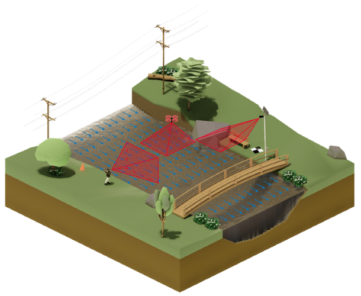

 

 Version: 1.0.0 
 

  

 

*** 

This guide was developed as part of the project "RIVeR-LAC: Innovation in Large-Scale Particle Image Velocimetry for Water Resource Management". The project was selected through the WMO HydroHub Innovation Call for Latin America and the Caribbean, organized by WMO and funded by the Inter-American Development Bank.

This guide was reviewed by members of the WMO HydroHub Think Tank, the WMO Secretariat, the WMO Expert Team on Hydrometry, and experts from several National Hydrological Services (reviewers are mentioned below).

### Coordinator:

-   Antoine Patalano, ORUS and Faculty of Exact, Physical, and Natural Sciences, National University of Córdoba, Argentina.

### Authors:

-   Leandro Massó, ORUS and Faculty of Exact, Physical, and Natural Sciences, National University of Córdoba, Argentina.
-   Antoine Patalano, ORUS and Faculty of Exact, Physical, and Natural Sciences, National University of Córdoba, Argentina.

### Contributors:

-   Mariano Re, National Water Institute of Argentina.
-   Pablo García, National Water Institute of Argentina.
-   Nicolas Ortiz, National Water Institute of Argentina.
-   Ana Heredia Ligorria, National Water Institute and Faculty of Exact, Physical, and Natural Sciences, National University of Córdoba, Argentina.
-   María Catalina Lago, National Water Institute of Argentina.

### Illustrations:

-   Tomás G. Altamira.

### External Reviewers:

-   Johanna Korhonen, WMO Secretariat.
-   Cecilia Maroñas,  Inter-American Development Bank (IDB).
-   Salvador Peña, WMO HydroHub Think Tank.
-   Cristina Wahrmann, Costa Rican Institute of Electricity (ICE) and WMO HydroHub Think Tank.
-   Marco Serrano, Costa Rican Institute of Electricity (ICE).
-   María José Torres, Costa Rican Institute of Electricity (ICE).
-   Shawn Boyce, Caribbean Institute for Meteorology and Hydrology (CIMH) and WMO HydroHub Think Tank.
-   James Bomhof, Water Survey of Canada, Environment and Climate Change Canada (ECCC).
-   Yirgalem Gebremichael, WMO Secretariat.

## **Purpose**

This guide provides a practical and accessible resource for applying the Large-Scale Particle Image Velocimetry (LSPIV) technique in streamflow measurement. It is primarily intended for hydrometric technicians who, without requiring prior experience in image-based techniques, can understand and apply the necessary concepts and procedures.

This guide aims to reduce technical and operational barriers for new users, promoting LSPIV as a non-intrusive, efficient, and versatile method of flow measurement. In addition to covering essential theoretical principles, this guide provides practical recommendations based on real-world field applications and data processing experiences.

This guide establishes the fundamental guidelines needed to ensure that collected and processed data can meet independent validation and integrity control requirements. However, it acknowledges that individual organizations may need to adapt or expand these recommendations to suit their specific requirements and conditions.

## **Scope**

This guide focuses on the use of LSPIV for measuring surface velocities and flow rates in open channels. It includes recommended procedures for data collection and processing using image analysis tools, covering the entire process from field planning to office-based data processing.

1.  **Application:** The guide details the key steps and considerations for obtaining reliable surface velocity and flow rate measurements using LSPIV, covering everything from image capture to the analysis of processed data. It includes recommendations on equipment handling, site selection, recording techniques, and image analysis methods.
2.  **Limitations:** This guide does not replace the operating manuals of specific equipment or the Standard Operating Procedures (SOPs) established by individual organizations. It is expected that these SOPs align with the recommendations provided in this guide.
3.  **Exclusions:** The guide does not endorse any particular software, tools, or commercial brands. The images and examples included are for illustrative purposes only and do not constitute an endorsement of specific products.
4.  **Guide Evolution:** As image-based velocimetry methodologies continue to evolve, this guide is maintained as a living document, developed under an open-source model in a public repository. This approach allows the active participation of the user community in its ongoing development, while maintaining version control for transparency. The contribution process is detailed in a later section.

## **Disclaimer**

This guide is provided solely for informational and educational purposes. The authors have made their best efforts to ensure the accuracy and relevance of the information, but:

1.  Users of this guide are fully responsible for the implementation of the LSPIV technique and the results obtained from its application.
2.  The authors assume no liability for any errors, omissions, or damages that may result from the correct or incorrect use of the information provided.
3.  The application of the described techniques and procedures must be carried out under the professional judgment of the user, considering the specific conditions of each site and the applicable local regulations.
4.  Results obtained using LSPIV must be independently validated before being used in any decision-making process.
5.  The use of this guide does not guarantee the accuracy or reliability of measurements, as it is the responsibility of the user to verify the quality of the data obtained through appropriate control and validation methods.

## **License and Change Control**

This guide implements a dual licensing scheme to protect both the collaborative nature of the document and the integrity of its visual elements:

1.  The textual content is licensed under the GNU Free Documentation License v1.3, allowing free distribution, modification, and improvement by the technical community, provided that derivative works maintain the same license and proper credit is given to the original authors.
2.  All figures, diagrams, and images are protected under the Creative Commons BY-ND 4.0 (Attribution-NoDerivatives) license. This means they can be freely shared with proper attribution to the original source, but cannot be modified without the authors' explicit permission.

## **Contribution and Validation Process**

Contributions to this guide follow a structured review process:

1.  Proposed modifications must be submitted through change requests (pull requests) in the official repository (the link will be available after the final reviews).
2.  Each contribution will be reviewed by at least two members of the technical supervisory committee, who will assess:

    - The technical accuracy of the content.

    - The clarity and coherence with the rest of the guide.

    - Compliance with the formatting standards.

    - Adherence to the established licenses.

3.  Accepted contributions will be incorporated into the guide following the established version control system.

Users who wish to contribute to the development of this guide must adhere to these licensing conditions and the validation process. Participation in the evolution of the guide implies acceptance of these terms.

## **Guide Usage Recommendations**

For proper use of this guide, it is recommended to follow the proposed order. Begin by reading the **Introduction**, which provides an overview of the principles and objectives of the technique. Next, depending on the type of recording performed during fieldwork, refer to the corresponding subsection in **Fieldwork** to obtain specific recommendations for that modality. Finally, continue with the **Office Work** chapter, which details the procedures for processing and analyzing the collected data. This order ensures a progressive and coherent understanding of the entire process, guaranteeing the quality and consistency of the results.

# Content

[1. Introduction](#1-introduction)  
&nbsp;&nbsp;&nbsp;&nbsp;[1.1. Image-Based Velocimetry Techniques: Operating Principle](#11-image-based-velocimetry-techniques-operating-principle)  
&nbsp;&nbsp;&nbsp;&nbsp;[1.2. Large-Scale Particle Image Velocimetry (LSPIV)](#12large-scale-particle-image-velocimetry-lspiv)  
&nbsp;&nbsp;&nbsp;&nbsp;[1.3. Advantages, disadvantages, and common questions](#13-advantages-disadvantages-and-common-questions)  
&nbsp;&nbsp;&nbsp;&nbsp;[1.4. Guide organization](#14-guide-organization)  

[2. Fieldwork](#2-fieldwork)  
&nbsp;&nbsp;&nbsp;&nbsp;[2.1. Recommendations by recording type](#21-recommendations-by-recording-type)  
&nbsp;&nbsp;&nbsp;&nbsp;&nbsp;&nbsp;&nbsp;&nbsp;[2.1.1. Perpendicular recording](#211-perpendicular-recording)  
&nbsp;&nbsp;&nbsp;&nbsp;&nbsp;&nbsp;&nbsp;&nbsp;[2.1.2. Oblique recording](#212-oblique-recording)  
&nbsp;&nbsp;&nbsp;&nbsp;&nbsp;&nbsp;&nbsp;&nbsp;[2.1.3. Fixed station](#213-fixed-station)  
&nbsp;&nbsp;&nbsp;&nbsp;[2.2. Bathymetric survey](#22-bathymetric-survey)  

[3. Processing steps](#3-processing-steps)  
&nbsp;&nbsp;&nbsp;&nbsp;[3.1. Software selection](#31-software-selection)  
&nbsp;&nbsp;&nbsp;&nbsp;[3.2. Data check](#32-data-check)  
&nbsp;&nbsp;&nbsp;&nbsp;[3.3. Workflow](#33-workflow)  
&nbsp;&nbsp;&nbsp;&nbsp;&nbsp;&nbsp;&nbsp;&nbsp;[3.3.1. Selection of the video time interval to process](#331-selection-of-the-video-time-interval-to-process)  
&nbsp;&nbsp;&nbsp;&nbsp;&nbsp;&nbsp;&nbsp;&nbsp;[3.3.2. Image extraction](#332-image-extraction)  
&nbsp;&nbsp;&nbsp;&nbsp;&nbsp;&nbsp;&nbsp;&nbsp;[3.3.3. Camera motion correction and lens distortion](#333-camera-motion-correction-and-lens-distortion)  
&nbsp;&nbsp;&nbsp;&nbsp;&nbsp;&nbsp;&nbsp;&nbsp;[3.3.4. Rectification: Transforming pixels to length units](#334-rectification-transforming-pixels-to-length-units)  
&nbsp;&nbsp;&nbsp;&nbsp;&nbsp;&nbsp;&nbsp;&nbsp;[3.3.5. Definition of Cross Sections](#335-definition-of-cross-sections)  
&nbsp;&nbsp;&nbsp;&nbsp;&nbsp;&nbsp;&nbsp;&nbsp;[3.3.6. Processing: Application of the PIV algorithm](#336-processing-application-of-the-piv-algorithm)  
&nbsp;&nbsp;&nbsp;&nbsp;&nbsp;&nbsp;&nbsp;&nbsp;[3.3.7. Discharge estimation](#337-discharge-estimation)  

[4. Bibliography](#4-bibliography)  

[5. Glossary](#5-glossary)  

[6. Annexes](#6-annexes)  

# 1. Introduction

Accurate measurement of streamflow is essential for efficient water resources management. These data are crucial for the planning of hydraulic infrastructure, flood risk management, and environmental impact monitoring, among other applications.

Traditionally, various techniques and instruments have been used to measure flow velocity and discharge. Among them, current meters stand out as classic instruments that, although reliable, require direct contact with the water flow for extended periods. Over the past three decades, hydroacoustic techniques have been introduced, using instruments such as the Acoustic Doppler Velocimeter (ADV) and the Acoustic Doppler Current Profiler (ADCP), which allow for precise measurements using acoustic waves. However, the use of these techniques presents certain limitations, both economically (as the acquisition and maintenance of these instruments are typically expensive) and logistically (as direct access to the measurement site is required, making it more difficult to operate under adverse weather conditions or in inaccessible areas).

From a technical perspective, hydroacoustic methods require a high degree of specialization and personnel training, particularly in remote areas or those with limited resources. As the use of intrusive techniques, where the instrument must be in direct contact with the water, can be hazardous during high-flow conditions and in highly polluted waters. Additionally, this direct contact may alter the natural flow conditions, affecting measurement accuracy and this limits their applicability in situations where both safety and precision are critical. While some continuous flow monitoring instruments, such as index velocity stations using Acoustic Doppler Velocity Meters or Surface Velocity Radars, can mitigate some of these challenges, they also have limitations related to deployment conditions, calibration requirements, and environmental constraints. Another significant limitation of hydroacoustic techniques is that they do not allow for fully autonomous monitoring, as they still require personnel to be present at the site for maintenance and validation, which can result in fragmented data and gaps in temporal coverage.

These limitations highlight the need to complement traditional methods with alternative approaches that are more cost-effective, less invasive, and offer innovative solutions for flow measurement. Instead of replacing existing techniques, integrating new methodologies like Large-Scale Particle Image Velocimetry (LSPIV) broadens the available tools, improving data coverage and accessibility for effective water resource management.

## 1.1 Image-Based Velocimetry Techniques: Operating Principle

One of the oldest methods for estimating surface flow velocity is the float method, in which a floating object is released into the flow, and its travel time over a known distance is recorded. The velocity of the tracer is calculated by dividing the traveled distance by the measured time, assuming that the tracer moves at the same speed as the free surface of the flow. This technique provides a simple estimate of the average surface velocity along the tracer's path ([Figure 1](#fig1)).

  

  

  

Figure 1: Schematic representation of surface velocity measurement using the float method. <em>Source:</em> Own elaboration
  

If a more detailed analysis of surface velocity variation along the tracer's path were required, smaller and consecutive distances could be measured over time. This would allow for estimating an average surface velocity value for each defined segment ([Figure 2](#fig2)).

  

  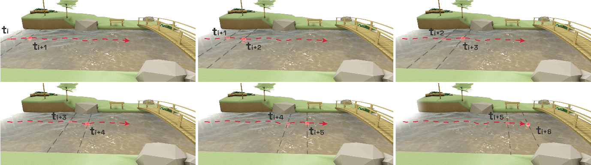

  

Figure 2: Schematic representation of velocity measurement using the float method with increased discretization. <em>Source:</em> Own elaboration
  

Instead of defining distances and manually recording tracer travel times, a more advanced approach would be to record a video to capture the motion of the float. By dividing this video into successive frames, the tracer's movement can be tracked across all images. Each of the schemes in [Figure 2](#fig2) could be thought of as corresponding to an individual video frame. This method enables a continuous and detailed analysis of the movement of the tracer.

Image-based velocimetry techniques follow a similar principle: a camera is used to capture a sequence of the flow containing tracers on its surface. These tracers may be naturally occurring in the water body, artificially introduced, or identified in the turbulence patterns of the free surface. By processing the images obtained from this recording, the surface velocity of the flow can be estimated.

The image processing step involves tracking the displacement of tracers or patterns on the water surface across all captured frames. Modern cameras can record at relatively high frame rates, typically between 30 and 60 frames per second (FPS). This means that each second, a series of 30 to 60 consecutive images of the flow is captured, allowing for the observation of rapid changes in water movement. Additionally, these cameras record in high resolutions, such as Full HD (1920×1080 pixels), 2.5K (~2560×1440 pixels), or 4K (~3840×2160 pixels), which refer to the number of pixels in each image. These characteristics provide high spatial and temporal resolution, enabling a detailed analysis of surface flow velocity.

Various techniques exist for processing the captured images, each utilizing a specific algorithm to analyze tracer movement within the flow. The two most common, and also the earliest developed, are Particle Tracking Velocimetry (PTV) and Particle Image Velocimetry (PIV).

PTV focuses on detecting and tracking the trajectory of individual tracers, similar to following the path of multiple floats simultaneously but in an automated manner. This technique allows for measuring the velocity of each tracer along its specific path, enabling the calculation of spatial variations in surface velocity.

On the other hand, PIV analyzes the movement of groups of tracers or patterns within small regions of the flow known as Interrogation Area (IA). In each of these regions, the average displacement of the tracer group or pattern is evaluated using a correlation algorithm that compares consecutive images. The result is a gridded surface velocity field, generated from the data obtained for each IA. More information on this method can be found in [Annex 2](#An2).

While PTV provides an individual velocity for each tracer along its trajectory, PIV generates a complete velocity map of the flow surface, allowing for an understanding of the distribution across the entire observed area ([Figure 3](#fig3)).

  

  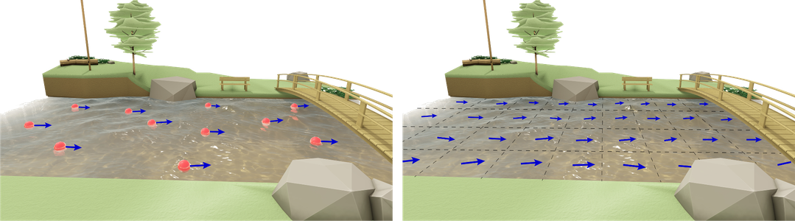

  

Figure 3: Schematic representation of processing algorithm results. Left: PTV, velocities for each identified tracer. Right: PIV, gridded surface velocity field.  <em>Source:</em> Own elaboration
    

Originally, PIV and PTV were developed for laboratory applications, where controlled conditions ensure optimal performance. However, over time, both techniques have been adapted for field use, giving rise to their large-scale variants: Large-Scale Particle Image Velocimetry (LSPIV) and Large-Scale Particle Tracking Velocimetry (LSPTV). These adaptations have enabled surface velocity and discharge measurements in rivers and channels, leading to the development of other image-based flow measurement strategies, such as Space-Time Image Velocimetry (STIV).

This guide focuses on the application of the LSPIV technique, which is currently among the most widely used methods for image-based discharge measurement in watercourses. While the content presented here is specific to LSPIV, many of the recommendations and best practices described are also applicable to other image-based velocimetry techniques. The main difference lies in the method used to calculate surface velocities, as different approaches, such as STIV, employ distinct algorithms to derive velocity fields. Despite these variations, the fundamental principles related to image acquisition, processing, and quality control remain relevant across multiple techniques.

## 1.2 Large-Scale Particle Image Velocimetry (LSPIV)

The term *Large-Scale* refers to the capability of the PIV technique to perform measurements in natural environments, covering large flow areas with conditions that cannot be replicated in a laboratory. To apply LSPIV, a video must record the free surface of a watercourse. This requires three basic elements: a camera, a flow with surface tracers, and an adequate light source ([Figure 4](#fig4)).

  

  

  

Figure 4: Example schematic of the basic elements for implementing LSPIV: Camera, flow with surface tracers, and light source.  <em>Source:</em> Own elaboration
 

**Camera:** The camera can be any device capable of capturing image sequences or video, such as a mobile phone, digital camera, UAV-mounted camera, or surveillance camera. The choice of device depends on the measurement context and available resources, but the essential requirement is that the camera must have sufficient resolution (typically Full HD or higher) to clearly capture the movement of tracers in the flow and a sufficient and stable FPS to ensure accurate motion detection.

A key aspect of LSPIV, related to camera positioning, is the need to convert pixel measurements into real-world length units. Since surface velocity fields are calculated between pairs of images, the obtained results are expressed in pixels per image pair (for example, if the tracers move 5 pixels between two consecutive images, the surface velocity would be recorded as 5 px/image pair). The time interval between two consecutive images is determined by the recording settings. However, converting pixels to length units requires a *rectification* process, which varies in complexity depending on the position of the camera. This results in different rectification approaches that must be considered ([Figure 5](#fig5)).

  

  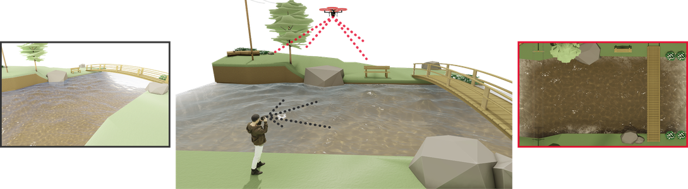

  

Figure 5: Schematic representation of camera viewing angles. The red-framed image on the right represents the perpendicular view, while the gray-toned image on the left represents the oblique view. <em>Source:</em> Own elaboration

- *Perpendicular view*: The camera is positioned perpendicular to the flow surface, looking downward. All pixels in the measurement area represent the same real-world distance, as there is no perspective distortion, assuming minimal lens distortion. The conversion from pixels to length units can be performed if a known real-world distance is present in the image. For example, if the image contains a clearly visible dimension (such as the width of a cross-section), the relationship between pixels and length units can be established. This process is known as 1D rectification.

- *Oblique View*: If a perpendicular camera position cannot be achieved, the images will exhibit perspective distortion. In an oblique view, perspective causes parallel lines in reality to appear non-parallel in the image, and distances that are identical in reality to have different pixel lengths in the image. For this reason, it is not valid to define a single constant value for pixel-to-length conversion. Rectification in this case involves correcting the perspective distortion in the image to align it with the real-world dimensions of the terrain. To perform this process, it is necessary to know some real-world distances or coordinates of visible points in the image, such as the dimensions of structures or fixed points in the area. These points are referred to as Control Points (CPs) in this guide, although in the literature they may also be found as Ground Reference Points (GRPs) or Ground Control Points (GCPs). For oblique views, there are two transformation methods: 2D rectification, which corrects a single plane using four CPs (in LSPIV, this is the free surface of the flow), or 3D rectification, which requires at least six CPs and allows for the rectification of planes at different elevations, making it useful in conditions where the free surface level varies. [Figure 6](#fig6) shows an example of 2D rectification, where a perspective-distorted image is transformed into one that appears as if it were captured from a perpendicular position.

  

  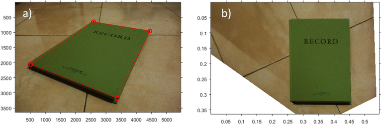

  

Figure 6: Example of rectification of a perspective-distorted image using the notebook's corners as Control Points. A) Original image with distortion. B) Rectified image. <em>Source:</em> Own elaboration

Chapters [2](#2-fieldwork) and [3](#3-processing-steps) cover the fieldwork and processing steps required to apply the different types of rectification, while [Annex 3](#An3) provides more detailed technical information.

Besides the camera position, it is necessary to ensure that the camera remains stable and does not experience vibrations or movement during recording. If movement occurs, the estimated displacement of the flow using correlation will be the superposition of the movement of the tracers (desired) and the movement of the camera, which can negatively affect the surface velocity results. This guide and annexes provide recommendations to avoid and/or mitigate these undesired movements during recording.

**Lighting:** Lighting is another key aspect. The most common light source in the field is sunlight, which is generally sufficient to illuminate the measurement area. However, in low-light conditions or nighttime measurements, it may be necessary to use artificial light sources to ensure the visibility of details on the water surface.

**Surface Tracers:** Among the three elements required for LSPIV implementation, tracers are critical. In the context of LSPIV, a tracer refers to any visible element that moves with the free surface of the water, which can be natural or artificial.

1.  *Natural tracers:* These are patterns naturally present on the free surface of the flow. These can include foam, debris carried by the flow, ice, or even ripples generated by the flow's own turbulence ([Figure 7](#fig7)).

  

  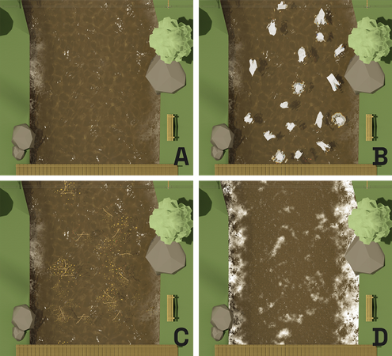

  

Figure 7: Examples of natural surface tracers. (A) Ripples caused by turbulence. (B) Ice fragments. (C) Floating natural debris. (D) Foam. <em>Source:</em> Own elaboration

2.  *Artificial tracers:* These are biodegradable floating materials that are seeded intentionally onto the free surface of the flow, such as vegetation debris, wood chips, among others. Their use is recommended when the flow does not exhibit visible natural tracers. This suboptimal condition may occur due to one or a combination of the following: low-flow conditions, very low-velocity flows, transparent flows where the riverbed is visible, areas affected by backwater effects, or low-turbulence flows. The tracers are released into the flow upstream of the measurement area, and the patterns they form are used to apply the technique ([Figure 8](#fig8)).

  

  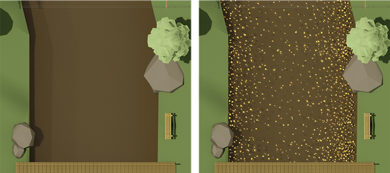

  

Figure 8: Left: Example of a surface with a lack of natural tracers. Right: Example of added wood shavings as artificial tracers. <em>Source:</em> Own elaboration

For simplicity, this guide will use the term tracer to refer to both natural and artificial tracers. It is essential to have clearly visible and well-defined tracers across the entire channel width to ensure the correct application of the technique. Throughout the guide, specific recommendations will be provided, and for further details, refer to [Annex 4](#An4).

The image processing required to calculate flow discharge using LSPIV is divided into several stages. Each step is crucial to ensuring that the results are accurate and reliable (Figure 9):

1.  **Recording**: Consists of video capture, which must later be converted into a sequence of images with a known temporal resolution.

2.  **Preprocessing:** The images are prepared for analysis. At this stage, lens distortions that affect measurement accuracy are corrected. Additionally, filters are applied to enhance the visibility of tracers or surface patterns on the water. A well-recorded video with a stable camera and good lens quality reduces the need for extensive preprocessing.
3.  **Processing:** The PIV algorithm is applied to generate surface velocity fields. The movement of tracers between pairs of successive images is analyzed, and their displacement over time is calculated. A quasi-instantaneous surface velocity field is obtained for each image pair.
4.  **Postprocessing:** Additional filters are applied to the results to eliminate erroneous or outlier data, which may have been generated during processing. The surface velocity fields are refined to ensure the highest possible accuracy.
5.  **Rectification:** The method for converting pixel units into length units is applied, using the appropriate rectification approach depending on the case (1D, 2D, or 3D). This process can be performed before image processing, meaning before step (b), which allows the surface velocity fields to be obtained directly in metric units (e.g., m/s). Alternatively, images can be processed in their original form, and rectification can be applied afterward to the obtained surface velocity fields. In both cases, the procedure is the same, and the choice of when to apply it depends on the software used.
6.  **Deriving the mean surface velocity profile:** To estimate discharge, it is necessary to work with temporally averaged surface velocities. This is achieved by averaging the surface velocity fields obtained for each processed image pair, resulting in the mean surface velocity field. From this field, the surface velocity distribution across a cross-section (XS) can be extracted.
7.  **Discharge calculation:** The results obtained using LSPIV correspond to surface velocities. Therefore, to compute discharge (*Q*), it is necessary to convert these into depth-averaged velocities. Various methods exist for this conversion, the most common being correction using an alpha coefficient, which represents the ratio between the depth-averaged velocity ($V_{m}$) and the surface velocity ($V_{s}$). This coefficient varies based on site characteristics and flow regime (see [Annex 6](#An6) for further details), but assuming a theoretical logarithmic velocity profile, it typically takes a value of approximately 0.85.

Additionally, bathymetry of the cross-section must be known. This requires conducting a topographic survey of the section and measuring the water level at the time of the video recording. Further details on this process are provided in Section 2.2.

For simplicity, [Figure 9](#fig9) schematically represents the computation of discharge as $Q = V_{m} \  x \  A$. However, once the mean velocity profile and cross-section bathymetry are known, discharge is typically calculated using the mid-section or mean-section method.

  

  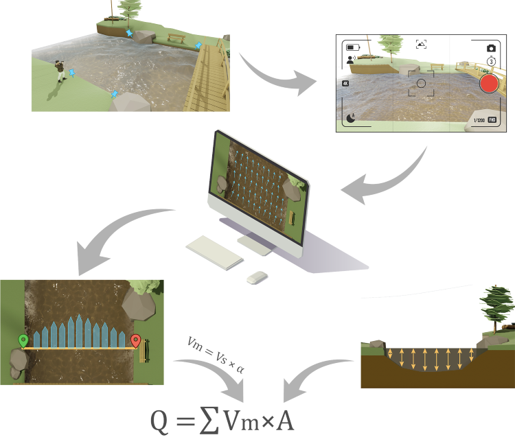

  

Figure 9: General scheme of LSPIV implementation for flow discharge estimation. <em>Source:</em> Own elaboration

LSPIV has become established as a reliable and cost-effective technique for measuring discharge, demonstrating accuracy comparable to traditional methods, such as current meters or hydroacoustic techniques, under optimal conditions of lighting, recording, and tracer distribution. However, its performance may be affected in scenarios where conditions are less favorable for implementing the technique, such as a lack of surface tracers, poor lighting conditions, or the presence of wind, among others. The uncertainty in discharge measurement is typically around 10–15% under conditions suitable for applying the technique. However, no generalized methods currently exist for determining error. Proper fieldwork planning (site selection, recording approach, and topographic surveys) and the use of complementary techniques, such as seeding artificial tracers, help mitigate these limitations and maintain consistent results.

## 1.3 Advantages, disadvantages, and common questions

Below are the advantages and disadvantages of the LSPIV technique, as well as some practical limitations that may affect its implementation. These points provide a general overview of the strengths and challenges of the technique and help to better understand its applications and field constraints.

**Advantages:**

1.  It is a non-intrusive technique that does not require direct contact with the flow.
2.  It allows for accurate velocity and discharge measurements.
3.  It can be implemented with low-cost equipment.
4.  It is suitable for measurements in hard-to-reach locations.
5.  It offers good spatial and temporal resolution.
6.  It is safe, as neither the operator nor the instrument needs to be in contact with the flow.
7.  Measurements can be performed remotely, without the need for personnel to be present on-site.
8.  It is adapted for highly unsteady flow conditions, such as sudden flood events.
9.  It is suitable for dense flows or those with high suspended sediment loads, where other methods may fail.
10. It has no depth restrictions, making it applicable to very shallow flows, where hydroacoustic and conventional techniques are ineffective.
11. It provides a visual record of the flow, which can be useful for other types of analysis.
12. A large number of flood videos recorded by citizen science initiatives on social media can be used for analysis.
13. Image-based velocimetry can be used to quickly develop a stage-discharge relationship (HQ curve), which can be validated and/or refined with additional measurements.

**Disadvantages:**

1.  There must be clearly visible tracers in the images; otherwise, the quality of the results may be negatively affected.
2.  The tracers must move at the same speed as the free surface of the flow to ensure accurate measurements.
3.  Wind, rain, and local lighting conditions may affect the visibility and behavior of surface tracers.
4.  The cross-sectional area of the flow must be measured to apply the velocity-area method. This is usually done in advance and must be monitored due to potential morphological changes in the section. Additionally, knowing the water level at the time of measurement is necessary.
5.  The ratio between surface velocity and depth-averaged velocity (alpha coefficient) used in the calculations can be highly variable and site-specific.
6.  Although some systems perform real-time processing, in many cases, desk work is required to determine discharge values.

**Common questions:**

**What types of flows can be measured?** LSPIV can be applied to measure the flow of any free-surface fluid, such as rivers, canals, hydraulic infrastructure flows, and even laboratory-scale experimental flows. The technique works best in flows with visible natural tracers, such as foam, bubbles, or turbulent structures. However, in the absence of natural tracers, artificial tracers can be seeded to ensure an appropriate surface texture for analysis. It is essential that the tracers, whether natural or artificial, accurately represent the movement of the surface of the fluid to obtain accurate measurements.
In highly turbulent flows, such as areas near hydraulic jumps, there are usually a large number of natural tracers on the surface, facilitating the application of LSPIV to estimate surface velocity with high resolution. However, due to intense flow fluctuations, the conversion from surface velocity to depth-averaged velocity may have higher uncertainty. In these cases, the technique must be carefully evaluated, as variations in the velocity distribution across the water column can affect the accuracy of discharge calculations.  

**Are there limitations regarding the size of the watercourses that can be measured?** The size of the watercourse can influence the application of LSPIV, mainly in terms of tracer visibility and image resolution. The essential requirement is that the video captures the entire width of the flow and that the surface tracers are clearly visible. In wider rivers, it may be necessary to record from a greater height, which could reduce resolution in distant areas, potentially affecting velocity estimation accuracy. However, when the fundamental conditions for LSPIV are met, the technique can also be applied successfully using satellite imagery for significantly wide rivers.  

**Is a special camera required for video recording?** No, any device capable of recording video or image sequences can be used. It is recommended that the camera have a resolution of at least Full HD (1080p) at 24 frames per second. Most modern cameras, including smartphones, have specifications well above these requirements. The technique can be applied using mobile devices, digital cameras, UAV cameras, surveillance cameras, and others.  

**What is the uncertainty of the technique in discharge measurements?** There is currently no standardized method for calculating LSPIV uncertainty due to the many variables involved in measurement. However, under optimal conditions, the uncertainty is comparable to other discharge measurement techniques, such as hydroacoustic methods. In general, LSPIV is associated with an uncertainty range of approximately 10–15%, primarily due to the difficulty in determining the alpha coefficient. However, under favorable conditions, if the relationship between surface velocity ($V_{s}$) and depth-averaged velocity ($V_{m}$) is well established, this uncertainty can be reduced, achieving values similar to those obtained with acoustic instruments. In less favorable conditions, uncertainty can increase significantly. The quantification and reduction of uncertainty in LSPIV is currently an active research field, with various groups working on more robust methodologies for uncertainty estimation.

## 1.4 Guide organization

As you progress through this guide, the two main phases of the LSPIV-based discharge measurement process will be detailed: **fieldwork** and **processing steps**. In the *Fieldwork* chapter, the recommendations and procedures necessary for proper data collection at the measurement site will be covered. Subsequently, in the *Processing steps* chapter, the processes and techniques for processing and analyzing the collected data will be detailed. This structure is designed to guide the reader through all stages of the process, from site preparation to final result interpretation, ensuring consistency and quality in measurements.
Additionally, annexes will be included, covering more technical and specific topics for those who wish to delve deeper into the details of the process and the methodologies employed.

&nbsp;
&nbsp;
***
&nbsp;
&nbsp;

# 2. Fieldwork

This chapter is dedicated to the recommendations necessary for conducting fieldwork for discharge estimation using the LSPIV technique. It provides clear and practical guidelines on how to prepare and execute measurements to obtain reliable results. It covers how to select the appropriate measurement site, how to properly position the camera, and what aspects to consider when recording videos.

The recommendations are adapted to different field conditions, classifying the recording methods into three main categories: *Perpendicular recording*, *Oblique recording*, and *Fixed station*. This classification is based on the available equipment, the possible camera positioning, and the specific requirements of each measurement site. Depending on these factors, the techniques and field procedures necessary to ensure proper image capture and subsequent processing will vary.

**Perpendicular recording:**

In this type of recording, the camera is placed perpendicular to the flow surface, capturing images from above. The most common way to achieve this view is by using a Unmanned Aerial Vehicle (UAV), which is positioned over the measurement area with the camera facing downward. This position ensures minimal perspective distortion, making the obtained image easier to process. To convert image pixels into length units (meters), it is sufficient to have a single known real-world distance visible in the image. 1D rectification is enough to obtain reliable surface flow velocity results in conventional units (such as meters per second).

  

  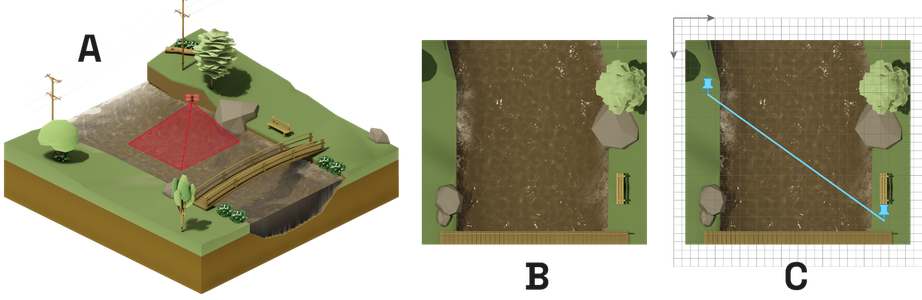

  

Figure 10: Schematic representation of perpendicular recording. (A) Recording point. (B) Camera view. (C) 1D rectification. <em>Source:</em> Own elaboration

**Oblique recording:**

In this modality, a camera is brought to the site of interest, where it is temporarily positioned on the riverbanks or on a bridge over the channel. Since the camera is tilted relative to the water surface, the resulting image exhibits perspective distortion. To correct this distortion, it is necessary to identify at least four Control Points (CPs) on the same plane as the water surface and visible in the image, whose planimetric coordinates or relative distances must be known. This type of rectification, known as 2D rectification, is sufficient to obtain reliable surface flow velocity results in conventional units (such as meters per second).

  

  

  

Figure 11: Schematic representation of oblique recording. (A) Recording point. (B) Camera view. (C) 2D rectification. <em>Source:</em> Own elaboration

**Fixed station:**

This system allows for automatic video recording of a watercourse for monitoring purposes. It consists of a permanently installed camera at a fixed point, with its operation controlled by a mini-computer. Typically, the automation of video recording is based on the water level, which is also measured automatically by an external sensor.

This system enables recordings to be obtained without requiring a person on-site, providing a remote monitoring solution for observing the behavior of a watercourse. It is particularly useful for tracking sudden flood events. In most cases, the camera is installed to capture the flow from an oblique angle, and since the camera's position remains unchanged, 3D rectification can be applied to correct perspective distortion for any flow level. In this case, it is necessary to know the spatial coordinates in the terrain and in the image of a set of at least six Control Points (CPs), distributed evenly in space.

  

  

  

Figure 12: Schematic representation of recording with a Fixed Station. (A) Recording point. (B) Camera view. (C) 3D rectification. <em>Source:</em> Own elaboration

*The three recording methods allow for different types of rectification. [Table 1](#tab1) summarizes the possible options and suggests the best choice for each case. If a different type of rectification than the recommended one is intended to be used, it is advisable to refer to [Annex 3](#An3).*

 

Table 1: Accepted rectification types according to recording method.

| Recording Method | Possible Rectification | Suggested Rectification |
|:----------------:|:----------------------:|:-----------------------:|
| Perpendicular    | 1D, 2D or 3D           | 1D                      |
| Oblique          | 2D or 3D                | 2D                      |
| Fixed station    | 2D or 3D                | 3D                      |

## 2.1 Recommendations by recording type

Specific recommendations for each type of recording are related to site selection, camera positioning, control points for rectification, and video recording. **These recommendations should be considered simultaneously, as all aspects are interrelated. It is not about following a strict order, but rather evaluating and adjusting all variables together to ensure that measurements are effective, safe, and that results are reliable.**

### 2.1.1 Perpendicular recording

#### 2.1.1.1 Site Selection

Image-based velocimetry techniques are not suitable for all sites, and the selection criteria may differ from those of other techniques. Proper site selection is crucial to obtaining reliable results and facilitating both fieldwork and video processing. The recommendations for site selection are:

*Related to the channel reach ([Figure 13](#fig13)):*

Preferred:

1.  Straight river reaches with uniform flow.
2.  Sites that allow for easy camera positioning in a perpendicular view.
3.  Accessible areas for bathymetric surveys (see Section [2.2](#22-bathymetric-survey)) and for marking and surveying CPs.

To avoid:

4.  Reaches with flow obstructions in the surrounding area.
5.  Reaches with hydraulic jumps or highly turbulent zones.
6.  Reaches with dense riparian vegetation, which reduces the effective flow area and/or visually obstructs the flow near the banks.
7.  Sections influenced by tidal effects, backwater effects, or other conditions that make it difficult to accurately quantify the alpha coefficient (only relevant for discharge calculations).

  

  

  

Figure 13: Schematic examples of site selection for perpendicular recording. (A) Recirculation zone. (B) Reach with obstacles. (C) Highly turbulent reach. (D) Straight and uniform reach. <em>Source:</em> Own elaboration

*Related to tracers and meteorological conditions ([Figure 14](#fig14) and [Figure 15](#fig15)):*

1.  Ensure that surface tracers are evenly distributed across the entire channel width and remain visible throughout the recording.
2.  Avoid measurements under wind conditions that could affect the natural movement of surface tracers. This is particularly important in low-flow conditions.
3.  Avoid sites with large shadows or sun reflections on the water surface that may obscure the movement of surface tracers.
4.  Avoid sites with stationary surface undulations that do not move with the flow, such as standing waves.
5.  If tracers are not clearly detected in a nadir view, consider using an oblique view, as it may improve visibility in certain conditions.

  

  

  

Figure 14: Schematic examples of natural tracer conditions. (A) No visible tracers. (B) Tracers visible only in certain areas. (C) Presence of stationary waves. (D) Presence of shadows and reflections. (E) Visible and uniformly distributed tracers. <em>Source:</em> Own elaboration

6.  If the water is clear or there are no visible natural tracers on the water surface, artificial tracers must be seeded. For more details, refer to [Annex 4](#An4).

  

  

  

Figure 15: Schematic examples of artificial tracer distribution in perpendicular recording. (A and B) Heterogeneous distribution. (C) Homogeneous distribution. <em>Source:</em> Own elaboration

*Related to the cross-section (XS):*

1.  Define at least one cross-section for study, although multiple sections can be defined to improve discharge estimation by averaging the values obtained at each section.
2.  Prefer sections with regular geometry, avoiding highly irregular profiles or those with large rocks (macro-rough flows).
3.  Select sections that are stable and not subject to significant erosion or sedimentation during the measurement period.
4.  Prefer sections where most of the recommendations regarding the study reach, tracers, and meteorological conditions are met.
5.  Mark the section location in the field so it can be easily identified in the images. Elements such as cones or stakes can be placed on the ground to be visible in the images ([Figure 16](#fig16)).

  

  

  

Figure 16: Schematic representation of cross-section location marking. <em>Source:</em> Own elaboration

6.  Conduct a bathymetric survey of the section(s) following the recommendations in Section [2.2](#22-bathymetric-survey).
7.  Measure the free surface water level. If external instruments are used (e.g., sensors or staff gauges), the data must be referenced to the same datum as the bathymetric survey of the analyzed section.

#### 2.1.1.2 Camera positioning

In perpendicular recording, the camera is positioned perpendicular to the flow surface, which is typically achieved using a UAV. Therefore, it is essential to first consider the local regulations on UAV use, as many countries have laws restricting their operation, especially in urban areas or near airports. Before conducting any measurements, it is necessary to verify the legal framework and obtain the required permits to ensure the safe and lawful use of the equipment.

Regarding on-site recommendations, the following should be considered:

1.  The camera should be positioned in a perpendicular view to facilitate correct pixel scaling ([Figure 17](#fig17)). If the view is oblique, refer to the [Oblique recording section](#212-oblique-recording).

  

  

  

Figure 17: Schematic representation of camera positioning in perpendicular recording. <em>Source:</em> Own elaboration

2.  The UAV must remain in a stable, hovering position to reduce camera movement. Any significant UAV movement could affect the velocity analysis results ([Figure 18](#fig18)).

  

  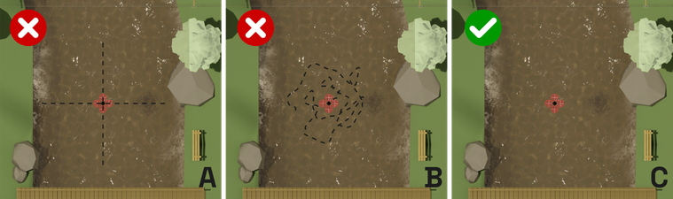

  

Figure 18: Schematic representation of UAV movement during video recording with a perpendicular view. (A) Longitudinal and/or transverse displacements. (B) Large erratic movements. (C) Stable or with minimal movement over a fixed position. <em>Source:</em> Own elaboration

3.  Ensure that the entire channel width, including the target cross-section, is fully visible within the image ([Figure 19](#fig19)).
4.  Ensure that Control Points are visible within the image (see section 2.1.1.3).
5.  Avoid positioning the camera so that the target cross-section appears too close to the image edges. It is recommended that the section be positioned at the center of the image ([Figure 19](#fig19)).
6.  Ensure there are no visual obstructions between the camera and the section of the watercourse to be measured, such as overhead cables, structures, or tall vegetation that may block the view ([Figure 19](#fig19)).
7.  If necessary and possible, remove vegetation near the banks to ensure the entire channel width is visible ([Figure 19](#fig19)).

  

  

  

Figure 19: Schematic representation of camera views in perpendicular recording. (A) Obstructed view. (B) Vegetation blocking the banks. (C) Incomplete channel width visibility. (D) Section positioned near the image edges. (E) Clear and complete channel view. <em>Source:</em> Own elaboration

7.  Verify that the surface tracers, whether natural or artificial, are clearly visible in the images (elements that appear detectable to the naked eye may not be well distinguished in the recording).
8.  Avoid taking measurements in strong wind conditions, as they may affect both the stability of the UAV and the recording quality (Figure 18).

#### 2.1.1.3 Control Points

For 1D rectification in perpendicular recording, two Control Points (CPs) are required. CPs are specific and easily identifiable points in the image, whose position in both the terrain and the image is known. These points must be static and clearly visible throughout the recording. Existing elements in the environment can be used, or temporary markers can be placed. 1D rectification is essentially the same as defining the pixel size in the image, as it establishes the relationship between the real-world terrain dimensions and their representation in the image. The following recommendations should be considered when selecting and using CPs:

*Related to CP selection ([Figure 20](#fig20) and [Figure 21](#fig21)):*

1.  Two CPs must be established, ideally positioned one on each bank of the channel.
2.  The CPs must be at the same elevation as the water surface.
3.  They should be easily identifiable, with a size and color that allow for quick localization.
4.  The points must remain static throughout the video recording, without moving or shifting position.

  

  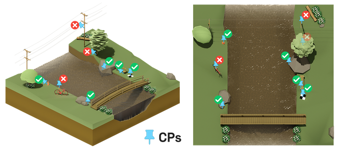

  

Figure 20: Elements in the field that can be used as CPs.<em>Source:</em> Own elaboration

  

  

  

Figure 21: Schematic representation of CP placement in perpendicular recording. Left: CPs appear too close together in the image. Right: CPs are easily visible, well-separated, and placed on both banks of the channel. <em>Source:</em> Own elaboration

5.  Existing site elements can be used, such as structures, posts, rocks, trees, hydraulic infrastructure, or temporary markers like stakes, cones, or grid markers ([Figure 22](#fig22)).

  

  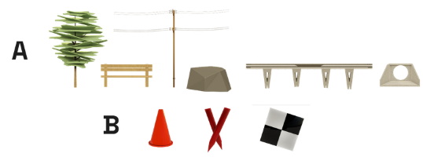

  

Figure 22: Examples of elements that can be used as CPs. (A) Pre-existing elements found at the site. (B) Examples of temporary markers. <em>Source:</em> Own elaboration

6.  When using a large object as a CP, the exact reference point must be clearly defined to avoid ambiguity. This can be achieved by marking or aligning an object in a way that clearly indicates the precise survey location. For example, if using a rock, it must be clear which specific part of the rock is being referenced.
7.  The same markers used to define the cross-section location can also be used as CPs

*Related to CP surveying:*

1.  There are two ways to determine the real-world coordinates of CPs: directly measuring their planimetric coordinates (*x, y*), or measuring the distances between them. The choice between these methods depends on the available equipment and the software requirements for image processing. Most software applications support both approaches.
2.  If planimetric coordinates (*x, y*) are needed, the CPs should be surveyed using Differential GNSS (Global Navigation Satellite System) or Total Station.
3.  If the software requires the distance between CPs, it can be obtained in two ways: Measuring their coordinates with Differential GNSS or Total Station and calculating the distance, or measuring the distance directly using a measuring tape, rangefinder, or optical level.

#### 2.1.1.4 Video recording

1.  Record videos at a frame rate of at least 24 frames per second (FPS) to ensure proper flow capture.
2.  A pixel resolution of at least 1080p (Full HD/FHD) is recommended. If the camera allows for higher resolution, opt for the maximum available. However, for very high resolutions (e.g., 4K), consider the impact on file size and processing time in LSPIV analysis.
3.  Avoid using lenses with significant distortion, such as fisheye or wide-angle lenses.
4.  It is recommended to record at least 60 seconds of video once the UAV is positioned at the target location, ensuring stable environmental conditions and the presence of surface tracers. Although shorter segments can be used during processing, this minimum duration increases the likelihood of having a high-quality segment suitable for analysis.
5.  Ensure that the water level remains stable throughout the recording.

#### 2.1.1.5 Checks and controls

Below is a basic checklist of elements to verify when conducting a monitoring campaign using perpendicular recording:

| ✅ | Equipment                                                                                                                     |
|----|-------------------------------------------------------------------------------------------------------------------------------|
|    | UAV with fully charged batteries.                                                                                             |
|    | Spare battery, fully charged.                                                                                                 |
|    | At least two elements to mark Control Points (CPs) in the field, such as stakes, cones, or grid markers.                      |
|    | CP survey equipment: Differential GNSS, Total Station, Optical Level, rangefinder, or measuring tape (at least one of these). |
|    | Cross-section survey equipment: See equipment requirements in Section 2.2.                                                    |

> It is recommended to record all site and recording details in a field notebook. This may include:   
>- Date and time of measurement. 
>- Names of the persons conducting the measurement.
>- Measurement site location. 
>- Weather conditions: General weather status (cloud cover, wind speed and direction, etc.). 
>- Hydrological condition of the channel to be measured. 
>- General condition of the section (vegetation, presence of debris, etc.). 
>- Site sketch, indicating the flow direction, banks, location of cross-section(s), CP placement, and surveyed CP position or distance information. 
>- Free surface water level if external measurement sensors/staff gauge are available, and note whether the water level is rising, stable, or decreasing.
>- Camera used, file names, and the times and time zone of the videos generated during measurement. 
>- UAV flight altitude and other details. 
>- If possible, quick estimates of flow velocity and/or discharge, for example, using the float method, or an estimated discharge from an HQ curve, if available at the site. 

#### 2.1.1.6 Error control

Before leaving the measurement site, answer the following questions:

1. **Do you have a recorded video?**  
❌ NO → Record a video at the site.  
✅ YES → Continue  

1. **Is the video stable?**  
❌ NO → Re-record, checking for UAV movements and wind conditions.  
✅ YES → Continue  

1. **s the entire channel width visible in the video?**  
❌ NO → Adjust the recording position.  
✅ YES → Continue  

1. **Are the surface tracers clearly visible in the video?**  
❌ NO → Reduce UAV altitude or seed artificial tracers.  
✅ YES → Continue  

1. **Are the CPs easily identifiable in the video?**  
❌ NO → Add or modify CP markers.  
✅ YES → Continue  

1. **Has the survey of CPs and the bathymetry of at least one cross-section been completed?**  
❌ NO → Conduct the necessary surveys.  
✅ YES → Continue  

1. **Do you have the free surface water level measurement?**  
❌ NO → Measure the free surface water level.  
✅ YES → Continue  

1. **Have all details been recorded in the field notebook?**  
❌ NO → It is recommended to do so.  
✅ YES → Ready for processing!  

&nbsp;
&nbsp;

### 2.1.2 Oblique recording

#### 2.1.2.1 Site selection

Image-based velocimetry techniques are not suitable for all sites, and the selection criteria may differ from those of other methods. Proper site selection is crucial to obtaining reliable results and facilitating both fieldwork and video processing.

*Related to the channel reach ([Figure 23](#fig23)):*

Preferred:

1.  Straight river reaches with uniform flow.
2.  Reaches with easy access to the riverbanks or a structure crossing the channel, such as a bridge or walkway, allowing for multiple camera positioning options.
3.  Accessible sites for bathymetric surveys (see Section 2.2) and for marking and surveying CPs.

To avoid:

4.  Reaches with flow obstructions in the surrounding area.
5.  Reaches with hydraulic jumps or highly turbulent zones.
6.  Reaches with dense riparian vegetation, which reduces the effective flow area and/or visually obstructs the flow near the banks.
7.  Sections influenced by tidal effects, backwater effects, or other conditions that make it difficult to accurately quantify the alpha coefficient (only relevant for discharge calculations).

  

  

  

Figure 23: Schematic examples of site selection for oblique recording. (A) Recirculation zone. (B) Reach with obstacles. (C) Highly turbulent reach. (D) Straight and uniform reach. <em>Source:</em> Own elaboration

*Related to tracers and meteorological conditions ([Figure 24](#fig24) and [Figure 25](#fig25)):*

1.  Ensure that surface tracers are evenly distributed across the entire channel width and remain visible throughout the recording.
2.  Avoid measurements under wind conditions that could affect the natural movement of surface tracers. This is particularly important in low-flow conditions.
3.  Avoid sites with large shadows or sun reflections on the water surface that may obscure the movement of surface tracers.
4.  Avoid sites with stationary surface undulations that do not move with the flow, such as standing waves.

  

  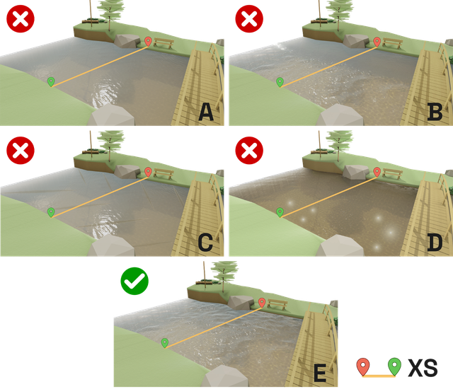

  

Figure 24: Schematic examples of natural tracer conditions. (A) No visible tracers. (B) Tracers visible only in certain areas. (C) Presence of stationary waves. (D) Presence of shadows and reflections. (E) Visible and uniformly distributed tracers. <em>Source:</em> Own elaboration

5.  If the water is clear or there are no visible natural tracers on the water surface, artificial tracers must be seeded. For more details, refer to [Annex 4](#An4).

  

  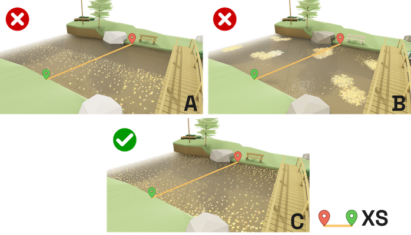

  

Figure 25: Schematic examples of artificial tracer conditions in oblique recording. A and B) Heterogeneous distribution. C) Homogeneous distribution. <em>Source:</em> Own elaboration

*Related to the cross-section (XS):*

1.  Define at least one cross-section for study, although multiple sections can be defined to improve discharge estimation by averaging the values obtained at each section.
2.  Prefer sections with regular geometry, avoiding highly irregular profiles or those with large rocks (macro-rough flows).
3.  Select sections that are stable and not subject to significant erosion or sedimentation during the measurement period.
4.  Prefer sections where most of the recommendations regarding the study reach, tracers, and meteorological conditions are met.

5.  Mark the section location in the field so it can be easily identified in the images. Elements such as cones or stakes can be placed on the ground to be visible in the images ([Figure 26](#fig26)).

  

  

  

Figure 26: Schematic representation of cross-section location marking. <em>Source:</em> Own elaboration

6.  Conduct a bathymetric survey of the section(s) following the recommendations in Section [2.2](#22-bathymetric-survey).
7.  Measure the free surface water level. If external instruments are used (e.g., sensors or staff gauges), the data must be referenced to the same datum as the bathymetric survey of the analyzed section.

#### 2.1.2.2 Camera positioning

The person conducting the measurement must bring a camera to the measurement site and record from the riverbanks or from a structure crossing the channel (e.g., a bridge), or using a UAV for oblique video recording. There are multiple positioning options for recording, and the selection should consider safety aspects, visibility of the flow area and tracers, CP location, orientation, height, among others. The following general recommendations should be considered:

1.  Prioritize the operator’s safety, especially in flood conditions or high-velocity flows. Avoid standing in unstable areas, such as eroded banks, loose rocks, or deteriorated structures. Do not engage in hazardous maneuvers, such as descending steep terrains or crossing the river at unauthorized locations just to obtain a better recording. It is preferable to find an alternative angle or take the measurement from a safe position, even if it means compromising recording quality.
2.  Walk along both riverbanks and check any available bridges to determine the best viewing angle, following the recommendations regarding tracers and CPs ([Figure 27](#fig27)).

  

  

  

Figure 27: Schematic representation of possible camera locations for oblique recording at a site. <em>Source:</em> Own elaboration

3.  Ensure camera stability by using a tripod or resting it on a stable and secure surface. If this is not possible, hold the camera firmly with both hands to minimize movement and vibrations ([Figure 28](#fig28)).

  

  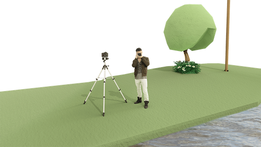

  

Figure 28: Methods for stabilizing the camera in oblique recording. <em>Source:</em> Own elaboration

4.  Choose higher vantage points relative to the water surface whenever possible, as this reduces perspective distortion.
5.  Ensure no visual obstructions between the camera and the watercourse section to be measured, such as overhead cables, structures, or tall vegetation that could block the view ([Figure 29](#fig29)). If necessary, and where conditions permit, consider removing vegetation or adjusting the camera position to achieve a clear view of the flow.
6.  Ensure the entire channel width, including the target cross-section, is fully visible within the image. Additionally, the cross-section should not be near the image edges but centered in the frame ([Figure 29](#fig29)).
7.  Ensure that Control Points are visible within the image (see section 2.1.2.3).
8.  Ensure surface tracers are clearly visible in the images. In oblique recordings, flow visibility may vary depending on the recording angle ([Figure 29](#fig29)).
9.  Avoid sun reflections on the water surface and do not record directly against the sun or other light sources ([Figure 29](#fig29)).
10. Verify that the CPs are clearly visible from the selected position.
11. If using a mobile device camera (e.g., a smartphone), note that the field of view may change between Photo mode and Video mode. Always test and adjust in Video mode.

  

  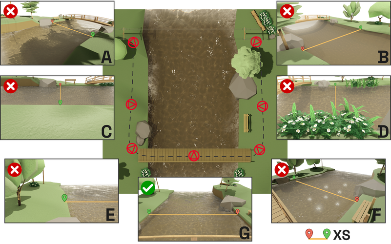

  

Figure 29: Schematic representation of different viewing conditions in oblique recording. (A) Presence of shadows. (B) Flow without tracers. (C) Very low vantage point. (D) Obstructed view. (E) Incomplete channel width visibility. (F) Presence of sun reflections. (G) Example of a suitable viewing angle. <em>Source:</em> Own elaboration

#### 2.1.2.3 Control Points

For oblique recording, four Control Points (CPs) are required. CPs are specific and easily identifiable points in the image, whose real-world position is known. It is necessary to have either the planimetric coordinates (*x*, *y*) of each CP or the six distances between them (the two diagonals and the four perimeter distances). The following recommendations should be considered when selecting and using CPs in oblique recordings:

1.  Four CPs must be established, ideally distributed as two on each bank.
2.  The CPs must be at the same elevation (or very close) to the free surface of the flow ([Figure 31](#fig31)).
3.  They should be easily identifiable, with a size and color that allow for quick localization, even for CPs that are farther from the recording point ([Figure 31](#fig31)).
4.  The CPs should be distributed within the image, avoiding alignment or excessive proximity to one another ([Figure 31](#fig31)).
5.  Utilize pre-existing elements at the site, such as structures, posts, rocks, trees, hydraulic infrastructure, or temporarily mark points using stakes, cones, or grid markers ([Figure 30](#fig30)).

  

  

  

Figure 30: Examples of elements that can be used as CPs. (A) Pre-existing elements found at the site. (B) Examples of temporary markers.
 <em>Source:</em> Own elaboration

6.  When using a large object as a CP, the exact reference point must be clearly defined to avoid ambiguity. This can be achieved by marking or aligning an object in a way that clearly indicates the precise survey location. For example, if using a rock, it must be clear which specific part of the rock is being referenced.
7.  It is preferable that the cross-section(s) of interest be located within the quadrant defined by the CPs, although this is not strictly necessary. Additionally, the same markers used to define the cross-section location can also be used as CPs.

  

  

  

Figure 31: Schematic examples of CP selection in oblique recording. (A) A CP is not at the same elevation as the water surface. (B) CPs are aligned. (C) A CP is not fixed. (D) Proper CP selection and distribution.
 <em>Source:</em> Own elaboration

*Related to CP surveying:*

1.  There are two ways to determine the real-world coordinates of CPs: directly measuring their planimetric coordinates (*x, y*), or measuring the distances between them. The choice between these methods depends on the available equipment and the software requirements for image processing. Most software applications support both approaches.
2.  If planimetric coordinates are used, all four CPs should be surveyed using Differential GNSS (Global Navigation Satellite System) or Total Station.
3.  If distances are used, all six distances between the four CPs must be measured (four perimeter distances and two diagonals). It is important to note that these distances must be horizontal, which is why CPs must be at the same elevation as the water surface.

#### 2.1.2.4 Video recording

1.  Record videos at a frame rate of at least 24 frames per second (FPS) to ensure proper flow capture.
2.  A pixel resolution of at least 1080p (Full HD/FHD) is recommended. If the camera allows for higher resolution, opt for the maximum available.
3.  Avoid using lenses with significant distortion, such as fisheye or wide-angle lenses.
4.  Once positioned at the recording site, ensuring safety and proper framing, begin recording. Check that the CPs and the cross-section(s) of interest are visible in the video.
5.  If no stabilization equipment (e.g., a tripod) is used, avoid sudden movements or panning. Hold the camera firmly and keep it as steady as possible.
6.  It is recommended to record at least 60 seconds of video, ensuring stable environmental conditions and the presence of surface tracers. Although shorter segments can be used during processing, this minimum duration increases the likelihood of having a high-quality segment suitable for analysis.
7.  Ensure that the water level remains stable throughout the recording 

#### 2.1.2.5 Checks and controls

***

Below is a basic checklist of elements to verify when conducting a monitoring campaign using oblique recording:

| ✅ | Equipment                                                                                                                     |
|----|-------------------------------------------------------------------------------------------------------------------------------|
|    | Camera or mobile device with fully charged batteries.                                                                         |
|    | Spare battery, fully charged.                                                                                                 |
|    | Tripod or stabilization equipment for the camera, if available.                                                               |
|    | At least four elements to mark Control Points (CPs) in the field, such as stakes, cones, or grid markers.                     |
|    | CP survey equipment: Differential GNSS, Total Station, Optical Level, rangefinder, or measuring tape (at least one of these). |
|    | Cross-section survey equipment: See equipment requirements in Section 2.2.                                                    |

> It is recommended to record all site and recording details in a field notebook. This may include: 
>- Date and time of measurement.
>- Names of the persons conducting the measurement.
>- Measurement site location. 
>- Weather conditions: General weather status (cloud cover, wind speed and direction, etc.). 
>- Hydrological condition of the channel to be measured. 
>- General condition of the section (vegetation, presence of debris, etc.). 
>- Site sketch, indicating the flow direction, banks, location of cross-section(s), CP placement, and surveyed CP position or distance information. 
>- Free surface water level if external measurement sensors/staff gauge are available, and note whether the water level is rising, stable, or decreasing.
>- Camera used, file names, and the times and time zone of the videos generated during measurement. 
>- If possible, quick estimates of flow velocity and/or discharge, for example, using the float method, or an estimated discharge from an HQ curve, if available at the site.

#### 2.1.2.6 Error Control

Before leaving the measurement site, answer the following questions:

1. **Do you have a recorded video?**  
❌ NO → Record a video at the site  
✅ YES → Continue  

1. **Is the video stable?**  
❌ NO → Re-record, ensuring camera stability  
✅ YES → Continue  

1. **Is the entire channel width visible in the video?**  
❌ NO → Adjust the recording position  
✅ YES → Continue  

1. **Are the surface tracers clearly visible in the video?**  
❌ NO → Change the recording position or seed artificial tracers  
✅ YES → Continue  

1. **Are the CPs easily identifiable in the video?**  
❌ NO → Add or modify CP markers  
✅ YES → Continue  

1. **Has the survey of CPs and the bathymetry of at least one cross-section been completed?**  
❌ NO → Conduct the necessary surveys  
✅ YES → Continue  

1. **Do you have the free surface water level measurement?**  
❌ NO → Measure the free surface water level  
✅ YES → Continue  

1. **Have all details been recorded in the field notebook?**  
❌ NO → It is recommended to do so  
✅ YES → Ready for processing!  

&nbsp;
&nbsp;

### 2.1.3 Fixed station

An LSPIV Fixed Station consists of a permanently installed camera with a view of the watercourse being monitored. It includes an electrical cabinet, a protective weatherproof enclosure housing the electronic components and hardware of the station. Additionally, it may include an energy supply source, such as a solar panel.

When using Fixed Stations, it is essential to consider that the following recommendations must be evaluated based on the range of water levels to be measured. The behavior of the monitored watercourse can vary significantly over time, due to fluctuations in water levels during flood events or low-flow conditions. Therefore, when planning the camera’s location and configuration, it is crucial to ensure that the area of interest remains suitable for LSPIV implementation across the expected range of water levels. A single camera position and configuration may not guarantee optimal conditions for LSPIV implementation across all flow levels. Additionally, since the station will be permanently installed on-site, careful consideration must be given to its placement, either by utilizing existing structures or installing a new structure at the site.

#### 2.1.3.1 Site selection

*Related to the selected reach:*

Preferred:

1.  Straight river reaches with uniform flow.
2.  Reaches with structures where the Fixed Station can be installed, such as light poles, bridges, nearby buildings, etc. If no such structure exists, a new structure must be installed on-site ([Figure 32](#fig32)).
3.  Reaches that already have an automatic water level sensor or where one can be installed. This data is necessary for the automation of the Fixed Station operation.
4.  Locations that are secure against vandalism.
5.  Accessible reaches for bathymetric surveys (see Section [2.2](#22-bathymetric-survey)).

To avoid:

1.  Reaches with flow obstructions in the surrounding area.
2.  Reaches with hydraulic jumps or highly turbulent zones within the range of water levels of interest.
3.  Reaches influenced by tidal effects, backwater effects, or other conditions that make it difficult to accurately quantify the alpha coefficient (only relevant for discharge calculations).

  

  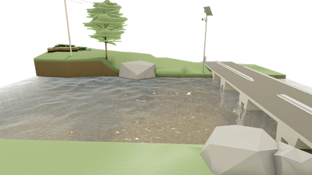

  

Figure 32: Schematic example of a Fixed Station installed on a pole.
 <em>Source:</em> Own elaboration

*Related to tracers and meteorological conditions ([Figure 33](#fig33)):*

1.  Ensure the presence of surface tracers with a homogeneous distribution across the entire channel width within the range of water levels of interest.
2.  Avoid sites with stationary surface waves that do not move with the flow, such as standing waves.
3.  Meteorological conditions may vary significantly between days and throughout the day. Evaluate lighting variations, considering the undesired appearance of large shadows or sun reflections over the flow area of interest

  

  

  

Figure 33: Schematic examples of natural tracer conditions. (A) No visible tracers. (B) Tracers visible only in certain areas. (C) Presence of shadows and reflections. (D) Visible and uniformly distributed tracers. <em>Source:</em> Own elaboration

*Related to the cross-section (XS):*

1.  Define at least one cross-section for study, although multiple sections can be defined to improve discharge estimation by averaging the values obtained at each section.
2.  Prefer sections with regular geometry, avoiding highly irregular profiles or those with large rocks (macro-rough flows).
3.  Select sections that are stable and not subject to significant erosion or sedimentation during the measurement period.
4.  Prefer sections where most of the recommendations regarding the study reach, tracers, and meteorological conditions are met.

#### 2.1.3.2 Camera positioning

1.  Install the camera on a firm and stable structure that is not significantly affected by wind or vibrations, especially if it is mounted on a bridge ([Figure 34](#fig34)).
2.  Position the camera at a height that allows for full visibility of the channel width, including the study cross-section, within the range of water levels of interest.
3.  Ensure that the flow measurement area does not appear too small in the image for the range of interest. This can happen if the camera is too far from the measurement area ([Figure 34](#fig34)).
4.  The cross-section should not be too close to the image edges; it is preferable that it is centered in the frame.
5.  The camera orientation should minimize direct sunlight on the lens, avoiding having the sun directly in front, which could affect image quality.
6.  There should be no visual obstructions between the camera and the monitored section of the watercourse, such as cables, structures, or vegetation that may block the view. If necessary, and where conditions allow, consider removing obstructions or adjusting the camera position to obtain a clear view of the flow ([Figure 34](#fig34)).
7.  Ensure that the surface tracers are clearly visible in the images within the range of water levels of interest

  

  

  

Figure 34: Schematic examples of different visualization conditions for a Fixed Station. (A) Station mounted on an unstable structure. (B) Station with an obstructed view. (C) Station positioned too far from the measurement area. (D) Station with a clear and unobstructed view for the range of interest. <em>Source:</em> Own elaboration

#### 2.1.3.3 Control Points

To perform rectification on videos captured by a Fixed station with a camera mounted in a fixed oblique position, a 3D rectification process must be used. This process requires Control Points (CPs), which can be pre-existing elements in the environment or temporarily marked points. These points must be clearly visible in the images, and both their spatial coordinates (*x, y, z*) and their pixel coordinates in the image must be known. At least six CPs are needed, evenly distributed within the camera’s field of view. The following recommendations should be considered when selecting and using CPs:

1.  A minimum of six CPs must be used for proper rectification. However, it is recommended to use at least eight CPs, or more if possible, as additional points provide greater redundancy and improve accuracy in case of errors in coordinate measurements.
2.  CPs must be evenly distributed within the camera’s field of view. A zigzag distribution pattern, both horizontally and vertically, can be used ([Figure 35](#fig35)).
3.  CPs should be arranged to cover the entire range of expected water levels ([Figure 35](#fig35)).

  

  

  

Figure 35: Schematic examples of CP distribution for 3D rectification using a Fixed Station. (A) Inadequate CP distribution. (B) Homogeneous CP distribution across the field of view. <em>Source:</em> Own elaboration

*Related to CP surveying:*

1.  To obtain spatial coordinates, the accuracy of CP survey data must be ensured, as errors in spatial coordinates can complicate or even prevent the rectification process. It is recommended to use Differential GNSS (Global Navigation Satellite System) or Total Station.
2.  CP coordinates must include altitude (*z*), and all elevations must be referenced to the same datum. Both water level data and cross-section surveys must use the same datum to ensure consistency in rectification.
3.  To obtain pixel coordinates, it is essential to precisely locate each CP in the image. To achieve this, it is recommended to capture an image simultaneously with the CP survey. An indicator on the GNSS/Total Station pole can be used for better accuracy when surveying distant points ([Figure 36](#fig36)).

  

  

  

Figure 36: Example of an indicator marking the GNSS Differential pole position during CP surveying. <em>Source:</em> Own elaboration

#### 2.1.3.4 Integration with water level sensor and staff gauge

For optimal use of Fixed Stations for discharge measurement, it is essential to have water level data that allows for automated processing. Such data is typically obtained from an external water level sensor. However, in many cases, the water level sensor does not measure at the exact cross-section used for discharge measurement. For example, if the site has a bridge, the sensor might be installed on the structure, while the cross-section viewed from the station could be located several meters upstream or downstream. Therefore, it is necessary to establish a relationship between the level recorded by the sensor ($H_{S}$) and the level at the section of interest ($H_{X S}$) ([Figure 37](#fig37)).

This relationship may vary depending on hydrological conditions, as flow behavior during low-flow conditions can differ from that during flood events. It is recommended to perform water level measurements at the cross-section under different flow conditions and link those values with the sensor-measured levels. Using these data pairs, a linear equation can be fitted, even in segmented intervals, using the least squares method, allowing the estimation of the cross-section level from any water level sensor measurement.

  

  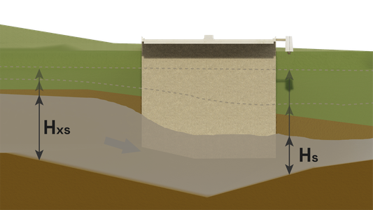

  

Figure 37: Schematic representation of water level sensor linkage.
 <em>Source:</em> Own elaboration

To estimate water levels at the cross-section, it is recommended to take in situ measurements using Differential GNSS or Total Station, recording the water surface level at both the cross-section of interest and the water level sensor location. These measurements must be referenced to the same datum as the CPs. Another option is to use images captured by the Fixed Station to make a visual estimate of the water level at the section, identifying moments when the flow reaches known Z-elevation points, such as CPs.

At sites with a historical staff gauge, it is advisable to integrate all measurement systems within a single reference framework. This will facilitate estimating the water level at the cross-section, at the sensor, or on the staff gauge, using any of the available reference points. To achieve this, during the topographic survey, the staff gauge position should be included in the same coordinate system as the CPs, ensuring data consistency.

Additionally, if site and flow conditions allow, optical methods can be used to measure the free surface water level. This can be done using images obtained by the Fixed Station or by installing a separate dedicated camera for this purpose.

## 2.2 Bathymetric survey

This section outlines general guidelines for surveying cross-sections used for discharge computation. This process can be conducted on the same day as the video recording, provided flow conditions allow it. Otherwise, assuming the section is not subject to significant erosion or sedimentation, the survey can be performed before or after the video recording. It is recommended to complement this information with best practices in topographic surveying, depending on the equipment used.

1.  The cross-sections should be selected based on the recommendations given for each recording mode while also considering accessibility.
2.  The cross-sections should be perpendicular to the main flow direction.
3.  Along each cross-section, multiple measurement points should be taken to adequately represent the riverbed shape. It is advisable to increase the density of points in areas with abrupt topographic changes, such as eroded banks or riverbeds with large rocks. The surveyed points should be aligned with the cross-section direction.
4.  The survey of each cross-section should cover the area from the water’s edge on one bank to the water’s edge on the opposite bank, ensuring the entire flow width is captured. It is essential to specify whether the survey starts from the Left Bank or Right Bank to avoid misinterpretations and ensure consistency in data processing.
For Fixed stations, it is recommended to survey a wider area, including the dry portion of the cross-section. This allows for the collection of geometric data for different water levels, making it possible to calculate discharge as flow levels fluctuate. However, it is important to note that discharge can only be calculated up to the maximum water level where bathymetric information is available.
5.  If the same instrument is used for both CP surveying and cross-section surveying, ensure both tasks are conducted in the same coordinate system. This is critical for Fixed stations
6.  Equipment options for bathymetric surveys:
    1.  Differential GNSS (Global Navigation Satellite System): Allows for high-precision and rapid surveys but may have limited use under structures or in areas with dense, tall vegetation.
    2.  Total Station: Enables high-precision and rapid surveys and can be referenced to a geographic coordinate system.
    3.  Optical Level: Accuracy depends on the operator's experience, and survey times may be longer. It can be referenced to a geographic coordinate system.
    4.  Echosounder/ADCP: In deep sections where wading is not possible, these instruments can be used to collect depth data.
    5.  Measuring Tape and Graduated Rod: If no other instruments are available, a simple survey can be conducted using a measuring tape for horizontal distances and a graduated rod for vertical measurements.

  

  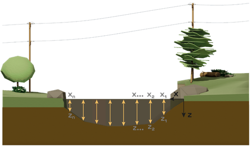

  

Figure 38: Schematic representation of bathymetric survey for a cross-section. <em>Source:</em> Own elaboration

***

# 3. Processing steps

This chapter describes the process of analyzing and processing the data collected in the field for flow discharge measurement using image-based velocimetry techniques. Through these recommendations, the user is guided from organizing the recorded material to interpreting the obtained results. Clear guidelines are provided on the use of specialized software, image correction, and the implementation of image-based velocimetry algorithms. Additionally, best practices are highlighted to optimize measurement accuracy, addressing potential challenges that may arise during processing.

The workflow covered in this chapter consists of the following stages:

1.  **Software selection**: Identifying appropriate tools for processing.
2.  **Data check**: Verifying the required files and formats.
3.  **Workflow**: Processing the video for discharge calculation, which includes:
    1.  **Selection of the video time interval**
    2.  **Correction of camera movement and lens distortion**
    3.  **Rectification**
    4.  **Application of the PIV algorithm**
    5.  **Discharge estimation**

## 3.1 Software selection

There are various software options available for processing recordings and estimating discharge using LSPIV ([Table 2](#tab2)). Although each software may have particularities in its interface and functionalities, most share the same fundamental processing stages. In some cases, the order in which these stages are performed may vary depending on the software, but the general workflow remains similar. The process includes:

1.  Selection of the video time range to be processed.
2.  Image extraction.
3.  Preprocessing: Correction of camera movement, lens distortion correction, and application of image enhancement filters.
4.  Processing: Application of PIV algorithms.
5.  Postprocessing: Application of filters to refine results.
6.  Rectification.
7.  Calculation of the velocity profile over the cross-section and discharge estimation.

[Table 2](#tab2) presents a list of some of the main software options available for the implementation of LSPIV.

Table 2: Available software for the implementation of the LSPIV technique. (\*) These tools use correlation algorithms for surface velocity calculation but not strictly PIV.

 
| **Software**             | **License**        | **Main features**                                                                                                                                                  | **Available Interface**    |
|--------------------------|--------------------|--------------------------------------------------------------------------------------------------------------------------------------------------------------------|----------------------------|
| **[RIVeR]()**                | Open Source        | Image Extraction Preprocessing Corrections Surface Velocity Calculation Postprocessing Filters 1D, 2D, and 3D Rectification Discharge Calculation                  | Graphical and command line |
| **[OpenRiverCam](https://localdevices.github.io/pyorc/)**         | Open Source        | Image Extraction Preprocessing Corrections Surface Velocity Calculation Postprocessing Filters 1D, 2D, and 3D Rectification Discharge Calculation                  | Command line               |
| **[FUDAA-LSPIV](https://riverhydraulics.riverly.inrae.fr/outils/logiciels-pour-la-mesure/fudaa-lspiv)**          | Open Source        | Image Extraction Preprocessing Corrections Surface Velocity Calculation Postprocessing Filters 1D, 2D, and 3D Rectification Discharge Calculation                  | Graphical and command line |
| **[PIVLab](https://www.pivlab.de/)**               | Open Source        | Preprocessing Corrections Surface Velocity Calculation Postprocessing Filters 1D Rectification                                                                     | Graphical and command line |
| **[DischargeApp](https://www.photrack.ch/developments.html) (\*)**    | Mobile Application | Image Extraction Preprocessing Corrections Surface Velocity Calculation Postprocessing Filters 2D Rectification Discharge Calculation                              | Graphical (Android)        |
| **[DischargeLab](https://www.photrack.ch/developments.html) (\*)**    | Proprietary        | Image Extraction Preprocessing Corrections Surface Velocity Calculation Postprocessing Filters 3D Rectification Discharge Calculation                              | Graphical                  |
| **[DischargeKeeper](https://www.photrack.ch/developments.html) (\*)** | Proprietary        | Specific por Fixed stations  Image Extraction Preprocessing Corrections Surface Velocity Calculation Postprocessing Filters 3D Rectification Discharge Calculation | Graphical                  |
| **[KLT-IV](https://sourceforge.net/projects/klt-iv/) (\*)**          | Free Executable    | Image Extraction Preprocessing Corrections Surface Velocity Calculation Postprocessing Filters 1D, 2D, and 3D Rectification Discharge Calculation                  | Graphical                  |

## 3.2 Data check

Before starting the processing of recordings for surface velocity and discharge estimation using image-based velocimetry techniques, it is essential to verify that all necessary files are available and in the correct formats. These include:

-   Video file
-   Control Points (CPs)
-   Cross-section bathymetry and water stage
-   Reference velocity and/or discharge values

Although file formats and types may vary depending on the software used, a checklist is provided with the most common formats. It is important that the user consult the specific manuals for each software to ensure compliance with particular requirements before starting the analysis. The essential data and formats are:

1.  **Video:** Must be in a format compatible with the software to be used. The most common extensions are \*.mp4, \*.MOV, \*.AVI, \*.MPG, \*.MKV, among others. If the recorded video is in a different format, it can be converted to a compatible one using appropriate tools. It is recommended to transfer the file directly from the recording device to the computer where it will be processed. Avoid transferring the file via social networks or methods that may alter its quality and metadata.
2.  **Control Points:** The required format depends on the type of rectification to be used based on the recording method.
    1.  1D Rectification:
        1.  Distance between two CPs.
        2.  Text file with two columns containing the x and y planimetric coordinates of the two CPs in the field. The most common file extensions are \*.txt, \*.xlsx, \*.xls, \*.csv.
    2.  2D Rectification:
        1.  Text file with one column containing six distances between the four CPs, including perimeter and diagonal distances. Attention should be paid to the order of the distances according to software requirements. The most common file extensions are \*.txt, \*.xlsx, \*.xls, \*.csv.
        2.  Text file with two columns containing the x and y planimetric coordinates of the four CPs in the field. The most common file extensions are \*.txt, \*.xlsx, \*.xls, \*.csv.
    3.  3D Rectification:
        1.  Text file with four columns: The first column contains the identifier for each Ground Reference Point (GRP), while the second to fourth columns contain the x, y, and z coordinates for each GRP. A minimum of six CPs is required. In some cases, two additional columns are required, containing the pixel coordinates of the CPs. The most common file extensions are \*.txt, \*.xlsx, \*.xls, \*.csv.
3.  **Bathymetry:** Text file with two columns: The first column contains the stationing values from the left to the right bank, and the second contains the depths or elevations of the cross-section. The most common file extensions are \*.txt, \*.xlsx, \*.xls, \*.csv. Additionally, the water stage at the time of measurement must be provided as a separate value.
The location of the cross-sections can generally be defined manually on an image or through the planimetric coordinates of the start and end points of the section. For the latter case, a text file with two columns containing the x and y planimetric coordinates of the section’s start and end points is required. The most common file extensions are \*.txt, \*.xlsx, \*.xls, \*.csv.
4.  **Marked-up image:** A field image with the Control Points (CPs) and cross-section clearly marked is recommended. This visual reference helps ensure consistency in data processing, particularly when different people are involved in field data collection and analysis.
5.  **Reference values:** If reference data is available, ensure that it is comparable to the results obtained by LSPIV. Reference data may include velocity or discharge values obtained by other techniques or discharge estimates from a stage-discharge curve.

## 3.3 Workflow

### 3.3.1 Selection of the video time interval to process

The video time interval to be processed is the time range that will be used for surface velocity and discharge estimation, which may be shorter than the total duration of the video. The goal is to identify the longest possible interval where the best conditions for LSPIV application are met. The following recommendations should be considered for its selection:

1.  Carefully watch the entire video.
2.  **Discard videos with interruptions or recording issues.** If the video has errors and is the only available record, select the unaffected interval and document it in detail to evaluate the quality and uncertainty of the results.
3.  Look for time intervals that meet the following conditions:
    1.  Camera stability: There should be no sudden movements, changes in framing, zoom adjustments, or shifts in recording position.
    2.  Lighting: No significant variations in ambient lighting, and no large shadows or reflections on the water surface.
    3.  Tracer visibility: The surface tracers should be clearly visible to the naked eye and homogeneously distributed across the entire channel width throughout the selected time interval.
    4.  Control Points: All CPs must be clearly visible in the images.
    5.  Cross-section: The cross-section of interest must be clearly visible at all times
4.  **Consider the interval duration.** A minimum duration of at least 20 seconds is recommended.
5.  **Combine multiple recordings if necessary.** If it is not possible to meet the minimum duration with a single recording, multiple intervals that meet the above conditions can be combined, and the results can be averaged to obtain a single discharge value.
6.  **Document limitations.** If point (d) cannot be met, it is recommended to process the available time interval and document it in the measurement details. This will help assess the quality of the image-based velocimetry measurement and evaluate its uncertainty.
7.  **Process and compare multiple suitable intervals.** If multiple time intervals within the recording meet these recommendations, it is beneficial to process each separately. The results can then be averaged to obtain a single discharge value or compared to evaluate measurement consistency.

### 3.3.2 Image extraction

Once the video interval to be processed has been selected, the next step is to extract the images that will be used to estimate surface velocities. This involves determining the appropriate resolution and the number of images per second. Below are some recommendations for performing this task efficiently:

1.  **Select the appropriate resolution.** The resolution of the extracted images should be as high as possible, without making the processing excessively computationally expensive. It is recommended to use the original video resolution to ensure the highest level of detail, but in some cases, it may be necessary to reduce it.
2.  **Define the number of images per second.** The maximum number of images per second that can be extracted is limited by the video’s frame rate (FPS). Currently, commercial cameras typically offer a default frame rate of at least 24 FPS, which is more than sufficient for image velocimetry. The extraction rate can be set by either extracting all available frames or reducing the number of frames per second. This is controlled by a parameter called the 'step,' which defines how many frames are skipped between extractions. A step of 1 extracts all available frames. A step of 2 extracts one frame, skips the next, and extracts the third, and so on. A step of 3 extracts one frame, skips two, then extracts the next, and so forth ([Figure 39](#fig39)). This parameter allows adjusting the time step, which will be used to calculate surface flow velocities.
Choosing the step size is a trial-and-error process. It is recommended that, between two consecutive frames, the displacement of the tracers or surface patterns be a few pixels, typically between 3 and 10 pixels. This ensures that the differences between frames are sufficient to detect movement but not too large to lose accuracy. At least 10 image pairs should be used for velocity and discharge calculations.
[Figure 40](#fig40) presents a real example of a video with artificial tracers, where the red square simulates an Interrogation Area (IA). Consecutive images are compared for different step values. With step 1, there is almost no visible displacement of the pattern formed by the tracers, making it difficult to detect movement. With step 12, the displacement is too large, making cross-correlation difficult. With step 3, a shift of a few pixels is observed, making it a suitable choice in this case.

| 🎥 Video 20FPS| ⬜ | ⬜ | ⬜ | ⬜ | ⬜ | ⬜ | ⬜ | ⬜ | ⬜ | ⬜ | ⬜ | ⬜ | ⬜ | ⬜ | ⬜ | ⬜ | ⬜ | ⬜ | ⬜ | ⬜ |
|------|---|---|---|---|---|---|---|---|---|---|---|---|---|---|---|---|---|---|---|---|
| Step 1| 🟨 | 🟨 | 🟨 | 🟨| 🟨 | 🟨 | 🟨 | 🟨 | 🟨 | 🟨 | 🟨 | 🟨 | 🟨 | 🟨 | 🟨 | 🟨 | 🟨 | 🟨 | 🟨 | 🟨 |
| Step 2| 🟦 |   | 🟦 |   | 🟦 |   | 🟦 |   | 🟦 |   | 🟦 |   | 🟦 |   | 🟦 |   | 🟦 |   | 🟦 |   |
| Step 3| 🟥 |   |   | 🟥 |   |   | 🟥 |   |   | 🟥 |   |   | 🟥 |   |   | 🟥 |   |   | 🟥 |   |
| Step 4| 🟩 |   |   |   | 🟩 |   |   |   | 🟩 |   |   |   | 🟩 |   |   |   | 🟩 |   |   |   |
  

Figure 39: Variation in the number of frames per second during image extraction. <em>Source:</em> Own elaboration

  

  

  

Figure 40: Variation in the number of frames per second during image extraction. <em>Source:</em> Own elaboration

3.  **Document the extraction process.** Record the resolution, number of images per second, time step between consecutive frames, and any adjustments or special considerations made during extraction. This information is valuable for ensuring the reproducibility of results and assessing processing quality. Most software tools perform this task automatically.

> 
 ⚠️ <strong>Error Control</strong> ⚠️ 
  
> 
>  *Once the images have been extracted, visually inspect all of them to verify that the process was carried out correctly. Check that the number of images and resolution are appropriate and that there are no extraction issues, such as identical images or pixelated frames.* 

### 3.3.3 Camera motion correction and lens distortion

The image correction and stabilization stage involves correcting any unintended camera movement during recording, as well as possible distortions caused by the lens used. Both corrections are not always necessary and will depend on the recording conditions. Below are general comments on both corrections, while additional technical details can be found in [Annex 1](#An1).

**Camera motion correction:** If there was unintended camera movement during recording, it is essential to stabilize the images before proceeding. Many processing software tools offer automatic tools to correct these movements by aligning images based on fixed points in the scene. An easy way to check for camera movement in the image sequence is to place the cursor over a fixed landmark, such as a Control Point (CP). Then, without moving the cursor, visually scan through all the images. If at any point the cursor no longer aligns with the fixed element, it means that movement is present in the sequence and must be corrected ([Figure 41](#fig41)).

Check the documentation of the software being used to learn how to execute the motion correction process. It is essential that static elements in the images, such as riverbanks, remain fixed and do not shift from one frame to another (e.g., vegetation swayed by the wind). After correction, ensure that CPs remain visible and correctly positioned in each image.

  

  

  

Figure 41: Camera motion correction in an extracted image sequence. Top: Sequence with camera movement. Bottom: Sequence with corrected motion. <em>Source:</em> Own elaboration

**Lens distortion correction:** Some camera lenses, particularly wide-angle or fisheye lenses, can introduce geometric distortions in images, altering the field of view. If these distortions are significant, they must be corrected before continuing with processing. A simple way to visually identify lens distortion is to check whether straight objects in reality appear curved in the images, especially near the edges ([Figure 42](#fig42)).

Most LSPIV software includes options to apply lens correction models based on the camera’s technical specifications. In some cases, it may be necessary to manually input lens parameters (such as focal length and lens type) to achieve better results. If this correction is required, refer to the software manual and/or [Annex 1](#An1) for more details.

  

  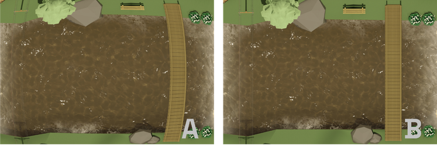

  

Figure 42: Lens distortion correction. A) Image with fisheye distortion. B) Image without lens distortion. <em>Source:</em> Own elaboration

### 3.3.4 Rectification: Transforming pixels to length units

In this step, the geometry of the images is transformed to convert pixel distances into length units (e.g., meters). Some software tools perform rectification directly on the images before processing, while others apply this correction to the surface velocity fields after processing. In both cases, the procedure remains the same. The following sections detail the rectification process according to the video recording mode. For more information, refer to [Annex 3](#An3).

#### 3.3.4.1 Perpendicular recording: 1D Rectification

A 1D rectification requires two Control Points (CPs) visible in the image. These points must be fixed landmarks in the terrain with a known real-world distance between them. The rectification process requires the following steps ([Figure 43](#fig43)):

1.  Obtain the pixel coordinates of the CPs. Each CP must be identified in the image, usually by manually selecting them with clicks. If available, it is recommended to use the zoom tool to ensure greater precision in point selection.
2.  Enter the real-world distance between the CPs. This can be done in two ways: By directly inputting the known distance between the two points, or by providing the planimetric coordinates of both points, allowing the software to calculate the distance automatically.

  

  

  

Figure 43: Control Point positioning in 1D rectification. <em>Source:</em> Own elaboration

> 
 ⚠️ <strong>Error Control</strong> ⚠️ 
  
>
> *If the software includes a scale in the rectified image, perform a quick evaluation of the process by comparing the scale with a known distance, such as the river width. If the dimensions do not match, an error may have occurred in the rectification process.*   

   
  
> 
Figure 44b: Examples of 1D rectification control using the rectified image scale. <em>Source:</em> Own elaboration

#### 3.3.4.2 Oblique recording: 2D Rectification

To perform a 2D rectification, four Control Points (CPs) visible in the image are required. These points must correspond to fixed elements in the terrain, with a known real-world distance between them. The rectification process requires the following steps ([Figure 44](#fig44)):

1.  Obtain the pixel coordinates of the CPs. Each CP must be identified in the image, usually by manually selecting them with clicks. It is recommended to use the zoom tool for greater precision. Although not mandatory, a logical order should be followed: the first point should be located upstream on the left bank, continuing counterclockwise.
2.  Enter the real-world coordinates of the CPs. This can be done in two ways: By inputting the six distances between the points (four perimeter distances and two diagonals), or by directly entering the planimetric coordinates of the four CPs.

  

  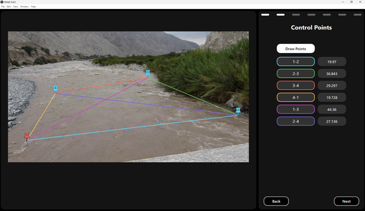

  

Figure 44: Control Point positioning in 2D rectification. <em>Source:</em> Own elaboration

> 
 ⚠️ <strong>Error Control</strong> ⚠️ 
  
> 
> *Ensure that the rectified image has a perpendicular perspective. While the edges may show some deformations, the area of interest should be displayed correctly. If the image is highly distorted, there may be an error in CP positioning or in the entered distances.*
> *If a scale is available in the rectified image, perform a quick evaluation by comparing it to a known distance, such as the river width. If the dimensions do not match, an error may have occurred in the rectification process.* 
>   

   

>  
Figure 44b: Examples of 2D rectification control. <em>Source:</em> Own elaboration

> 

#### 3.3.4.3 Fixed station: 3D Rectification

To perform a 3D rectification, at least six Control Points (CPs) must be evenly distributed throughout the area of interest at different heights and be visible in the image. The rectification process requires the following steps ([Figure 45](#fig45)):

1.  Obtain the pixel coordinates of the CPs. Each CP must be identified in the image, usually by manually selecting them with clicks. It is recommended to use the zoom tool for greater precision. Following a logical order when selecting the CPs helps to associate them more easily with their spatial coordinates.
If the pixel coordinates must be entered via a file, an external tool should be used to determine the pixel coordinates of each CP and generate the required input file.
2.  Enter the spatial coordinates of the CPs. Typically, a text file must be provided containing the *x, y*, and *z* coordinates along with an identifier for each CP. It is crucial to ensure that each point in the image is correctly associated with its corresponding terrain coordinate.
3.  Enter the water surface elevation. To apply rectification on the water surface plane, its elevation must be entered using the same coordinate system as the CPs.
4.  Define the area of interest for rectification. In some cases, it may be necessary to specify a particular section of the image to be rectified. This is done by entering the spatial coordinates of the vertices that enclose the area of interest within a polygon.

  

  

  

Figure 45: Control Point positioning in 3D rectification. <em>Source:</em> Own elaboration

5.  Some programs include a function that calculates reprojection errors. This indicator converts pixel coordinates to length units and then reverses the transformation back to pixels. In an ideal process, there should be no difference between the original and reprojected coordinates. However, if significant reprojection errors are detected, it may be necessary to remove or correct CPs that are affecting rectification accuracy. For more details on reprojection errors, refer to [Annex 3](#An3).

> 
 ⚠️ <strong>Error Control</strong> ⚠️ 
  
> 
> *Verify that the rectified image appears from a perpendicular perspective. While the edges may show some deformations, the area of interest should be displayed correctly. If the image presents significant distortions, there may be errors in the coordinates (both pixel and spatial values) of one or more CPs. If possible, review the reprojection errors of the CPs to identify potential issues.*
> *If a scale is available in the rectified image, perform a quick evaluation by comparing it to a known distance, such as the river width. If the dimensions do not match, an error may have occurred in the rectification process.* 
>    

  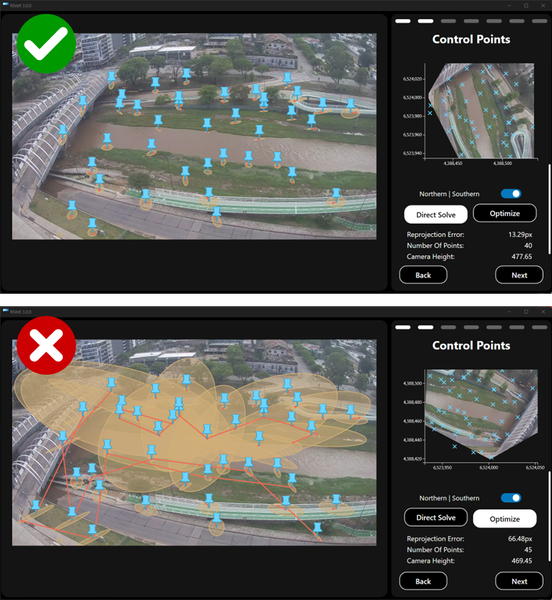 

>  
Figure 45b: Examples of 3D rectification control. <em>Source:</em> Own elaboration

> 

### 3.3.5 Definition of Cross Sections

This step involves defining the cross sections along which discharge will be estimated ([Figure 46](#fig46)). The sections must be precisely positioned within the image to ensure accurate velocity measurements and subsequent discharge calculations. This process can be carried out in two ways:

**Manual definition.** In this method, the cross sections are manually positioned by clicking on the image. For greater precision in point selection, it is recommended to use the zoom tool if available. It is advisable to start by placing the first point on the left bank of the channel, followed by the second point on the right bank. This order facilitates the organization and tracking of sections along the flow.

**Definition using spatial coordinates.** If the spatial coordinates of the Control Points (CPs) have already been entered, the cross sections can be defined directly using the spatial coordinates of their endpoints. For accuracy, the coordinate system used for CPs must match that of the cross sections.

  

  

  

Figure 46: Positioning of cross sections for discharge calculation. <em>Source:</em> Own elaboration

> 
 ⚠️ <strong>Error Control</strong> ⚠️ 
  
> 
>  *It is essential to verify that the defined cross sections correctly span the entire channel width within the image and that they follow a trajectory as perpendicular to the flow as possible. If the sections are misplaced or skewed, velocity and discharge calculations may be negatively affected.*   

   

>  
Figure 46b: Example of poor cross-section placement. <em>Source:</em> Own elaboration

> 

### 3.3.6 Processing: Application of the PIV algorithm

In this stage, the main objective is to calculate the velocity fields on the water surface using the Particle Image Velocimetry (PIV) technique. This process involves several steps, where analysis areas are defined, images are optimized, and specialized algorithms are applied to estimate surface velocity vectors. Throughout this sequence, it is crucial to perform quality control to ensure accuracy and minimize errors, guaranteeing a reliable surface velocity field for flow analysis. It is important to note that the steps described below may vary slightly depending on the software used. Therefore, it is recommended to review the specific documentation for each tool to ensure the correct application of the method. The general workflow includes the following steps (for more details, refer to [Annex 2](#An2)):

1.  **Definition of the Region of Interest (ROI):** Selection of the video area where the analysis will be performed.
2.  **Definition of masks:** Exclusion of irrelevant or interfering areas.
3.  Application of image enhancement filters: Optimization of contrast and clarity in the images to facilitate analysis.
4.  **Application of the cross-correlation algorithm (PIV):** Calculation of particle displacement between consecutive images to estimate surface velocity vectors.
5.  **Application of post-processing filters:** Removal of outliers and refinement of the obtained data.
6.  **Calculation of the mean surface velocity field:** Integration and analysis of processed data to obtain the final mean surface velocity field.

**Definition of the Region of Interest (ROI)**: The Region of Interest (ROI) is the area of the image that will be analyzed to calculate surface velocity fields. This corresponds to the region where the flow of interest is observed, excluding non-flow areas such as riverbanks. Some software tools define the ROI automatically based on the selected cross-sections, while in others, the user must define it manually. In this case, the ROI can be specified in different ways depending on the software: By drawing a rectangle over the area of interest, or by outlining multiple rectangles or polygons, if the study area has an irregular shape.

Regardless of the method, the ROI should always include all the cross-sections previously positioned for discharge analysis. However, Control Points (CPs) used for rectification do not need to be within this area, as their role is purely geometric, serving to correct the image.

**Definition of masks:** A mask is a tool used to exclude specific areas of an image from the analysis, hiding static elements that are not part of the visible water flow. The purpose of masks is to ensure that the PIV algorithm focuses exclusively on the movement of surface tracers, avoiding interference from non-relevant elements. It is common for static objects, such as riverbanks, bridges, or rocks, to be present within the ROI. These objects must be masked to prevent the algorithm from interpreting them as flow elements. Masks are typically defined by polygons that enclose the undesired elements ([Figure 47](#fig47)). This process can be carried out manually by selecting the vertices of each polygon within the image or by loading files containing the coordinates of the predefined polygons.

  

  

  

Figure 47: Definition of the Region of Interest (ROI) and masks. The ROI is represented by the blue rectangle, while the masked areas are shown in red. <em>Source:</em> Own elaboration

> 
 ⚠️ <strong>Error Control</strong> ⚠️ 
  
> 
>  *Ensure that the ROI and masks are consistently defined in all images. Any differences or shifts between frames may indicate uncorrected camera movement during recording. It is essential that the ROI and masks remain static and consistent throughout the entire image sequence to avoid errors in velocity calculations.*

**Application of image enhancement filters:** Before processing, filters can be applied to the images to improve the visibility of tracers, optimizing the performance of the cross-correlation algorithm in detecting movement. These filters help enhance relevant image features while reducing noise or elements that may affect analysis. Most LSPIV software includes built-in tools to apply the most commonly used image enhancement filters. It is recommended to use these integrated options first, as they are optimized for flow image processing and help maintain an efficient workflow. Among the most common filters, two stand out (for more details, refer to [Annex 1](#An1)):

Contrast enhancement filters: A widely used example is the CLAHE (Contrast Limited Adaptive Histogram Equalization) filter, which adjusts contrast locally in different parts of the image ([Figure 48](#fig48)). This filter is particularly useful when working with natural tracers, as it enhances the visibility of particles or patterns that might otherwise be difficult to detect due to low contrast differences.

Background subtraction filter: This filter subtracts the average image from each frame in the sequence, removing static elements and highlighting only the parts that move. It is especially effective when using artificial tracers, as it helps isolate the particles or markers moving with the water flow.

The selection of filters depends on user experience and specific processing needs. It is recommended to evaluate effectiveness through trial and error. These filters may vary depending on the software used, so it is advisable to review the specific documentation for each tool before applying them. For more information, refer to [Annex 1](#An1).

  

  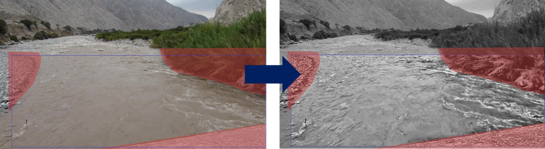

  

Figure 48: Example of applying image enhancement filters. <em>Source:</em> Own elaboration

**Application of the cross-correlation algorithm (PIV):** The PIV method is based on cross-correlation, comparing small regions of consecutive images to detect the displacement of tracers or surface patterns. There are several cross-correlation algorithms, which can be found in [Annex 2](#An2). However, all algorithms share a key concept: the definition of the Interrogation Area (IA), a small region of the image where tracer displacement is measured, and the Search Area (SA), the corresponding region in the consecutive image where that displacement is tracked. The proper definition of these area sizes is crucial for achieving accurate results.

Some software tools define the IA as a square, requiring the user to specify the side length in pixels, which is also applied to the SA. Larger areas allow the detection of larger patterns but with lower spatial resolution, while smaller areas provide higher resolution but may be more sensitive to noise or poorly defined patterns. A common practice is to apply the algorithm multiple times, gradually reducing the size of the IA. This approach, known as multi-pass processing, first estimates the velocity field using large areas and then refines it with smaller areas, improving resolution and accuracy (Figure 49). The optimization of IA size and number of passes is an iterative process, where increasing the number of steps or reducing the IA size does not always guarantee better results and may significantly increase processing time. A good starting point is to use an IA size of 128 px for the first pass and 64 px for the second pass, which is generally suitable for standard image resolutions like Full HD or 2.5K.

  

  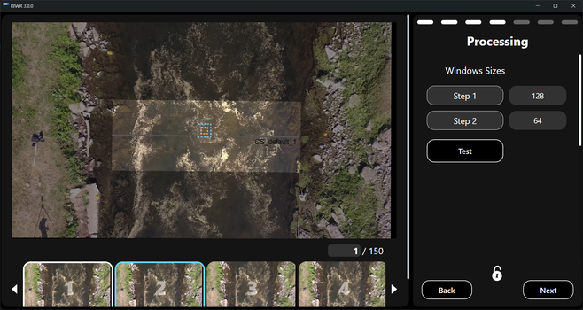

  

Figure 49: Example of defining the interrogation area size. <em>Source:</em> Own elaboration

In other software, it may be necessary to define both the IA size and the SA size. In these cases, increasing the SA size in the main flow direction can be helpful, as this is where the greatest displacement of tracers is expected.

It is recommended to perform a preliminary processing of a single image pair to verify the results and adjust parameters before applying the algorithm to the entire image sequence.

> 
 ⚠️ <strong>Error Control</strong> ⚠️ 
  
>
>  *Before running the PIV algorithm on the entire sequence, process a single image pair as a test. If most velocity vectors appear anomalous (e.g., incoherent directions or magnitudes), there may be an issue with the IA size or image enhancement filters. Adjust the parameters and rerun the test. If results do not improve after several adjustments, consider changing the frame extraction rate (step) or evaluating whether surface tracers are adequate for LSPIV.*   

  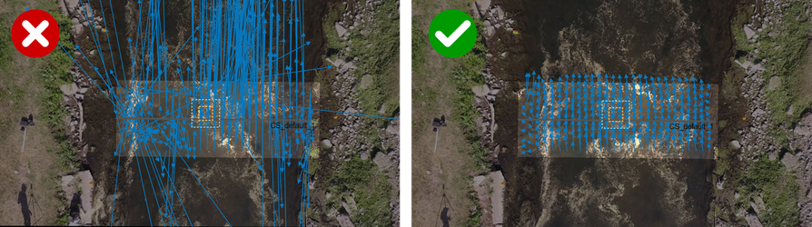 

> 
Figure 49b: Examples of processing parameterization control. <em>Source:</em> Own elaboration

**Application of post-processing filters:** Post-processing filters help remove outliers and enhance the consistency of surface velocity fields. Various types of filters exist, depending on the software used. It is recommended to consult [Annex 2](#An2) and the software’s documentation for more details on their application.

Among the most commonly used filters are spatial filters, which compare a velocity vector with its neighbors based on magnitude or direction; if a vector significantly deviates from nearby vectors, it is filtered out as an outlier. Another common filter is the cross-correlation coefficient filter, which evaluates the quality of the correlation between consecutive images. The correlation coefficient ranges from 0 (no correlation) to 1 (perfect correlation), and low (\~\<0.5) or high (\~\>0.98) values may indicate unreliable velocity estimations.

Additionally, there are specialized filters for artificial tracers, which help detect whether tracers are present or absent in the images, improving processing accuracy.

**Calculation of the mean/median velocity field:** For each processed image pair, a velocity field is obtained, representing surface displacement between the time steps tᵢ and tᵢ₊₁. The time interval (tᵢ₊₁ - tᵢ) is defined by the video’s frames per second (FPS) and the selected step for processing. To estimate discharge, it is necessary to calculate the mean velocity field over time. Most software tools use either the arithmetic mean or the median to compute a representative value of surface velocity across all processed image pairs.

### 3.3.7 Discharge estimation

The final step in the LSPIV processing workflow is to estimate discharge based on the obtained surface velocity fields. This process involves integrating velocity data with the bathymetry of the selected cross section and applying a velocity correction factor to obtain the mean velocity in depth. The steps for discharge estimation are outlined below.

**Mean surface velocity profile:** The cross-sectional velocity profile is derived from the mean surface velocity field. It is important to review these profiles to identify any anomalous or unexpected values, which should be filtered out if the software allows it.

**Incorporation of bathymetry:** The bathymetric data of the cross section and the water surface elevation are incorporated. Bathymetry is typically expressed as horizontal distance versus depth or elevation. It is essential to ensure that the bathymetry is correctly aligned with the cross section, generally following the convention from left bank to right bank. Additionally, the start and end points of the velocity profile and bathymetry must coincide to prevent any misalignment.

**Interpolation/Extrapolation of Velocities:** In cases where velocity data is missing in certain areas near the banks (e.g., due to visibility issues in the images), interpolation or extrapolation techniques may be required to complete the velocity profile. Most software tools perform this process automatically. More details on interpolation and extrapolation methods can be found in [Annex 5](#An4).

**Calculation of depth-averaged velocity:** To convert surface velocity into depth-averaged velocity, it is necessary to define the alpha coefficient. The commonly used theoretical value of 0.85 is based on a logarithmic velocity distribution in the vertical profile. It is recommended to conduct an initial calculation using this value, although alternative methods exist for a more precise estimation of alpha, depending on the available data. These methods are detailed in [Annex 6](#An6). It is important to note that alpha is the parameter with the greatest influence on discharge uncertainty, as it directly impacts the final estimation.

**Discharge calculation:** Once the mean velocity profile has been determined, the discharge calculation is performed by integrating the velocity profile with the wetted cross-sectional area derived from the bathymetry. This is typically done using the mid-section method or the mean-section method.

> 
 ⚠️ <strong>Error Control</strong> ⚠️ 
  
>
>  *It is essential to check that the water surface elevation is accurate, the velocity profile and bathymetry are properly aligned, and any anomalous velocity values in the cross section have been filtered out. Errors in these aspects will negatively affect the quality of the final discharge estimation.* 

**Comparison with other techniques:** If data generated by other instruments/techniques is available, it can be used for validation:

1.  Velocity Comparison: When comparing LSPIV results with velocity measurements from other methods, it is essential to consider that LSPIV measures surface velocities, whereas techniques such as ADCPs or current meters may record depth-averaged velocities or velocities at a specific depth. Therefore, ensuring that the velocities being compared are equivalent is crucial, or appropriate adjustments should be applied.
2.  Discharge Comparison: LSPIV discharge estimates can also be validated by comparing them with reference measurements. These comparisons may lead to adjustments that improve the accuracy of the alpha coefficient, which is used to convert surface velocity into depth-averaged velocity. This aspect is discussed in more detail in [Annex 6](#An6).

***

# 4. Bibliography

**PIV:**  

Adrian, R. J. (1991). Particle-imaging techniques for experimental fluid mechanics. *Annual Review of Fluid Mechanics, 23*(1), 261–304. <https://doi.org/10.1146/annurev.fl.23.010191.001401>  

Adrian, R. J. (2005). Twenty years of particle image velocimetry. *Experiments in Fluids, 39*(2), 159–169. <https://doi.org/10.1007/s00348-005-0991-7>  

Raffel, M., Willert, C. E., Wereley, S. T., & Kompenhans, J. (2007). *Particle Image Velocimetry.* Springer Berlin Heidelberg. <https://doi.org/10.1007/978-3-540-72308-0>  

**LSPIV:**  

Fujita, I., & Komura, S. (1994). Application of video image analysis for measurements of river-surface flows. *Proceedings of Hydraulic Engineering*, 733–738.  

Fujita, I., Muste, M., & Kruger, A. (1998). Large-scale particle image velocimetry for flow analysis in hydraulic engineering applications. *Journal of Hydraulic Research, 36*(3), 397–414. <https://doi.org/10.1080/00221689809498626>  

Jolley, M. J., Russell, A. J., Quinn, P. F., & Perks, M. T. (2021). Considerations when applying large-scale PIV and PTV for determining river flow velocity. *Frontiers in Water, 3*(December), 1–21. <https://doi.org/10.3389/frwa.2021.709269>  

Muste, M., Ho, H. C., & Kim, D. (2011). Considerations on direct stream flow measurements using video imagery: Outlook and research needs. *Journal of Hydro-Environment Research, 5*(4), 289–300. <https://doi.org/10.1016/j.jher.2010.11.002>  

WaMSTeC. (2021). Australian Government - National Industry Guidelines for Hydrometric Monitoring PART 11: Application of Surface Velocity Methods for Velocity and Open Channel Discharge Measurements.  

**Some Examples of LSPIV Application:**  

Jodeau, M., Hauet, A., Paquier, A., Le Coz, J., & Dramais, G. (2008). Application and evaluation of LS-PIV technique for the monitoring of river surface velocities in high flow conditions. *Flow Measurement and Instrumentation, 19*(2), 117–127. <https://doi.org/10.1016/j.flowmeasinst.2007.11.004>  

Le Coz, J., Hauet, A., Pierrefeu, G., Dramais, G., & Camenen, B. (2010). Performance of image-based velocimetry (LSPIV) applied to flash-flood discharge measurements in Mediterranean rivers. *Journal of Hydrology, 394*(1–2), 42–52. <https://doi.org/10.1016/j.jhydrol.2010.05.049>  

Le Coz, J., Patalano, A., Collins, D., Guillén, N. F., García, C. M., Smart, G. M., Bind, J., Chiaverini, A., Le Boursicaud, R., Dramais, G., & Braud, I. (2016). Lessons learnt from recent citizen science initiatives to document floods in France, Argentina and New Zealand. *E3S Web of Conferences, 7*, 6–11. <https://doi.org/10.1051/e3sconf/20160716001>  

Leitão, J. P., Peña-Haro, S., Lüthi, B., Scheidegger, A., & Moy de Vitry, M. (2018). Urban overland runoff velocity measurement with consumer-grade surveillance cameras and surface structure image velocimetry. *Journal of Hydrology, 565*, 791–804. <https://doi.org/10.1016/j.jhydrol.2018.09.001>  

Guillén, N. F., Patalano, A., García, C. M., & Bertoni, J. C. (2017). Use of LSPIV in assessing urban flash flood vulnerability. *Natural Hazards, 87*(1), 383–394. <https://doi.org/10.1007/s11069-017-2768-8>  

Pearce, S., Ljubicic, R., Peña-Haro, S., Perks, M., Tauro, F., Pizarro, A., Dal Sasso, S. F., Strelnikova, D., Grimaldi, S., Maddock, I., Paulus, G., Plavšic, J., Prodanovic, D., & Manfreda, S. (2020). An evaluation of image velocimetry techniques under low flow conditions and high seeding densities using unmanned aerial systems. *Remote Sensing, 12*(2), 1–24. <https://doi.org/10.3390/rs12020232>  

Tauro, F., Petroselli, A., Porfiri, M., Giandomenico, L., Bernardi, G., Mele, F., Spina, D., Grimaldi, S., Pearce, S., Ljubicic, R., Peña-Haro, S., Perks, M., Pizarro, A., Dal Sasso, S. F., Strelnikova, D., Grimaldi, S., Maddock, I., Paulus, G., & Adrian, R. J. (2020). Application and evaluation of LS-PIV technique for the monitoring of river surface velocities in high flow conditions. *Flow Measurement and Instrumentation, 5*(1), 289–300. <https://doi.org/10.5194/hess-24-1429-2020>  

**Software:**

Le Coz, J., Jodeau, M., Marchand, B., & Le Boursicaud, R. (2014). Image-based velocity and discharge measurements in field and laboratory river engineering studies using the free FUDAA-LSPIV software. *River Flow*, 7.  

Patalano, A., García, C. M., & Rodríguez, A. (2017). Rectification of image velocity results (RIVeR): A simple and user-friendly toolbox for large scale water surface particle image velocimetry (PIV) and particle tracking velocimetry (PTV). *Computers and Geosciences, 109*(June), 323–330. <https://doi.org/10.1016/j.cageo.2017.07.009>  

Peña-Haro, S., Lüthi, B., Carrel, M., & Philippe, T. (2018). DischargeApp: a smart-phone app for measuring river discharge. *EGU General Assembly 2018*, Vienna.  

Perks, M. T. (2020). KLT-IV v1.0: Image velocimetry software for use with fixed and mobile platforms. *Geoscientific Model Development, 13*(12), 6111–6130. <https://doi.org/10.5194/gmd-13-6111-2020>  

Thielicke, W., & Stamhuis, E. J. (2014). PIVlab – Towards user-friendly, affordable and accurate digital particle image velocimetry in MATLAB. *Journal of Open Research Software, 2*. <https://doi.org/10.5334/jors.bl>  

Winsemius, H., Annor, F. O., Hagenaars, R., van de Giesen, N., Luxemburg, W., & Hoes, O. (2023). *Towards open access and open source software for image-based velocimetry techniques.* <https://doi.org/10.20944/preprints202308.0896.v1>  

***

# 5. Glossary

$\alpha$: Surface-to-depth velocity correction coefficient

$V_{m}$: Depth-averaged velocity

$V_{s}$: Surface velocity

*x, y, z*: Real-world coordinates of a point

ADCP: Acoustic Doppler Current Profiler

ADV: Acoustic Doppler Velocimeter

CPs: Control Points

FPS: Frame per second

GCPs: Ground Control Points

GNSS: Global Navigation Satellite System

GRPs: Ground Reference Points

IA: Interrogation area

LSPIV: Large-Scale Particle Image Velocimetry

PIV: Particle Image Velocimetry

PTV: Particle Tracking Velocimetry

SA: Search Area

STIV: Space-Time Image Velocimetry

UAV: Unmanned Aerial Vehicle

XS: Cross-section

*** 

# 6. Annexes

<strong>ANNEX 1: PRE-PROCESSING CORRECTION</strong>

<h2 style="text-align:center;">ANNEX 1: PRE-PROCESSING CORRECTIONS</h2>

## Contenido
[1. Pre-processing corrections](#1-pre-processing-corrections)  
&nbsp;&nbsp;&nbsp;&nbsp;[1.1 Camera motion correction](#11-camera-motion-correction)  
&nbsp;&nbsp;&nbsp;&nbsp;[1.2 Lens distortion correction](#12-lens-distortion-correction)  
&nbsp;&nbsp;&nbsp;&nbsp;[1.3 Image enhancement](#13-image-enhancement)  

# 1. Pre-processing corrections

## 1.1 Camera motion correction

### 1.1.1 What is image stabilization and why is it necessary?

Image stabilization is an essential process in video analysis, designed to correct unwanted movement that may occur during recording. This movement can be caused by factors such as camera vibrations, operator movements, weather conditions, or even minor imperfections in mounting systems. Its primary goal is to align the images of a video so that static elements in the environment, such as the background or permanent structures, remain stationary throughout the sequence. This enables a more precise analysis of dynamic elements, such as water flow or particle displacement. Stabilization corrects unwanted translational, rotational, and scaling movements ([Figure A.1.1](#figA11)).

  

  

  

Figure A.1.1: Drone movement is shown by overlaying stabilized images onto the original images. The green mask visible in the processed row highlights the region where the stabilized image remains within the frame, while the final stabilized images crop out all unstable edges. <em>Source:</em> Jolley et al. (2021)
  

In applications such as Large-Scale Particle Image Velocimetry (LSPIV), stabilization is particularly crucial. For example, slight angular or translational displacements of the camera can alter the perceived trajectory of particles, affecting both the accuracy of calculations and the reliability of results. Moreover, in cases where stabilization is not performed correctly, image processing algorithms may mistake camera movements for real motion in the flow, introducing significant errors into the analysis.

Generally, stabilization relies on three fundamental stages: feature detection, feature matching between images, and geometric transformation of images to correct movement. Each stage presents technical challenges and may be computationally expensive, depending on the complexity of the video and the methods used.

Currently, various methods and algorithms exist for implementing stabilization, each with its own advantages and limitations (e.g., Tordoff & Murray, 2002; Lee et al., 2009; Litvin et al., 2003, among others). While this annex does not aim to delve into advanced technical aspects, it provides a general introduction to familiarize the reader with basic principles and to encourage further exploration of the capabilities this tool offers.

### 1.1.2 Feature detection

A feature is a distinctive pattern or structure within an image, such as points, edges, corners, or regions with unique textures. These do not necessarily represent physical objects in the real world; rather, they are defined as areas that stand out from their immediate surroundings in terms of texture, color, or intensity.

For image sequence stabilization, features must be detected in all frames. Various algorithms exist for this purpose, aiming to identify features that exhibit:

1.  Precise localization: Each detected feature must have a well-defined position in the image, facilitating tracking and analysis in consecutive frames.
2.  Distinctiveness: Features must be sufficiently unique within their neighborhood to enable reliable comparisons with other regions of the image.
3.  Repeatability: A good feature should be consistently detectable across multiple images of the same scene, even under varying conditions such as changes in scale, rotation, noise, or lighting. This ensures that features remain robust against transformations and disturbances.

Common examples of local features include:

1.  Corners: Regions where edges converge or intersect.
2.  Blobs: Homogeneous areas that stand out due to their shape or intensity compared to the surroundings.
3.  Edges: Lines where significant changes in pixel intensity occur.

Feature detection can be performed manually, where the user defines the image regions with the best characteristics, or automatically. In the latter case, various algorithms search for features based on local intensity variations and/or gradients, highlighting areas with abrupt changes in texture or intensity. Each algorithm is designed to detect different types of features and has its own advantages and limitations. [Table A.1.1](#tabA11) presents some of the most commonly used algorithms. SURF and KAZE are recommended for natural environments, as they are better at detecting features in scenes of non-human origin, such as rivers. In contrast, FAST, MINEIGEN, HARRIS, BRISK, and ORB are more effective at detecting features in scenes with clear anthropogenic intervention (Pizarro et al., 2022). [Figure A.1.2](#figA12)provides examples of these algorithms applied to the same image.

 
Table A.1.1: Feature detection algorithms in images.

| Algorithm | Feature Type             | Reference                 |
|-----------|--------------------------|---------------------------|
| FAST      | Corner                   | Rosten et al., 2006       |
| Harris    | Corner                   | Harris et al., 1988       |
| MSER      | Uniform intensity region | Matas et al., 2002        |
| SURF      | Blob                     | Bay et al., 2008          |
| KAZE      | Blob                     | Alcantarilla et al., 2012 |
| BRISK     | Corner                   | Leutenegger et al., 2011  |
| ORB       | Corner                   | Rublee et al., 2011       |

*Source:* Own elaboration

  

  

  

Figure A.1.2: Examples of feature detection algorithm applications. A) SURF, B) FAST, C) ORB. <em>Source:</em> Own elaboration
  

Beyond detecting the features themselves, descriptors of these key points are also sought, acting as unique ‘IDs’. Descriptor calculation is typically performed within regions centered around the detected features, transforming the local pixel neighborhood into a compact vector representation. This new representation allows neighborhoods to be compared regardless of changes in scale or orientation. Descriptors such as SIFT or SURF rely on local gradient calculations, while binary descriptors like BRISK or ORB use pairs of local intensity differences that are then encoded into a binary vector.

In the case of watercourse images, features may sometimes be detected on the free surface of the flow. This can introduce errors in the stabilization process since these features exhibit natural movement that does not correspond to camera motion. In some cases, it is necessary to define masked regions where features should not be detected. [Figure A.1.3](#figA13) illustrates an example of this.

  

  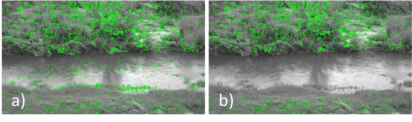

  

Figure A.1.3: Example of feature detection in a river environment. A) Feature detection applied to the entire image. B) Feature detection applied after masking the water surface. <em>Source:</em> Own elaboration
   

### 1.1.3 Feature matching

After applying feature detection and descriptor extraction to two images, each detected feature must be matched to its corresponding feature in the other image. This process determines the variations in translation, scale, rotation, and deformation between images, which are essential for stabilization.

Feature matching relies on feature descriptors. Characteristics such as size, orientation, and neighbor configuration are used to establish correspondences. Matching can be performed using similarity metrics, such as Euclidean distance, Hamming distance, cross-correlation of descriptors, among others. [Figure A.1.4](#figA14) illustrates an example of feature matching for an image that has been scaled and rotated.

  

  

  

Figure A.1.4: Example of feature matching. <em>Source:</em> Own elaboration
   

When the number of detected features is high or when features are not well defined, matching errors may occur, including redundant matches, undetected matches, or incorrect correspondences. Various approaches exist to minimize these errors, using algorithms that assign weights to descriptors as quantitative measures of match quality (e.g., the ORSAN method (*Moisan et al., 2004*)).

Feature matching must be performed throughout the entire image sequence. There are two main approaches:

1.  Reference image matching: One image is chosen as the reference, and features from all other images are matched to this one. Typically, the first image in the sequence is used as the reference, meaning that all movements are referenced to a single image.
2.  Batch matching: The image sequence is divided into small batches, and features from each image are matched to an image within the same batch.

### 1.1.4 Geometric image transformation and stabilization

Using the feature matching data, the necessary corrections to align the images are calculated. These corrections include geometric transformations such as translation, rotation, scaling (or zoom), and, in some cases, more complex transformations like projective distortions. For example, a forward displacement of the camera may require a scaling adjustment, while a slight tilt would imply a frame rotation. These transformations are mathematically represented through transformation matrices, which are applied to the frames to compensate for the detected movements.

The general geometric transformation used in image stabilization is a projective transformation (recommended reading: [Annex 3](#An3)). This is a linear planar transformation that can be expressed as:

  

  

  

or in matrix form:

  

  

  

where $\mathbf{X}$ and $\mathbf{X '}$ are the position vectors of the matched features between two images, and $\mathbf{H}$ is the transformation matrix. Based on the feature matching data, the transformation matrix can be solved and then applied to align one image to another. There are several specific cases of projective transformation that can be used, including *similarity*, *affine*, and *projective* transformations (Hartley & Zisserman, 2004). [Figure A.1.5](#figA15) provides examples of these transformations.

  

  

  

Figure A.1.5: Distortions that arise under central projection. Images of a tiled floor. (a) Similarity: The circular pattern is represented as a circle. A square tile is represented as a square. Lines that are parallel or perpendicular maintain the same relative orientation in the image. (b) Affine: The circle is represented as an ellipse. Orthogonal lines in the real world are not represented as orthogonal lines. However, the sides of the square tiles, which are parallel in the real world, remain parallel in the image. (c) Projective: Parallel lines in the real world are represented as converging lines. Tiles closer to the camera appear larger than those farther away.
 <em>Source:</em> Hartley & Zisserman (2004)
 

1.  *Similarity transformation:* Preserves shapes (angles and parallelism) and allows uniform scaling, rotation, and translation. The transformation matrix includes a scale factor $s$, a rotation angle $\theta$, and translation $t_{x}$ and $t_{y}$.

  

  

  

At least two point correspondences are needed to solve the matrix. This transformation is suitable for image sequences with simple, smooth camera movements, such as small vibrations or oscillations.

2.  *Affine Transformation:* Preserves parallelism and allows variations in angles, rotations, non-uniform scaling, and translations. The transformation matrix is:

  

  

  

The coefficients $a_{i j}$ represent scaling, rotation, and shear deformation. At least three point correspondences are needed to solve the matrix. This transformation is recommended for image sequences with camera movements that include translations, rotations, zoom variations, and/or shear deformations.

3.  *Projective Transformation:* Does not preserve angles, parallelism, or scale. Allows complex perspective distortions. The transformation matrix is the one given in equation [(1.1)](#e11). At least four point correspondences are required to solve the matrix. This transformation is recommended for image sequences with complex camera movements that involve perspective variations. It is the most sensitive transformation.

Greater accuracy in the estimated transformation is achieved when a larger number of matched features is used to solve the transformation matrix. However, incorrect matches can introduce noise into this process. There are algorithms designed to reduce the influence of these incorrect matches when determining $\mathbf{H}$, such as the RANSAC method (Fischler & Bolles, 1981) and its modifications. Once the transformation matrix is obtained, it is applied to the pixels of the image being transformed to minimize camera motion. [Figure A.1.6](#figA16) shows an example of a similarity transformation applied to the example in [Figure A.1.4](#figA14).

  

  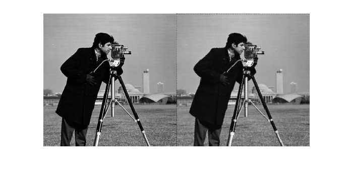

  

Figure A.1.6: Result of applying a similarity transformation. Left: Original image. Right: Transformed image <em>Source:</em> Own elaboration
  

Finally, motion correction is performed for each pair of analyzed images by detecting features, extracting descriptors from each image, matching features, estimating the transformation matrix, and subsequently correcting the image. The quality of the result depends on the accuracy of each stage. For example, incorrect matching can lead to erroneous transformations, while a poorly defined mask can introduce noise into the process.

Stabilization may also include an additional smoothing step, where small accumulated errors between consecutive frames are evenly distributed throughout the video, eliminating residual oscillations. This step ensures a smoother and more natural movement in the stabilized sequence. [Figure A.1.7](#figA17) presents an example of motion stabilization in an image sequence, where each frame was stabilized using the first frame as a reference.

  

  

  

Figure A.1.7: Example of camera motion stabilization in an image sequence. Top: Original images. Bottom: Stabilized images. <em>Source:</em> Own elaboration
   

## 1.2 Lens distortion correction

The camera calibration process allows for determining the intrinsic and extrinsic parameters of the optical system, as well as lens distortions. This step may be necessary (depending on the lens) to obtain displacement/velocity measurements from images. In techniques such as Large-Scale Particle Image Velocimetry (LSPIV), camera calibration ensures accuracy in velocity and discharge measurements. This is particularly critical when working with wide-angle or ‘fisheye’ lenses, which tend to introduce significant distortions if not properly calibrated. The accuracy of the calibration will ultimately determine the precision of the measurements obtained from the images. For this reason, it is essential to perform camera calibration with full assurance that the obtained parameters are as close as possible to the real values. This requires both choosing an appropriate calibration method and correctly implementing it.

The main objective is to obtain a mathematical model that describes how a camera transforms three-dimensional points (in real space) into two-dimensional points (in the image), correcting the inherent distortions of the optical system. This model includes:

1.  Intrinsic parameters: Internal characteristics of the camera, such as focal length, sensor size, and principal point.
2.  Extrinsic parameters: Position and orientation of the camera relative to a real-world coordinate system.
3.  Lens distortion: Correction of deviations such as radial and tangential distortion, which affect the projected position of points.

Distortion can be classified into two main types:

1.  Radial distortion: Causes straight lines to bend either towards the center (barrel distortion) or towards the edges (pincushion distortion).
2.  Tangential distortion: Results from misalignments in the optical elements, producing non-radial displacements in the image.

### 1.2.1 Brown’s distortion model (1966)

Brown’s distortion model is widely used to describe lens imperfections. These imperfections generate lateral deviations in the light beam passing through the lens, resulting in a projected position that differs from the expected position. The equations describing this distortion are:

  

  

  
  

  

  
  

  

  
  

  

  
  

  

  
  

  

  
  

  

  

where:

$X$, $Y$ and $Z$, coordinates of the camera local system;

$u$ and $v$, projected coordinates on the image;

$f_{x}$ and $f_{y}$, focal lengths;

$c_{x}$ and $c_{y}$, principal point coordinates;

$K_{1}$, $K_{2}$ and $K_{3}$, radial distortion coefficients;

$P_{1}$ and $P_{2}$; tangential distortion coefficients;

$Skew$, is the skew coefficient (negligible in most cases).

### 1.2.2 Calibration procedure

1.  *Image Capture:* Multiple images of a calibration pattern, such as a chessboard, must be captured from different angles and positions. It is crucial that the images are taken under the same conditions as those that will be used during processing, including the capture mode (video or photo) and focal length. At least three images are recommended to solve the calibration equations, although a higher number improves accuracy. Reflections and shadows should be avoided, ensuring that the pattern fully covers the camera’s field of view. [Figure A.1.8](#figA18) shows an example of a set of images used for camera calibration.

  

  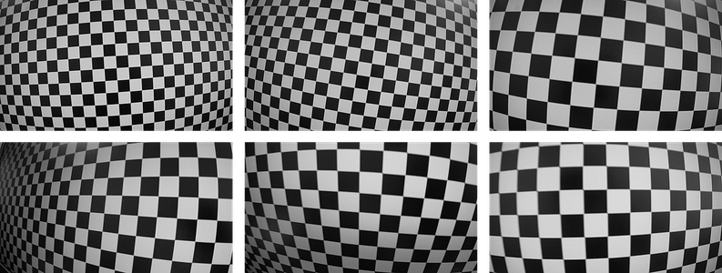

  

Figure A.1.8: Set of images for camera calibration. The images are taken in video mode. The lens distortion is visible in each capture. <em>Source:</em> Own elaboration
 

2.  *Corner detection:* Several libraries and specialized software tools are available for camera calibration, such as OpenCV[^1], Matlab[^2], or Agisoft[^3], among others. The software used for calibration will automatically detect the corners of the pattern and calculate the intrinsic parameters and distortion coefficients: $f_{x}$, $f_{y} , \  c_{x} ,$ $c_{y}$, $K_{1}$, $K_{2}$, $K_{3}$, $P_{1}$ $P_{2}$ and $S k e w $.
[^1]: <https://docs.opencv.org/4.x/dc/dbb/tutorial_py_calibration.html>

[^2]: <https://la.mathworks.com/help/vision/camera-calibration.html>

[^3]: <https://agisoft.freshdesk.com/support/solutions/articles/31000160059-lens-calibration-using-chessboard-pattern-in-metashape>

3.  *Result Evaluation:*  The obtained parameters are applied to the images to correct the distortion. [Figure A.1.9](#figA19) presents an example where an original image (a) is corrected to eliminate lens distortions (b).

  

  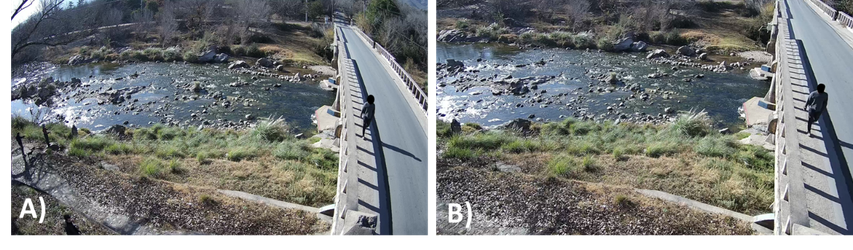

  

Figure A.1.9: Example of lens distortion correction. A) Original image; B) Image with corrected lens distortion. <em>Source:</em> Own elaboration
 

The distortion parameters remain valid for any image taken with the same camera, as long as the same optical zoom is used. Otherwise, recalibration will be necessary.

## 1.3 Image enhancement

Image manipulation involves altering certain properties of images through the application of digital filters. In LSPIV applications, pre-processing filters aim to optimize the visibility of surface tracers on the water and reduce interferences that may hinder displacement detection through cross-correlation. These interferences can include undesirable lighting conditions, overexposed or low-contrast areas, visibility of the riverbed, among others.

The use of image enhancement filters facilitates tracer detection under complex conditions, allowing analysis techniques to operate with greater precision. Their use is not mandatory in all cases, but they become essential when the captured material does not meet minimum quality standards. Some of the situations where pre-processing is most relevant include:

1.  Variable or poor lighting conditions: When tracers do not have sufficient contrast with their surroundings due to uneven or insufficient lighting. In these cases, brightness and contrast adjustment filters can enhance the areas of interest, allowing better tracer identification.
2.  Presence of background noise: Elements such as vegetation, rocks, or the visible riverbed can generate noise in the estimation of tracer displacements. Filtering visual noise helps focus the analysis on moving particles that truly act as tracers.
3.  Videos with low contrast or saturation: In images where colors are too muted or brightness levels are concentrated in a narrow range, distinguishing tracers from their surroundings can be difficult. Techniques such as intensity normalization or histogram equalization can significantly increase the differentiation between tracers and the background.

The decision to use filters and the type of filters to apply will largely depend on the user's experience with LSPIV. Lighting conditions, tracer type and color, flow conditions, and environmental factors vary significantly for each recorded video. Moreover, a wide variety of filters exist, each with different behaviors depending on their parameter settings. Therefore, choosing whether to apply pre-processing filters and selecting the appropriate types of filters is a trial-and-error task, and their effectiveness will largely depend on the user's expertise in digital image processing and LSPIV applications.

### 1.3.1 Commonly used filters in LSPIV

There are several types of filters, each designed to address specific issues, and their application depends on the characteristics of the captured material. Below are some of the filters commonly used in image-based velocimetry techniques, along with general recommendations on when they may be useful. Some of these filters are available in LSPIV software; if not, and if the user wishes to apply them, image processing must be performed outside the software. For more detailed information, consulting the technical documentation of the software in use is recommended. For users with little or no experience in digital image processing who need to delve deeper into the field, Gonzalez & Woods (2017) is recommended reading.

**Grayscale conversion:** This process transforms multiband images, which contain information in multiple color channels (e.g., red, green, and blue), into a single band that represents only luminance levels ([Figure A.1.10](#figA110)). The main objective is to simplify image analysis by reducing computational complexity and focusing on intensity variations that are relevant for identifying surface tracers. Additionally, it facilitates the application of other filters.

Grayscale conversion is the first manipulation step in image-based velocimetry (Fujita et al., 2007). It may not be necessary if the original material was captured using monochrome or thermal cameras (Patalano et al., 2017; Kinzel & Legleiter, 2019). Some software programs automatically apply this conversion within their workflow. 

  

  

  

Figure A.1.10: Example of grayscale image conversion. Left: Original image; Right: Grayscale image.
 <em>Source:</em> Own elaboration
 

**Contrast enhancement:** Increasing image contrast helps tracers stand out more from their surroundings, facilitating tracking, improving peak detectability in displacement estimation, and ultimately enhancing velocity fields (Deen et al., 2010). There are numerous methods to achieve this, each with particular characteristics that make them suitable for different recording conditions.

One of the simplest methods for contrast enhancement is contrast stretching, which has a general application. This method expands the dynamic range of intensity values in the image, ensuring that brightness levels are more evenly distributed. This enhances intensity differences, making them more perceptible. Its implementation is simple and effective for images with a low dynamic range.

Logarithmic and power transformations are also effective contrast enhancement methods. Logarithmic transformation is useful for compressing high-intensity values and expanding low ones, allowing detail recovery in overexposed areas. Meanwhile, power transformation, known as gamma correction, applies an exponential curve to intensity values, allowing details in dark or bright regions to be highlighted depending on the selected gamma parameter. This enables contrast adaptation to the specific characteristics of each image, though experience is required to choose the appropriate gamma value.

Histogram equalization is another common method, modifying the brightness level distribution to make it more uniform, thereby increasing contrast in areas with homogeneous lighting. It has been shown to be effective in situations where contrast levels are concentrated within a narrow range (Fujita & Aya, 2004). An advanced variant of this technique is Contrast-Limited Adaptive Histogram Equalization (CLAHE – Pizer et al., 1987), which operates on localized regions instead of the entire image. This allows for local contrast enhancement without excessively amplifying noise.

[Figure A.1.11](#figA111) presents examples of applying contrast enhancement filters.

  

  

  

Figure A.1.11: Examples of contrast enhancement filter applications. A) Original image. B) Contrast stretching. C) Gamma correction. D) CLAHE.  <em>Source:</em> Own elaboration
 

**Binarization:** Binarization is a technique that converts an image into a binary representation, consisting only of two colors (typically black and white pixels). This process applies thresholding algorithms that classify each pixel based on its intensity: values above a predefined threshold become white, while values below it become black. The result is a simplified visual representation of the image, effectively highlighting the most relevant elements by removing non-essential background information. Various algorithms can be used for implementation, ranging from simple methods that define a global intensity threshold to more advanced algorithms such as the one proposed by Otsu (1979). In LSPIV applications, binarization can be useful when, even after applying other filters, surface tracer visibility does not sufficiently stand out from the background (Jolly et al., 2021). Additionally, it can be particularly useful for images of flow with artificial tracers, allowing tracers to be isolated from the background ([Figure A.1.12](#figA112)).

  

  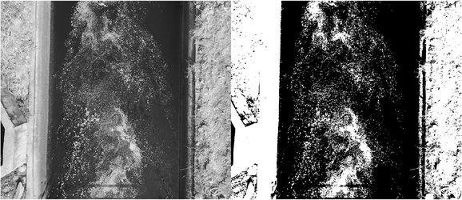

  

Figure A.1.12: Example of binarization applied to an image with artificial tracers. Left: Original image; Right: Binarized image.  <em>Source:</em> Own elaboration
 

**Background subtraction/ background removal:** Background subtraction is a technique that removes static and non-relevant elements in a scene, such as the riverbed or stationary vegetation, which may interfere with the detection of surface tracer displacements. This method is particularly important when the background of the image (e.g., the riverbed visible through transparent flow) visually dominates over the tracers, introducing bias towards zero displacements or making it difficult to identify motion patterns.

A simple way to implement this filter is to subtract the mean image from the sequence of images used ([Figure A.1.13](#figA113)). This reduces noise and eliminates static elements that could introduce bias. This approach assumes that stationary features in the image are sources of error and removes them (Honkanen & Nobach, 2005). Similar to binarization, this method can be particularly useful for images of flows with artificial tracers.

  

  

  

Figure A.1.13: Examples of background subtraction application. A) Original image. B) Mean image. C) Original image after mean image subtraction. <em>Source:</em> Own elaboration
 

It is important to consider that while background subtraction can significantly improve LSPIV analysis results, its effectiveness depends on the quality of the captured material. Videos with variable lighting conditions or uncorrected camera motion may require additional adjustments for optimal performance.

### 1.3.2 Selecting the appropriate filter

Choosing the right filter is a highly case-dependent process, influenced by the specific characteristics of each image and the particular problem being addressed. There is no single approach or strict set of rules for determining which filter to use, as image nature and acquisition conditions can vary significantly across different scenarios.

One of the most important aspects of filter selection is that the process involves constant trial and error. Each image set may present different challenges, such as variable lighting, background noise, or poorly visible tracers. Therefore, it is not always possible to determine in advance which filter will be the most effective. In many cases, multiple filters must be tested and combined based on the results, adjusting their parameters to optimize the processed image quality. Additionally, user experience plays a key role in this process. An operator with expertise in digital image processing, and particularly in LSPIV applications, will be able to quickly identify which methods and filters are best suited for the available video material.

However, it is important to highlight that filter application will not always resolve all visibility and noise issues. In some cases, filters may enhance certain image aspects but will not completely eliminate visibility or noise problems. For this reason, recording conditions should be as optimal as possible to minimize the need for complex pre-processing. A video captured under ideal conditions, with adequate lighting and good tracer visibility, will significantly reduce the need for filtering and improve the quality of the obtained data.

In summary, selecting the right filter is a flexible and dynamic task that requires both technical knowledge of image processing and practical experience with LSPIV. Although there is no fixed formula for choosing a filter, trial and error, combined with careful recording practices, will ensure more precise and effective results in analyzing flow rates and particle displacements in water flows.

***

<strong>ANNEX 2: PARTICLE IMAGE VELOCIMETRY - PIV</strong>

<h2 style="text-align:center;">ANNEX 2: PARTICLE IMAGE VELOCIMETRY - PIV</h2>

## Content
[2. Particle image velocimetry – PIV](#2-particle-image-velocimetry–piv)  
&nbsp;&nbsp;&nbsp;&nbsp;[2.1 Cross-correlation algorithms](#21-cross-correlation-algorithms)  
&nbsp;&nbsp;&nbsp;&nbsp;[2.2 Sub-pixel estimation](#22-sub-pixel-estimation)  
&nbsp;&nbsp;&nbsp;&nbsp;[2.3 Post-processing filters](#23-post-processing-filters)  

# 2. Particle image velocimetry – PIV

Particle Image Velocimetry (PIV) is one of the earliest non-intrusive techniques developed for measuring flows in laboratory settings. Although the term was coined over 40 years ago (Adrian, 1984), the fundamental principle of the technique is older and relatively simple: it consists of recognizing and quantifying the displacement of tracer particles in a flow. Modern PIV methods allow for the quantitative measurement of velocity at numerous points simultaneously, using advanced image capture and digital processing technologies.

Technological advances in digital cameras (increased sensor resolution, higher frame rates) and computational capacity (faster processing, greater memory) have made it possible to study increasingly complex and higher-velocity flows. A distinguishing characteristic of the PIV technique is that the estimated velocity at a given point does not correspond to an individual particle but represents a statistical measure of the velocity within that region of the fluid.

In its classical configuration, PIV implementation requires a flow seeded with tracers that move at the same velocity as the fluid, a laser illumination system to make these particles visible in the study plane, and a digital camera to capture a sequence of images of that plane ([Figure A.2.1](#figA21)). The laser generates a light sheet that illuminates the measurement zone and the particles within it. The digital camera captures the laser reflection on the tracer particles, allowing their motion to be tracked over time. This setup is widely used in laboratory studies but is not directly applicable in the field for river discharge quantification. However, the algorithms used to estimate surface velocities remain the same in both cases.

A crucial aspect of the PIV technique is the fundamental assumption that tracer particles follow the flow motion. In a controlled environment such as a laboratory, this assumption can be verified by minimizing the lag between particle velocity and fluid velocity, in accordance with Stokes' law (Raffel et al., 2007). In large-scale applications, such as field studies, this verification is more challenging, though general criteria regarding particle inertia are often sufficient to ensure the validity of the assumption.

  

  

  

Figure A.2.1: Typical instrumentation setup for laboratory application of particle image velocimetry. A) Flow B) Camera C) Semi-cylindrical lens D) Laser. <em>Source:</em> Own elaboration
  

In its simplest form, the PIV technique allows for obtaining two components of the instantaneous velocity field in a fluid plane. To perform this calculation, at least two images of the tracer particles must be captured at a known time interval, with sufficiently high illumination levels in the study region to ensure particle visibility.

The image processing follows a series of well-defined steps:

1.  **Subdivision of the image into interrogation areas:** The captured images are divided into small regions called interrogation areas (IA) ([Figure A.2.2](#figA22)). Within each interrogation area, the tracers form a pattern, and the goal is to estimate the average displacement of the particle group within that region. This provides a two-dimensional (2D) velocity vector for each interrogation area, representing the local flow motion.

  

  

  

Figure A.2.2: Diagram of image subdivision into interrogation areas. <em>Source:</em> Own elaboration
  

2.  **Pattern search in the subsequent image:** For each interrogation area in an image, the corresponding position of the particle pattern is searched for in the following image of the sequence. Since the time between consecutive images is short, it is assumed that the pattern has not changed significantly in position. The search is performed within a search area (SA) in the next image, which may be the same size as the IA or larger ([Figure A.2.3](#figA23)).

  

  

  

Figure A.2.3: Definition of interrogation and search areas in an image pair. Red square: interrogation area. Blue square: search area. <em>Source:</em> Own elaboration
  

3.  **Application of cross-correlation:** Once the search area is defined, a cross-correlation is applied between the interrogation area and the search area to identify the pattern displacement. The result of this operation is a correlation plane, where the highest peak indicates the most probable position of the pattern in the following image. This displacement is associated with the average flow velocity in the interrogation area. This process will be detailed further in the following sections.
4.  **Calculation of the displacement field:** This procedure is repeated for all interrogation areas in the image, generating a complete displacement field. Since the time interval between images is known, the velocity field can be calculated by dividing the obtained displacements by this interval.

  

  

  

Each calculated velocity field represents a quasi-instantaneous snapshot of the flow, as the time between consecutive images is generally very short. This process is repeated throughout the image sequence, generating a set of velocity fields that describe the dynamic behavior of the flow.

## 2.1 Cross-correlation algorithms

Cross-correlation algorithms are fundamental to the PIV technique, as they enable the estimation of particle pattern displacement between consecutive images. These algorithms compare interrogation areas from one image with corresponding search areas in the next image, determining particle displacement based on pattern similarity.

Cross-correlation is a statistical technique used to find similar patterns within areas A and B from two consecutive images. Discrete cross-correlation is expressed by the equation (Huang et al., 1997):

  

  

  

where $A$ and $B$ are the Interrogation Areas from images A and B, respectively. This formula measures the similarity between the IA for a given displacement (Raffel et al., 2007). The maximum peak in the resulting correlation plane indicates the most probable displacement of the particles within the interrogation areas (Huang et al., 1997).

There are two main methods for solving this equation. The most direct method is calculating the matrix in the spatial domain, commonly referred to as Direct Cross-Correlation (DCC) (e.g., Okamoto et al., 2000) or Particle Image Pattern Matching (PIPM) (e.g., Huang et al., 1997). The second method calculates the correlation matrix in the frequency domain using the Discrete Fourier Transform (DFT), computed through the Fast Fourier Transform (FFT) (Bastiaans, 2000).

### 2.1.1 Direct cross-correlation – DCC:

In this method, the calculation is performed in the spatial domain, allowing interrogation areas A and B to have different sizes (Stamhuis, 2006). By using a search area B larger than interrogation area A, information loss due to particle displacement is minimized, thereby reducing background noise. This methodology significantly decreases both systematic and random calculation errors (Huang et al., 1997) ([Figure A.2.5](figA25)). However, since this is a first-order method, the analysis is based on linear position variations, meaning that rotations and deformations are not accounted for. Although this approach is computationally expensive O($N^{4}$), especially for large interrogation areas, it can be more accurate in some cases than the Fourier-based method (Raffel et al., 2007; Thielicke & Stamhuis, 2014).

  

  

  

Figure A.2.5: Calculation of the correlation matrix using DCC. Interrogation area A (4×4 pixels) is correlated with search area B (8×8 pixels), resulting in a correlation matrix (9×9 pixels). <em>Source:</em> Own elaboration
 

### 2.1.2 Fast Fourier transform– FFT:

This method improves efficiency by computing cross-correlation in the frequency domain. According to the correlation theorem, cross-correlation in the spatial domain is equivalent to multiplying the Fourier transforms in the frequency domain:

  

  

  

where $Ƒ$ denotes the Fourier transform, $Ƒ^{- 1}$ the inverse Fourier transform, y $Ƒ^{*}$ indicates the complex conjugate of the transform. The use of FFT reduces processing time to O(${N \  L o g}_{2} N$), making it more efficient than DCC for large interrogation areas. However, this efficiency can be affected if the interrogation areas are not power-of-two sizes, introducing additional computational complexities.

This method uses interrogation areas of equal size and introduces background noise when particle displacement is significant. Additionally, it assumes that data within the interrogation areas are periodic, repeating in all directions (Raffel et al., 2007). This assumption implies that when the particle displacement exceeds half the size of the interrogation area, the intensity peak in the correlation plane is mirrored and appears on the opposite side of the matrix ([Figure A.2.6](#figA26)). Thus, particle displacement must be less than half the size of the interrogation area, though it is recommended to keep it below one-fourth of the interrogation area size to maintain low background noise in the correlation plane (Keane & Adrian, 1990).

  

  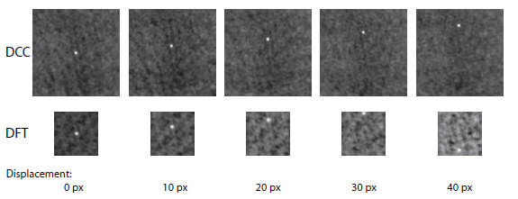

  

Figure A.2.6: Correlation matrices obtained using DCC (top) and DFT (bottom). Interrogation area A (64×64 px) is used for both methods. The search area in DCC is 128×128 px, while in DFT, it is 64×64 px. In DCC, background noise does not increase until displacement exceeds 32 px. In DFT, background noise increases immediately when displacement is greater than 0. A displacement greater than 32 px inverts the peak in the correlation plane, causing it to appear on the opposite side of the correlation matrix. <em>Source:</em> Thielicke & Stamhuis (2014)
 

This drawback can be mitigated using "recovery routines" (Stamhuis, 2006). These routines involve performing multiple iterations of the FFT algorithm on the same interrogation areas. In each iteration, the obtained results are used to adjust the position of the interrogation areas in the next step, minimizing information loss and improving the accuracy of displacement calculations. Additionally, the grid of interrogation areas can be refined in each iteration, which increases the spatial resolution of the final velocity field, providing a wider dynamic range and a better signal-to-noise ratio (Scarano & Riethmuller, 1999).

To address nonlinear displacements of particles, which may cause distortions or rotations within the interrogation area, methodologies have been proposed to adjust the shape of the areas. Thielicke & Stamhuis (2014) suggest an approach where interrogation areas overlap by 50%, obtaining more information about the edges and corners of each area. The displacements are calculated at each pixel using bilinear interpolation, allowing the interrogation area to be deformed in successive iterations ([Figure A.2.7](#figA27)). This ensures that, after several iterations, the deformed area aligns perfectly with the original image, achieving a more precise estimation of displacements.

  

  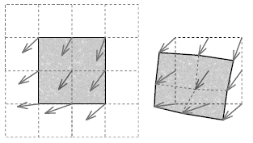

  

Figure A.2.7: Principle of the interrogation area deformation technique. Left: Result after the first analysis; Right: Deformed interrogation area. <em>Source:</em> Thielicke & Stamhuis (2014)
 

## 2.2 Sub-pixel estimation

The integer displacement between two interrogation areas can be determined directly by locating the peak in the correlation matrix. However, to improve estimation accuracy, it is common to apply an adjustment that allows displacement detection with sub-pixel resolution.

Once the integer peak in the correlation matrix has been identified, a Gaussian fit can be used to refine its position. This adjustment is performed on the intensity distribution in the rows and columns surrounding the peak, with the objective of determining the most accurate location of the maximum. In this approach, only the pixels adjacent to the peak in the vertical and horizontal directions are considered. That is, for each axis, the three points corresponding to the peak and its immediate neighbors are used to fit a Gaussian function ([Figure A.2.8](#figA28)). This method is known as Gaussian 2.3-point fit.

The reason a Gaussian function is appropriate for this adjustment is that the intensity distribution of individual particles in the image generally follows a shape that closely resembles a Gaussian curve. By fitting this function to the correlation matrix distribution, greater accuracy in displacement estimation is achieved, as the peak of the fitted function represents the sub-pixel location of displacement.

Using this adjustment enables the determination of particle positions with a precision greater than the pixel size, improving the accuracy of the estimated velocity field.

  

  

  

Figure A.2.8: Principle of the Gaussian 2.3-point fit: Sub-pixel precision is achieved by fitting a one-dimensional Gaussian function (solid line) to the integer intensity distribution from the correlation matrix (dots). Only one axis is shown.  <em>Source:</em> Own elaboration
 

## 2.3 Post-processing filters

Post-processing of the obtained data can help increase the reliability of the results. This process includes methods for detecting invalid data (outliers), their removal and possible correction, as well as techniques for smoothing velocity fields and reducing measurement noise.

There are many outlier detection methods, and their applicability and effectiveness vary depending on the conditions and characteristics of the measurement and its results. The scientific literature on the development and testing of post-processing algorithms is extensive and constantly evolving. Without limiting the reader’s options, some of the most commonly used strategies are described below:

1.  **Filtering by velocity limit values:** This basic method defines minimum and maximum velocity limits, either for each velocity component or for the total magnitude. The thresholds can be subjectively defined, requiring prior knowledge of expected velocities, or statistically defined, based on parameters such as the mean and standard deviation. For example, a filter may be applied based on the mean velocity plus a defined number of standard deviations, eliminating data outside these limits.
2.  **Filtering based on neighbor analysis:** In this method, the coherence of a velocity vector is evaluated by comparing it to its closest neighbors in the grid. Characteristics such as magnitude or direction are analyzed, removing values that significantly differ from their neighbors. This approach is particularly useful because it adapts to the local flow conditions, providing a robust outlier detection strategy in complex scenarios. An example is the normalized median test (Westerweel & Scarano, 2005), which evaluates velocity fluctuations relative to the median within a 3×3 neighborhood.
3.  **Filtering based on correlation quality**: Cross-correlation quality parameters can be used as indicators of result reliability. One such parameter is the normalized cross-correlation coefficient (NCC), derived from the normalization of Equation 2.2. This coefficient ranges from 0 to 1, where 0 indicates no correlation and 1 represents perfect correlation. Its use consists of defining an acceptable NCC value range, typically between 0.5 and 0.98. NCC is widely implemented due to its usefulness as a general quality indicator (Lewis, 1995). However, challenges exist in precisely defining these thresholds, and their interpretation can be complex in natural flows, where surface roughness or image artifacts may affect correlation without necessarily indicating poor displacement estimation.
Other commonly used correlation plane quality parameters include (Keane & Adrian, 1992): Peak-to-mean correlation ratio (PMCR), the ratio between the highest correlation peak and the mean correlation value, and Peak-to-peak correlation ratio (PPCR) the ratio between the highest and second-highest correlation peaks.
4.  **Interpolation and filling of missing data:** Once outliers are detected and removed, these data must be replaced to maintain spatial continuity in the velocity field. Various interpolation techniques exist, such as nearest-neighbor interpolation or more advanced methods like bidimensional spline interpolation (Stamhuis & Videler, 1995). These methods efficiently reconstruct the velocity field, reducing the influence of eliminated outliers.
5.  **Smoothing and noise reduction**: To minimize noise in velocity measurements, smoothing methods are commonly applied. One of the most used techniques is the moving average filter (Raffel et al., 2007), which smooths unwanted fluctuations while preserving the general characteristics of the flow. Alternatively, convolutions or other mean-based methods can be applied, depending on the specific needs of the analysis.

***

<strong>ANNEX 3: RECTIFICATION</strong>

<h2 style="text-align:center;">ANNEX 3: RECTIFICATION</h2>

## Content
[3. Rectification](#3-rectification)  
&nbsp;&nbsp;&nbsp;&nbsp;[3.1 Camera matrix](#3-1-camera-matrix)  
&nbsp;&nbsp;&nbsp;&nbsp;[3.2 Homography matrix](#32-homography-matrix)  
&nbsp;&nbsp;&nbsp;&nbsp;[3.3 Rectification methods](#33-rectification-methods)  

# 3. Rectification

Rectification is a fundamental process in transforming data obtained from images into a real-world reference system. In the context of Large-Scale Particle Image Velocimetry (LSPIV), this process is essential for converting the coordinates and displacements detected in an image (expressed in pixels) into their corresponding positions and magnitudes in the physical world (expressed in metric units). Depending on the environmental conditions and the level of complexity required, different rectification techniques can be used, such as 1D, 2D, and 3D rectification, relying on key matrices such as the camera matrix and the homography matrix. This annex addresses these concepts technically, providing a theoretical foundation for their implementation

## 3.1 Camera matrix

A point $P$ in a two-dimensional Cartesian space has two coordinates, such that $P = ( x , y )$. In mathematics, and specifically in projective geometry, homogeneous coordinates are a tool used to describe a point in projective space. In homogeneous coordinates, every two-dimensional point is defined by three coordinates. Thus, a point in Cartesian space is represented as $\widetilde{P} = ( x , y , 1 )$ in homogeneous coordinates. To convert a point from homogeneous coordinates $\widetilde{P} = ( \widetilde{x} , \widetilde{y} , \widetilde{z} )$ back to Cartesian coordinates, the first two elements are divided by the third:

  

  

  

The pinhole camera model is the simplest optical system, consisting of a closed box with a small aperture through which light enters. This model establishes a relationship between the Cartesian coordinates of a point in space and its projected coordinates in an image:

  

  

  

where $X$, $Y$ y $Z$ are the 3D coordinates of a point in space, $\widetilde{x}$$, $$\widetilde{y}$ y $\widetilde{z}$ re the homogeneous coordinates of the projection of this point according to the pinhole model, and $f$ is the focal length (the distance between the optical center of the lens and the image plane) ([Figure A.3.1](#figA31)). Using Equation [(3.2)](#e32), the homogeneous coordinates of a point’s projection can be converted into Cartesian coordinates as follows.

  

  

  

This equation relates the coordinates of a point in the real world with its projected image, based on the distance between the point and the camera model. The limitation of this relationship is its non-linearity. The division by $Z$ means that the farther an object is from the camera, the smaller its projection. The main advantage of using homogeneous coordinates instead of Cartesian coordinates is the linearity of the relationship between reality and its projection:

  

  

  

  

  

  

Figure A.3.1: Illustration of the pinhole camera model.  <em>Source:</em> Own elaboration
 

If the camera model is more sophisticated than the pinhole model, such as a digital camera with a lens and sensor ([Figure A.3.2](#figA32)), the relationship between real-world coordinates ($$X$$, $$Y$$, $$Z$$) and projected pixel coordinates ($\widetilde{u}$, $\widetilde{v}$, $\widetilde{w}$) can be written as:

  

  

  

In Equation [(3.5)](#e35), two types of parameters appear, forming what is known as the *camera matrix*:

1.  **Intrinsic parameters:** Define the internal characteristics of the camera in terms of scale and image centering on the sensor. These parameters include $\rho_{u}$ y $\rho_{v}$ which refer to the pixel size in the two directions, $u_{0}$ y $v_{0}$ r which represent the position of the camera sensor’s center, and $f$ the focal length.
2.  **Extrinsic parameters:** Define the position and orientation of the camera in space. The last matrix defines the position of the camera center in the real world. $\mathbf{R}$ is the rotation matrix, indicating the lens orientation, and $\mathbf{T}$ the position of the real-world coordinate system’s origin (often mistakenly considered the camera’s position).

  

  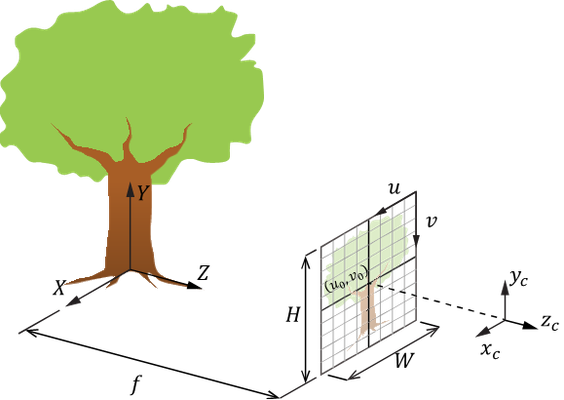

  

Figure A.3.2: Illustration of a digital camera model. With <b>H</b> and <b>W</b> as the sensor's height and width in pixels; <b>xc</b>, <b>yc</b> and <b>zc</b> as the coordinates of the camera center. <em>Source:</em> Own elaboration
 

The camera matrix $\mathbf{C}$ is a complex matrix that is difficult to solve and contains unknown parameters. Its resolution is carried out through a calibration process. The relationship between homogeneous coordinates in the real world and projected homogeneous coordinates on the camera sensor can be written as:

  

  

  

where:

  

  

 

where $u$ and $v$ are the projected Cartesian coordinates on the camera sensor.

A key characteristic of equation [(3.6)](#e36) is its invariance. If we multiply the camera matrix by a facto $\lambda$:

  

  

 

the relationship [(3.7)](#e37) remains unchanged. Thus, the presence of the element $C_{34}$ n the camera matrix is entirely arbitrary, allowing equation (3.6) to be rewritten as:

  

  

 

This relationship [(3.9)](#e39) is used to perform what is referred to here as 3D Rectification. How this relation is used in the rectification process will be detailed later in Section 3.2.3. Additionally, it is the starting point for defining the *Homography Matrix*.

## 3.2 Homography matrix

The homography matrix establishes the relationship between the coordinates of points on the same plane in the real world and their projections in pixels, eliminating the depth dimension. If we assume that all real-world points lie on the same plane $Z = 0$, then the third column of the camera matrix in equation [(3.9)](#e39) becomes irrelevant because all its elements are multiplied by $$0$$. Thus, equation [(3.9)](#e39) can be simplified as follows:

  

  

 

The matrix $H$ is called the homography matrix, containing 9 elements, of which 8 are unknown. In this case, the homography matrix can be solved using only 4 points whose real-world coordinates and projected coordinates are known. It is important to note that this transformation applies only within a single plane, to which an elevation $Z = 0$ is assigned, and is not valid for transforming points outside this plane.

## 3.3 Rectification methods

Below are different approaches to utilizing the concepts described in various rectification methods. These processes can be applied either to the images (explicit rectification) or directly to the resulting velocity fields (implicit rectification) (Jolley et al., 2021). Higham and Brevis (2019) suggested that rectifying the velocity vector field, instead of the image, is more effective in most cases, particularly in PIV applications. The methods for using and solving the matrices presented here are not strictly the only possible ones and may vary depending on the software used for this task.

### 3.3.1 1D rectification

D rectification is the simplest method and is used when the camera is positioned in a nadir angle, meaning it is perpendicular to the area of interest (i.e., the flow in LSPIV). This method only corrects the geometry in one dimension, assuming no perspective distortion.

In this case, the image transformation is straightforward, as the mapping between the image and the real-world plane can be described using a simple one-dimensional scaling relationship. A full homography matrix is not needed; instead, a correction factor based on a known distance in the image plane is applied. To implement this method, it is sufficient to know the real distance between two visible points in the image to establish a reference, defining a scale factor $s = \frac{d_{r e a l}}{d_{p i x e l e s}}$ where $d_{r e a l}$​ is the real distance between two points and $d_{p i x e l e s}$​ is the distance in the image, measured in pixels. The factor $s$ is used to convert measured distances in the image to their real-world equivalents.

It is important to note that, although this method consists of scaling pixel size, this value is valid only for the plane that contains the two reference points. Therefore, these points must be very close to the plane of interest to be rectified. In the case of LSPIV, since the plane of interest is the free surface of the flow, these points must be at the same elevation as the water surface.

### 3.3.22D rectification

2D rectification is suitable for situations where the camera is not aligned perpendicularly to the flow, such as oblique recordings taken from the riverbank or from a structure.

In this method, the full homography matrix is used. Equation ([3.10](#e310)), as presented, allows for the transformation of real-world coordinates into their projected coordinates in the image. However, for LSPIV applications, the inverse operation is required—that is, transforming the coordinates of an image $( x , y )$ to their corresponding real-world coordinates $( X , Y )$. Since the homography matrix $\mathbf{H}$ is invertible, this can be done directly using equation [3.11](#e311):

  

  

This is an 8-parameter plane-to-plane projective transformation. To solve for $\mathbf{H}$, as previously mentioned, it is necessary to know both the image and real-world coordinates of four points, commonly referred to as Control Points (CPs) (Fujita et al., 1998; Detert & Weitbrecht, 2015; Patalano et al., 2017; Detert, 2021). Since this transformation applies within a single plane, the Control Points must be coplanar. In the case of LSPIV, they must be located at the same height as the water surface.

To determine the pixel coordinates of the Control Points, their positions must be identified in the image. Meanwhile, their real-world coordinates can be obtained in two ways: Directly measuring the real-world coordinates $( X , Y )$ of each point, or sing six known distances between them (four perimeter distances and two diagonals), allowing the construction of a local $( X , Y )$ coordinate system by arbitrarily assigning a coordinate pair to one of the Control Points.

[Figure A.3.3](#figA33) shows an example of coordinate rectification using four known points (the corners of a notebook).

  

  

  

Figure A.3.3: a) Original image with four coplanar points whose coordinates are known in both the image and real-world reference frame. b). Rectified image obtained using the homography matrix calculated from these four points. <em>Source:</em> Own elaboration
 

For implicit rectification, LSPIV processing results, expressed in pixels, are displacement vector fields whose origins are located on a regular grid. Since equation (3.11) allows for the transformation of coordinates rather than displacements, it is necessary to express the LSPIV displacement vectors by their origin and end coordinates:

  

  

where $\overrightarrow{d_{i}}$ is the displacement vector in pixels at grid position $i$, and $\overrightarrow{x_{i}^{O}}$ y $\overrightarrow{x_{i}^{F}}$ are the origin and endpoint coordinates, respectively. The coordinates $\overrightarrow{x_{i}^{O}}$ y $\overrightarrow{x_{i}^{F}}$ are rectified using equation ([3.11](#e311)) to obtain the real-world coordinates that define the displacement in meters:

  

  

where $\overrightarrow{X_{i}^{O}}$ y $\overrightarrow{X_{i}^{F}}$ are the rectified coordinates of the origin and endpoint, respectively. The real displacement $\overrightarrow{D_{i}}$ is then calculated as:

  

  

### 3.3.3 3D rectification

3D rectification is suitable for situations where the camera is not aligned perpendicularly to the flow, such as oblique recordings from the riverbank or a structure. Unlike 2D rectification, which only corrects distortions in a single plane, 3D rectification allows for the projection of any plane in space, provided that the camera configuration is known. This makes it particularly useful for Fixed Stations, where a single camera position is used to rectify different water surface elevations over time.

In this case, the full camera matrix $\mathbf{C}$ ([3.9](#e39)) is used. If the camera's intrinsic and extrinsic parameters are known, $\mathbf{C}$ can be directly computed. If these parameters are unknown, at least six points with known real-world and image coordinates are required to solve for the 11 unknowns in the camera matrix. These points are commonly referred to as Ground Control Points (GCPs) (Jodeau et al., 2008). One possible method for solving for the unknowns in PPP is Singular Value Decomposition (SVD).

Although the minimum number of points required to solve for the camera matrix is six, the accuracy of the rectification improves significantly when a greater number of precisely measured GRPs are used. The more GRPs included, the greater the redundancy in the rectification system, which enhances the precision and reliability of the results. Additionally, GRP data should be thoroughly reviewed to ensure relative accuracy before attempting rectification. Errors in GRP surveying will complicate the process, and large errors may result in failure. For improved accuracy, the use of RTK (Real-Time Kinematic) systems is recommended.

It is important to remember that, once completed, the camera calibration is valid only for that specific mounting position, image resolution, zoom, and focal length. Any changes to these parameters will require recalibration in the processing/measurement software. If recalibration is not performed, the resulting velocity and discharge data will be inaccurate.

**Procedure for rectifying a plane:**

To perform 3D rectification of the free surface (or any other plane of interest), follow these steps:

1.  **Define four points in real-world coordinates** to use as a Region of Interest (ROI). It is necessary to know the planimetric coordinates of these points $( X , Y )$.
2.  **Define the elevation level**: Assign a constant elevation coordinate to the four defined points. This coordinate must match the plane to be rectified; in the case of LSPIV, this is the water surface plane. In this way, the real-world coordinates of the four points $\left( X , Y , \  Z \right)$ are established. In a Fixed Station, this value will change depending on the water level variations of the monitored channel.
3.  **Calculate pixel coordinates**: Using the computed camera matrix, these four points are projected from the real-world plane onto the image plane, obtaining their corresponding pixel coordinates $( x , y )$. This transformation is carried out using the full camera matrix

  

  

4.  **Compute the homography matrix**: With the real-world coordinates and their corresponding pixel coordinates, a homography matrix $\mathbf{H}$ can be computed, which will allow any point on that plane to be mapped onto the image. The homography $\mathbf{H}$ is obtained by solving the system of equations generated by the projected and real-world coordinates.
5.  **Perform 2D rectification of the plane**: Once the homography matrix for the plane of interest is computed, 2D rectification can be applied similarly to the method described in section 3.3.2. This transformation is applied to the plane coordinates, correcting perspective distortions and allowing an accurate representation of the plane in the image.

#### Errors in rectification (adapted from WaMSTeC, 2021):

Errors in image rectification directly impact the accuracy of the pixel scaling factor, which is used for velocity calculations and, ultimately, for discharge estimation. These errors, known as reprojection errors, represent the software's ability to map pixel coordinates to the real-world coordinates of the Ground Reference Points (GRPs). It is crucial to understand that these errors are not related to the accuracy of the field-surveyed data but rather to the software's ability to correctly interpret that information. However, if the topographic data contain significant errors, they will negatively affect the rectification process and, consequently, the accuracy of the analysis results.

The rectification errors must be quantified for each GRP used. A common method for evaluating the magnitude of these errors is to calculate the Root Mean Square Error (RMSE) of the rectified image coordinates compared to the actual GRP coordinates. This error is broken down into RMSE for the x and y coordinates, and is calculated as follows:

  

  

  

  

  

  

where $x_{imagen,i}$ and $y_{imagen,i}$ are the rectified image coordinates of the GRPs, y $x_{GRP,i}$ e $y_{GRP,i}$ are the real-world coordinates measured in the field for the i-esimo GRP, and n is the total number of GRPs used. The resulting RMSE value, $RMSE_r$, provides a radial measurement of positional error around each GRP and is expressed in the same units as the input coordinates.

To ensure accurate pixel scaling, the $RMSE_r$ value must not exceed three times the pixel size or three times the reported Ground Sampling Distance (GSD) at a 68% confidence level (equivalent to 1 sigma). It is recommended to exclude GRPs with large errors, as they can introduce significant uncertainty in the rectification process and compromise the quality of the results.

Thus, it is essential to carefully select the GRPs used, ensuring that the chosen points provide the lowest possible uncertainty. To achieve this, verifying the accuracy of the surveyed data before performing rectification is crucial. In cases where large errors are detected in certain points, these should be removed from the analysis.

***

<strong>ANNEX 4: SURFACE TRACERS</strong>

<h2 style="text-align:center;">ANNEX 4: SURFACE TRACERS</h2>

## Content
[4. Surface tracers](#4-surface-tracers)  
&nbsp;&nbsp;&nbsp;&nbsp;[4.1 Natural tracers](#41-natural-tracers)  
&nbsp;&nbsp;&nbsp;&nbsp;[4.2 Artificial tracers](#42-artificial-tracers)  
&nbsp;&nbsp;&nbsp;&nbsp;[4.3 Environmental and recording factors](#43-environmental-and-recording-factors)  

# 4. Surface tracers

Surface tracers are visually detectable elements (optically or thermally) on the water surface that allow tracking the flow motion. In Large-Scale Particle Image Velocimetry (LSPIV), tracers are essential, as they provide the necessary texture to identify displacements in image sequences (videos). Without them, image analysis cannot reliably detect motion patterns. A general rule states that **if surface movement cannot be observed with the naked eye, a reliable surface velocity measurement using LSPIV is not possible.**

In general terms, the key aspects to evaluate the presence of favorable conditions for implementing LSPIV include:

1.  *Tracer type:* The shape, size, and buoyancy of the tracers must ensure that their displacement closely matches the movement of the free water surface. Additionally, they must be easily visible in the images, meaning aspects like color and tonal variations play an important role.
2.  *Tracer distribution:* The distribution must be homogeneous in both space and time, meaning the tracers must be present throughout the entire channel width and throughout the entire image sequence. An inadequate distribution, whether spatial or temporal, can significantly affect the results (Detert, 2021; Meselhe et al., 2004).
3.  *Environmental and recording factors:* Various environmental factors, such as lighting conditions and wind, can complicate tracer visualization or alter their movement, introducing biases in the results. Additionally, camera position and orientation during recording can negatively impact the quality of the measurement area visualization.

The following sections describe the most commonly found or used types of tracers in watercourses, along with recommendations for assessing whether conditions are suitable for implementing LSPIV.

## 4.1 Natural tracers

Natural tracers are features or elements that are already present on the water surface and are passively transported by the current. These tracers do not require external intervention, making them the simplest and most cost-effective option for implementing LSPIV. However, their presence and characteristics depend on the hydrological and environmental conditions of the watercourse, meaning they may not always be available in sufficient quantity or quality. The most common types of natural tracers are:

**Turbulent flow structures:** Surface structures generated by turbulence, such as ripples, boils, and upwelling boils, can act as tracers by reflecting the dynamic characteristics of the flow. These structures are more common in rivers with high slopes and intense turbulence. Although they are not physical elements, their movement and shape on the surface can be tracked using image velocimetry techniques ([Figure A.4.1](#figA41)). It is important to distinguish these features from stationary surface waves, which do not move at the same velocity as the free surface and are undesirable for LSPIV implementation.

  

  

  

Figure A.4.1: Examples of the presence of natural surface tracers generated by turbulent flow structures. <em>Source:</em> Own elaboration
 

**Foam:** Foam forms in turbulent watercourses due to the mixing of air and water. This type of tracer is particularly common in rivers with steep slopes or in areas where the flow interacts with obstacles such as rocks or artificial structures. Foam, as it moves with the current, creates visible patterns on the surface that can be easily tracked in images ([Figure A.4.2](#figA42)). It is essential that foam is not limited to a single section of the channel but is present throughout the entire width of the river.

  

  

  

Figure A.4.2: Example of surface foam as a natural surface tracer. <em>Source:</em> Own elaboration
  

**Floating debris:** Small floating elements such as leaves, twigs, seeds, small debris, and other fragments of vegetation can also serve as natural tracers ([Figure A.4.3](#figA43)). These elements typically originate from riparian vegetation and are commonly found in rivers and streams with dense ecosystems or urban areas with pollution issues. To be effective as tracers, they must be evenly distributed across the entire channel width and should be small enough to ensure low inertia.

  

  

  

Figure A.4.3: Example of floating vegetation debris and urban waste as natural surface tracers. <em>Source:</em> Own elaboration
   

**Ice:** In cold climate regions, floating ice sheets can act as natural tracers ([Figure A.4.4](#figA44)). Their movement represents the surface flow velocity, although their use may be limited due to their size, distribution, and potential interactions with obstacles or accumulation in certain areas of the watercourse. This type of tracer is particularly relevant in rivers with seasonal low temperatures but may not be useful in situations where the water surface is almost entirely covered by large floating ice sheets.

  

  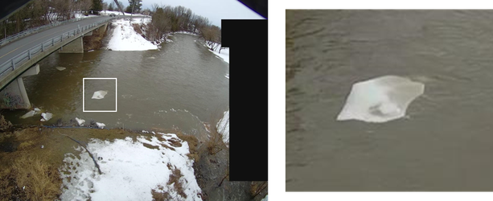

  

Figure A.4.4: Example of floating ice sheets as natural surface tracers. <em>Source:</em> Images provided by the National Hydrological Service of Environment and Climate Change Canada
 

In ideal conditions, the presence of natural tracers in turbulent or high-velocity flows may be sufficient for a successful LSPIV analysis. However, these tracers must meet the criteria for **homogeneous spatial and temporal distribution**. It is possible that suitable tracers are present only in certain sections of the channel or that their passage through the measurement area is intermittent. [Figure A.4.5](#figA45) shows an example where tracers are visible on one half of the channel width, while the other half appears smooth and featureless (undesirable condition). Situations with spatial and temporal heterogeneity in tracer presence should be avoided, as they can alter results and require additional efforts during image processing.

  

  

  

Figure A.4.5: Example of spatial heterogeneity in natural tracer distribution. <em>Source:</em> Own elaboration
 

## 4.2 Artificial tracers

In some scenarios, such as rivers with low turbulence or slow-moving flows, natural tracers may be scarce, discontinuous, or unevenly distributed, making LSPIV analysis more difficult. The need to use artificial tracers may also arise in transparent flows, where the riverbed is visible, creating confusing patterns that do not represent the true surface flow dynamics. Another common situation occurs when the camera is too far from the flow and cannot be repositioned, resulting in a resolution too low to visualize natural tracers ([Figure A.4.6](#figA46)). In all these cases, artificial tracers become a necessary strategy to ensure an adequate surface texture for reliable analysis.

  

  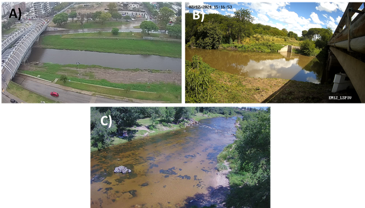

  

Figure A.4.6: Examples of conditions where artificial tracers are required. A) Lack of visible natural tracers due to the camera being too far from the flow. B) Slow-moving or low-turbulence flows. C) Transparent flows where the riverbed is visible. <em>Source:</em> Own elaboration
 

**4.2.1 Characteristics of artificial tracers**

Artificial tracers are materials intentionally introduced onto the water surface to improve the detection and tracking of flow motion. They must be carefully selected to meet certain essential criteria:

1.  **Passive movement with the flow**: Tracers must accurately follow the water surface motion, without being significantly affected by external forces, such as wind or their own buoyancy.
2.  **Visibility in images**: Their contrast with water must be sufficient to facilitate identification in the recordings.
3.  **Non-sinking behavior**: Tracers must remain afloat throughout the recording period, as submersion would make them unrepresentative of the surface flow dynamics. Sinking may occur due to higher density than water, inadequate size (making them prone to downward currents), or deployment in highly turbulent areas where the flow causes immersion.
4.  **Environmental impac**t: It is crucial that the tracers are environmentally safe and do not negatively affect water quality or local ecosystems. This includes prioritizing biodegradable materials, such as natural bark, wood fragments, or polymers that rapidly decompose in the environment.

The type of tracers used varies by region, as materials are often sourced from available industrial byproducts. Some commonly used artificial tracers include:

1.  Wood shavings: With particle sizes large enough to prevent sinking upon deployment into the flow.
2.  Cereal husks: Such as rice husks.
3.  Vegetal residues: In agricultural or forestry areas, plant debris or floral waste can be repurposed as tracers.

**4.2.2 Seeding process**

The term "seeding" refers to the distribution of artificial tracers over the water surface. This process is crucial to ensure quality measurements in LSPIV. To achieve reliable results, it is essential that the distribution of tracers is homogeneous in both space and time. This means that there should be no gaps without particles, tracers must cover the entire width of the channel, and the distribution should remain consistent throughout the entire video recording. [Figure A.4.7](#figA47) provides examples of different tracer distributions within the measurement area.

  

  

  

Figure A.4.7: Artificial tracer distributions in the measurement area. A) Clusters of tracers with large gaps (undesirable condition). B) Part of the channel width lacks tracers (undesirable condition). C) Uniform distribution across the entire measurement area (desired condition). <em>Source:</em>Own elaboration
 

Seeding must always be performed upstream of the measurement area to ensure that tracers reach the area of interest in an orderly manner. During seeding, it is crucial to prevent tracers from accumulating in specific areas due to obstacles in the channel, as this could disrupt the intended distribution. Similarly, obstacles in the channel must not create wake zones without tracers.

Operators can seed the tracers from: the riverbanks, within the channel, or from a structure crossing the channel, such as a bridge ([Figure A.4.8](#figA48)). Depending on the width of the channel, multiple operators may be required to seed tracers simultaneously. It is recommended that each operator has the appropriate volume of tracers for their assigned area, avoiding unnecessary movements. It is important that operators standing in the water should minimize movements and move slowly during recording to avoid disturbing the water surface, as this could create waves or wakes that interfere with tracer distribution.

  

  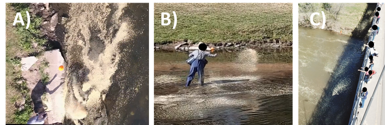

  

Figure A.4.8: Examples of seeding methods. A) From the riverbanks. B) From within the channel. C) From a structure (bridge) crossing the channel. <em>Source:</em> Own elaboration
 

Additionally, special care should be taken to avoid obstructing the recording with the operator’s body or objects during seeding. For instance, if a camera is recording, and an operator is seeding nearby, they must ensure that their arm or the tracers in the air do not block the flow measurement area, as this would affect visibility ([Figure A.4.9](#figA49)). Moreover, when wind conditions are strong, it is important to consider its impact during seeding. Wind can disrupt tracer distribution, causing them to scatter in unintended directions before reaching the water surface.

  

  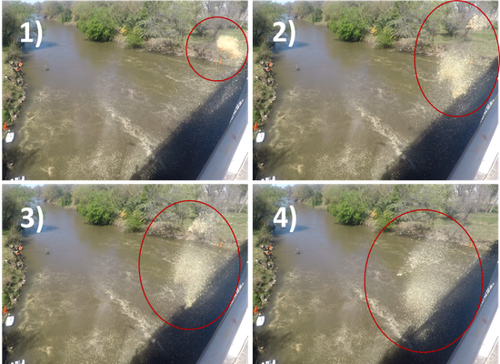

  

Figure A.4.9: Example of visual obstruction of the flow during the seeding process. <em>Source:</em> Own elaboration
 

By ensuring proper seeding of artificial tracers, LSPIV implementation is optimized, guaranteeing that the collected data are representative and reliable for flow analysis.

## 4.3 Environmental and recording factors

Several environmental factors and recording conditions can significantly impact the visibility of surface tracers and, consequently, the accuracy of the results obtained through LSPIV. The main aspects to consider to minimize issues and ensure adequate capture of surface flow motion are:

**Tracers present but not visible in the images**

For LSPIV analysis to be effective, surface tracers must be clearly identifiable in the recorded image sequence. However, it is possible that tracers visible to the naked eye in the field may not be adequately detected in the video. This may occur due to:

1.  Low contrast between the tracers and the water background.
2.  Recording at a low spatial resolution.
3.  Excessive distance between the flow and the camera, which reduces the ability to distinguish tracers in the images.

When the flow is too far from the camera, spatial resolution decreases, making tracers difficult to detect [Figure A.4.10](#figA410). To avoid these problems, it is crucial to adjust recording conditions, such as camera position and spatial resolution settings, ensuring that tracers are clearly visible in the captured images.

  

  

  

Figure A.4.10: Example of tracers not being visible due to the recording point being too far from the flow. <em>Source:</em> Own elaboration
 

**Visual obstructions**

Elements such as vegetation, artificial structures (bridges, pillars), or even people may partially or completely block the measurement area ([Figure A.4.11](#figA411)). These obstructions not only reduce the visibility of the flow area, but they can also generate shadows, affecting image quality. Before starting the recording, a thorough site inspection should be conducted to identify and adjust the camera position, minimizing visual obstructions.

  

  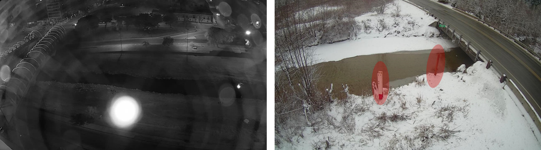

  

Figure A.4.11: Elements obstructing the view of the flow measurement area. Left: Insect on the camera lens. Right: Objects at the site partially obstructing the flow. <em>Source:</em> Own elaboration. Some images were provided by the National Hydrological Service of Environment and Climate Change Canada
 

**Lighting conditions**

Inadequate lighting can significantly compromise image quality, affecting the accuracy of LSPIV analysis. The most relevant issues include:

1.  *Inconsistent lighting:* Both spatial and temporal variations in lighting conditions can significantly affect LSPIV results. Spatial variations, such as shadows or transitions between bright and dark areas in the measurement region ([Figure A.4.12](#figA412)), may be interpreted as static patterns during processing, biasing results toward zero velocities in these regions. Temporal variations, such as clouds intermittently covering the sun, can make it difficult to consistently identify tracers throughout the video. Although some of these issues can be partially corrected during image processing, it is always preferable to avoid them during recording to ensure more accurate and reliable results.

  

  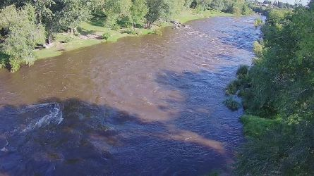

  

Figure A.4.12: Spatial variation in lighting conditions across the flow measurement area. <em>Source:</em> Own elaboration
 

2.  *Sun reflections:* Intense glare on the water surface, caused by solar reflections or artificial lighting sources, represents an adverse condition for LSPIV analysis ([Figure A.4.13](#figA413)). These high-intensity bright areas prevent proper visualization of surface tracers. If these reflections are processed, they may be misinterpreted as surface patterns, leading to unreliable velocity estimations. This occurs because the temporal evolution of these reflections does not necessarily correspond to the actual movement of the flow.

  

  

  

Figure A.4.13: Presence of undesired sun reflections over the flow measurement area. <em>Source:</em> Own elaboration
 

3.  *Recording directly facing the light source:* Capturing images toward the sun or another strong light source results in overexposure and loss of detail in the flow visualization ([Figure A.4.14](#figA414)).

  

  

  

Figure A.4.14: Recording with a light source directly facing the camera lens. <em>Source:</em> Own elaboration
 

4.  *Night recordings:* Lighting conditions during night recordings often present significant challenges for LSPIV implementation. Even when artificial lights are used, they generally fail to illuminate the entire water surface uniformly, creating dark areas and heterogeneities that complicate tracer visualization. The use of infrared cameras is also not an effective solution, as water absorbs most infrared radiation, appearing as a black surface in the images, which makes tracking surface tracers impossible ([Figure A.4.15](#figA415)). For these reasons, night recordings should be avoided unless an adequate lighting and/or recording system is available to ensure optimal image capture conditions.

  

  

  

Figure A.4.15: Night recordings. Left: Image captured with an infrared camera. Right: Heterogeneous artificial lighting of the watercourse. <em>Source:</em> Own elaboration
  

To mitigate these issues, it is recommended to record under uniform lighting conditions, adjust the camera angle and/or position to avoid reflections, and, if necessary, use polarizing filters to minimize glare on the water surface.

**Precipitation (rain or snow) during recording:**

The presence of rain or snow while recording can create multiple challenges for LSPIV application. Raindrops or snowflakes moving in front of the flow may be incorrectly identified as tracers during analysis, leading to erroneous velocity estimations. Besides, the impact of raindrops on the water surface can generate transient patterns that do not correspond to the actual flow movement, introducing biases in the results ([Figure A.4.16](#figA416)).

In Fixed Stations, another factor to consider is that the camera lens may get wet or fogged up due to precipitation or changes in temperature and humidity. This results in blurry images with reduced visibility of the tracers, complicating subsequent analysis ([Figure A.4.16](#figA416)). For these reasons, recording during active precipitation should be avoided, or protective measures such as camera housings or covers should be implemented to mitigate these effects and ensure proper recording quality.

  

  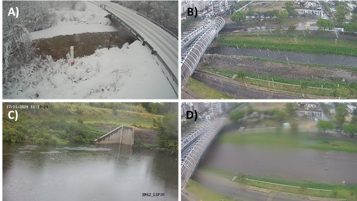

  

Figure A.4.16: Examples of recordings during precipitation events. A) Visibility of snowflakes. B) Visibility of raindrops. C) Deformation of the water surface due to raindrop impact. D) Camera lens wet from rain. <em>Source:</em> Own elaboration. Some images were provided by the National Hydrological Service of Environment and Climate Change Canada
 

**Wind**

The shear effect of wind on the water surface can alter surface flow velocity, causing increases, decreases, or fluctuations in speed. This adds complexity to the estimation of the alpha coefficient (α), which is used to relate surface velocities to depth-averaged velocities (for more details, see [Annex 6](#An6)). Additionally, when using artificial tracers, the wind can also disrupt their distribution. Strong gusts may blow tracers off course before they reach the water, resulting in an irregular distribution or unwanted concentrations in certain areas. For these reasons, it is recommended to avoid recordings under strong wind conditions or, if unavoidable, consider these effects when interpreting results.

**Frozen surface**

In cold regions, the water surface may be partially or completely frozen, forming static ice sheets. These elements do not represent actual flow movement, and if they dominate the surface, LSPIV may be ineffective ([Figure A.4.17](#figA417)). Before starting a recording, it is essential to check that most of the surface is ice-free and that the visible tracers accurately reflect flow motion.

  

  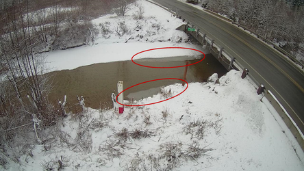

  

Figure A.4.17: Static ice sheets on the flow surface. <em>Source:</em> Image provided by the National Hydrological Service of Environment and Climate Change Canada
 

***

<strong>ANNEX 5: INTERPOLATION/EXTRAPOLATION OF VELOCITY PROFILE DATA</strong>

<h2 style="text-align:center;">ANNEX 5: INTERPOLATION/EXTRAPOLATION OF VELOCITY PROFILE DATA</h2>

## Contenido
[5. Interpolation/extrapolation of velocity profile data](#5-interpolation-extrapolation-of-velocity-profile-data)  
&nbsp;&nbsp;&nbsp;&nbsp;[5.1 Need for interpolation and extrapolation](#51-need-for-interpolation-and-extrapolation)  
&nbsp;&nbsp;&nbsp;&nbsp;[5.2 Commonly used methods](#52-commonly-used-methods)  
&nbsp;&nbsp;&nbsp;&nbsp;[5.3 Comments on measurement quality (adapted from WaMSTeC, 2021)](#53-comments-on-measurement-quality-adapted-from-wamstec-2021)  

# 5. Interpolation/extrapolation of velocity profile data

## 5. Interpolation/extrapolation of velocity profile data

### 5.1 Need for interpolation and extrapolation

In the context of discharge measurement using image velocimetry techniques, it is often not possible to obtain a complete velocity profile along the cross-section of the flow. These limitations may arise due to multiple factors:

- **Anomalous data:** In some cases, certain areas of the cross-section may exhibit incorrect or inconsistent velocity estimates, either due to low image quality or unfavorable conditions, such as inadequate surface roughness, the presence of shadows or solar reflections, among others.
- **Non-visible sections:** Areas near the banks may be out of the camera’s field of view or obscured by environmental factors (e.g., vegetation, structures).

The detection of these anomalous data can be performed by visualizing the obtained velocity profile and comparing it to the expected hydrodynamic behavior of the flow cross-section. This allows for the identification of irregularities, such as unexpected peaks or dips in velocity, which may indicate measurement errors requiring correction, as well as gaps in the profile where no data have been recorded ([Figure A.5.1](#figA51)).

  

  
    

  

Figure A.5.1: Bathymetric and velocity profiles. Left: Example of a velocity profile with anomalous data, where an unusually high velocity peak appears at a specific point, suggesting a measurement error due to image artifacts or surface roughness. Right: Incomplete velocity profile, where the areas near the banks lack data. This situation is common when cameras fail to cover the entire flow cross-section due to physical obstacles or limitations in the field of view. <em>Source:</em> Own elaboration

To address these conditions, it is necessary to apply interpolation and extrapolation methods to reconstruct missing velocity data ([Figure A.5.2](#figA52)). This allows for a more accurate and reliable discharge estimation, even in the presence of missing data.

  

  
    

  

Figure A.5.2: Application of interpolation and extrapolation methods to reconstruct missing velocity data, ensuring a more accurate discharge estimation. Blue: original data. Red: interpolated/extrapolated data. <em>Source:</em> Own elaboration

### 5.2 Commonly used methods

There are numerous interpolation and extrapolation methods for velocity data. Below are some of the methods currently implemented in software available for LSPIV applications.

#### 5.2.1 Linear interpolation

Linear interpolation is a simple method that calculates an intermediate velocity value between two points in a velocity profile, $(x_1,v_1)$ and $(x_2,v_2)$, where $x$ represents the position along the profile and $v$ the corresponding velocity data. If the velocity $v$ at a position $x$ between $x_1$ and $x_2$ needs to be estimated, it can be calculated as:

  

  
    

  

For extrapolations toward the banks, Equation [5.1](#e51) is also applied, assuming that the bank velocity is zero, or assigning it a predefined value.

This method is effective when the distances between known data points are small, and the lateral velocity distribution does not exhibit strong gradients. However, it lacks a physical basis and does not account for the actual hydrodynamic behavior of the flow.

#### 5.2.2 Polynomial equations

The use of polynomial equations allows for a more complex and accurate approximation of velocity data, especially when dealing with a set of points that do not follow a linear trend. Given a set of $n+1$ velocity points $(x_0,v_0)$, $(x_1,v_1)$, $(x_2,v_2)$, …, $(x_{n+1},v_{n+1})$, a polynomial of degree up to $n$ can be fitted to these data points to estimate velocity at other positions along the profile. The general form of a polynomial equation is:

  

  
    

  

The coefficients $a_0, a_1, a_2, …, a_n$ are determined using curve-fitting methods, such as the least squares method, which minimizes the sum of squared errors between the polynomial and the data points. This method is useful for capturing nonlinear trends in velocity data. However, similar to linear interpolation, it lacks a direct hydrodynamic foundation and may lead to overfitting if the polynomial degree is too high.

#### 5.2.3 Local Froude number method

This method is based on an interpolation of local Froude numbers. For each velocity data point, the Froude number is calculated as:

  

  
    

  

where $v_i$ is the velocity at node $i$, $h_i$ is the flow depth at node $i$, and $g$ is gravitational acceleration. The interpolation of Froude numbers is performed as:

  

  
    

  

With this interpolated value, the velocity at node $i$ is then calculated as:

  

  
    

  

This method applies a scale factor dependent on depth $\sqrt{h_i}$, considering the flow geometry in the lateral variation of velocity profiles. For extrapolation toward the banks, a zero velocity at the bank may be assumed, or an estimated bank velocity $V_{bank}$ may be obtained using a power-law extrapolation from the velocity measured near the bank $V_{ad}$, with exponent $1/m$:

  

  
    

  

The exponent $1/m$ typically ranges from 5 to 7 but can vary over a wider range depending on hydraulic resistance (ISO 748, 2007). Le Coz et al. (2012) suggests that observed values of the exponent in discharge measurements vary between 2 (highly rough bank with slope) and 10 (smooth vertical bank). The limitation of this method arises when the unmeasured width near a bank is large, as the extrapolated profile will strongly depend on the chosen assumptions. That is, whether zero velocity is assumed at the bank or a bank velocity is estimated using Equation 5.6 with an assumed exponent $1/m$.

The interpolation of local Froude numbers has been proposed in several studies (Despax, 2016; Fulford & Sauer, 1986; Le Coz et al., 2012) and is currently implemented in software such as RIVeR and Fudaa-LSPIV.

## 5.3 Comments on measurement quality (adapted from WaMSTeC, 2021)

Discharge calculations require measured velocities. Currently accepted procedures for discharge calculations based on point velocity measurements, such as those obtained with Flow Trackers or mechanical current meters, involve measuring velocity data at each vertical along the channel width and calculating discharge using the mid-section or mean-section method.

Depending on the image velocimetry method, the analysis configuration, and site conditions, the image velocimetry software may need to calculate and apply an interpolated velocity to replace missing or erroneous velocity data. This is similar to what happens when ensemble or cell data are missing in ADCP measurements. As with ADCP data reviews, interpolated data should also be evaluated when used in discharge measurements with image velocimetry.

To minimize the need for interpolated velocity data in discharge calculations, the user should ensure that:

1. The LSPIV processing setup is capable of consistently measuring distributed velocities across the entire channel width within the camera’s field of view, for the full range of discharge conditions to be measured.
2. The camera installation and site selection are suitable for the image analysis method and for the site conditions across the expected discharge range.
3. Post-processing procedures are used to refine the analysis settings and increase the number of velocity points measured across the channel.
4. Any interpolated velocity data must be calculated between two measured velocity points that are close to each other and located on both sides of the interpolated point's position.

Assessing the velocity data used in a discharge calculation is a key step in determining the overall quality of the discharge measurement. This includes evaluating the amount and quality of any interpolated velocity data. The user should visually inspect any interpolated data areas and determine whether the interpolation accurately reflects the velocity distribution, considering the measured velocity points along the cross-section.

The user should take into account:

1. The location, distribution, quantity, and appropriateness of interpolated data points within the cross-section.
2. Changes in water depth and bed roughness at the interpolation point.
3. Upstream obstructions (such as rocks or trees) that may affect velocity distribution.

Based on the initial visual assessment, the user should aim to minimize the amount of interpolated data by applying additional post-processing corrections or adjusting the initial analysis parameters. Once a measurement is finalized, the total percentage of interpolated discharge should be quantified and documented in the measurement summary report ([Figure A.5.3](#figA53)).

  

  
    

  

Figure A.5.3: Example of an LSPIV discharge measurement report showing velocity and discharge information, including percentage values for interpolated discharge data (0.7%). <em>Source:</em> WaMSTeC, 2021

There are qualitative assessment recommendations for the measurement quality based on the percentage of interpolated discharge and/or the distance between measured data points used for velocity interpolation. If no specific guidelines exist for your jurisdiction, you may refer to the Australian National Guidelines for Hydrometric Monitoring (WaMSTeC, 2021) as a reference. These guidelines propose quality bands that are applied as part of a general quality and uncertainty assessment. These are based on a similar evaluation method applied to missing/interpolated discharge data in ADCP measurements:
- Quality Band 1 = ≤10% of the total discharge is interpolated and/or interpolated data points are randomly distributed across the channel, with a maximum interpolation distance of ≤10% of the total channel width.
- Quality Band 2 = ≥10% and ≤20% of the total discharge is interpolated and/or interpolated data points are randomly distributed across the channel, with a maximum interpolation distance of ≥10% and ≤20% of the total channel width.
- Quality Band 3 = ≥20% of the total discharge is interpolated and/or interpolated data points are grouped together in the main channel, with a maximum interpolation distance of ≥20% and ≤30% of the total channel width.
- Any measurement where the maximum interpolation distance is ≥30% of the total channel width is considered an unclassified/estimated measurement.
- Extrapolating velocity and discharge data along the main channel should be avoided whenever possible
In practice, Quality Bands 1, 2, and 3 are typically referred to as good, fair, and poor, respectively, in the water industry in Australia.

***

<strong>ANNEX 6: ALPHA COEFFICIENT, RELATIONSHIP BETWEEN SURFACE VELOCITY AND MEAN VELOCITY</strong>

<h2 style="text-align:center;">ANNEX 6: ALPHA COEFFICIENT, RELATIONSHIP BETWEEN SURFACE VELOCITY AND MEAN VELOCITY</h2>

## Content
[6. Alpha coefficient: Relationship between surface velocity and mean velocity](#6-alpha-coefficient-relationship-between-surface-velocity-and-mean-velocity)  
&nbsp;&nbsp;&nbsp;&nbsp;[6.1 Method 1: Calculation of α from site calibration data](#61-method-1-calculation-of-α-from-site-calibration-data)  
&nbsp;&nbsp;&nbsp;&nbsp;[6.2 Method 2: Calculation of α based on velocity profile expressions and site-specific physics](#62-method-2-calculation-of-α-based-on-velocity-profile-expressions-and-site-specific-physics)  
&nbsp;&nbsp;&nbsp;&nbsp;[6.3 Method 3: Calculation of α without data](#63-method-3-calculation-of-α-without-data)  
&nbsp;&nbsp;&nbsp;&nbsp;[6.4 Wind effects](#64-wind-effects)  
&nbsp;&nbsp;&nbsp;&nbsp;[6.5 Workflow diagram for selecting the alpha method](#65-workflow-diagram-for-selecting-the-alpha-method)  

# 6. Alpha coefficient: Relationship between surface velocity and mean velocity

*This annex is a translation and adaptation of Biggs et al. (2021).*

Despite its advantages, using cameras for flow measurement still faces significant challenges. One of the main difficulties is the conversion of surface velocity into mean depth-averaged velocity, a process that is complex and influenced by multiple factors. This conversion is quantified using the alpha coefficient (α), which represents the ratio between the mean velocity over depth and the surface velocity (${v / v}_{s}$). Although the standard value of α is often taken as 0.85 or 0.86 (Rantz, 1982), in practice, this coefficient varies significantly depending on the flow and site characteristics. Reported values typically range between 0.7 and 0.9, with extreme cases exceeding 1.1, particularly in situations where the water surface is influenced by wind or in irregular channels (Hauet et al., 2018). Several hydraulic and site characteristics can have a significant impact on the α coefficient ([Figure A.6.1](#figA61)), including:

1.  Channel aspect ratio (width-to-depth ratio).
2.  Variations in water depth.
3.  Bed roughness.
4.  Unsteady flow or reverse currents.
5.  Hydraulic structures.
6.  Vegetation presence.
7.  Wind effects.
8.  Secondary currents.

  

  

  

Figure A.6.1: Examples of velocity profiles across depth and their effect on the alpha coefficient value. A) Sand. B) Concrete. C) Surface wind. <em>Source:</em> Own elaboration

To improve the accuracy of flow measurement using surface velocimetry, it is essential to establish clear guidelines for selecting an appropriate α coefficient, adapted to the specific flow and site conditions.

There are multiple methodological approaches for estimating α, given its high variability. The following sections present the most commonly used methods in practice, ranging from simplified approaches to more detailed ones, depending on the available data and site conditions. Finally, Section 6.5 provides a workflow for selecting the most appropriate method for estimating α.

## 6.1 Method 1: Calculation of α from site calibration data

### 6.1.1 Method 1a: α from velocity data extrapolated from ADCP

A site-specific average α value (global α) can be easily estimated from ADCP velocity data using the QRev software (Randall, 2020). First, open the measurement in QRev, then click on "Extrapolation" and select "Velocity" ([Figure A.6.2](#figA62)). Choose the extrapolation method that best fits the data (e.g., power law). The data will be displayed as normalized elevation $z / H$​ on the y-axis and normalized velocity $v / V$​ on the x-axis. Set the subsection range to 20%–80% to use only the central portion of the channel. Click on the "Data Cursor" button and select the top of the velocity profile where it reaches the water surface. The "X" value represents the ratio of surface velocity to mean depth-averaged velocity $v_{s} / V$ ​. Then, the site-specific α value is then obtained as $\alpha = \frac{1}{x} = \frac{V}{v_{s}}$ (Hauet et al., 2018). α values for the site can be recorded across different flow conditions and plotted against depth scale to create a site-specific stage–α curve ([Figure A.6.3](#figA63)). For extreme conditions (e.g., floods), specific α values can be estimated by extrapolating this curve.

Although this method is convenient for users familiar with ADCP measurements, it should be applied with caution due to uncertainties in the extrapolation process. Significant velocity changes can occur between the measured points and the water surface due to wind, secondary currents, or turbulence, and the best extrapolation method may vary depending on site-specific conditions

  

  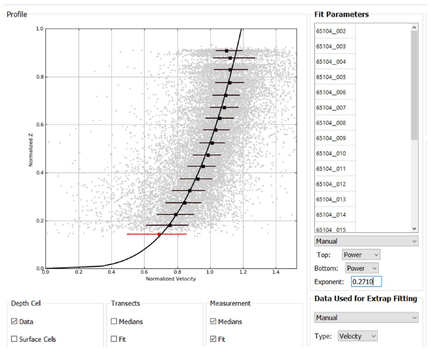

  

Figure A.6.2: Extrapolation of the velocity profile in QRev for α estimation. <em>Source:</em> Biggs et al. (2021)

  

  

  

Figure A.6.3: Example of a site-specific stage–α relationship. <em>Source:</em> Biggs et al. (2021)

### 6.1.2 Method 1b: α from a reference discharge measurement and discharge calculated using surface velocimetry with α = 1

Another method to determine the average α value for a site is by comparing the reference discharge $Q_{R e f}$​ obtained from traditional velocity measurements (e.g., ADCP, POEM, or current meters) with the discharge calculated using surface velocimetry $Q_{S}$​, assuming an initial α value of 1:

  

  

In practice, $Q_{R e f}$ is obtained using other techniques with low measurement uncertainty, such as ADCP, current meters, or salt dilution gauging. Additionally, if the site has a validated stage–discharge curve (H-Q relationship), it can be used to estimate $Q_{R e f}$ under low to medium flow conditions. Regarding the estimation of $Q_{S , \alpha = 1}$, it can be determined using surface velocimetry techniques (e.g., LSPIV, STIV, LSPTV) while assuming an α value of 1. This method is also applicable when using surface velocity radar (SVR) or direct surface velocity measurements (e.g., with a propeller-type current meter placed at or just below the water surface), especially in large flood events, where deeper velocity measurements may not be possible.

This approach offers multiple advantages, as surface velocities are measured directly, rather than extrapolated from in-situ velocity profiles (as in ADCP measurements). By repeating this method for various flow rates (or water levels), a site-specific stage–α curve can be developed. In some sites, this approach may provide limited advantages compared to a traditional stage–discharge curve (H-Q relationship) for low to medium flows. However, it offers significant benefits for extrapolating discharge estimates beyond the range measurable with in-situ gauging instruments, or in locations affected by tidal influences or fast-moving flows, where direct discharge measurements are more challenging.

## 6.2 Method 2: Calculation of α based on velocity profile expressions and site-specific physics

It is also important to obtain good α estimations in sites without calibration data, or under extreme conditions, such as flood events, when other measurements may not be safe or feasible. Any estimation of the α coefficient relies on inherent assumptions about the shape of velocity profiles in depth.

### Method 2a: α from the logarithmic velocity profile

For logarithmic velocity profiles, the α coefficient is calculated as $\alpha = \frac{H}{H - z_{0}} - \left\lbrack l n  \left( \frac{H}{z_{0}} \right) \right\rbrack^{- 1}$ (Le Coz et al. 2010; Welber et al. 2016; Fujita, 2018; Smart y Biggs, 2020a), where $H$ is the flow depth, and $z_{0}$ is the roughness coefficient of the velocity profile according to the logarithmic law. If the assumption $H \gg z_{0}$ holds and the shear velocity is defined as $v_{*} = \sqrt{g H S}$, this equation simplifies to:

  

  

Where $g$ is the acceleration due to gravity, $S$ is the channel slope, $\kappa$ is the Von Kármán constant (\~0.40), y $v_{s}$ is the time-averaged surface velocity (Smart y Biggs, 2020a).

To estimate α at a measurement site, the parameters must be averaged over time and space. The mean section Depth $H$ is calculated as:

  

  

Where $A$ is the cross-sectional area and $b$ is the section width. For surface velocity, it should be averaged across the entire section width as $v_{s} = Q_{S , \alpha = 1} / A$ ($Q_{S , \alpha = 1}$ is the surface discharge estimated with α = 1). If the assumption $H \gg z_{0}$ does not hold (e.g., in channels with a very rough bed), equation (6.2) becomes invalid. In such cases, more complex equations that account for higher relative roughness may be necessary (Smart y Biggs, 2020b).

This method provides a practical approach to estimating α when velocity profile data is unavailable. It can be useful in situations where data can only be obtained remotely, such as estimating slope from a Digital Elevation Model (DEM) of the gauging section, determining depth and cross-sectional area using airborne ground-penetrating radar, or obtaining surface velocity measurements from drones. This is particularly valuable during extreme flood events, where intrusive methods are not feasible, or in remote locations that are difficult to access. However, this approach has limitations, as accurately measuring channel slope can be challenging, particularly in low-gradient rivers. This method also assumes that $v_{*} = \sqrt{g H S}$, which may not always be precise (Smart & Biggs, 2020b). Additionally, it assumes that logarithmic velocity profiles extend up to the water surface, which may not always hold due to wind effects on the surface and secondary currents.

### 6.2.2 Method 2b: α from the power law profile

For velocity profiles that follow a power law ($\frac{\bar{\bar{v}}}{u_\ast}=a\left(\frac{z}{d}\right)^M$, where $d$ is the roughness scale and $M$ is the power law exponent), the α coefficient can be estimated from the exponent $M$.

Special attention must be given to the exponent, as the power law is often expressed as $\frac{\bar{\bar{v}}}{u_\ast}=a\left(\frac{z}{d}\right)^{1/m}$, where $1 / m$ e is the exponent in this case (ISO 748). Regardless of the notation used, the α coefficient can be estimated as:

  

  

While the results are equivalent whether using $M$ or $1 / m$, it is essential to clearly understand the distinction. For example, in QRev, the power law "exponent" displayed in the software ([Figure A.6.2](#figA62)) corresponds to $M$. The practical method for estimating the power law exponent $M$ in QRev is similar to the approach described in Section 6.1.1.

This method is convenient and useful for many measurement sites. However, it shares the same limitations as Method 2a, as it assumes that the vertical velocity distribution follows a well-defined equation. In reality, this may not always hold in sites with accelerated flows, wind effects on the surface, secondary currents, bridge piers, bed wakes, bars, debris, and other flow resistance sources near the water surface, such as submerged riparian vegetation or aquatic plants (Smart, 1999; Biggs et al., 2019). In sites with these characteristics, neither Method 2a nor Method 2b is suitable.

## 6.3 Method 3: Calculation of α without data

### 6.3.1 Method 3a: Default α values

The traditional method assumes that the α coefficient is constant, typically 0.85 or 0.86 (Rantz, 1982). This value originates from the integration of a velocity profile following a power law with an exponent of 1/6, which results in 0.857 (Smart & Biggs, 2020a). This α value is assumed to apply to all velocity profiles across a cross-section, making it a 'global' α value. This approach does not account for site-specific characteristics or flow physics and is used as a default value when no additional information is available. For deep channels with smooth hydraulic conditions (i.e., low relative roughness), the default α value is appropriate if no other information is available (Welber et al., 2016). However, as relative roughness increases (e.g., shallow flows with rough beds), α deviates from the default value, leading to greater errors (Welber et al., 2016).

### Method 3b: Estimation of α based on site characteristics

A slight improvement over Method 3a is to select a site-specific α coefficient based on a visual assessment of the site's characteristics. Although this approach is highly subjective, it is likely more accurate than assuming a default value of α = 0.857. Several authors have proposed guidelines for selecting α, though some recommendations contradict each other or lack clear supporting evidence (Hauet et al., 2018; Turnipseed & Sauer, 2010). The greatest consensus is found for flows in concrete-lined channels, where α = 0.90 is commonly assigned.

Le Coz et al. (2011) and Fujita (2018) suggest using a default α value of 0.85 or selecting α based on site roughness and estimates of the power law exponent that likely applies ([Table A.6.1](#tabA61)).

  
Table A.6.1: Estimation of α based on site roughness and expected power law exponents (Le Coz et al., 2011; Fujita, 2018)

|                       | Normal      | Smooth | Rough | Very Rough | Extreme Cases |
|:-------------------:|:-----------:|:-----:|:------:|:----------:|:--------------:|
| $m$      | 6-7         | 10     | 4     | 2-3        |               |
| $M$      | 0.143-0.167 | 0.1    | 0.25  | 0.333-0.5  |               |
| ${\alpha}$ | 0.86-0.87   | 0.91   | 0.8   | 0.67-0.75  | 0.6-1.2       |

*Source:* Biggs et al. (2021)

Hauet et al. (2018) and Welber et al. (2016) investigated the prediction of α based on relative roughness (defined in terms of d50 grain size and flow depth) but did not find a clear relationship. However, Smart (2021b) identified a general correlation between α and relative roughness or relative depth (defined as *H/*d84) using data from Hicks & Mason (1991), which included measurements from over 100 rivers in New Zealand. Although the data presented by Smart (2021b) showed considerable scatter, clear trends were observed, which may serve as a useful general guideline for estimating α in rivers with rough and shallow beds ([Table A.6.2](#tabA62)).

Table A.6.2: From Smart (2021b) relative depth, power law exponent $M$ and α. Based on the Hicks and Mason (1991) dataset from over 100 New Zealand rivers, with alpha calculated from $\frac{1}{M - 1}$.

| $\frac{H}{d_{84}}$ | $M$ | ${\alpha}$ |
|:------------------------------------------------------:|:------------------:|:-----------------------:|
| \>30                                                 | 0.16             | 0.86                  |
| 10-30                                                | 0.19             | 0.84                  |
| 2-10                                                 | 0.58             | 0.63                  |
| \<2                                                  | 1.59             | 0.37                  |

*Source:* Biggs et al. (2021)

Although none of these methods are ideal compared to direct site-specific measurements (Methods 1a, 1b, 2a, 2b), it is recommended to follow the guidance of Le Coz et al. (2011), Fujita (2018), and Smart (2021b). An α estimation based on expert judgment, using [Table A.6.1](#tabA61), will likely provide a more accurate value than simply assuming a default α of 0.857.

## 6.4 Wind effects

Surface wind is a significant issue for surface velocimetry methods (Hauet et al., 2018; Peña-Haro et al., 2020). Wind blowing upstream will reduce surface velocities and increase α values, while wind blowing downstream will increase surface velocities and decrease α values.

The effects of wind are very complex to address analytically (Smart, 2021a, b) because the impact on water surface velocity depends on multiple factors, including wind shear stress, wind fetch, surface roughness, tracer types, and the turbulent mixing characteristics of the channel itself.

If direct prediction of wind effects on surface velocities (and α coefficients) is not possible, wind measurements should at least be conducted to characterize potential impacts on flow measurements. These data could then be used to assign quality control (QC) codes to recorded data. Unfortunately, wind measurements present their own practical challenges, such as obtaining measurements above the water surface instead of from the shoreline, and ensuring that measurements are spatially representative of the average wind conditions across the cross-section. Due to the heterogeneity of most measurement sites (e.g., shorelines, riparian vegetation, local terrain), it is very difficult to accurately quantify average wind speed, let alone surface shear stress due to wind.

The practical recommendation from this guide is to avoid performing image-based surface velocimetry if visible wind effects are present on the water surface (e.g., wind-generated surface waves, ripples, or visible movement of tracer particles caused by wind) (WaMSTeC, 2021). If possible, it is also recommended that field personnel carry an anemometer whenever conducting image-based surface velocimetry so they can record wind speeds at a location that is representative of the measurement site. Recommendations on instrumentation and methodology can be found in Biggs et al. (2021).

Wind speed records can then be used to identify anomalous data points in surface velocity records or to assign QC codes based on site-specific wind thresholds. Wind effects should be evaluated on a site-by-site basis, and it would be unwise to recommend general wind limits. For example, there will be significant differences between a slow-flowing lowland river, where wind can cause substantial discrepancies in surface velocity, and a high-velocity, steep-gradient, highly turbulent mountain river, where surface velocity discrepancies caused by wind are quickly mixed throughout the water column.

By recording wind data alongside surface velocities and discharge measurements (i.e., at long-term monitoring sites), it may also be possible to identify wind-biased data points in the stage–α calibration curve (as in Method 1b) and then determine empirical corrections for future measurements under similar wind conditions.

## 6.5 Workflow diagram for selecting the alpha method

  

  

<em>Source:</em> Biggs et al. (2021)

**Explanation of the case: ‘Is the site suitable for estimating α?’**

If no input data are available to derive α (i.e., no velocity profiles or reference discharge measurements), α must be estimated. This will be appropriate for most sites, but the accuracy of the estimation will depend on how well the flow characteristics at the site align with conventional logarithmic or power law velocity profiles. The variability of α can be reduced by carefully selecting the measurement site, for example, by avoiding locations with submerged vegetation, wake effects, and changing geometry (i.e., where flow is not uniform along the channel, which often occurs due to channel contractions, such as bridges, weirs, or dams). Some sites, such as those with dense submerged vegetation throughout the entire water column, should be completely avoided. In other marginal sites, measurements should still be conducted, but with the inclusion of as much metadata as possible regarding site characteristics (to aid in quality control). If possible, returning to the site in the future to measure α and reprocess the data is recommended.

**Alternatives for the case: ‘Recommend avoiding surface velocimetry’**

If strong winds are present and wind conditions are not being recorded for quality control, it is generally recommended to avoid surface velocimetry-based discharge measurements and use alternative techniques. However, when no other techniques are available and discharge measurement is still required (e.g., during extreme flood events), surface velocimetry measurements should still be carried out, but with a clear acknowledgment of the reduced confidence in measurement accuracy. For deep flows during floods with strong winds (i.e., when tracers are visibly affected by wind on the water surface), it may also be possible to measure "surface velocities" using contact-type current meters (such as propeller meters) positioned just below the water surface, where wind effects are reduced.

***

<strong>REFERENCES</strong>

# References

Adrian, R. J. (1984). Scattering particle characteristics and their effect on pulsed laser measurements of fluid flow: speckle velocimetry vs particle image velocimetry. *Applied Optics, 23*(10–11), 1690-1693. <https://doi.org/10.1364/AO.23.001690>  

Alcantarilla, P. F., Bartoli, A., & Davison, A. J. (2012). KAZE Features. *ECCV 2012, Part VI, LNCS, 7577*, 214.  

Bastiaans, R. J. M. (2000). Cross-correlation PIV; theory, implementation and accuracy (Vol. 99, Issue 1993).  

Bay, H., Ess, A., Tuytelaars, T., & Van Gool, L. (2008). SURF: Speeded Up Robust Features. *Computer Vision and Image Understanding, 110*(3), 346–359.  

Biggs, H., Nikora, V., Gibbins, C., Cameron, S., Papadopoulos, K., Stewart, M., Fraser, S., Vettori, D., Savio, M., O’Hare, M., Kucher, M., & Hicks, D. M. (2019). Flow interactions with an aquatic macrophyte: a field study using stereoscopic particle image velocimetry. *Journal of Ecohydraulics, 4*(2), 113-130.  

Biggs, H., Smart, G., Holwerda, N., Doyle, M., McDonald, M., & Ede, M. (2021). River discharge from surface velocity measurements - A field guide for selecting alpha. *Envirolink Advice Report.* Christchurch, New Zealand.  

Brown, D. C. (1966). Decentering distortion of lenses. *Photogrammetric Engineering, 32*, 444-462.  

Deen, N. G., Willems, P., Sint Annaland, M. V., Kuipers, J. A., Lammertink, R. G., & Kemperman, A. J. (2010). On image pre-processing for PIV of single-and two-phase flows over reflecting objects. *Experimental Fluids, 49*, 525–530. <https://doi.org/10.1007/s00348-010-0827-y>  

Detert, M. (2021). How to avoid and correct biased riverine surface image velocimetry. *Water Resources Research, 57*(2), 1-17. <https://doi.org/10.1029/2020WR027833>  

Detert, M., & Weitbrecht, V. (2015). A low-cost airborne velocimetry system: Proof of concept. *Journal of Hydraulic Research, 23*, 532–539. <https://doi.org/10.1080/00221686.2015.1054322>  

Despax, A., Hauet, A., Le Coz, J., Dramais, G., Bertrand, B., Besson, D., & Belleville, A. (2016). Comparaison interlaboratoire de mesures de débit par profileur hydro-acoustique.  

Fischler, M. A., & Bolles, R. C. (1981). Random Sample Consensus: A paradigm for model fitting with applications to image analysis and automated cartography. *Communications of the ACM, 24*(6), 381–395. <https://doi.org/10.1145/358669.358692>  

Fujita, I. (2018). Principles of surface velocity gaugings. *The 4th IAHR-WMO-IAHS Training Course on Stream Gauging.*  

Fujita, I., & Aya, S. (2004). Refinement of LSPIV technique for monitoring river surface flows. *Joint Conference on Water Resource Engineering and Water Resources Planning and Management.* <https://doi.org/10.1061/40517(2000)312>  

Fujita, I., Muste, M., & Kruger, A. (1998). Large-scale particle image velocimetry for flow analysis in hydraulic engineering applications. *Journal of Hydraulic Research.* <https://doi.org/10.1080/00221689809498626>  

Fujita, I., Watanabe, H., & Tsubaki, R. (2007). Development of a nonintrusive and efficient flow monitoring technique: The space-time image velocimetry (STIV). *International Journal of River Basin Management, 5*, 105–114. <https://doi.org/10.1080/15715124.2007.9635310>  

Fulford, J., & Sauer, V. B. (1986). Comparison of velocity interpolation methods for computing open-channel discharge. *Selected Papers in the Hydrologic Sciences*, 154p.  

Gonzalez, R., & Woods, R. (2017). *Digital Image Processing* (Global Edition, 4th ed.). Pearson. ISBN 978-1-292-22304-9.  

Hartley, R., & Zisserman, A. (2004). *Multiple view geometry in computer vision.* <http://dx.doi.org/10.1017/cbo9780511811685>  

Harris, C., & Stephens, M. J. (1988). A combined corner and edge detector. *Proceedings of the 4th Alvey Vision Conference*, August, 147–152.  

Hauet, A., Morlot, T., & Daubagnan, L. (2018). Velocity profile and depth-averaged to surface velocity in natural streams: A review over a large sample of rivers. *Proceedings of River Flow 2018, Lyon, France.*  

Hicks, D. M., & Mason, P. (1991). *Roughness characteristics of New Zealand Rivers: A handbook for assigning hydraulic roughness coefficients to river reaches by the "visual comparison" approach.* Water Resources Survey.  

Higham, J. E., & Brevis, W. (2019). When, what and how image transformation techniques should be used to reduce error in particle image velocimetry data? *Flow Measurement and Instrumentation, 66*, 79–85. <https://doi.org/10.1016/j.flowmeasinst.2019.02.005>  

Honkanen, M., & Nobach, H. (2005). Background extraction from double-frame PIV images. *Experiments in Fluids, 38*(3), 348–362.  

Huang, H., Dabiri, D., & Gharib, M. (1997). On errors of digital particle image velocimetry. *Measurement Science and Technology, 8*(12), 1427–1440. <https://doi.org/10.1088/0957-0233/8/12/007>  

ISO. (2007). *Hydrometry - Measurement of liquid flow in open channels using current-meters or floats* (p. ISO 748:2007(E)). ISO.  

Jodeau, M., Hauet, A., Paquier, A., Le Coz, J., & Dramais, G. (2008). Application and evaluation of LS-PIV technique for the monitoring of river surface velocities in high flow conditions. *Flow Measurement and Instrumentation.* <https://doi.org/10.1016/j.flowmeasinst.2007.11.004>  

Jolley, M. J., Russell, A. J., Quinn, P. F., & Perks, M. T. (2021). Considerations when applying large-scale PIV and PTV for determining river flow velocity. *Frontiers in Water, 3*(December), 1–21. <https://doi.org/10.3389/frwa.2021.709269>  

Keane, R. D., & Adrian, R. J. (1990). Optimization of particle image velocimeters. I. Double pulsed systems. *Measurement Science and Technology, 1*(11), 1202–1215. <https://doi.org/10.1088/0957-0233/1/11/013>  

Kinzel, P. J., & Legleiter, C. J. (2019). sUAS-based remote sensing of river discharge using thermal particle image velocimetry and bathymetric lidar. *Remote Sensing, 11*. <https://doi.org/10.3390/rs11192317>  

Le Coz, J., Hauet, A., Pierrefeu, G., Dramais, G., & Camenen, B. (2010). Performance of image-based velocimetry (LSPIV) applied to flash-flood discharge measurements in Mediterranean rivers. *Journal of Hydrology, 394*(1-2), 42-52.  

Le Coz, J., Duby, P., Dramais, G., Camenen, B., Laronne, J., Zamler, D., & Zolezzi, G. (2011). Use of emerging non-intrusive techniques for flood discharge measurements. *5th International Conference on Flood Management*. Tokyo, Japan.  

Le Coz, J., Camenen, B., Peyrard, X., & Dramais, G. (2012). Uncertainty in open-channel discharges measured with the velocity-area method. *Flow Measurement and Instrumentation, 26*, 18–29. <https://doi.org/10.1016/j.flowmeasinst.2012.05.001>  

Lee, K. Y., Chuang, Y. Y., Chen, B. Y., & Ouhyoung, M. (2009). Video stabilization using robust feature trajectories. National Taiwan University.  

Leutenegger, S., Chli, M., & Siegwart, R. (2011). BRISK: Binary robust invariant scalable keypoints. *Proceedings of the IEEE International Conference, ICCV*.  

Lewis, J. P. (1995). Fast normalized cross-correlation. *Vision Interface, 10*(1), 120-123.  

Litvin, A., Konrad, J., & Karl, W. C. (2003). Probabilistic video stabilization using Kalman filtering and mosaicking. *IS&T/SPIE Symposium on Electronic Imaging, Image and Video Communications and Processing.*  

Matas, J., Chum, O., Urba, M., & Pajdla, T. (2002). Robust wide-baseline stereo from maximally stable extremal regions. *Proceedings of British Machine Vision Conference*, 384–396.  

Meselhe, E. A., Peeva, T., & Muste, M. (2004). Large scale particle image velocimetry for low velocity and shallow water flows. *Journal of Hydraulic Engineering*. <https://doi.org/10.1061/(ASCE)0733-9429(2004)130:9(937)>  

Moisan, L., & Stival, B. A. (2004). A probabilistic criterion to detect rigid point matches between two images and estimate the fundamental matrix. *International Journal of Computer Vision, 57*(3), 201-208.  

Okamoto, K., Nishio, S., Saga, T., & Kobayashi, T. (2000). Standard images for particle-image velocimetry. *Measurement Science and Technology, 11*(6), 685–691. <https://doi.org/10.1088/0957-0233/11/6/311>  

Otsu, N. (1979). A threshold selection method from gray-level histograms. *IEEE Transactions on Systems, Man, and Cybernetics, 9*(1), 62–66. <https://doi.org/10.1109/TSMC.1979.4310076>  

Patalano, A. (2017). *Desarrollo e implementación a gran escala de técnicas de velocimetría por imágenes para caracterizar flujos de agua con superficie libre.* Universidad Nacional de Córdoba.  

Patalano, A., García, C. M., & Rodríguez, A. (2017). Rectification of image velocity results (RIVeR): a simple and user-friendly toolbox for large scale water surface particle image velocimetry (PIV) and particle tracking velocimetry (PTV). *Computers & Geosciences, 107*, 323–330. <https://doi.org/10.1016/j.cageo.2017.07.009>  

Peña-Haro, S., Lüthi, B., Lukes, R., & Carrel, M. (2020). Wind effect on image-based river surface velocity measurements. In *EGU General Assembly Conference Abstracts* (p. 9943).  

Perks, M. T. (2020). KLT-IV v1.0: image velocimetry software for use with fixed and mobile platforms. *Geoscientific Model Development Discussions, 13*, 6111–6130. <https://doi.org/10.5194/gmd-2020-187>  

Pizarro, A., Dal Sasso, S. F., & Manfreda, S. (2022). VISION: VIdeo StabilisatION using automatic features selection. *OSF*. <https://doi.org/10.17605/OSF.IO/HBRF2>  

Pizer, S. M., Amburn, E. P., Austin, J. D., Cromartie, R., Geselowitz, A., Greer, T., ter Haar Romeny, B., Zimmerman, J. B., & Zuiderveld, K. (1987). Adaptive histogram equalization and its variations. *Computer Vision, Graphics, and Image Processing, 39*(3), 355–368.  

Raffel, M., Willert, C. E., Wereley, S. T., & Kompenhans, J. (2007). *Particle Image Velocimetry.* *Experimental Fluid Mechanics.* Springer Berlin Heidelberg, Berlin, Heidelberg.  

Randall, M. (2020). LSPIV or STIV and other tips. *Presentation at NZHS Technical Workshop 2020, Tauranga, New Zealand.*  

Rantz, S. (1982). *Measurement and computation of stream-flow: Measurement of stage and discharge.* U.S. Geological Survey Water Supply Paper 2175.  

Rosten, E., & Drummond, T. (2006). Machine learning for high-speed corner detection. *9th European Conference on Computer Vision, 1*, 430–443.  

Rublee, E., Rabaud, V., Konolige, K., & Bradski, G. (2011). ORB: An efficient alternative to SIFT or SURF. *Proceedings of the 2011 International Conference on Computer Vision*, 2564–2571. Barcelona, Spain.  

Scarano, F., & Riethmuller, M. L. (1999). Iterative multigrid approach in PIV image processing with discrete window offset. *Experiments in Fluids, 26*(6), 513–523. <https://doi.org/10.1007/s003480050318>  

Smart, G. (1999). Turbulent velocity profiles and boundary shear in gravel bed rivers. *Journal of Hydraulic Engineering, 125*(2), 106-116.  

Smart, G., & Biggs, H. (2020a). Remote gauging of open channel flow: Estimation of depth-averaged velocity from surface velocity and turbulence. *Proceedings of River Flow 2020, Delft, Netherlands.*  

Smart, G., & Biggs, H. (2020b). Effects of shallow flows on the ratio of depth-averaged velocity to water surface velocity. *Weathering the Storm: NZHS and NZFSS Conference*. Invercargill, New Zealand.  

Smart, G. (2021a). Superficial flow measurement. *NZHS Technical Workshop*. Christchurch, New Zealand.  

Smart, G. (2021b). Is delta alpha uniform charlie? *International Surface Velocimetry Workshop*. Hull, UK.  

Stamhuis, E. J. (2006). Basics and principles of particle image velocimetry (PIV) for mapping biogenic and biologically relevant flows. *Aquatic Ecology, 40*(4), 463–479. <https://doi.org/10.1007/s10452-005-6567-z>  

Stamhuis, E. J., & Videler, J. J. (1995). Quantitative flow analysis around aquatic animals using laser sheet particle image velocimetry (LSPIV). *Journal of Experimental Biology, 198*, 283-294.  

Thielicke, W., & Stamhuis, E. J. (2014). PIVlab – Towards user-friendly, affordable and accurate digital particle image velocimetry in MATLAB. *Journal of Open Research Software, 2*. <https://doi.org/10.5334/jors.bl>  

Tordoff, B., & Murray, D. W. (2002). Guided sampling and consensus for motion estimation. *European Conference on Computer Vision.*  

Turnipseed, D., & Sauer, V. (2010). *Discharge measurements at gaging stations* (No. 3-A8). US Geological Survey.  

WaMSTeC. (2021). *Australian Government - National Industry Guidelines for hydrometric monitoring PART 11: Application of surface velocity methods for velocity and open channel discharge measurements.*  

Welber, M., Le Coz, J., Laronne, J., Zolezzi, G., Zamler, D., Dramais, G., Hauet, A., & Salvaro, M. (2016). Field assessment of noncontact stream gauging using portable surface velocity radars (SVR). *Water Resources Research, 52*(2), 1108-1126.  

Westerweel, J., & Scarano, F. (2005). Universal outlier detection for PIV data. *Experiments in Fluids, 39*(6), 1096-1100. <https://doi.org/10.1007/s00348-005-0016-6> 

