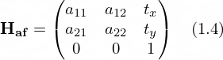
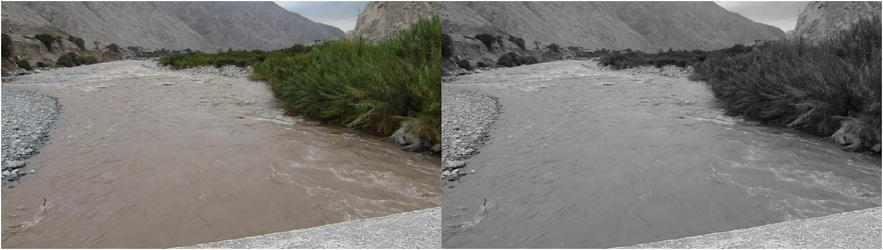
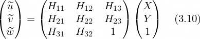

  

 

<h1 align="center">Guía práctica introductoria a la medición de caudal por imágenes</h1>
<h2 align="center">Recomendaciones para el uso de la técnica LSPIV</h2>

  

 

Versión: 1.0.0

 

  

 

*** 

Esta guía fue desarrollada en el marco del proyecto "RIVeR-LAC: Innovación en Velocimetría por Imágenes de Partículas a Gran Escala para la Gestión Hídrica", el cual fue seleccionado en la convocatoria *WMO HydroHub Innovation Call* en América Latina y el Caribe de la OMM, financiado por el Banco Interamericano de Desarrollo.

Esta guía fue revisada por miembros del *WMO HydroHub Think Tank*, la Secretaría de la OMM, el *WMO Expert Team on Hydrometry* y expertos de varios Servicios Hidrológicos Nacionales (los/as revisores/as se mencionan a continuación).

### Coordinador:

-   Antoine Patalano, ORUS y Facultad de Ciencias Exactas, Físicas y Naturales de la Universidad Nacional de Córdoba, Argentina.

### Autores:

-   Leandro Massó, ORUS y Facultad de Ciencias Exactas, Físicas y Naturales de la Universidad Nacional de Córdoba, Argentina.
-   Antoine Patalano, ORUS y Facultad de Ciencias Exactas, Físicas y Naturales de la Universidad Nacional de Córdoba, Argentina.

### Colaboradores:

-   Mariano Re, Instituto Nacional del Agua de Argentina.
-   Pablo García, Instituto Nacional del Agua de Argentina.
-   Nicolas Ortiz, Instituto Nacional del Agua de Argentina.
-   Ana Heredia Ligorria, Instituto Nacional del Agua y Facultad de Ciencias Exactas, Físicas y Naturales de la Universidad Nacional de Córdoba, Argentina.
-   María Catalina Lago, Instituto Nacional del Agua de Argentina.

### Ilustraciones:

-   Tomás G. Altamira.

### Revisores externos:

-   Johanna Korhonen, Secretariado de la OMM.
-   Cecilia Maroñas, Banco Interamericano de Desarrollo (BID).
-   Salvador Peña, WMO HydroHub Think Tank.
-   Cristina Wahrmann, Instituto Costarricense de Electricidad (ICE) y WMO HydroHub Think Tank.
-   Marco Serrano, Instituto Costarricense de Electricidad (ICE).
-   María José Torres, Instituto Costarricense de Electricidad (ICE).
-   Shawn Boyce, Instituto Caribeño de Meteorología e Hidrología (CIMH) y WMO HydroHub Think Tank.
-   James Bomhof, Water Survey of Canada, Environment and Climate Change Canada (ECCC).
-   Yirgalem Gebremichael, Secretariado de la OMM.

## **Propósito**

La presente guía tiene como objetivo proporcionar una herramienta práctica y accesible para la implementación de la técnica de Velocimetría por Imágenes de Partículas a Gran Escala (LSPIV) en la medición de caudal en cursos de agua. Está dirigida principalmente a técnicos hidrométricos que, sin necesidad de contar con experiencia previa en técnicas basadas en imágenes, puedan comprender y aplicar los conceptos y procedimientos necesarios.

El propósito principal de esta guía es reducir las barreras técnicas y operativas que enfrentan nuevos usuarios, promoviendo la adopción de LSPIV como una alternativa no intrusiva, eficiente y versátil de medición de flujo. La guía no solo aborda los fundamentos teóricos esenciales, sino que también incluye recomendaciones prácticas basadas en experiencias de campo y procesamiento de datos.

Esta guía define los lineamientos esenciales que deben cumplirse para garantizar que los datos recolectados y procesados sean capaces de superar procesos de validación independiente y controles de integridad. Sin embargo, se reconoce que cada organización puede ajustar o ampliar estas recomendaciones para adaptarlas a sus requerimientos particulares o circunstancias específicas.

## **Alcance**

Esta guía abarca el uso de LSPIV para la medición de velocidades superficiales y caudales en canales abiertos. Incluye procedimientos recomendados para la recolección y procesamiento de datos mediante herramientas de análisis de imágenes, abordando desde la planificación en campo hasta el procesamiento en gabinete (oficina).

1.  **Aplicación:** La guía detalla los pasos y consideraciones clave para obtener mediciones confiables de velocidad superficial y caudal mediante LSPIV, abarcando desde la captura de imágenes hasta el análisis de los datos procesados. Se incluyen recomendaciones sobre el manejo de equipos, la selección de sitios de medición, las técnicas de grabación y los métodos de análisis de imágenes.
2.  **Limitaciones:** Esta guía no sustituye los manuales de operación de equipos específicos ni los Procedimientos Operativos Estándar (SOP) de las organizaciones. Se espera que estos SOP estén alineados con las recomendaciones aquí presentadas.
3.  **Exclusiones:** No se promueve el uso de software, herramientas o marcas comerciales específicas. Las imágenes y ejemplos incluidos son únicamente ilustrativos y no constituyen un respaldo a productos particulares.
4.  **Evolución de la guía:** Dado el avance continuo en las metodologías de velocimetría por imágenes, esta guía se considera un documento vivo, desarrollado bajo un modelo de código abierto en un repositorio público. Esto permite la participación activa de la comunidad de usuarios en su evolución, mientras mantiene la trazabilidad de los cambios mediante un sistema de versionado claro. El proceso de contribución se detalla más adelante.

## **Descargo de Responsabilidad**

La presente guía se proporciona únicamente con fines informativos y educativos. Los autores han realizado sus mejores esfuerzos para garantizar la precisión y actualidad de la información contenida, sin embargo:

1.  Los usuarios de esta guía son los únicos responsables de la implementación de la técnica LSPIV y de los resultados obtenidos a partir de su aplicación.
2.  Los autores no asumen responsabilidad alguna por errores, omisiones o daños que pudieran resultar del uso, correcto o incorrecto, de la información contenida en esta guía.
3.  La aplicación de las técnicas y procedimientos descritos debe realizarse bajo el criterio profesional del usuario, considerando las condiciones específicas de cada sitio y las normativas locales aplicables.
4.  Los resultados obtenidos mediante la implementación de LSPIV deben ser validados de manera independiente por los usuarios antes de su utilización en cualquier proceso de toma de decisiones.
5.  El uso de esta guía no garantiza la exactitud o confiabilidad de las mediciones realizadas, siendo responsabilidad del usuario verificar la calidad de los datos obtenidos mediante métodos apropiados de control y validación.

## **Licencia y Control de Cambios**

Esta guía está licenciada bajo la licencia [Creative Commons BY-ND 4.0 (Atribución-SinDerivadas)](https://creativecommons.org/licenses/by-nd/4.0/deed.es).

- El contenido textual, las figuras, los diagramas y las imágenes están protegidos por esta licencia.  
- Eres libre de compartir y distribuir este documento, siempre que se otorgue el crédito adecuado a los autores originales.  
- No se permiten modificaciones, obras derivadas o adaptaciones de ningún tipo sin la autorización explícita de los autores.  

Para más detalles, consulta el archivo **[LICENSE.md](./LICENSE.md)** en este repositorio.

## **Proceso de Contribución y Validación**

Las contribuciones a esta guía siguen un proceso de revisión estructurado:

1.  Las modificaciones propuestas deben ser enviadas mediante solicitudes de cambio (pull requests) en el repositorio oficial.
2.  Cada contribución será revisada por al menos dos miembros del comité técnico supervisor, quienes evaluarán:

    - La precisión técnica del contenido.

    - La claridad y coherencia con el resto de la guía.

    - El cumplimiento de los estándares de formato.

    - La adherencia a las licencias establecidas.

3.  Las contribuciones aceptadas se incorporarán a la guía siguiendo el sistema de control de versiones establecido.

Los usuarios que deseen contribuir al desarrollo de esta guía deben adherirse a estas condiciones de licencia y al proceso de validación. La participación en la evolución de la guía implica la aceptación de estos términos.

## **Recomendación de uso de guía**

Para un uso adecuado de esta guía, se recomienda seguir el orden propuesto. Comience leyendo la **Introducción**, que proporciona una visión general de los principios y objetivos de la técnica. A continuación, dependiendo del tipo de grabación que se realice en el trabajo de campo, diríjase al subcapítulo correspondiente de **Trabajo de Campo** para obtener recomendaciones específicas para esa modalidad. Finalmente, continúe con el capítulo de **Etapas de procesamiento**, que detalla los procedimientos para el procesamiento y análisis de los datos obtenidos. Este orden garantiza una comprensión progresiva y coherente de todo el proceso, asegurando la calidad y consistencia de los resultados.

# Contenido

[1. Introducción](#1-introducción)  
&nbsp;&nbsp;&nbsp;&nbsp;[1.1. Técnicas de velocimetría basadas en imágenes: principio de funcionamiento](#11-técnicas-de-velocimetría-basadas-en-imágenes-principio-de-funcionamiento)  
&nbsp;&nbsp;&nbsp;&nbsp;[1.2. Velocimetría por Imágenes de Partículas a Gran Escala (LSPIV)](#12-velocimetría-por-imágenes-de-partículas-a-gran-escala-lspiv)  
&nbsp;&nbsp;&nbsp;&nbsp;[1.3. Ventajas, desventajas y preguntas usuales](#13-ventajas-desventajas-y-preguntas-usuales)  
&nbsp;&nbsp;&nbsp;&nbsp;[1.4. Organización de la guía](#14-organización-de-la-guía)  

[2. Trabajo de campo](#2-trabajo-de-campo)  
&nbsp;&nbsp;&nbsp;&nbsp;[2.1. Recomendaciones según tipo de grabación](#21-recomendaciones-según-tipo-de-grabación)  
&nbsp;&nbsp;&nbsp;&nbsp;&nbsp;&nbsp;&nbsp;&nbsp;[2.1.1. Grabación perpendicular](#211-grabación-perpendicular)  
&nbsp;&nbsp;&nbsp;&nbsp;&nbsp;&nbsp;&nbsp;&nbsp;[2.1.2. Grabación oblicua](#212-grabación-oblicua)  
&nbsp;&nbsp;&nbsp;&nbsp;&nbsp;&nbsp;&nbsp;&nbsp;[2.1.3. Estación fija](#213-estación-fija)  
&nbsp;&nbsp;&nbsp;&nbsp;[2.2. Relevamiento batimétrico](#22-relevamiento-batimétrico)  

[3. Etapas de procesamiento](#3-etapas-de-procesamiento)  
&nbsp;&nbsp;&nbsp;&nbsp;[3.1. Opciones existentes de software](#31-opciones-existentes-de-software)  
&nbsp;&nbsp;&nbsp;&nbsp;[3.2. Chequeo de datos](#32-chequeo-de-datos)  
&nbsp;&nbsp;&nbsp;&nbsp;[3.3. Flujo de trabajo](#33-flujo-de-trabajo)  
&nbsp;&nbsp;&nbsp;&nbsp;&nbsp;&nbsp;&nbsp;&nbsp;[3.3.1. Selección del intervalo de tiempo del video a procesar](#331-selección-del-intervalo-de-tiempo-del-video-a-procesar)   
&nbsp;&nbsp;&nbsp;&nbsp;&nbsp;&nbsp;&nbsp;&nbsp;[3.3.2. Extracción de imágenes](#332-extracción-de-imágenes)  
&nbsp;&nbsp;&nbsp;&nbsp;&nbsp;&nbsp;&nbsp;&nbsp;[3.3.3. Corrección de movimiento de cámara y distorsión por lente](#333-corrección-de-movimiento-de-cámara-y-distorsión-por-lente)  
&nbsp;&nbsp;&nbsp;&nbsp;&nbsp;&nbsp;&nbsp;&nbsp;[3.3.4. Rectificación: transformación de pixel a unidades de longitud](#334-rectificación-transformación-de-pixel-a-unidades-de-longitud)  
&nbsp;&nbsp;&nbsp;&nbsp;&nbsp;&nbsp;&nbsp;&nbsp;[3.3.5. Definición de secciones transversales](#335-definición-de-secciones-transversales)  
&nbsp;&nbsp;&nbsp;&nbsp;&nbsp;&nbsp;&nbsp;&nbsp;[3.3.6. Procesamiento: Aplicación de algoritmo de PIV](#336-procesamiento-aplicación-de-algoritmo-de-piv)  
&nbsp;&nbsp;&nbsp;&nbsp;&nbsp;&nbsp;&nbsp;&nbsp;[3.3.7. Estimación de caudal](#3-7-estimación-de-caudal)  

[4. Bibliografía](#4-bibliografía)  

[5. Glosario](#5-glosario)  

[6. Anexos](#5-anexos)  

# 1. Introducción

La medición precisa de caudal de cursos de agua es fundamental para una gestión eficiente de los recursos hídricos. Estos datos son útiles para la planificación de obras hidráulicas, la gestión de riesgos por inundaciones, el monitoreo del impacto ambiental, entre otros.

Tradicionalmente, se han utilizado diversas técnicas e instrumentos para medir la velocidad de corriente y el caudal. Entre ellas se destacaban los molinetes, instrumentos clásicos que, aunque confiables, requieren contacto directo con el flujo de agua con largos períodos de exposición. En las últimas tres décadas, se comenzaron a emplear técnicas hidroacústicas con instrumentos como el Velocímetro Doppler Acústico (ADV) y el Perfilador de Corriente Acústico Doppler (ADCP), que permiten obtener mediciones precisas mediante ondas acústicas. Sin embargo, el uso de estas técnicas presenta algunas limitaciones desde lo económico (la adquisición y mantenimiento de estos equipos suelen ser costosos) y la logística (ya que se requiere acceso directo al sitio de medición, lo que dificulta su operación en condiciones meteorológicas adversas o en áreas inaccesibles).

Desde lo técnico, los métodos hidroacústicos demandan un alto grado de especialización y formación del personal, especialmente en áreas remotas o con recursos limitados. Dado que el uso de técnicas intrusivas, en las que el instrumento debe estar en contacto directo con el agua, puede ser peligroso en condiciones de alto caudal y en aguas altamente contaminadas, su aplicabilidad es limitada. Además, este contacto directo puede alterar las condiciones naturales del flujo, afectando la precisión de la medición y limitando su aplicabilidad en situaciones donde la seguridad y la exactitud son críticas. Si bien algunos instrumentos de monitoreo continuo de caudal, como las estaciones de velocidad índice que utilizan medidores de velocidad acústicos Doppler o radares de velocidad superficial, pueden mitigar algunos de estos desafíos, también presentan limitaciones relacionadas con las condiciones de implementación, los requisitos de calibración y las restricciones ambientales. Otra limitación significativa de las técnicas hidroacústicas es que no permiten un monitoreo completamente autónomo, ya que aún requieren la presencia de personal en el sitio para mantenimiento y validación, lo que puede generar datos fragmentados y brechas en la cobertura temporal.

Estas restricciones subrayan la necesidad de complementar las técnicas tradicionales con métodos alternativos que sean menos costosos, menos invasivos y que ofrezcan un enfoque innovador para la medición de caudales. Lejos de desplazar lo existente, la incorporación de nuevas técnicas, como la Velocimetría por Imágenes de Partículas a Gran Escala (LSPIV), permitirá diversificar las herramientas disponibles, ampliando así la cobertura y la disponibilidad de información hidrológica relevante para la gestión eficiente de los recursos hídricos.

## 1.1 Técnicas de velocimetría basadas en imágenes: principio de funcionamiento

Una de las formas más antiguas para estimar la velocidad superficial de un flujo es el método del flotador. En este método, se lanza un objeto flotante al flujo y se mide el tiempo que tarda en recorrer una distancia conocida. La velocidad del trazador se calcula dividiendo la distancia recorrida por el tiempo medido, y se asume que el trazador se desplaza a la misma velocidad que la superficie libre del flujo. Esta técnica proporciona una estimación sencilla de la velocidad media superficial a lo largo de la línea de trayectoria del flotador ([Figura 1](#fig1)).

  

  

  

Figura 1: Esquema del flujo de trabajo. <em>Fuente:</em> Elaboración propia
  

Si se quisiera conocer con mayor resolución temporal cómo es la variación de la velocidad superficial del flujo a lo largo de la trayectoria realizada por el trazador, se podrían tomar los tiempos en que el trazador recorre distancias más pequeñas y consecutivas. Estimando así un valor de velocidad superficial medio para cada distancia definida ([Figura 2](#fig2)).

  

  

  

Figura 2: Esquema de medición de velocidad superficial por método de flotador con mayor discretización. <em>Fuente:</em> Elaboración propia
  

En lugar de definir las distancias y medir tiempos de trazador, se podría emplear un enfoque más avanzado grabando un video para registrar el movimiento del flotador. Al dividir este video en imágenes sucesivas, es posible rastrear el movimiento del trazador a lo largo de todas las imágenes. Podría considerarse que cada uno de los esquemas de la [Figura 2](#fig2) se corresponde a una de las imágenes del video (fotogramas). Esto permite un análisis continuo y detallado del movimiento del trazador.

Las técnicas de velocimetría basadas en imágenes siguen un principio similar: se utiliza una cámara para capturar una secuencia del flujo en la que presente trazadores en su superficie. Estos trazadores pueden ser propios del cuerpo de agua, añadidos artificialmente o identificarse en los patrones turbulentos de la superficie libre. A partir del procesamiento de las imágenes que surgen de esta filmación se puede estimar la velocidad superficial del flujo.

El procesamiento de estas imágenes consiste en seguir el desplazamiento de los trazadores o patrones presentes en la superficie del agua a lo largo de todas las imágenes capturadas. Las cámaras actuales tienen la capacidad de grabar a frecuencias relativamente altas, típicamente entre 30 y 60 fotogramas por segundo (FPS). Esto significa que cada segundo se captura una serie de 30 a 60 imágenes consecutivas del flujo, permitiendo observar cambios rápidos en el movimiento del agua. Además, estas cámaras también graban en resoluciones altas, como Full HD (1920×1080 pixels), 2.5K (~2560×1440 pixels) o 4K (~3840×2160 pixels), lo que se refiere a la cantidad de píxeles en cada imagen. Estas características, permiten obtener resultados con una alta resolución espacial y temporal , lo que permite un análisis muy detallado de la velocidad superficial del flujo.

Existen diversas técnicas para procesar las imágenes capturadas, y cada una utiliza su propio algoritmo para analizar el movimiento de los trazadores en el flujo. Los dos algoritmos más comunes, y también los primeros en ser desarrollados, son PTV (Velocimetría por Seguimiento de Partículas) y PIV (Velocimetría por Imágenes de Partículas).

PTV se enfoca en detectar y seguir la trayectoria de trazadores individuales, similar a seguir el recorrido de varios flotadores al mismo tiempo pero de manera automática. Esta técnica permite medir la velocidad de cada trazador a lo largo de su trayectoria específica, permitiendo calcular la variación espacial de la velocidad superficial del flujo.

Por otro lado, PIV analiza el movimiento de grupos de trazadores o patrones en pequeñas áreas del flujo conocidas como ventanas de interrogación (VI). En cada una de esas regiones se evalúa el desplazamiento medio del grupo de trazadores o del patrón mediante un algoritmo de correlación que compara imágenes consecutivas. Como resultado se obtiene un campo de velocidad superficial cuadriculado, conformado por el resultado obtenido de cada VI. Para mayor información puede consultar el [Anexo 2](#An2).

Mientras que PTV ofrece una velocidad individual para cada trazador a lo largo de su trayectoria, PIV genera un mapa completo de velocidades en la superficie del flujo, permitiendo entender cómo es la distribución en toda el área observada ([Figura 3](#fig3)).

  

  

  

Figura 3: Esquemas de resultados de los algoritmos de procesamiento. Izq.: PTV, velocidades para cada trazador identificado. Der.: PIV, campo de velocidad superficial cuadriculado.  <em>Fuente:</em> Elaboración propia
  

Originalmente, las técnicas PIV y PTV fueron desarrolladas para su uso en laboratorios, donde las condiciones de control son óptimas. Sin embargo, con el tiempo, ambas se han adaptado para ser utilizadas en campo, dando lugar a las variantes Velocimetría por Imágenes de Partículas a Gran Escala (LSPIV) y Velocimetría por Seguimiento de Partículas a Gran Escala (LSPTV). Esta adaptación ha permitido que se puedan medir velocidades superficiales y caudal en cursos fluviales y canales. Y han dado lugar al surgimiento de otras estrategias para la medición de velocidades superficiales a partir de imágenes, como la Velocimetría por Imágenes Espacio-Temporales (STIV).

Esta guía se centra en la aplicación de la técnica LSPIV, que actualmente es uno de los métodos más utilizados para la medición de caudal en cursos de agua basados en imágenes. Si bien el contenido presentado aquí es específico para LSPIV, muchas de las recomendaciones y buenas prácticas descritas también son aplicables a otras técnicas de velocimetría por imágenes. La principal diferencia radica en el método utilizado para calcular las velocidades superficiales, ya que distintos enfoques, como STIV, emplean algoritmos diferentes para obtener los campos de velocidad. A pesar de estas variaciones, los principios fundamentales relacionados con la adquisición de imágenes, el procesamiento y el control de calidad siguen siendo relevantes en múltiples técnicas.

## 1.2 Velocimetría por Imágenes de Partículas a Gran Escala (LSPIV)

El término *Large-Scale* (Gran Escala) se refiere a la capacidad de la técnica PIV de realizar mediciones en ambientes naturales, abarcando grandes áreas de flujo con condiciones que no se pueden replicar en laboratorio. Para implementar LSPIV se requiere un video en el que sea visible la superficie libre de un curso de agua, para ello son necesarios tres elementos básicos: una cámara, un flujo con trazadores en la superficie, y una fuente de iluminación adecuada ([Figura 4](#fig4)).

  

  

  

Figura 4: Esquema ejemplo elementos básicos para la implementación de LSPIV: Cámara, flujo con trazadores superficiales y fuente de iluminación.  <em>Fuente:</em> Elaboración propia
  

**Cámara:** La cámara puede ser cualquier dispositivo que capture secuencias de imágenes o video: un teléfono móvil, una cámara digital, cámaras instaladas en VANTs (Vehículos Aéreos No Tripulados) o cámaras de vigilancia, entre otras. La elección del dispositivo depende del contexto de la medición y de los recursos disponibles, pero lo esencial es que la cámara tenga una resolución suficiente (igual o mayor a FullHD) para capturar claramente el movimiento de los trazadores en el flujo, y un FPS suficiente y estable para garantizar una detección precisa del movimiento de trazadores.

Un aspecto distintivo de LSPIV, vinculado a la posición de la cámara durante la grabación, es la necesidad de transformar las unidades de pixeles a unidades de longitud. Debido a que los campos de velocidad superficial se calculan entre pares de imágenes, los resultados obtenidos quedarían expresados en unidades de pixeles por par de imágenes (por ejemplo, si los trazadores se desplazaron 5 pixeles entre una imagen y la siguiente, la velocidad quedaría expresada como 5px/par de imágenes). Para la transformación de la temporalidad se conoce el tiempo entre dos imágenes consecutivas que está en función de las características de la grabación. Mientras que para convertir de pixeles a unidades de longitud al proceso se lo conoce como *rectificación*, y puede variar en complejidad dependiendo de la posición de la cámara, lo que da lugar a diferentes casos que deben ser considerados ([Figura 5](#fig5)).

  

  

  

Figura 5: Esquemas de puntos de visual de cámara. La imagen enmarcada en rojo, ubicada a la derecha, representa la vista perpendicular, mientras que la imagen en tonos grises, en el lado izquierdo, representa la vista oblicua. <em>Fuente:</em> Elaboración propia

- *Visual perpendicular:* La cámara se encuentra perpendicular a la superficie del flujo con visual hacia abajo. Todos los píxeles del área de medición representan una misma distancia en la realidad ya que no hay distorsión por perspectiva, asumiendo una distorsión mínima de la lente. La conversión de píxeles a unidad de longitud se puede realizar si se conoce una distancia real dentro de la imagen. Por ejemplo, si en la imagen se visualiza una dimensión conocida (como el ancho de una sección), se puede establecer la relación entre píxeles y unidades de longitud. A esto se lo conoce como rectificación 1D.

- *Visual oblicua:* En el caso en que no se logre una posición perpendicular de la cámara, las imágenes presentan distorsión por perspectiva. Con una visual oblicua, la perspectiva genera que las líneas paralelas en la realidad no lo sean en la imagen y que las distancias que en la realidad son idénticas, en la imagen tengan longitudes en pixeles distintas. Es por eso que no es válido definir un único valor constante para la conversión de pixel a unidad de longitud. La rectificación en este caso implica corregir la distorsión de la perspectiva en la imagen para "alinearla" con las dimensiones reales del terreno. Para realizar este proceso es necesario conocer algunas distancias o coordenadas reales de puntos visibles en la imagen, como dimensiones de estructuras o puntos fijos en el área. Estos puntos se los denomina como Puntos de Control (CPs) en esta guía, aunque en la literatura también pueden encontrarse como Puntos de Referencia Terrestre (GRPs) o Puntos de Control Terrestres (GCPs). Para visuales oblicuas existen dos metodologías de transformación, la rectificación 2D en donde se rectifica un único plano utilizando 4 CPs (en LSPIV, es el plano de la superficie libre el flujo). O bien la rectificación 3D, en donde se utilizan al menos 6 CPs y permite la rectificación de planos a diferentes alturas, que es de utilidad en condiciones de variación del nivel de la superficie libre. En la [Figura 6](#fig6) se muestra un ejemplo de rectificación 2D, donde a partir de una imagen con distorsión por perspectiva se obtiene una imagen que simula haber sido tomada desde una posición perpendicular.

  

  

  

Figura 6: Ejemplo de rectificación de una imagen con distorsión por perspectiva utilizando los vértices del cuaderno como Puntos de Control. A) Imagen original con distrosión. B) Imagen rectificada.<em>Fuente:</em> Elaboración propia

En los Capítulos [2](#2-trabajo-de-campo) y [3](#3-etapas-de-procesamiento) se abordan los trabajos en campo y las etapas de procesamiento de video necesarias para aplicar los diferentes tipos de rectificación, y en el [Anexo 3](#An3) se presentan con mayor detalle técnico.

Además de la posición de cámara, es necesario que durante la grabación la cámara no presente vibraciones o movimientos. Si esto ocurre, el desplazamiento del flujo estimado mediante la correlación será la superposición del movimiento de los trazadores (lo buscado) y el de la cámara, lo que puede afectar negativamente los resultados de velocidad superficial. En esta guía y sus [Anexos](#An1) se presentan recomendaciones para evitar y/o mitigar estos movimientos indeseados durante la grabación.

**Iluminación:** La iluminación es otro aspecto clave. La fuente de luz más común en el campo es la luz solar que, generalmente, es adecuada para iluminar el área de medición. Sin embargo, en situaciones de poca luminosidad o en mediciones nocturnas, puede ser necesario utilizar fuentes de luz artificial para asegurar la visibilidad de los detalles en la superficie del agua.

**Trazadores superficiales:** Entre los tres elementos necesarios para la implementación de LSPIV, los trazadores son fundamentales. En el contexto de LSPIV, se denomina trazador a cualquier elemento visible que se desplaza con la superficie libre del agua, pudiendo ser este de origen natural o artificial.

1.  *Trazadores naturales:* Son patrones presentes naturalmente en la superficie libre del flujo. Pueden estar dados por presencia de espuma, residuos que arrastra el flujo, hielo, o bien ondulaciones generadas por la propia turbulencia del flujo ([Figura 7](#fig7)).

  

  

  

Figura 7: Ejemplos de tipos de trazadores naturales en superficie libre. A) Ondulaciones por turbulencia. B) Trozos de hielo. C) Residuos naturales flotantes. D) Espuma. <em>Fuente:</em> Elaboración propia

2.  *Trazadores artificiales:* Son materiales biodegradables flotantes que se añaden intencionalmente a la superficie libre del flujo, como residuos de vegetación, viruta de madera, entre otros. Su utilización se recomienda cuando el flujo no presenta trazadores naturales visibles. Esta condición (poco óptima) puede darse por alguna, o la combinación de: flujos en estiaje, flujos de muy baja velocidad, flujos transparentes en donde puede verse el material del lecho, en áreas que presenten efectos de remanso, flujos poco turbulentos. Los trazadores se arrojan al flujo aguas arriba del área de medición y se utilizan los patrones formados por ellos para implementar la técnica ([Figura 8](#fig8)).

  

  

  

Figura 8: Izq.: Ejemplo de la condición de escasez de trazadores naturales en superficie. Der.: Ejemplo de viruta de madera añadida como trazador artificial. <em>Fuente:</em> Elaboración propia

Por simplicidad, en esta guía se utilizará el término 'trazador' para referirnos a ambos tipos. Es necesario que existan trazadores visibles y bien definidos en todo el ancho del cauce para una correcta aplicación de la técnica. A lo largo de la guía se mencionan recomendaciones específicas, y para mayor detalle se recomienda la lectura del [Anexo 4](#An4).

El procesamiento de imágenes para calcular el caudal de un flujo a través de LSPIV se divide en varias etapas. Cada una de ellas es importante para asegurar que los resultados sean precisos y confiables ([Figura 9](#fig9)):

1.  **Registro**: Consiste en la grabación de un video, que luego se debe convertir en una secuencia de imágenes de temporalidad conocida.
2.  **Preprocesamiento:** Se preparan las imágenes para ser analizadas. En esta instancia se corrigen posibles distorsiones de la lente de la cámara, que afectan la precisión de las mediciones. Además, se aplican filtros a las imágenes para mejorar la visibilidad de los trazadores o patrones en la superficie del agua. Un video bien grabado, con una cámara estable y una lente de buena calidad, reduce la necesidad de un preprocesamiento extenso.
3.  **Procesamiento:** Se implementa el algoritmo de PIV para obtener los campos de velocidad superficial. Se analiza el movimiento de los trazadores entre pares de imágenes sucesivas y se calcula su desplazamiento en el tiempo. Se obtiene un campo de velocidad superficial cuasi-instantáneo para cada par de imágenes.
4.  **Postprocesamiento:** Se aplican filtros adicionales a los resultados obtenidos que ayudan a eliminar datos erróneos o atípicos (*outliers*) que puedan haberse generado durante el procesamiento. Se refinan los campos de velocidad superficial para asegurar la mejor precisión posible.
5.  **Rectificación:** Se aplica el método de transformación de unidades en pixeles a unidades de longitud, aplicando el modo de rectificación adecuado según el caso (1D, 2D o 3D). Este proceso puede realizarse antes del procesamiento de imágenes, es decir, previo al paso b), lo que permite obtener directamente los campos de velocidad superficial en unidades métricas (p. ej., m/s). Alternativamente, las imágenes pueden procesarse en su forma original y la rectificación aplicarse posteriormente sobre los campos de velocidad superficial obtenidos. En ambos casos, el procedimiento es el mismo y la elección de cuándo aplicarlo dependerá del software utilizado.
6.  **Obtención de perfil de velocidad superficial media:** Para la estimación de caudal se debe trabajar con velocidades medias temporales, para ello se realiza un promedio de los campos de velocidades superficiales obtenidos para cada par de imágenes procesadas, obteniendo el campo medio de velocidad superficial. De este campo se puede extraer la distribución de velocidad superficial a lo largo de una sección transversal (XS).
7.  **Cálculo de caudal:** Los resultados obtenidos mediante LSPIV corresponden a velocidades superficiales. Por lo tanto, para el cálculo del caudal (*Q*), es necesario convertirlas en velocidades medias en profundidad. Existen diferentes métodos para realizar esta conversión, siendo el más utilizado la corrección mediante un coeficiente alfa, que es la relación entre la velocidad media en profundidad ($V_{m}$) y la velocidad superficial ($V_{s}$). Este coeficiente varía según las características del sitio y el régimen de flujo (ver [Anexo 6](#An6) para mayores detalles), pero, asumiendo una distribución logarítmica teórica del perfil de velocidad vertical, toma un valor aproximado de 0.85.

A su vez, es necesario conocer la batimetría de la sección. Para ello se debe realizar un relevamiento topográfico de la misma y del nivel del flujo en el momento de la grabación del video utilizado. En la sección [2.2](#22-relevamiento-batimétrico) se presentan mayores detalles.

Si bien en la [Figura 9](#fig9) esquemático y simplificativo se establece $Q = V_{m} \  x \  A$, conocido el perfil de velocidad media en profundidad y la batimetría de la sección, se calcula el caudal a partir del método de la sección media o método de la sección central.

  

  

  

Figura 9: Esquema global de implementación de LSPIV para la obtención del dato de caudal. <em>Fuente:</em> Elaboración propia

LSPIV se ha consolidado como una técnica confiable y económica para la medición de caudal, mostrando una precisión comparable a métodos tradicionales, como el uso de correntómetros o técnicas hidroacústicas, en condiciones óptimas de iluminación, grabación y distribución de trazadores. Aunque su desempeño puede verse afectado en escenarios con condiciones poco favorables para la implementación de la técnica, como escasez de trazadores superficiales, malas condiciones de iluminación, presencia de viento, entre otras. La incertidumbre en la medición de caudal es del orden del 10-15% bajo condiciones aceptables para la implementación de la técnica, aunque no existen en la actualidad métodos generalizados para la determinación del error. La adecuada planificación del trabajo de campo (selección de sitio de medición, forma de grabación y relevamientos topográficos) y la implementación de técnicas complementarias, como el añadido de trazadores artificiales, permiten mitigar estas limitaciones y mantener resultados consistentes.

## 1.3 Ventajas, desventajas y preguntas usuales

A continuación, se presentan las ventajas y desventajas de la técnica LSPIV, así como algunas limitaciones prácticas que pueden influir en su implementación. Estos puntos ofrecen una visión general de los aspectos positivos y negativos de la técnica, y ayudan a comprender mejor sus aplicaciones y desafíos en el campo.

**Ventajas:**

1.  Es una técnica no intrusiva, no requiere contacto directo con el flujo.
2.  Permite mediciones precisas de velocidad y caudal.
3.  Puede implementarse con equipos de bajo costo.
4.  Es apta para mediciones en sitios de difícil acceso.
5.  Ofrece buena resolución tanto espacial como temporal.
6.  Es segura, ya que no es necesario que el operador ni el instrumento entre en contacto con el flujo.
7.  Las mediciones pueden realizarse de forma remota, sin necesidad de que el personal esté presente en el sitio.
8.  Está adaptada para condiciones de flujo altamente impermanente, como crecidas repentinas.
9.  Es apta para condiciones de flujo denso o con altas cargas de sedimento en suspensión, donde otros métodos pueden fallar.
10. No tiene restricciones de profundidad, pudiendo emplearse en flujos con tirante muy bajo, donde las técnicas hidroacústicas y clásicas no son efectivas.
11. Se obtiene un registro visual del flujo, que puede ser de utilidad para otro tipo de análisis.
12. Existe un gran volumen de videos de inundaciones recopilados por la ciencia ciudadana en redes sociales que pueden ser utilizados para análisis.
13. La velocimetría por imágenes puede utilizarse para obtener rápidamente una relación de nivel-caudal (curva HQ o clave), que puede validarse y/o refinarse con otras mediciones.

**Desventajas:**

1.  Debe haber trazadores claramente visibles en las imágenes, de lo contrario, la calidad de los resultados puede verse afectada negativamente.
2.  Los trazadores utilizados deben desplazarse a la misma velocidad que la superficie libre del flujo para obtener mediciones precisas.
3.  El viento, la lluvia y las condiciones locales de iluminación pueden afectar la visibilidad y el comportamiento de los trazadores en la superficie del flujo.
4.  Es necesario medir el área transversal del flujo para aplicar el método de velocidad de área. Esto suele hacerse previamente y debe estar sometido a un seguimiento debido a posibles cambios morfológicos en la sección. Además, es necesario conocer el nivel del agua en el momento de la medición.
5.  La relación entre velocidad superficial y velocidad media (coeficiente alfa), a utilizar en los cálculos puede ser muy variable y específica para cada sitio.
6.  Aunque existen sistemas que lo realizan de manera automática e in-situ, puede ser necesario el procesamiento en gabinete para saber el valor de caudal.

**Preguntas usuales:**

**¿Qué tipos de flujos se pueden medir?** LSPIV puede aplicarse para medir flujos de cualquier fluido que se encuentre en condiciones de superficie libre, como ríos, canales, corrientes en infraestructuras hidráulicas e incluso flujos experimentales en laboratorios. La técnica funciona mejor en flujos con trazadores naturales visibles, como espuma, burbujas o estructuras turbulentas. Sin embargo, en ausencia de trazadores naturales, es posible añadir trazadores artificiales para garantizar una textura superficial adecuada para el análisis. Es importante que los trazadores, ya sean naturales o artificiales, sean representativos del movimiento superficial del fluido para asegurar mediciones precisas. No obstante, en flujos altamente turbulentos, como en zonas cercanas a resaltos hidráulicos, suele haber una gran cantidad de trazadores naturales en la superficie, lo que facilita la aplicación de LSPIV para estimar la velocidad superficial con buena resolución. Sin embargo, debido a las intensas fluctuaciones del flujo, la conversión de velocidad superficial a velocidad media en profundidad puede presentar una mayor incertidumbre. En estos casos, la técnica debe ser cuidadosamente evaluada, ya que las variaciones en la distribución de velocidades en la columna de agua pueden afectar la precisión del cálculo del caudal. 

**¿Existen limitaciones en cuanto al tamaño de los cursos de agua a medir?** El tamaño del curso de agua puede influir en la aplicación de LSPIV, principalmente en relación con la visibilidad de los trazadores y la resolución de las imágenes. Lo importante es que el video capture todo el ancho del flujo y que los trazadores superficiales sean claramente visibles. En cursos más anchos, puede ser necesario grabar desde mayor altura, lo que podría reducir la resolución en las zonas más alejadas y afectar la precisión en la estimación de velocidades. Sin embargo, cuando se cumplen los requisitos fundamentales de la técnica, LSPIV también puede aplicarse exitosamente utilizando imágenes satelitales para ríos significativamente anchos.  

**Para la grabación de videos, ¿se necesita una cámara especial?** No, cualquier dispositivo que capture videos o secuencias de imágenes puede utilizarse. Se recomienda que tenga una resolución al menos FullHD a una frecuencia de 24 fotogramas por segundo. La gran mayoría de las cámaras del mercado, incluyendo las de teléfonos celulares, tienen prestaciones más que suficientes para ser utilizadas. Se pueden utilizar dispositivos móviles, cámaras digitales, VANTs, cámaras de vigilancia, entre otros.  

**¿Cuál es la incertidumbre de la técnica en la medición de caudal?** Actualmente, no existe un método estándar para calcular la incertidumbre en LSPIV debido a las muchas variables que influyen en la medición. Sin embargo, en condiciones óptimas, la incertidumbre se acerca a la de otras técnicas de medición de caudal como las hidroacústicas. Generalmente se le asocia un valor de entre 10 y 15%, fundamentalmente debido a la complejidad en definir el coeficiente alfa. No obstante, en condiciones favorables, si se conoce bien la relación entre la $V_{s}$ y $V_{m}$, esta incertidumbre puede reducirse, logrando valores cercanos a los obtenidos con instrumentos acústicos. En situaciones menos favorables, esta incertidumbre puede aumentar considerablemente. La cuantificación y reducción de la incertidumbre en LSPIV es actualmente un campo de investigación activo, con diversos grupos trabajando en desarrollar metodologías más robustas para su estimación.  

## 1.4 Organización de la guía

Al avanzar en esta guía, se detallarán las dos fases principales del proceso de medición de caudal mediante LSPIV: **trabajo de campo** y **etapas de procesamiento**. En el capítulo *Trabajo de campo*, se abordarán las recomendaciones y procedimientos necesarios para la correcta recopilación de datos en el sitio de medición. Posteriormente, en el capítulo *Etapas de procesamiento*, se detallarán los procesos y técnicas para el procesamiento y análisis de los datos obtenidos en el campo. Esta estructura busca guiar al lector a través de todas las etapas del proceso, desde la preparación en el sitio hasta la interpretación final de los resultados, asegurando la consistencia y la calidad de las mediciones.
Además, se incluirán anexos que abordan temas más técnicos y específicos, destinados a aquellos que deseen profundizar en aspectos más detallados del proceso y las metodologías empleadas.

&nbsp;
&nbsp;
***
&nbsp;
&nbsp;

# 2. Trabajo de campo

Este capítulo está dedicado a las recomendaciones necesarias para realizar trabajos en campo para la estimación de caudal mediante la técnica LSPIV. Aquí se proporcionan pautas claras y prácticas sobre cómo preparar y ejecutar las mediciones para obtener resultados confiables. Abarca cómo seleccionar el sitio adecuado de medición, cómo ubicar la cámara de manera correcta, y qué aspectos considerar al grabar los videos.

Para adaptar las recomendaciones a diferentes situaciones en el campo, se han clasificado las formas de grabación en tres categorías principales: *Grabación perpendicular*, *Grabación oblicua* y *Estación fija*. Esta clasificación se basa en el equipo disponible, la posición en que se puede colocar la cámara y los requerimientos específicos de cada sitio de medición. Según estos factores, varían las técnicas y los trabajos en campo necesarios para asegurar una correcta captura de imágenes y el procesamiento posterior.

**Grabación perpendicular:**

En este tipo de grabación, la cámara se coloca de forma perpendicular a la superficie del flujo, capturando las imágenes desde arriba. La forma más común de lograr esta vista es utilizando un Vehículo Aéreo No Tripulado (VANT), que se posiciona sobre el área de medición con la cámara con visual hacia abajo. Esta posición asegura que haya una distorsión mínima por perspectiva, por lo que la imagen obtenida resulta más sencilla de procesar. Para transformar los píxeles de la imagen en unidades de longitud (metros), basta con conocer una sola distancia real visible en la imagen. La rectificación 1D es suficiente para obtener resultados confiables de velocidad superficial del flujo en unidades convencionales (como metros por segundo).

  

  

  

Figura 10: Esquema de grabación perpendicular. A) Punto de grabación. B) Visual desde cámara. C) Rectificación 1D. <em>Fuente:</em> Elaboración propia

**Grabación oblicua:**

En esta modalidad, se lleva una cámara al sitio de interés, donde se posiciona temporalmente en las márgenes del río o sobre un puente sobre el cauce. Dado que la cámara está inclinada respecto a la superficie del agua, la imagen resultante presenta una distorsión por perspectiva. Para corregir esta distorsión, es necesario identificar al menos cuatro puntos de control (CPs) en el mismo plano que la superficie del agua y visibles en la imagen, cuyas coordenadas planimétricas o distancias relativas deben ser conocidas. Este tipo de rectificación, denominado rectificación 2D, es suficiente para obtener resultados confiables de velocidad superficial del flujo en unidades convencionales (como metros por segundo).

  

  

  

Figura 11: Esquema de grabación oblicua. A) Punto de grabación. B) Visual desde cámara. C) Rectificación 2D. <em>Fuente:</em> Elaboración propia

**Estación Fija:**

Este sistema permite grabar videos de un curso de agua para su monitoreo de forma automática. Consiste en una cámara que se instala de manera permanente en un punto fijo y que su funcionamiento está controlado por una mini computadora. Generalmente, la automatización de la grabación de videos está dada por el nivel de agua que es medido también de forma automática por un sensor externo.

Este sistema facilita la obtención de grabaciones sin estar presente en el sitio, ofreciendo una solución para monitoreo remoto del comportamiento de un curso de agua, siendo especialmente útil para el seguimiento de crecidas repentinas. La mayoría de las veces, la cámara se instala de manera que capture el flujo desde un ángulo oblicuo y, debido a que la posición de la cámara no cambia, se puede utilizar la rectificación 3D para corregir la distorsión por perspectiva para cualquier nivel del flujo. En este caso, se necesitan conocer las coordenadas espaciales en el terreno y en la imagen de una nube de al menos seis Puntos de Control (CPs) distribuidos homogéneamente en el espacio.

  

  

  

Figura 12: Esquema de grabación con Estación Fija. A) Punto de grabación. B) Visual desde cámara. C) Rectificación 3D. <em>Fuente:</em> Elaboración propia

*Los tres modos de grabación admiten diferentes tipos de rectificación, en la [Tabla 1](#tab1) se resumen las posibilidades y se sugieren las mejores opciones para cada caso. En el caso de querer utilizar un tipo de rectificación diferente a los sugeridos, se recomienda la lectura del [Anexo 3](#An3).*

 
Tabla 1: Tipos de rectificación admitidos según tipos de grabación.

| Tipo de Grabación | Rectificación posible | Rectificación sugerida |
|:-----------------:|:---------------------:|:----------------------:|
| Perpendicular     | 1D, 2D o 3D           | 1D                     |
| Oblicua           | 2D o 3D               | 2D                     |
| Estación fija     | 2D o 3D               | 3D                     |

## 2.1 Recomendaciones según tipo de grabación

Las recomendaciones específicas para cada tipo de grabación se vinculan con las sugerencias sobre la selección del sitio, la ubicación de la cámara, los puntos de control para la rectificación, y la grabación del video. **Estas recomendaciones deben considerarse de manera simultánea, ya que todos los aspectos están interrelacionados. No se trata de seguir un orden estricto, sino de evaluar y ajustar todas las variables en conjunto para asegurar que las mediciones sean efectivas, seguras y los resultados sean confiables.**

### 2.1.1 Grabación perpendicular

#### 2.1.1.1 Selección sitio

Las técnicas de velocimetría por imágenes no son adecuadas para todos los sitios, y los requerimientos para su selección pueden diferir de los de otras técnicas. Una adecuada selección del sitio es crucial para obtener resultados confiables y facilitar tanto el trabajo en campo como el procesamiento de videos. Las recomendaciones para la selección del sitio son:

*Vinculadas al tramo ([Figura 13](#fig13)):*

Preferir:

1.  Tramos rectos del cauce, con flujo uniforme.
2.  Tramos de fácil acceso para la ubicación de la cámara en una posición perpendicular.
3.  Tramos accesibles para la realización de relevamientos batimétricos (ver Sección 2.2) y la materialización y relevamiento de CPs.

Evitar:

4.  Tramos con obstáculos al flujo en su entorno .
5.  Tramos con presencia de resaltos hidráulicos o zonas altamente turbulentas .
6.  Tramos con presencia de vegetación ribereña abundante que disminuya el área efectiva del flujo y/o interfiera visualmente el flujo cercano a las márgenes.
7.  Tramos influenciados por mareas, efectos de remanso u otras condiciones que dificulten la cuantificación precisa del coeficiente alfa (relacionado solo con los cálculos de caudal).

  

  

  

Figura 13: Esquemas de ejemplos de selección de sitios para grabación perpendicular. A) Sitio con recirculación. B) Sitio con obstáculos. C) Sitio muy turbulento. D) Sitio recto y uniforme. <em>Fuente:</em> Elaboración propia

*Vinculadas a los trazadores y las condiciones meteorológicas ([Figura 14](#fig14) y [Figura 15](#fig15)):*

1.  Asegurar la presencia de trazadores superficiales, que deben tener una distribución homogénea en todo el ancho del cauce y estar presentes durante todo el tiempo de grabación.
2.  Evitar realizar la medición en presencia de viento que pueda afectar el movimiento natural de los trazadores superficiales. Esto es especialmente importante para mediciones en condiciones de estiaje.
3.  Evitar sitios con grandes sombras o reflejos del sol en la superficie del flujo que puedan ocultar el movimiento de los trazadores superficiales.
4.  Evitar sitios con ondulaciones estáticas de la superficie libre que no se desplazan con el flujo, como pueden ser las ondas cruzadas.
5.  Si los trazadores no se detectan claramente, considere usar una vista oblicua, ya que puede mejorar la visibilidad en ciertas condiciones.

  

  

  

Figura 14: Esquemas de ejemplos de condiciones de trazadores naturales. A) Sin trazadores visibles. B) Con trazadores visibles solo en un sector. C) Con ondas estacionarias. D) Con sombras y reflexiones. E) Con trazadores visibles y uniformes. <em>Fuente:</em> Elaboración propia

6.  En sitios con agua transparente o sin trazadores naturales visibles en la superficie del agua, será necesario utilizar trazadores artificiales. Para mayor detalle revisar el [Anexo 4](#An4).

  

  

  

Figura 15: Esquemas de ejemplos de distribución de trazadores artificiales en grabación perpendicular. A y B) Distribución heterogénea. C) Distribución homogénea. <em>Fuente:</em> Elaboración propia

*Vinculadas a la sección transversal (XS):*

1.  Definir al menos una sección transversal de estudio, aunque pueden definirse varias para mejorar la estimación del caudal mediante un promedio de los valores obtenidos en cada sección.
2.  Preferir secciones de geometría regular, evitando geometrías muy accidentadas o con mucha presencia de rocas de gran tamaño (flujos macro rugosos).
3.  Definir secciones estables y no sujetas a procesos de erosión o sedimentación significativos durante la medición.
4.  Preferir secciones en donde se cumplan la mayoría de las recomendaciones referidas al tramo del cauce de estudio, los trazadores y las condiciones meteorológicas.
5.  Demarcar en el terreno la ubicación de la sección, para que sea fácilmente localizable en las imágenes. Pueden utilizarse elementos como conos o estacas ubicados en el terreno, y que sean visibles en las imágenes ([Figura 16](#fig16)).

  

  

  

Figura 16: Esquema de materialización de localización de secciones transversales. <em>Fuente:</em> Elaboración propia

6.  Relevar la batimetría de la/s sección/es según recomendaciones dadas en [2.2](#22-relevamiento-batimétrico).
7.  Medir el nivel de la superficie libre del flujo. Si se utilizan instrumentos externos (p.ej., sensores o reglas hidrométricas), los datos deben estar referenciados al mismo datum que el relevamiento batimétrico de la sección de análisis.

#### 2.1.1.2 Ubicación de la cámara

En la grabación perpendicular, la cámara se posiciona de manera perpendicular a la superficie del flujo, lo cual se logra, en la mayoría de los casos, utilizando un VANT. Por ello, es importante en primer lugar tener en cuenta las reglamentaciones locales relacionadas con el uso de VANTs, ya que en muchos países existen normativas que restringen su operación, especialmente en áreas urbanas o cercanas a aeropuertos. Antes de realizar cualquier medición, se debe verificar el marco legal y obtener los permisos correspondientes para garantizar un uso seguro y legal del equipo.

En cuanto a recomendaciones en el sitio, se tiene:

1.  La cámara debe colocarse en una vista perpendicular para facilitar la correcta escala de los píxeles [Figura 17](#fig17). En caso de que la vista sea oblicua, redirigirse a la sección [Grabación Oblicua](#212-grabación-oblicua).

  

  

  

Figura 17: Esquema de posicionamiento de cámara en grabación perpendicular.<em>Fuente:</em> Elaboración propia

2.  El VANT debe mantenerse en una posición estable y en vuelo estacionario para reducir el movimiento de la cámara. Cualquier movimiento significativo del VANT podría afectar los resultados del análisis de velocidad [Figura 18](#fig18).

  

  

  

Figura 18: Esquemas de movimiento de VANT durante la grabación de un video con visual perpendicular. A) Desplazamientos longitudinales y/o transversales. B) Grandes desplazamientos erráticos. C) Estático o con pequeños desplazamientos sobre una posición fija. <em>Fuente:</em> Elaboración propia

3.  Asegurar que todo el ancho del cauce, incluyendo la sección transversal de interés, esté completamente contenido dentro de la imagen ([Figura 19](#fig19)).
4.  Asegurar que los Puntos de Control sean visibles dentro de la imagen (ver sección 2.1.1.3).
5.  Evitar una posición de cámara en donde la sección transversal de interés se vea muy cercana a los bordes de la imagen. Se recomienda que la sección se encuentre en el centro de la imagen ([Figura 19](#fig19)).
6.  Asegurar la ausencia de obstáculos visuales entre la cámara y el tramo del curso de agua que se desea medir, como cables aéreos, estructuras o vegetación alta que puedan obstruir la vista ([Figura 19](#fig19)).
7.  De ser necesario y posible, remover vegetación cercana a las márgenes de la sección transversal de interés para permitir que se vea el ancho completo del cauce ([Figura 19](#fig19)).

  

  

  

Figura 19: Esquemas de visión de cámara para grabación perpendicular. A) Visión con obstrucciones. B) Vegetación en las márgenes. C) Visión incompleta del ancho del cauce. D) Secciones ubicada cercanas a los bordes de la imagen. E) Visión limpia y completa del cauce. <em>Fuente:</em> Elaboración propia

7.  Verificar que los trazadores superficiales, ya sean naturales o artificiales, sean claramente visibles en las imágenes (elementos que parecen detectables a simple vista pueden no distinguirse bien en la grabación).
8.  Evitar realizar mediciones en presencia de vientos fuertes que puedan afectar la estabilidad del VANT y la calidad de la grabación ([Figura 18](#fig18)).

#### 2.1.1.3 Puntos de control

Para la rectificación 1D en grabación perpendicular se requieren dos Puntos de Control (CPs). Los CPs son puntos específicos y fácilmente identificables en la imagen, cuya posición tanto en el terreno como en la imagen conocida. Estos puntos deben ser estáticos y claramente visibles durante toda la grabación. Pueden utilizarse elementos existentes en el entorno o bien materializarse de manera temporal. La rectificación 1D es, en esencia, lo mismo que definir el tamaño del píxel en la imagen, ya que establece la relación entre las dimensiones del terreno real y su representación en la imagen. Las recomendaciones para elegir y usar los CPs son:

*Vinculadas a la elección de CPs ([Figura 20](#fig20) y [Figura 21](#fig21)):*

1.  Se deben establecer dos CPs, idealmente ubicados uno en cada margen del cauce.
2.  Los CPs deben estar a la misma altura que la superficie libre del flujo.
3.  Deben ser fácilmente identificables, con un tamaño y color que permitan su rápida localización.
4.  Los puntos deben permanecer estáticos durante toda la grabación del video, sin moverse ni cambiar de lugar.

  

  

  

Figura 20: Elementos en el terreno que pueden utilizarse como CPs.<em>Fuente:</em> Elaboración propia

  

  

  

Figura 21: Esquema de ubicación de CPs en grabación perpendicular. Izq.: Los CPs se ven muy cercanos en la imagen. Der.: CPs se ven fácilmente, están bien separados y ubicados en ambas márgenes del cauce <em>Fuente:</em> Elaboración propia

5.  Aprovechar elementos preexistentes en el sitio, como estructuras, postes, rocas, árboles, obras de arte hidráulicas, o bien materializar puntos de forma temporal utilizando estacas, conos o cuadrantes ([Figura 22](#fig22)).

  

  

  

Figura 22: Ejemplos de elementos que pueden utilizarse como CPs. A) Elementos que pueden encontrarse en el sitio. B) Ejemplos de elementos temporarios. <em>Fuente:</em> Elaboración propia

6.  Definir con precisión el CP en caso de utilizar un objeto grande, evitando ambigüedades sobre la ubicación exacta. Esto se puede lograr marcando o alineando un objeto de manera que indique con precisión la ubicación del levantamiento. Por ejemplo, si se utiliza una roca, debe ser claro qué parte exacta de la roca se está tomando como referencia.

7.  Pueden utilizarse como CPs los elementos utilizados para demarcar la ubicación de la sección transversal del interés.

*Vinculadas al relevamiento de los puntos:*

1.  Existen dos maneras de conocer las coordenadas en el terreno de los CPs, a partir de la medición directa de sus coordenadas planimétricas (*x*, *y*) o bien midiendo las distancias entre ellos. Se puede optar por una u otra en función del equipamiento disponible y los requerimientos del software a usar para el procesamiento de las imágenes (aunque su gran mayoría admite ambas formas).
2.  Si es necesario conocer las coordenadas planimétricas (*x, y*), los CPs se deben relevar utilizando instrumentos como GNSS (Global Navigation Satellite System) Diferencial o Estación Total.
3.  Si el software requiere la distancia entre los CPs, se puede obtener de dos maneras: midiendo sus coordenadas con GNSS Diferencial o Estación Total y luego calculando la distancia entre ellos, o bien midiendo la distancia de forma directa utilizando una cinta métrica, distanciómetro o nivel óptico.

#### 2.1.1.4 Grabación de video

1.  Grabar los videos con una frecuencia de al menos 24 fotogramas por segundo (FPS) para asegurar una captura adecuada del flujo.
2.  Se recomienda una resolución de píxeles de al menos 1080p (FullHD/FHD). Si la cámara permite grabar a mayor resolución, optar por la máxima. Sin embargo, para resoluciones muy altas (por ejemplo, 4K), considere el impacto en el tamaño del archivo y el tiempo de procesamiento en el análisis LSPIV.
3.  Evitar el uso de lentes con gran distorsión, por ejemplo ‘ojo de pez’ o gran angular.
4.  Se recomienda grabar un video de al menos 60 segundos una vez que el VANT se encuentre ubicado en la posición de interés, asegurando las condiciones ambientales y de trazadores superficiales. Aunque en el procesamiento se pueden utilizar fragmentos más cortos, esta duración mínima recomendada aumenta la probabilidad de contar con un segmento de buena calidad suficiente para el análisis.
5.  Asegurar que el nivel del agua se mantenga estable durante toda la grabación.

#### 2.1.1.5 Chequeos y controles

Se detalla a continuación una lista base de elementos a chequear al momento de realizar una campaña de monitoreo con grabación perpendicular:

| ✅ | Equipos                                                                                                                     |
|----|-----------------------------------------------------------------------------------------------------------------------------|
|    | VANT con baterías cargadas                                                                                                  |
|    | Batería de repuesto cargada                                                                                                 |
|    | Al menos dos elementos para materializar Puntos de Control en el sitio. Por ejemplo, estacas, conos o cuadrantes.           |
|    | Relevamiento de CPs: GNSS Diferencial, Estación Total, Nivel Óptico, distanciómetro o cinta métrica (al menos uno de ellos) |
|    | Relevamiento de sección transversal: ver requerimientos de equipos según 2.2.                                               |

>Se recomienda asentar toda la información del sitio y la grabación en una libreta de campaña. Esta podría incluir:  
>- Fecha y hora de medición.
>- Nombres de las personas que realizan la medición.
>- Localización del sitio de medición.
>-  Condiciones meteorológicas: estado general del tiempo (nubosidad, velocidad y dirección de viento, etc.).
>-  Condición hidrológica del cauce a medir.  
>-  Estado general de la sección (vegetación, presencia de residuos, etc.).
>-  Croquis del sitio, indicando dirección de escurrimiento del cauce, márgenes, ubicación de sección/es transversal/es, ubicación de CPs, información relevada de posición o distancia entre CPs.
>-  Nivel de la superficie libre del agua si hay sensores de medición externos o una regla hidrométrica disponible, y anotar si el nivel del agua está subiendo, estable o en descenso.  
>-  Cámara utilizada, nombres de archivos y los tiempos y zona horaria de los videos generados durante la medición. 
>-  Altura y otros detalles del vuelo de VANT. 
>-  Si es posible, estimaciones rápidas de velocidad de flujo y/o caudal por ejemplo por método del flotador, o bien caudal estimado por curva H-Q si hubiera en el sitio.

#### 2.1.1.6 Control de Error

Antes de retirarse del sitio de medición responda estas preguntas:

1. **¿Tiene un video grabado?**  
❌ NO → Grabar un video en el sitio  
✅ SI → Continuar  
&nbsp;
2. **¿El video es estable?**  
❌ NO → Volver a grabar, revisar movimientos del VANT y presencia de viento  
✅ SI → Continuar  
&nbsp;
3. **¿El ancho completo del cauce es visible en el video?**  
❌ NO → Cambiar posición de grabación  
✅ SI → Continuar  
&nbsp;
4. **¿Son fácilmente visibles los trazadores superficiales en el video?**  
❌ NO → Reducir la altura de vuelo del VANT o utilizar trazadores artificiales  
✅ SI → Continuar  
&nbsp;
5. **¿Son fácilmente identificables los CPs en el video?**  
❌ NO → Agregar o modificar los marcadores de los CPs  
✅ SI → Continuar  
&nbsp;
6. **¿Realizó el relevamiento de los CPs y la batimetría de al menos una sección transversal?**  
❌ NO → Realizar relevamientos necesarios  
✅ SI → Continuar  
&nbsp;
7. **¿Cuenta con el dato de nivel de superficie libre?**  
❌ NO → Medir el nivel de superficie libre  
✅ SI → Continuar  
&nbsp;
8. **¿Asentó toda la información en una libreta de campaña?**  
❌ NO → Se recomienda hacerlo  
✅ SI → ¡Listo para procesar!  

    
&nbsp;
&nbsp;

### 2.1.2 Grabación oblicua

#### 2.1.2.1 Selección sitio

Las técnicas de velocimetría por imágenes no son adecuadas para todos los sitios, y los requerimientos para la selección del sitio pueden diferir de otras técnicas. Una adecuada selección del sitio es crucial para obtener resultados confiables y facilitar tanto el trabajo en campo como el procesamiento de videos. Las recomendaciones para la selección del sitio son:

*Vinculadas al tramo ([Figura 23](#fig23)):*

Preferir:

1.  Tramos rectos del cauce, con flujo uniforme.
2.  Tramos de fácil acceso a las márgenes del cauce o a una estructura que lo cruza, como un puente o andarivel, para poder acceder a diferentes opciones de posición de cámara.
3.  Tramos accesibles para la realización de relevamientos batimétricos (ver Sección 2.2) y la materialización y relevamiento de CPs.

Evitar:

4.  Tramos con obstáculos al flujo en su entorno.
5.  Tramos con presencia de resaltos hidráulicos o zonas altamente turbulentas.
6.  Tramos con presencia de vegetación ribereña abundante que disminuya el área efectiva del flujo y/o interfiera visualmente el flujo cercano a las márgenes.
7.  Tramos influenciados por mareas, efectos de remanso u otras condiciones que dificultan la cuantificación precisa del coeficiente alfa (relacionado solo con los cálculos de caudal).

  

  

  

Figura 23: Esquemas de ejemplos de selección de sitios para grabación oblicua. A) Sitio con recirculación. B) Sitio con obstáculos. C) Sitio muy turbulento. D) Sitio recto y uniforme. <em>Fuente:</em> Elaboración propia

*Vinculadas a los trazadores y las condiciones meteorológicas ([Figura 24](#fig24) y [Figura 25](#fig25)):*

1.  Asegurar la presencia de trazadores superficiales, que deben tener una distribución homogénea en todo el ancho del cauce y estar presentes durante todo el tiempo de grabación.
2.  Evitar realizar la medición en presencia de viento que pueda afectar el movimiento natural de los trazadores superficiales. Esto es especialmente importante para mediciones en condiciones de estiaje.
3.  Evitar sitios con grandes sombras o reflejos del sol en la superficie del flujo que puedan ocultar el movimiento de los trazadores superficiales.
4.  Evitar sitios con ondulaciones estáticas de la superficie libre que no se desplazan con el flujo, como pueden ser las ondas cruzadas.

  

  

  

Figura 24: Esquemas de ejemplos de condiciones de trazadores naturales. A) Sin trazadores visibles. B) Con trazadores visibles solo en un sector. C) Con ondas estacionarias. D) Con sombras y reflexiones. E) Con trazadores visibles y uniformes. <em>Fuente:</em> Elaboración propia

5.  En sitios con agua transparente o sin trazadores naturales visibles en la superficie del agua, será necesario utilizar trazadores artificiales. Para mayor detalle revisar el [Anexo 4](#An4).

  

  

  

Figura 25: Esquemas de ejemplos de condiciones de trazadores artificiales en grabación oblicua. A y B) Distribución heterogénea. C) Distribución homogénea. <em>Fuente:</em> Elaboración propia

*Vinculadas a la sección transversal (XS):*

1.  Definir al menos una sección transversal de estudio, aunque pueden definirse varias para mejorar la estimación del caudal mediante un promedio de los valores obtenidos en cada sección.
2.  Preferir secciones de geometría regular, evitando geometrías muy accidentadas o con mucha presencia de rocas de gran tamaño (flujos macro rugosos).
3.  Definir secciones estables y no sujetas a procesos de erosión o sedimentación significativos durante la medición.
4.  Preferir secciones en donde se cumplan la mayoría de las recomendaciones referidas al tramo del cauce de estudio, los trazadores y las condiciones meteorológicas.
5.  Demarcar en el terreno la ubicación de la sección, para que sea fácilmente localizable en las imágenes. Pueden utilizarse elementos como conos o estacas ubicados en el terreno, y que sean visibles en las imágenes ([Figura 26](#fig26)).

  

  

  

Figura 26: Esquema de materialización de localización de secciones transversales. <em>Fuente:</em> Elaboración propia

6.  Relevar la batimetría de la/s sección/es según recomendaciones dadas en [2.2](#22-relevamiento-batimétrico).
7.  Medir el nivel de la superficie libre del flujo. Si se utilizan instrumentos externos (p.ej., sensores o reglas hidrométricas), los datos deben estar referenciados al mismo datum que el relevamiento batimétrico de la sección de análisis.

#### 2.1.2.2 Ubicación de la cámara

La persona encargada de la medición se debe acercar con una cámara a la zona de medición y tomar la grabación desde las márgenes del cauce o sobre una estructura que cruce el mismo (por ejemplo, un puente), o utilizando un UAV para la grabación de video oblicuo. Existen múltiples opciones de ubicación para la grabación, para la elección de una de ellas se deben tener en cuenta aspectos de seguridad, de visualización del área de flujo de interés y los trazadores, y de ubicación de CPs, orientación, altura, entre otros. Las recomendaciones generales a considerar son:

1.  Priorizar la seguridad de la persona encargada de la grabación, especialmente en situaciones de crecida o flujos de alta velocidad. Evitar ubicarse en áreas inestables, como márgenes erosionadas, piedras sueltas o estructuras deterioradas. No realizar maniobras peligrosas, como descender por terrenos empinados o cruzar el río en lugares no habilitados, con el fin de obtener una mejor grabación. Es preferible buscar un ángulo alternativo o realizar la medición desde un punto seguro, sacrificando calidad en el material registrado.

2.  Recorrer ambas márgenes del curso de agua, así como cualquier puente disponible, para analizar desde dónde se obtiene la mejor visualización, siguiendo las recomendaciones respecto a trazadores y CPs ([Figura 27](#fig27)).

  

  

  

Figura 27: Esquema de posibles ubicaciones para la grabación oblicua en un sitio. <em>Fuente:</em> Elaboración propia

3.  Facilitar la estabilidad de la cámara, utilizar algún elemento como un trípode o apoyarla sobre una superficie fija y segura. En caso contrario, se debe sostener la cámara firmemente con ambas manos para minimizar movimientos y vibraciones ([Figura 28](#fig28)).

  

  

  

Figura 28: Modos de estabilización de cámara en grabación oblicua. <em>Fuente:</em> Elaboración propia

4.  Privilegiar las zonas más elevadas con respecto a la superficie del agua como lugares de grabación, ya que se reduce la distorsión por perspectiva.
5.  Asegurar que no haya obstáculos visuales entre la cámara y el tramo del curso de agua que se desea medir, como cables aéreos, estructuras o vegetación alta que puedan obstruir la vista ([Figura 29](#fig29)). En caso de ser necesario, y si las condiciones lo permiten, se debe considerar remover vegetación o ajustar la posición de la cámara para tener una visualización clara del flujo.
6.  Asegurar que todo el ancho del cauce, incluyendo la sección transversal de interés, esté completamente contenido dentro de la imagen. Y que la sección transversal no se encuentre cercana a los bordes sino en el centro de la imagen ([Figura 29](#fig29)).
7.  Asegurar que los Puntos de Control sean visibles dentro de la imagen (ver sección 2.1.2.3).
8.  Asegurar que los trazadores superficiales sean claramente visibles en las imágenes. En grabaciones oblicuas, la visibilidad del flujo puede variar dependiendo del ángulo de grabación ([Figura 29](#fig29)).
9.  Evitar la presencia de reflejos solares sobre la superficie del agua y no grabar directamente frente al sol o fuentes de iluminación ([Figura 29](#fig29)).
10. Verificar que desde el sitio elegido se cuente con una adecuada visualización de los CPs.
11. Si se utiliza una cámara de dispositivo móvil (por ejemplo, teléfono celular) considerar que el campo de visión varía si el modo es ‘Fotografía’ o ‘Video’. En el caso de realizar pruebas, hacerlo directamente en modo ‘Video’.

  

  

  

Figura 29: Esquema con diferentes ejemplos de visualización del área de interés en grabación oblicua. A) Presencia de sombras. B) Flujo sin trazadores. C) Visual desde muy baja altura. D) Visual obstaculizada. E) Visual no completa del ancho del cauce. F) Presencia de reflexiones solares. G) Ejemplo de visual adecuada. <em>Fuente:</em> Elaboración propia

#### 2.1.2.3 Puntos de control

Para la grabación oblicua, es necesario contar con cuatro Puntos de Control (CPs). Los CPs son puntos específicos y fácilmente identificables en la imagen, cuya posición en el mundo real es conocida. Se requiere conocer las coordenadas planimétricas en el terreno de cada punto (*x*, *y*) o las seis distancias entre ellos (las dos diagonales y las cuatro perimetrales). Las recomendaciones para elegir y usar los CPs en grabaciones oblicuas son:

1.  Se deben establecer cuatro CPs, idealmente distribuidos dos por cada margen.
2.  Los CPs deben estar a la misma altura (o muy cercanos) de la superficie libre del flujo ([Figura 31](#fig31)).
3.  Deben ser fácilmente identificables, con un tamaño y color que permitan su rápida localización, incluso los más lejanos al punto de grabación ([Figura 31](#fig31)).
4.  Los CPs deben estar distribuidos en la imagen, evitando que en la misma los puntos queden alineados o muy cercanos entre ellos ([Figura 31](#fig31)).
5.  Aprovechar elementos preexistentes en el sitio, como estructuras, postes, rocas, árboles, obras de arte hidráulicas, o bien materializar puntos de forma temporal utilizando estacas, conos o cuadrantes ([Figura 30](#fig30)).

  

  

  

Figura 30: Ejemplos de elementos que pueden utilizarse como CPs. A) Elementos que pueden encontrarse en el sitio. B) Ejemplos de elementos temporarios.
 <em>Fuente:</em> Elaboración propia

6.  Definir con precisión el CP en caso de utilizar un objeto grande, evitando ambigüedades sobre la ubicación exacta. Esto se puede lograr marcando o alineando un objeto de manera que indique con precisión la ubicación del levantamiento. Por ejemplo, si se utiliza una roca, debe ser claro qué parte exacta de la roca se está tomando como referencia.
7.  Es preferible que la/s sección/es trasversal/es de interés se encuentren dentro del cuadrante limitado por los CPs, aunque no es estrictamente necesario. A su vez, pueden aprovecharse como CPs los elementos utilizados para la materialización de las secciones.

  

  

  

Figura 31: Esquemas de ejemplos de selección de CPs en grabación oblicua. A) Un CP no está a la misma altura que la superficie del agua. B) Los CPs se ven alineados. C) Un CP no es fijo. D) Adecuada elección y distribución de CPs.
 <em>Fuente:</em> Elaboración propia

*Vinculadas al relevamiento de los CPs:*

1.  Existen dos maneras de conocer las coordenadas en el terreno de los CPs, a partir de la medición directa de sus coordenadas planimétricas (*x*, *y*) o bien midiendo las distancias entre ellos. Se puede optar por una u otra en función del equipamiento disponible y los requerimientos del software a usar para el procesamiento de las imágenes (aunque su gran mayoría admite ambas formas).
2.  Si se opta por las coordenadas planimétricas, los 4 CPs deben relevarse utilizando instrumentos como GNSS Diferencial o Estación Total.
3.  Si se opta por las distancias, se deben medir las 6 distancias entre los 4 CPs (cuatro distancias perimetrales y dos diagonales). Es importante tener en cuenta que estas distancias deben ser horizontales, es por eso que es necesario que los puntos estén a la misma altura que la superficie del flujo.

#### 2.1.2.4 Grabación de video

1.  Los videos deben grabarse con una frecuencia de al menos 24 fotogramas por segundo (FPS) para asegurar una captura adecuada del flujo.
2.  Se recomienda una resolución de píxeles de al menos 1080p (FullHD/FHD). Si la cámara permite grabar a mayor resolución, optar por la máxima.
3.  Se recomienda evitar el uso de lentes con gran distorsión, por ejemplo ‘ojo de pez’ o gran angular.
4.  Una vez ubicado en la posición de grabación verificando la seguridad del lugar y un adecuado encuadre, comenzar a grabar. Recordar visualizar en el video los CPs y la/s sección/es transversal/es de estudio.
5.  Si no se utiliza un elemento de estabilización (p.ej. trípode), evitar los movimientos bruscos o de paneo. Sostener la cámara firmemente y evitar cualquier movimiento.
6.  Se recomienda grabar un video de al menos 60 segundos, asegurando las condiciones ambientales y de trazadores superficiales. Aunque en el procesamiento se pueden utilizar fragmentos más cortos, esta duración mínima recomendada aumenta la probabilidad de contar con un segmento de buena calidad suficiente para el análisis.
7.  Asegurar que el nivel del agua se mantenga estable durante toda la grabación.

#### 2.1.2.5 Chequeos y controles

Se detalla a continuación una lista base de elementos a chequear al momento de realizar una campaña de monitoreo con grabación perpendicular.

| ✅ |                                                                                                                             |
|----|-----------------------------------------------------------------------------------------------------------------------------|
|    | Cámara o dispositivo móvil con baterías cargadas                                                                            |
|    | Batería de repuesto cargada                                                                                                 |
|    | Trípode o elemento para estabilización de cámara, si es posible                                                             |
|    | Al menos cuatro elementos para materializar Puntos de Control en el sitio. Por ejemplo, estacas, conos o cuadrantes.        |
|    | Relevamiento de CPs: GNSS Diferencial, Estación Total, Nivel Óptico, distanciómetro o cinta métrica (al menos uno de ellos) |
|    | Relevamiento de sección transversal: ver requerimientos de equipos según 2.2.                                               |

> Se recomienda asentar toda la información del sitio y la grabación en una libreta de campaña. Esta podría incluir: 
>- Fecha y hora de medición. 
>- Nombres de las personas que realizan la medición.
>- Localización del sitio de medición. 
>- Condiciones climáticas: estado general del tiempo, velocidad y dirección de viento. 
>- Condición hidrológica del cauce a medir.  
>- Estado general de la sección (vegetación, presencia de residuos, etc.). 
>- Croquis del sitio, indicando dirección de escurrimiento del cauce, ubicación de sección/es transversal/es, ubicación de CPs, información relevada de posición o distancia entre CPs. 
>-  Nivel de la superficie libre del agua si hay sensores de medición externos o una regla hidrométrica disponible, y anotar si el nivel del agua está subiendo, estable o en descenso.  
>-  Cámara utilizada, nombres de archivos y los tiempos y zona horaria de los videos generados durante la medición. 
>- Si es posible, estimaciones rápidas de velocidad de flujo y/o caudal por ejemplo por método del flotador, o bien caudal estimado por curva H-Q si hubiera en el sitio. 

#### 2.1.2.6 Control de Error

Antes de retirarse del sitio de medición responda estas preguntas:

1. **¿Tiene un video grabado?**  
❌ NO → Grabar un video en el sitio  
✅ SI → Continuar  

2. **¿El video es estable?**  
❌ NO → Volver a grabar asegurando la estabilidad de la cámara.  
✅ SI → Continuar  

3. **¿El ancho completo del cauce es visible en el video?**  
❌ NO → Cambiar el punto de grabación.  
✅ SI → Continuar  

4. **¿Son fácilmente visibles los trazadores superficiales en el video?**  
❌ NO → Cambiar el punto de grabación o utilizar trazadores artificiales  
✅ SI → Continuar  

5. **¿Son fácilmente identificables los CPs en el video?**  
❌ NO → Agregar o modificar los marcadores de los CPs  
✅ SI → Continuar  

6. **¿Realizó el relevamiento de los CPs y la batimetría de al menos una sección transversal?**  
❌ NO → Realizar relevamientos necesarios  
✅ SI → Continuar  

7. **¿Cuenta con el dato de nivel de superficie libre?**  
❌ NO → Medir el nivel de superficie libre  
✅ SI → Continuar  

8. **¿Asentó toda la información en una libreta de campaña?**  
❌ NO → Se recomienda hacerlo  
✅ SI → ¡Listo para procesar!  

&nbsp;
&nbsp;

### 2.1.3 Estación fija

Una Estación Fija de LSPIV consiste en una cámara instalada de forma permanente con vista al curso de agua que se monitorea. Se completa con un gabinete eléctrico, una caja estanca de protección donde se alojan los componentes electrónicos y el hardware de la estación. Además, puede incluir una fuente de alimentación energética, como un panel solar.

En el uso de Estaciones Fijas, es importante tener en cuenta que las recomendaciones proporcionadas a continuación deben ser consideradas en función del rango de niveles de agua que se desea medir. El comportamiento del curso de agua que se monitorea puede variar considerablemente en el tiempo, debido a fluctuaciones en los niveles de agua durante eventos de crecida o estiaje. Por lo tanto, al planificar la ubicación y configuración de la cámara, es esencial asegurarse de que el área de interés se visualice con condiciones aptas para la implementación de LSPIV a lo largo del rango de niveles que se pretende monitorear. Es posible que una única ubicación y configuración de la cámara no garantice condiciones óptimas para la implementación de LSPIV en todo el rango de niveles del curso de agua. A su vez, debido a que la estación permanecerá fija en el sitio, es primordial considerar dónde se instalará, pudiendo hacerlo en estructuras existentes o bien instalando una nueva estructura en el sitio.

#### 2.1.3.1 Selección sitio

*Vinculadas al tramo a elegir:*

Preferir:

1.  Tramos rectos del cauce, con flujo uniforme.
2.  Tramos con estructuras donde pueda instalarse la Estación Fija, como postes de luz, puente, edificio cercano, etc. Caso contrario será necesario colocar en el sitio la estructura donde instalar la estación ([Figura 32](#fig32)).
3.  Tramos que cuenten con sensor de medición de nivel de agua, o bien en dónde pueda instalarse un nuevo sensor. Este dato es necesario para la automatización del funcionamiento de la Estación.
4.  Tramos que sean seguros contra el vandalismo.
5.  Tramos accesibles para la realización de relevamientos batimétricos (ver Sección [2.2](#22-relevamiento-batimétrico)).

Evitar:

1.  Tramos con obstáculos al flujo en su entorno.
2.  Tramos con presencia de resaltos hidráulicos o zonas altamente turbulentas en el rango de niveles de agua de interés.
3.  Tramos influenciados por mareas, efectos de remanso u otras condiciones que dificulten la cuantificación precisa del coeficiente alfa (relacionado solo con los cálculos de caudal).

  

  

  

Figura 32: Esquema de ejemplo de una Estación Fija instalada sobre un poste.
 <em>Fuente:</em> Elaboración propia

*Vinculadas a trazadores y condiciones meteorológicas ([Figura 33](#fig33)):*

1.  Asegurar la presencia de trazadores superficiales con distribución homogénea en todo el ancho del cauce en el rango de niveles de agua de interés.
2.  Evitar sitios con ondulaciones estáticas de la superficie libre, es decir que no se desplacen con el flujo superficial, como ondas cruzadas.
3.  Las condiciones meteorológicas podrían variar significativamente entre días y a lo largo del día. Evaluar la variación de iluminación considerando la indeseada aparición de grandes sombras o reflexiones solares sobre el área de flujo de interés.

  

  

  

Figura 33: Esquemas de ejemplos de condiciones de trazadores naturales. A) Sin trazadores visibles. B) Con trazadores visibles solo en un sector. C) Con sombras y reflexiones. D) Con trazadores visibles y uniformes.
 <em>Fuente:</em> Elaboración propia

*Vinculadas a la sección transversal (XS):*

1.  Definir al menos una sección transversal de estudio, aunque pueden definirse varias para mejorar la estimación del caudal mediante un promedio de los valores obtenidos en cada sección.
2.  Preferir secciones de geometría regular, evitando geometrías muy accidentadas o con mucha presencia de rocas de gran tamaño (flujos macro rugosos).
3.  Definir secciones estables y no sujetas a procesos de erosión o sedimentación significativos durante la medición.
4.  Preferir secciones en donde se cumplan la mayoría de las recomendaciones referidas al tramo del cauce de estudio, los trazadores y las condiciones meteorológicas.

#### 2.1.3.2 Ubicación de la cámara

1.  Instalar la cámara en una estructura firme y estable que no se vea afectada significativamente por el viento o vibraciones, especialmente si está montada en un puente ([Figura 34](#fig34)).
2.  Ubicar la cámara a una altura que permita visualizar todo el ancho del cauce, incluyendo la sección transversal de estudio, dentro del rango de niveles de agua de interés.
3.  El área de medición del flujo no debe aparecer demasiado pequeña en la imagen para el rango de niveles de interés. Esto ocurre si la cámara se encuentra muy alejada del área de medición ([Figura 34](#fig34)).
4.  La sección transversal no debe quedar cercana a los bordes de la imagen, es preferible que se encuentre centrada en el encuadre.
5.  La orientación de la cámara debe minimizar la incidencia directa de la luz solar sobre el lente, evitando que el sol esté de frente, lo que podría afectar la calidad de la imagen.
6.  No debe haber obstáculos visuales entre la cámara y el tramo del curso de agua a monitorear, como cables, estructuras o vegetación que puedan bloquear la visual. Si es necesario, y las condiciones lo permiten, se debe considerar la remoción de lo que obstruye la visión o ajustar la posición de la cámara para obtener una vista clara del flujo ([Figura 34](#fig34)).
7.  Asegurarse de que los trazadores superficiales sean claramente visibles en las imágenes en el rango de niveles de agua de interés.

  

  

  

Figura 34: Esquema con diferentes ejemplos de visualización del área de interés con Estación fija. A) Estación sobre estructura muy vacilante. B) Estación con visual obstruida. C) Estación con visual muy lejana al área de medición. D) Estación con visual clara y limpia para el rango de niveles de interés.
 <em>Fuente:</em> Elaboración propia

#### 2.1.3.3 Puntos de Control

Para realizar la rectificación en videos tomados desde una Estación Fija con una cámara montada en una posición oblicua fija, es necesario emplear un proceso de rectificación 3D. Para ello se utilizan Puntos de Control (CPs) que pueden ser elementos existentes en el entorno o bien materializarse de manera temporal. Si se instalan nuevos CPs, se recomienda que sean semipermanentes, ya que pueden ser relevados regularmente para verificar posibles desplazamientos y reutilizados en caso de que la cámara se mueva inadvertidamente. Estos puntos deben ser claramente visibles en las imágenes y deben conocerse tanto las coordenadas espaciales (*x, y ,z*) como las coordenadas en la imagen (píxeles). Se necesitan al menos seis CPs distribuidos en el área visible por la cámara. Las recomendaciones para elegir y usar los CPs son:

1.  Se deben utilizar al menos seis CPs para una rectificación adecuada. Sin embargo, se recomienda usar al menos ocho CPs, o más si es posible, ya que la inclusión de puntos adicionales proporciona mayor redundancia y mejora la precisión en caso de errores en las mediciones de coordenadas.
2.  Los CPs deben estar distribuidos uniformemente dentro del campo de visión de la cámara. Puede utilizarse un patrón de distribución zigzag, tanto horizontal como verticalmente ([Figura 35](#fig35)).
3.  Los CPs deben estar distribuidos de tal manera que cubran todo el rango de niveles de agua que se espera monitorear ([Figura 35](#fig35)).

  

  

  

Figura 35: Esquemas de distribución de CPs para rectificación 3D usando Estación Fija. A) Inadecuada distribución de CPs. B) Distribución homogénea en el espacio de los CPs.
 <em>Fuente:</em> Elaboración propia

*Vinculadas al relevamiento de los puntos:*

1.  Para la obtención de las coordenadas espaciales , es fundamental que los datos de relevamiento de los CPs tengan una precisión relativa adecuada, ya que los errores en las coordenadas espaciales pueden complicar el proceso o incluso hacerlo fallar. Se recomienda el uso de GNSS Diferencial o Estación Total.
2.  Las coordenadas de los CPs deben incluir la altitud (*z*), y todas las elevaciones deben estar referenciadas a un mismo datum. Tanto los datos de nivel del agua como los de las secciones transversales deben tener el mismo datum para garantizar la coherencia en la rectificación.
3.  Para la obtención de las coordenadas en píxeles, es fundamental la precisión en la ubicación de cada punto sobre la imagen. Para ello, se recomienda la captura de una imagen de forma simultánea al relevamiento de las coordenadas planimétricas de cada punto. Puede utilizarse un indicador de la posición del bastón de GNSS Diferencial/Estación Total para mayor precisión en puntos alejados ([Figura 36](#fig36)).

  

  

  

Figura 36: Ejemplo de indicador de posición de bastón de GNSS Diferencial durante el relevamiento de CPs.
 <em>Fuente:</em> Elaboración propia

#### 2.1.3.4 Vinculación con sensor de nivel y regla hidrométrica

Para un uso óptimo de las estaciones fijas para la medición de caudal, es fundamental contar con un dato de nivel del agua que permita automatizar el procesamiento. Este dato suele obtenerse de un sensor de nivel externo. Sin embargo, en muchas ocasiones el sensor de nivel no mide exactamente en la misma sección transversal que se utiliza para la medición del caudal. Por ejemplo, si en el sitio hay un puente el sensor puede estar ubicado sobre la estructura y la sección transversal que se visualiza desde la estación estar algunos metros aguas abajo o arriba del puente. Por lo tanto, es necesario establecer una relación entre el nivel registrado por el sensor ($H_{S}$) y el nivel en la sección de interés ($H_{X S}$) ([Figura 37](#fig37)).

Esta relación puede variar dependiendo de las condiciones hidrológicas, ya que el comportamiento del flujo en situaciones de estiaje puede ser diferente al de una crecida. Se recomienda, entonces, realizar mediciones del nivel en la sección transversal bajo distintas condiciones de flujo y vincular esos datos con los niveles medidos por el sensor. A partir de estos pares de datos, se pueden ajustar ecuaciones lineales, incluso por tramos, utilizando el método de mínimos cuadrados, lo que permitirá estimar el nivel en la sección a partir de cualquier medición del sensor de nivel.

  

  

  

Figura 37: Esquema de vinculación de sensor de nivel.
 <em>Fuente:</em> Elaboración propia

Para estimar los niveles en la sección transversal, se sugiere realizar mediciones in situ con GNSS Diferencial o Estación Total, midiendo el nivel de la superficie del agua tanto en la sección de interés como en el lugar donde se encuentra el sensor de nivel. Estas mediciones deben estar referenciadas al mismo datum que los CPs. Otra opción es aprovechar las imágenes capturadas por la estación fija para hacer una estimación visual del nivel en la sección, identificando momentos en los que el flujo alcance puntos de cota Z conocidos, como los CPs.

En aquellos sitios donde exista una regla hidrométrica histórica, es recomendable integrar todos los sistemas de medición en un único marco de referencia. Esto facilitará la estimación del nivel en la sección, en el sensor o en la regla hidrométrica, utilizando cualquiera de los otros. Para ello, durante el relevamiento topográfico, se debe incluir la posición de la regla hidrométrica en el mismo sistema de coordenadas que los CPs, asegurando la coherencia de todos los datos.

A su vez, si las condiciones del sitio y el flujo lo permiten, existen metodologías para medir el nivel de superficie libre ópticamente. Esto puede ser a partir de imágenes obtenidas por la Estación, o bien utilizar una cámara extra específica para esta tarea.

## 2.2 Relevamiento batimétrico

Se presentan algunos lineamientos para el relevamiento de secciones transversales a utilizar para el cálculo de caudal. Este proceso puede realizarse durante el mismo día de grabación de video si las condiciones del flujo lo permiten. Caso contrario, y asumiendo que la sección no está sometida a procesos de erosión/sedimentación, puede realizarse anterior o posteriormente a la grabación de video. Se recomienda complementar esta información con buenas prácticas topográficas, según el instrumental a utilizar.

1.  Las secciones transversales se escogen en función de las recomendaciones mencionadas para cada modo de grabación, y considerando la accesibilidad a las mismas.
2.  Las secciones deben ser perpendiculares a la dirección principal de escurrimiento.
3.  A lo largo de cada sección transversal, deben tomarse múltiples puntos de medición para representar adecuadamente la forma del cauce. Se recomienda aumentar la densidad de puntos en áreas con cambios abruptos en la topografía, como márgenes erosionadas o cauces con presencia de grandes rocas. Y que los puntos relevados se encuentren alineados con la dirección de la sección.
4.  El relevamiento de cada sección transversal debe abarcar desde la línea de contacto del agua en una margen hasta la línea de contacto del agua en la margen opuesta, asegurando que se capture adecuadamente todo el ancho del flujo. Es esencial especificar si el levantamiento comienza desde la margen izquierda o la margen derecha para evitar interpretaciones erróneas y garantizar la coherencia en el procesamiento de datos.
En el caso de Estaciones Fijas, es recomendable relevar un ancho mayor que incluya la parte seca de la sección transversal. Esto permite contar con información geométrica para diferentes niveles de agua y poder realizar el cálculo de caudal cuando el nivel del flujo varíe. Sin embargo, es importante considerar que el cálculo del caudal solo puede realizarse hasta la altura máxima donde se tenga información batimétrica de la sección transversal.
5.  Si el relevamiento de las secciones se realiza con el mismo instrumento con el que se relevan los CPs, realizar ambas tareas en el mismo sistema de coordenadas. Esto es imperativo en el caso de Estaciones Fijas.
6.  Los equipos que se pueden utilizar son:
    1.  GNSS Diferencial: Permite relevamiento de gran precisión y rapidez, aunque puede verse limitado su uso debajo de estructuras o zonas con mucha presencia de vegetación de gran altura.
    2.  Estación Total : Permite relevamiento de gran precisión y rapidez, puede vincularse a un sistema de coordenadas geográficas.
    3.  Nivel Óptico: La precisión puede estar condicionada por la experiencia del operador, y los tiempos de relevamiento pueden aumentar. Puede vincularse a un sistema de coordenadas geográficas.
    4.  Ecosonda/ADCP: En el caso de secciones cuya profundidad no permite el relevamiento por vadeo, puede utilizarse estos instrumentos para disponer de información allí.
    5.  Cinta métrica y varilla graduada: Si no se dispone de otros instrumentos, puede realizarse un relevamiento simple con cinta métrica para medir distancias horizontales, y una varilla graduada para las verticales.

  

  

  

Figura 38: Esquema de relevamiento batimétrico de una sección transversal.
 <em>Fuente:</em> Elaboración propia

***

# 3. Etapas de procesamiento

En este capítulo se describe el proceso de análisis y procesamiento de los datos obtenidos en campo para la medición de caudal mediante técnicas de velocimetría por imágenes. A través de estas recomendaciones, se guía al usuario desde la organización del material grabado hasta la interpretación de los resultados obtenidos. Se brindan pautas claras sobre el uso de software especializado, la corrección de las imágenes y la implementación de algoritmos de velocimetría por imágenes. Además, se destacan las buenas prácticas para optimizar la precisión de las mediciones, abordando las posibles dificultades que puedan surgir durante el procesamiento.

El flujo de trabajo abordado en este capítulo comprende las siguientes etapas:

1.  **Selección del software:** identificación de herramientas adecuadas para el procesamiento.
2.  **Chequeo de datos:** verificación de los archivos y formatos necesarios.
3.  Flujo de trabajo: procesamiento del video para el cálculo del caudal, que incluye
    1.  **Selección del intervalo de tiempo del video**
    2.  **Corrección de movimiento de cámara y distorsión por lente**
    3.  **Rectificación**
    4.  **Aplicación del algoritmo de PIV**
    5.  **Estimación de caudal**

## 3.1 Opciones existentes de software

Existen diversas opciones de software disponibles para procesar las grabaciones y estimar el caudal mediante LSPIV ([Tabla 2](#tab2)). Aunque cada software puede tener particularidades en su interfaz y funcionalidades, la mayoría comparte las mismas etapas fundamentales de procesamiento. En algunos casos, el orden en el que estas etapas se realizan puede variar según el software, pero el flujo de trabajo general es similar. El proceso incluye:

1.  Selección del rango de tiempo del video a procesar.
2.  Extracción de imágenes.
3.  Pre-procesamiento: corrección de movimiento, corrección de distorsión por lente, aplicación de filtro de mejora de imagen.
4.  Procesamiento: aplicación de algoritmos de PIV.
5.  Post-procesamiento: aplicación de filtros sobre resultados.
6.  Rectificación.
7.  Cálculo de perfil de velocidades sobre sección transversal y estimación de caudal.

En la [Tabla 2](#tab2), se presenta una lista con algunas de las principales opciones de software disponibles para la implementación de LSPIV.

 
Tabla 2: Softwares disponibles para la implementación de la técnica LSPIV. (\*) Utilizan algoritmos de correlación para el cálculo de velocidad superficial, pero no estrictamente PIV.

| **Software**             | **Licencia**        | **Funcionalidades principales**                                                                                                                                                  | **Interfaz disponible**    |
|--------------------------|--------------------|--------------------------------------------------------------------------------------------------------------------------------------------------------------------|----------------------------|
| **[RIVeR](https://github.com/oruscam/RIVeR)**                | Código abierto                      | Extracción de imágenes Correcciones de pre-procesamiento Cálculo de velocidad superficial Filtros de post-procesamiento Rectificación 1D, 2D y 3D Cálculo de caudal                          | Gráfica y línea de comando |
| **[OpenRiverCam](https://localdevices.github.io/pyorc/)**         | Código abierto                      | Extracción de imágenes Correcciones de pre-procesamiento Cálculo de velocidad superficial Filtros de post-procesamiento Rectificación 1D, 2D y 3D Cálculo de caudal                          | Línea de comando           |
| **[FUDAA-LSPIV](https://riverhydraulics.riverly.inrae.fr/outils/logiciels-pour-la-mesure/fudaa-lspiv)**          | Código abierto                      | Extracción de imágenes Correcciones de pre-procesamiento Cálculo de velocidad superficial Filtros de post-procesamiento Rectificación 1D, 2D y 3D Cálculo de caudal                          | Gráfica y línea de comando |
| **[PIVLab](https://www.pivlab.de/)**               | Código abierto                      | Correcciones de pre-procesamiento Cálculo de velocidad superficial Filtros de post-procesamiento Rectificación 1D                                                                            | Gráfica y línea de comando |
| **[DischargeApp](https://www.photrack.ch/developments.html) (\*)**    | Aplicación para teléfonos celulares | Extracción de imágenes Correcciones de pre-procesamiento Cálculo de velocidad superficial Filtros de post-procesamiento Rectificación 2D Cálculo de caudal                                   | Gráfica (Android)          |
| **[DischargeLab](https://www.photrack.ch/developments.html) (\*)**    | Propietario                         | Extracción de imágenes Correcciones de pre-procesamiento Cálculo de velocidad superficial Filtros de post-procesamiento Rectificación 3D Cálculo de caudal                                   | Gráfica                    |
| **[DischargeKeeper](https://www.photrack.ch/developments.html) (\*)** | Propietario                         | Específico para Estaciones fijas  Extracción de imágenes Correcciones de pre-procesamiento Cálculo de velocidad superficial Filtros de post-procesamiento Rectificación 3D Cálculo de caudal | Gráfica                    |
| **[KLT-IV](https://sourceforge.net/projects/klt-iv/) (\*)**          | Ejecutable libre                    | Extracción de imágenes Correcciones de pre-procesamiento Cálculo de velocidad superficial Filtros de post-procesamiento Rectificación 1D, 2D y 3D Cálculo de caudal                          | Gráfica                    |

## 3.2 Chequeo de datos

Antes de iniciar el procesamiento de las grabaciones para la estimación de velocidad superficial y caudal mediante técnicas de velocimetría por imágenes, es fundamental verificar que se cuente con todos los archivos necesarios y en los formatos adecuados. Estos incluyen:

-   Archivo de video
-   Puntos de Control
-   Batimetría de sección transversal y nivel de agua
-   Valores de velocidad y/o caudal de referencia

Aunque los formatos y tipos de archivos pueden variar según el software utilizado, se presenta una lista de verificación con las formas más comunes. Es importante que el usuario consulte los manuales específicos de cada software para asegurarse de cumplir con los requisitos particulares antes de comenzar el análisis. Los datos y formatos esenciales son:

1. **Video:** En formato compatible con software a utilizar. Las extensiones más usuales son \*.mp4, \*.MOV, \*.AVI, \*.MPG, \*.MKV, entre otras. Si el video grabado está en un formato diferente, puede convertirse a uno compatible utilizando herramientas adecuadas. Se recomienda la descarga del archivo directo desde el dispositivo con el que fue grabado al ordenador en donde se procesará. Evitar transferir el archivo por redes sociales, o por medios que puedan alterar su calidad y metadatos.

2. **Puntos de Control:** Dependerá del tipo de rectificación a utilizar según el modo de grabación.
    1.  Rectificación 1D:
         1.  Distancia entre dos CPs
         2.  Archivo de texto de dos columnas con coordenadas planimétricas en terreno *x* e *y* de dos CPs (extensiones más usuales \*.txt, \*.xlsx, \*.xls, \*.csv)
     2.  Rectificación 2D:
          1.  Archivo de texto de una columna con 6 distancias entre los 4 CPs, perimetrales y diagonales. Prestar atención al orden de las distancias según requerimientos de software (extensiones más usuales \*.txt, \*.xlsx, \*.xls, \*.csv).
         1.  Archivo de texto de dos columnas con coordenadas planimétricas en terreno *x* e *y* de cuatro CPs (extensiones más usuales \*.txt, \*.xlsx, \*.xls, \*.csv).
     3.  Rectificación 3D:
          1.  Archivo de texto de cuatro columnas, en la primera un identificador de cada GRP, de la segunda a la cuarta las coordenadas *x*, *y* *z* de cada GRP, el mínimo es 6 CPs. En algunos casos se exigen dos columnas extra con las coordenadas en pixeles de los CPs (extensiones más usuales \*.txt, \*.xlsx, \*.xls, \*.csv).
3. **Batimetría:** Archivo de texto de dos columnas, la primera conteniendo las progresivas desde margen izquierda a margen derecha, y la segunda conteniendo las profundidades o elevaciones de la sección (extensiones más usuales \*.txt, \*.xlsx, \*.xls, \*.csv). Además, el nivel del agua en el momento de la medición debe proporcionarse como un valor separado.
La ubicación de las secciones generalmente puede definirse de forma manual sobre una imagen, o a través de coordenadas planimétricas del comienzo y fin de la sección. Para este último caso se necesita un archivo de texto de dos columnas con coordenadas planimétricas en terreno *x* e *y* de del comienzo y fin de la sección (extensiones más usuales \*.txt, \*.xlsx, \*.xls, \*.csv).
1. **Imagen de ayuda:** Se recomienda contar con una imagen de campo en la que los Puntos de Control (CPs) y la sección transversal estén claramente marcados. Esta referencia visual ayuda a garantizar la coherencia en el procesamiento de datos, especialmente cuando diferentes personas están involucradas en la recolección de datos en campo y en el análisis.
2. **Valores de referencia:** Si se cuenta con datos de referencias asegurar que sean comparables con los resultados obtenidos por LSPIV. Pueden ser velocidades o caudal obtenidos por otras técnicas, o caudal estimado mediante curva de descarga.

## 3.3 Flujo de trabajo

### 3.3.1 Selección del intervalo de tiempo del video a procesar

El intervalo de tiempo del video a procesar es aquel rango de tiempo que será utilizado para la estimación de velocidades superficiales y caudal, y puede ser menor a la duración total del video. Se buscará el mayor intervalo de tiempo en donde se garanticen las mejores condiciones para la aplicación de LSPIV. Para su selección se recomienda:

1.  Mirar con atención el video completo.
2.  **Descartar videos con interrupciones o problemas de grabación.** Si el video presenta fallas y es el único registro disponible, seleccionar el intervalo sin problemas y documentarlo en detalle para evaluar la calidad y la incertidumbre de los resultados.
3.  Buscar intervalos de tiempo que cumplan:
      1.  Estabilidad de cámara: que no haya movimientos bruscos, cambios de encuadre, cambios de zoom, o cambios en la posición de grabación.
      2.  Iluminación: sin variaciones significativas en la iluminación del ambiente, ni presencia de grandes sombras o reflexiones sobre la superficie del agua
      3.  Visualización de trazadores: que los trazadores en la superficie del agua se observen adecuadamente a simple vista y con una distribución homogénea en todo el ancho del cauce durante todo el intervalo de tiempo.
      4.  Puntos de Control: que todos los CPs sean claramente visibles en las imágenes.
      5.  Sección transversal: que la sección transversal de interés se pueda observar claramente en todo momento.
4.  **Considerar la duración del intervalo.** Se recomienda una duración mínima de al menos 20 segundos.
5.  **Combinar múltiples grabaciones si es necesario.** Si no es posible cumplir con la duración mínima en una sola grabación, se pueden combinar múltiples intervalos que cumplan las condiciones anteriores y promediar los resultados para obtener un único valor de caudal.
6.  **Documentar limitaciones.** En caso de no poder cumplir con el punto 4, se recomienda procesar el intervalo de tiempo disponible y documentarlo en los detalles de la medición. Esto ayudará a determinar la calidad de la medición por velocimetría de imágenes y la evaluación de su incertidumbre.
7.  **Procesar y comparar múltiples intervalos adecuados.** Si existen varios intervalos en la grabación que cumplen con estas recomendaciones, es beneficioso procesar cada uno de ellos por separado. Luego, se pueden promediar los resultados para obtener un único valor de caudal o realizar comparaciones entre ellos para evaluar la consistencia de las mediciones.

### 3.3.2 Extracción de imágenes

Una vez seleccionado el intervalo de video a procesar, el siguiente paso es extraer las imágenes que se utilizarán para la estimación de las velocidades superficiales. Esto implica determinar la resolución adecuada y la cantidad de imágenes por segundo y. Se presentan algunas recomendaciones para realizar esta tarea de manera eficiente:

1.  **Seleccionar la resolución adecuada.** La resolución de las imágenes extraídas debe ser la máxima posible, sin que esto implique un procesamiento demasiado costoso computacionalmente. Se recomienda utilizar la resolución original del video para asegurar la mayor cantidad de detalles, pero en algunos casos puede ser necesario reducirla.
2.  **Definir la cantidad de imágenes por segundo.** La cantidad máxima de imágenes por segundo que se puede extraer estará limitada por la resolución de fotogramas por segundo (FPS) con la que fue grabado el video. Las cámaras comerciales actualmente disponibles ofrecen una frecuencia predeterminada de al menos 24 FPS, que suele ser más que suficiente para la velocimetría por imágenes. Para la definición, se puede optar por extraer la totalidad de las imágenes disponibles o por reducir la cantidad de imágenes por segundo. Para esto, se define un valor conocido como "step", que establece cuántas imágenes se omitirán entre cada imagen extraída. Un step de 1 extrae todas las imágenes disponibles, mientras que un step de 2 extrae una imagen, saltea la siguiente y extrae la tercera, y así sucesivamente. Un step de 3 extrae una imagen, omite dos y luego extrae la siguiente ([Figura 39](#fig39)). Este parámetro permite ajustar el intervalo de tiempo entre imágenes (time step), que se utilizará para calcular las velocidades superficiales del flujo.
La elección del step es un proceso de prueba y error. Se recomienda que, entre dos imágenes sucesivas, los desplazamientos de los trazadores o patrones superficiales sean de algunos píxeles, generalmente entre 3 y 10 píxeles. Esto asegura que las diferencias entre las imágenes sean suficientes para detectar el movimiento, pero no tan grandes como para perder precisión. Se deben utilizar un mínimo de 10 pares de imágenes para los cálculos de velocidad y caudal.
En la [Figura 40](#fig40) se muestra un ejemplo real de un video con trazadores artificiales, donde el cuadrado rojo simula ser una ventana de interrogación. Se comparan imágenes consecutivas para diferentes valores de step. Para step 1, prácticamente no se observa desplazamiento del patrón generado por los trazadores, lo que dificulta la detección del movimiento. Para step 12, el desplazamiento es demasiado grande, lo que dificulta la correlación cruzada. En cambio, con step 3, se observa un desplazamiento de algunos píxeles, lo que lo convierte en un valor adecuado en este caso.

| 🎥 Video 20 FPS| ⬜ | ⬜ | ⬜ | ⬜ | ⬜ | ⬜ | ⬜ | ⬜ | ⬜ | ⬜ | ⬜ | ⬜ | ⬜ | ⬜ | ⬜ | ⬜ | ⬜ | ⬜ | ⬜ | ⬜ |
|------|---|---|---|---|---|---|---|---|---|---|---|---|---|---|---|---|---|---|---|---|
| Step 1| 🟨 | 🟨 | 🟨 | 🟨| 🟨 | 🟨 | 🟨 | 🟨 | 🟨 | 🟨 | 🟨 | 🟨 | 🟨 | 🟨 | 🟨 | 🟨 | 🟨 | 🟨 | 🟨 | 🟨 |
| Step 2| 🟦 |   | 🟦 |   | 🟦 |   | 🟦 |   | 🟦 |   | 🟦 |   | 🟦 |   | 🟦 |   | 🟦 |   | 🟦 |   |
| Step 3| 🟥 |   |   | 🟥 |   |   | 🟥 |   |   | 🟥 |   |   | 🟥 |   |   | 🟥 |   |   | 🟥 |   |
| Step 4| 🟩 |   |   |   | 🟩 |   |   |   | 🟩 |   |   |   | 🟩 |   |   |   | 🟩 |   |   |   |
  

Figura 39: Variación de cantidad de imágenes por segundo durante la extracción de imágenes.
 <em>Fuente:</em> Elaboración propia

  

  

  

Figura 40: Variación de cantidad de imágenes por segundo durante la extracción de imágenes. <em>Fuente:</em> Elaboración propia

3.  **Documentar el proceso de extracción.** Registrar la resolución, cantidad de imágenes por segundo, el tiempo entre dos imágenes consecutivas (time step) y cualquier ajuste o consideración especial que se haya realizado durante la extracción. Esta información es valiosa para la reproducibilidad de los resultados y para evaluar la calidad del procesamiento. Los softwares generalmente realizan esta tarea de manera automática.

> 
 ⚠️ <strong>Control de Error</strong> ⚠️ 
  
> 
> *Una vez extraídas las imágenes, hacer un recorrido visual de todas ellas para verificar que el proceso se realizó correctamente. Chequear que la cantidad de imágenes y resolución sea la adecuada y que no existan imágenes con problemas de extracción como varias imágenes idénticas o imágenes pixeladas.*
>  

### 3.3.3 Corrección de movimiento de cámara y distorsión por lente

La instancia de corrección y estabilización de imágenes consiste en corregir cualquier movimiento involuntario de la cámara durante la grabación, así como posibles distorsiones causadas por el lente utilizado. Ambas correcciones no son siempre necesarias, dependerá de las condiciones de grabación. Aquí se presentan comentarios generales sobre ambas correcciones, mientras que en el [Anexo 1](#An1) se podrá encontrar mayor detalle técnico.

**Corrección de movimiento:** Si durante la grabación hubo movimientos no intencionales de la cámara, es importante estabilizar las imágenes antes de continuar. Muchos softwares de procesamiento ofrecen herramientas automáticas para corregir estos movimientos, alineando las imágenes en base a puntos fijos en el escenario. Una forma sencilla de verificar si la secuencia de imágenes presenta movimiento es colocar el cursor sobre un elemento fijo en el terreno, como un CP. Luego, sin mover el cursor, recorre visualmente todas las imágenes. Si en algún momento el cursor deja de coincidir con la posición del elemento fijo, significa que hay movimiento en la secuencia y es necesario corregirlo ([Figura 41](#fig41)).

Revise la documentación del software que está utilizando para conocer cómo ejecutar el proceso de corrección de movimiento. Es fundamental que en las imágenes se identifiquen elementos estáticos, como las márgenes del río, y que no haya movimientos en esas áreas (por ejemplo, vegetación movida por el viento). Asegúrese de que después de la corrección, los CPs permanezcan visibles y correctamente posicionados en cada imagen.

  

  

  

Figura 41: Corrección de movimiento de cámara en secuencia de imágenes extraídas de un video. Arriba: Secuencia de imágenes con movimiento de cámara. Abajo: Secuencia de imágenes con movimiento corregido. <em>Fuente:</em> Elaboración propia

**Corrección de distorsión por lente:** Algunas lentes de cámaras, en especial la gran angular o aquellas con efecto 'ojo de pez', pueden introducir distorsiones geométricas en las imágenes, deformando el campo de visión. Si estas distorsiones son significativas, deben corregirse antes de continuar con el procesamiento. Un método sencillo para identificar visualmente si existen distorsiones por lente es observar si hay elementos que deberían ser rectos y se ven curvados, especialmente cerca de los bordes de las imágenes ([Figura 42](#fig42)).

Generalmente, los softwares de LSPIV incluyen opciones para aplicar modelos de corrección de lente, basados en la información técnica de la cámara utilizada. En algunos casos, puede ser necesario ingresar manualmente los parámetros de la lente (como la distancia focal, tipo de lente, etc.) para obtener mejores resultados. Si es necesario aplicar esta corrección, consulte el manual del software que está utilizando y/o el [Anexo 1](#An1) para obtener más información.

  

  

  

Figura 42: Corrección de distorsión por lente. A) Imagen con distorsión ‘ojo de pez’. B) Imagen sin distorsión por lente. <em>Fuente:</em> Elaboración propia

### 3.3.4 Rectificación: transformación de pixel a unidades de longitud

En este paso, se transforma la geometría de las imágenes para convertir las distancias de píxeles a unidades de longitud (por ejemplo, metros). Existen algunos softwares que realizan la rectificación directamente sobre las imágenes antes de procesarlas, mientras que otros aplican esta corrección sobre los resultados de los campos de velocidad superficial. En ambos casos, el procedimiento es el mismo. A continuación, se detallará el proceso para rectificación según el modo de grabación del video, para mayor información recurrir al [Anexo 3](#An3).

#### 3.3.4.1 Grabación perpendicular: Rectificación 1D

Para llevar a cabo una rectificación 1D, se necesitan dos CPs visibles en la imagen. Estos puntos deben corresponder a elementos fijos en el terreno, cuya distancia real entre ellos sea conocida. Para rectificar se necesita ([Figura 43](#fig43)):

1.  Conocer las coordenadas en pixeles de los CPs: Para ello se deben ubicar ambos CPs en la imagen. Generalmente se realiza de forma manual, haciendo ‘clics’ sobre los CPs. Se recomienda usar la herramienta de zoom, si está disponible, para una mayor precisión en la ubicación de los puntos.
2.  Conocer la distancia real entre los CPs: Se debe ingresar la distancia real entre ambos puntos. Esto puede realizarse de dos formas: ingresando directamente la distancia conocida, o bien proporcionando las coordenadas planimétricas de ambos puntos, de modo que el software calcule la distancia automáticamente.

  

  

  

Figura 43: Ubicación de Puntos de Control en rectificación 1D. <em>Fuente:</em> Elaboración propia

> 
 ⚠️ <strong>Control de Error</strong> ⚠️ 
  
>
> *Si el software incluye una escala en la imagen rectificada, realice una evaluación rápida del proceso comparando la escala con una distancia conocida, como el ancho del cauce. Si las dimensiones no coinciden, es probable que haya habido un error en el proceso de rectificación.*    

   
  
> 
Figura 43b: Ejemplos de control de rectificación 1D utilizando la escala de imagen rectificada <em>Fuente:</em> Elaboración propia

#### 3.3.4.2 Grabación oblicua: Rectificación 2D

Para llevar a cabo una rectificación 2D, se necesitan cuatro CPs visibles en la imagen. Estos puntos deben corresponder a elementos fijos en el terreno, cuya distancia real entre ellos sea conocida. Para rectificar se necesita ([Figura 44](#fig44)):

1.  Conocer las coordenadas en píxeles de los CPs: Para ello se deben ubicar los 4 CPs en la imagen. Generalmente se realiza de forma manual, haciendo ‘clics’ sobre los CPs. Se recomienda usar la herramienta de zoom para mayor precisión. Aunque no es obligatorio, se sugiere seguir un orden lógico: el primer punto será aguas arriba en la margen izquierda, continuando en sentido contrario a las agujas del reloj.
2.  Conocer las coordenadas en terreno de los CPs: Se puede ingresar esta información de dos maneras: introduciendo las seis distancias entre los puntos (cuatro perimetrales y dos diagonales) o ingresando directamente las coordenadas planimétricas de los cuatro CPs.

  

  

  

Figura 44: Ubicación de CPs en rectificación 2D. <em>Fuente:</em> Elaboración propia

> 
 ⚠️ <strong>Control de Error</strong> ⚠️ 
  
> 
> *Verifique que la imagen rectificada se visualice desde una perspectiva perpendicular. Aunque los bordes pueden mostrar deformaciones, el área de interés debe visualizarse correctamente. Si la imagen está muy distorsionada, podría haber un error en la ubicación de los CPs o en las distancias ingresadas.* 
> *Si se cuenta con una escala en la imagen rectificada, realice una evaluación rápida comparándola con una distancia conocida, como el ancho del cauce. Si las dimensiones no coinciden, es probable que haya habido un error en el proceso de rectificación.* 
>   

   

>  
Figura 44b: Ejemplos de control de rectificación 2D. <em>Fuente:</em> Elaboración propia

>  

#### 3.3.4.3 Estación fija: Rectificación 3D

Para llevar a cabo una rectificación 3D, se necesitan seis CPs distribuidos homogéneamente en toda el área de interés a diferentes alturas, y que sean visibles en la imagen. Para rectificar se necesita ([Figura 45](#fig45)):

1.  Conocer las coordenadas en píxeles de los CPs: Para ello se debe ubicar cada CP en la imagen. Generalmente se realiza de forma manual, haciendo ‘clics’ sobre cada GRP. Se recomienda usar la herramienta de zoom para mayor precisión. Un orden lógico en la ubicación de los CPs ayuda a asociarlos más fácilmente con sus coordenadas espaciales.
Si las coordenadas en píxeles deben ser ingresadas a través de un archivo, se deberá utilizar otra herramienta externa para conocer las coordenadas en píxeles de cada CP y construir el archivo a ingresar.
2.  Conocer las coordenadas espaciales de los CPs: Generalmente se debe ingresar un archivo de texto con las coordenadas (*x, y, z*) y un identificador de los CPs. Es importante verificar que cada punto en la imagen esté correctamente asociado con su correspondiente coordenada en el terreno.
3.  Conocer la altura de superficie de agua: Para realizar la rectificación sobre el plano de la superficie del agua, se deberá ingresar su altura en el mismo sistema de coordenadas que los CPs.
4.  Conocer el área de interés a rectificar: En algunas ocasiones, es necesario delimitar un área específica de la imagen para ser rectificada. Esto se realiza ingresando las coordenadas espaciales de los vértices que encierran el área de interés en un polígono.

  

  

  

Figura 45: Ubicación de Puntos de Control (CPs) en rectificación 3D. <em>Fuente:</em> Elaboración propia

5.  Algunos programas incluyen una función que calcula errores de reproyección. Este indicador realiza la transformación de coordenadas de píxeles a unidades de longitud y luego vuelve a transformar esas coordenadas de unidades de longitud a píxeles. En un proceso perfecto, no debería haber diferencias entre las coordenadas originales y las reproyectadas. Sin embargo, si se detectan errores de reproyección significativos, puede ser necesario eliminar o corregir aquellos CPs que estén afectando la calidad de la rectificación. Para más detalles sobre los errores de reproyección, consulte el [Anexo 3](#An3).

> 
 ⚠️ <strong>Control de Error</strong> ⚠️ 
  
> 
> *Verifique que la imagen rectificada se visualice desde una perspectiva perpendicular. Aunque los bordes pueden mostrar deformaciones, el área de interés debe visualizarse correctamente. Si la imagen presenta distorsiones significativas, puede haber errores en las coordenadas (tanto en píxeles como en valores espaciales) de algún/os CPs. En caso de ser posible, revise los errores de reproyección de los CPs para identificar posibles problemas.*
> *Si se cuenta con una escala en la imagen rectificada, realice una evaluación rápida comparándola con una distancia conocida, como el ancho del cauce. Si las dimensiones no coinciden, es probable que haya habido un error en el proceso de rectificación.*
>     

   

>  
Figura 45b: Ejemplos de control de rectificación 3D.  <em>Fuente:</em> Elaboración propia

> 

### 3.3.5 Definición de secciones transversales

Este paso consiste en definir las secciones transversales sobre las cuales se estimará el caudal ([Figura 46](#fig46)). Las secciones deben estar ubicadas de manera precisa en la imagen para asegurar una correcta medición de las velocidades y posterior cálculo de caudal. Este proceso puede llevarse a cabo de dos formas:

**Definición manual**: En este método, las secciones transversales se ubican manualmente haciendo ‘clics’ sobre la imagen. Para mayor precisión en la ubicación de los puntos, es conveniente utilizar la herramienta de zoom, si está disponible. Se recomienda comenzar con el primer punto en la margen izquierda del cauce y luego ubicar el segundo punto en la margen derecha. Este orden facilita el seguimiento y la organización de las secciones a lo largo del cauce.

**Definición a partir de coordenadas espaciales**: Si las coordenadas espaciales de los Puntos de Control (CPs) han sido ingresadas previamente, es posible definir las secciones transversales directamente utilizando las coordenadas espaciales de los extremos de cada sección. Para que este proceso sea preciso, es importante que el sistema de coordenadas utilizado para los CPs sea el mismo que el de las secciones transversales.

  

  

  

Figura 46: Ubicación de secciones transversales para cálculo de caudal. <em>Fuente:</em> Elaboración propia

> 
 ⚠️ <strong>Control de Error</strong> ⚠️ 
  
> 
>  *Es fundamental verificar que las secciones transversales definidas abarquen correctamente todo el ancho del cauce en la imagen y que sigan un recorrido perpendicular al flujo del agua, o lo más cercano posible. Si las secciones se ubican de manera incorrecta o sesgada, los cálculos de velocidad y caudal pueden verse afectados negativamente.*    

   

>  
Figura 46b: Ejemplo de mala ubicación de sección transversal.  <em>Fuente:</em> Elaboración propia

> 

### 3.3.6 Procesamiento: Aplicación de algoritmo de PIV

En esta etapa, el objetivo principal es calcular los campos de velocidad en la superficie del agua mediante la técnica de Velocimetría por Imágenes de Partículas (PIV). Este proceso involucra varios pasos, donde se definen áreas de análisis, se optimizan las imágenes y se aplican algoritmos especializados para estimar los vectores de velocidad superficial. A lo largo de esta secuencia, es fundamental realizar controles de calidad que garanticen la precisión y minimicen los errores, asegurando un campo fiable de las velocidades superficiales de flujo. Cabe señalar que las etapas descritas a continuación pueden presentar algunas variaciones según el software utilizado. Por ello, se recomienda revisar la documentación específica de cada herramienta para asegurar una correcta aplicación del método. El flujo de trabajo general incluye (para mayor información recurrir al [Anexo 2](#An2)):

1.  **Definición de la Región de Interés (ROI):** selección de la zona del video donde se realizará el análisis.
2.  **Definición de máscaras:** exclusión de áreas irrelevantes o interferentes.
3.  **Aplicación de filtros de mejora de imagen:** optimización del contraste y la claridad de las imágenes para facilitar el análisis.
4.  **Aplicación del algoritmo de correlación cruzada (PIV):** cálculo de los desplazamientos de partículas entre imágenes consecutivas para estimar los vectores de velocidad superficial.
5.  **Aplicación de filtros de post-procesamiento:** eliminación de valores atípicos y refinamiento de los datos obtenidos.
6.  **Cálculo del campo de velocidades superficiales medias:** integración y análisis de los datos procesados para obtener el campo final de velocidades medias superficiales.

**Definición de la Región de Interés (ROI)**: La ROI es el área de la imagen que se analizará para calcular los campos de velocidad superficial, es decir, la región donde se observa el flujo de interés, excluyendo las zonas sin flujo, como los márgenes. En algunos softwares, la ROI se define automáticamente en función de las secciones transversales, mientras que en otros, es una tarea que debe realizar el usuario. En este último caso, puede definirse de distintas maneras según el software: dibujando un rectángulo sobre el área de interés o trazando un conjunto de rectángulos o polígonos si la forma del área de estudio es irregular. En ambos casos, la definición se realiza manualmente sobre una imagen.

Es crucial que todas las secciones transversales, previamente ubicadas para el análisis de caudal, queden dentro de la ROI. Sin embargo, los CPs utilizados para la rectificación no necesitan estar dentro de esta área, ya que su función es exclusivamente geométrica, para corregir la imagen.

**Definición de máscaras:** Una máscara es una herramienta utilizada para excluir del análisis áreas específicas de una imagen, ocultando elementos estáticos que no forman parte del flujo de agua visible. Su propósito es garantizar que el algoritmo de PIV se enfoque exclusivamente en el movimiento de los trazadores superficiales, evitando interferencias de elementos no relevantes. Puede ocurrir que dentro de la ROI aún existan elementos estáticos que no son parte del área de flujo, y en este caso se pueden utilizar máscaras. Estos elementos pueden incluir partes de las márgenes, estructuras, rocas u otros objetos que interfieran con el flujo de agua visible en las imágenes. Las máscaras se suelen definir mediante polígonos que encierran los elementos no deseados ([Figura 47](#fig47)). Este proceso puede realizarse de forma manual, seleccionando los vértices de cada polígono haciendo clics sobre la imagen, o bien cargando archivos que contengan las coordenadas de los polígonos previamente definidos.

  

  

  

Figura 47: Definición de la Región de Interés (ROI) y máscaras. La ROI está representada por el rectángulo azul, mientras que las áreas enmascaradas se muestran en rojo. <em>Fuente:</em> Elaboración propia

> 
 ⚠️ <strong>Control de Error</strong> ⚠️ 
  
> 
> *Verificar que la Región de Interés (ROI) y las máscaras estén correctamente definidas en todas las imágenes. Si se observan diferencias o desplazamientos entre las imágenes, esto puede ser una señal de que ha habido un movimiento de la cámara durante la grabación que no ha sido corregido adecuadamente. Es importante que la ROI y las máscaras permanezcan estáticas y coherentes a lo largo de toda la secuencia de imágenes para evitar errores en el cálculo de velocidades.* 

**Aplicación de filtros de mejora de imagen:** Previo al procesamiento, se pueden aplicar filtros sobre las imágenes para mejorar la visualización de los trazadores, optimizando así el rendimiento del algoritmo de correlación cruzada en la detección de movimiento. Estos filtros sirven para resaltar las características relevantes de la imagen y reducir el ruido o elementos que puedan afectar el análisis. La mayoría de los softwares diseñados para la aplicación de LSPIV incluyen herramientas para aplicar los filtros más comunes de mejora de imagen. Se recomienda utilizar estas opciones integradas en primer lugar, ya que están optimizadas para el procesamiento de imágenes de flujo y permiten mantener un flujo de trabajo más eficiente. Entre los filtros más comunes se destacan dos (para mayor información recurrir al [Anexo 1](#An1):

Filtros de mejora de contraste: Un ejemplo de este tipo es el filtro CLAHE (Contrast Limited Adaptive Histogram Equalization), que ajusta el contraste localmente en diferentes partes de la imagen ([Figura 48](#fig48)). Este filtro es especialmente útil cuando se trabaja con trazadores naturales, ya que mejora la visibilidad de partículas o patrones que de otro modo podrían pasar desapercibidos debido a poca diferencia de contraste.

Filtro de sustracción de fondo: Este filtro resta de cada imagen la imagen promedio de la secuencia, eliminando así los elementos estáticos y destacando sólo las partes que se mueven. Es particularmente efectivo cuando se usan trazadores artificiales, ya que ayuda a aislar las partículas o marcadores que se desplazan con el flujo del agua.

La elección del tipo de filtro a utilizar es subjetiva y dependiente de la experiencia del usuario, por lo que se recomienda analizar la efectividad por prueba y error. Estos filtros pueden variar según el software utilizado, por lo que es recomendable revisar la documentación específica de cada herramienta antes de aplicarlos. Para mayor información, dirigirse al [Anexo 1](#An1)).

  

  

  

Figura 48: Ejemplo de aplicación de filtros de mejora de imagen. <em>Fuente:</em> Elaboración propia

**Aplicación del algoritmo de correlación cruzada (PIV):** El método PIV se basa en la correlación cruzada, comparando pequeñas regiones de imágenes consecutivas para detectar el desplazamiento de los trazadores o patrones superficiales. Existen varios algoritmos de correlación cruzada, los cuales pueden consultarse en el [Anexo 2](#An2). Sin embargo, todos los algoritmos comparten un concepto clave: la definición de la ventana de interrogación (VI), que es una pequeña región de la imagen donde se mide el desplazamiento de los trazadores, y la ventana de búsqueda (VB), que es la región correspondiente en la imagen consecutiva donde se busca ese desplazamiento. La correcta definición de los tamaños de estas ventanas es fundamental para la precisión de los resultados.

En algunos softwares, la VI tiene forma cuadrada y debe definirse el tamaño del lado en pixeles, tomándose el mismo para SA. Ventanas más grandes permiten capturar patrones más grandes, pero con menor resolución espacial, mientras que ventanas más pequeñas brindan mayor resolución, aunque pueden ser más sensibles a patrones menos definidos o al ruido Una práctica común es repetir la aplicación del algoritmo varias veces, reduciendo progresivamente el tamaño de las VI. Este enfoque, conocido como múltiples pasadas, permite obtener una primera estimación del campo de  superficial con ventanas grandes y luego refinarla con ventanas más pequeñas, mejorando la resolución y la calidad de los resultados (Figura 49). La optimización del tamaño de las ventanas y la cantidad de pasadas es un proceso iterativo, donde más pasos o tamaños más pequeños aumentan el tiempo de procesamiento, además de no ser garantía de mejores resultados. Un buen punto de partida es utilizar un tamaño de VI de 128px en la primera pasada y 64px en la segunda, lo que suele ser adecuado para resoluciones de imágenes usuales como FullHD o 2.5K.

  

  

  

Figura 49: Ejemplo de definición de tamaño de ventana de interrogación. <em>Fuente:</em> Elaboración propia

En otros softwares, se puede requerir definir tanto el tamaño de la VI como el de la SA. En estos casos, puede ser útil aumentar el tamaño de la VB en la dirección principal del flujo, ya que allí se espera el mayor desplazamiento de los trazadores.

Es recomendable realizar el procesamiento preliminar de un par de imágenes para verificar los resultados y ajustar los parámetros antes de procesar la secuencia de imágenes completa.

> 
 ⚠️ <strong>Control de Error</strong> ⚠️ 
  
>
> *Procesar un par de imágenes como prueba antes de aplicar el algoritmo a toda la secuencia. Si se detectan vectores de velocidad anómalos en la mayor parte del área de interés (direcciones o magnitudes incoherentes), esto puede indicar un problema con los tamaños de ventana o con los filtros de mejora de imagen. En ese caso, es necesario ajustar los parámetros y repetir la prueba. Si, después de varios intentos, no se obtienen mejoras, se puede modificar la cantidad de imágenes por segundo extraídas o bien puede suceder que los trazadores superficiales no sean adecuados para aplicar la técnica LSPIV*   

   

> 
Figura 49b: Ejemplos de control de parametrización del procesamiento. <em>Fuente:</em> Elaboración propia

**Aplicación de filtros de post-procesamiento:** Los filtros de post-procesamiento se utilizan para eliminar resultados anómalos y mejorar la coherencia de los campos de velocidad superficial obtenidos. Existen diversos tipos de filtros, que varían según el software utilizado. Se recomienda consultar el [Anexo 2](#An2) y la documentación específica del software para obtener más detalles sobre su aplicación.

Entre los filtros más comunes se encuentran los filtros espaciales, que comparan un vector velocidad con sus vecinos en términos de magnitud o dirección. Si un vector presenta variaciones significativas en relación con los vectores cercanos, se filtra por considerarse un error. Otro filtro habitual es el de coeficiente de correlación cruzada, que mide la calidad de la correlación entre imágenes consecutivas. Este coeficiente varía de 0 (sin correlación) a 1 (correlación perfecta), y valores bajos (\~\<0.5) o muy altos (\~\>0.98) pueden indicar estimaciones de velocidad poco confiables.

Existen también filtros especializados cuando se utilizan trazadores artificiales, que ayudan a detectar la presencia o ausencia de los trazadores en las imágenes, mejorando así la precisión del análisis.

**Cálculo del campo medio/mediano de velocidades:** Para cada par de imágenes procesadas, se obtiene un campo de velocidad que representa el desplazamiento superficial entre los instantes ti y ti+1, donde el intervalo temporal (ti+1 - ti) está definido por los fotogramas por segundos del video (FPS) y el paso temporal seleccionado para el análisis “step”. Para calcular el caudal, es necesario obtener el campo medio de velocidades en el tiempo. Generalmente, los softwares utilizan la media aritmética o la mediana para este cálculo, obteniendo así un valor representativo de la velocidad superficial en todo el intervalo de imágenes procesadas.

### 3.3.7 Estimación de caudal

El paso final en el flujo de trabajo del procesamiento LSPIV es la estimación del caudal a partir de los campos de velocidad superficial obtenidos. Este proceso implica la integración de los datos de velocidad con la batimetría de la sección transversal seleccionada y la aplicación de un factor de corrección de velocidad para obtener la velocidad media en profundidad. A continuación, se describen los pasos para la estimación del caudal.

**Perfil de velocidades por sección:** Se obtiene el perfil de velocidades superficiales en cada sección transversal a partir del campo medio de velocidad superficial. Es importante revisar estos perfiles para identificar posibles valores anómalos o inesperados que puedan ser eliminados si el software lo permite.

**Incorporación de batimetría:** Se ingresan los datos batimétricos correspondientes a cada sección y el nivel de superficie de agua. La batimetría se suele expresar como distancia horizontal frente a profundidades o elevaciones. Se debe asegurar que la batimetría esté correctamente alineada con la sección transversal, generalmente siguiendo la convención de margen izquierda a margen derecha. Además, los puntos de inicio y fin entre el perfil de velocidades y la batimetría deben ser coincidentes para evitar cualquier desfase.

**Interpolación/extrapolación de velocidades:** En los casos donde no se cuente con datos de velocidad en zonas cercanas a las márgenes (por ejemplo, debido a la falta de visualización en las imágenes), es posible que sea necesario realizar interpolaciones o extrapolaciones para completar el perfil. Generalmente los softwares realizan este proceso automáticamente, se puede consultar el [Anexo 5](#An5) para mayor información.

**Cálculo la velocidad media en profundidad:** Para convertir el perfil de velocidades superficiales en un perfil de velocidades medias en profundidad, es necesario definir el valor del coeficiente alfa. El valor teórico comúnmente utilizado es 0.85, basado en una distribución logarítmica de las velocidades en la vertical. Se recomienda realizar un primer cálculo con este valor, aunque existen métodos alternativos para estimar alfa de manera más precisa según la información disponible (detallados en el [Anexo 6](#An6)). Cabe destacar que alfa es el parámetro con mayor influencia en la incertidumbre del cálculo de caudal, ya que impacta directamente en la estimación final.

**Cálculo de caudal:** Finalmente, el caudal se estima integrando el perfil de velocidades en el área mojada definida por la batimetría. Esto se puede hacer utilizando el método de la sección media o central.

> 
 ⚠️ <strong>Control de Error</strong> ⚠️ 
  
>
> *Asegurar que el nivel de superficie de agua sea correcto, junto con un adecuado alineamiento del perfil de velocidades y la batimetría de la sección. Como también el filtrado de velocidades anómalas en la sección. Errores en estos aspectos impactarán negativamente en la calidad del resultado final.*

**Comparación con otras técnicas:** Si se cuenta con datos generados con otros instrumentos/técnicas, es posible realizar comparaciones para validar los resultados obtenidos:

1.  Comparación de velocidades: Al comparar los resultados de LSPIV con mediciones de velocidad obtenidas por otros métodos, es fundamental tener en cuenta que LSPIV mide velocidades superficiales, mientras que técnicas como ADCP o molinetes pueden registrar velocidades medias en profundidad o a una profundidad específica. Por lo tanto, es importante asegurarse de que las velocidades que se comparan sean equivalentes o, en su defecto, aplicar ajustes adecuados.
2.  Comparación de caudales: También es posible validar la estimación de caudal obtenida con LSPIV comparándola con mediciones de referencia. De estas comparaciones pueden surgir ajustes que mejoren la precisión del coeficiente alfa, utilizado para la conversión de velocidad superficial a velocidad media en profundidad. Este aspecto se analiza en mayor detalle en el [Anexo 6](#An6).

***

# 4. Bibliografía

**PIV:**

Adrian, R. J. (1991). Particle-imaging techniques for experimental fluid mechanics. *Annual Review of Fluid Mechanics, 23*(1), 261–304. <https://doi.org/10.1146/annurev.fl.23.010191.001401>  

Adrian, R. J. (2005). Twenty years of particle image velocimetry. *Experiments in Fluids, 39*(2), 159–169. <https://doi.org/10.1007/s00348-005-0991-7>  

Raffel, M., Willert, C. E., Wereley, S. T., & Kompenhans, J. (2007). *Particle Image Velocimetry.* Springer Berlin Heidelberg. <https://doi.org/10.1007/978-3-540-72308-0>  

**LSPIV:**

Fujita, I., & Komura, S. (1994). Application of video image analysis for measurements of river-surface flows. *Proceedings of Hydraulic Engineering*, 733–738.  

Fujita, I., Muste, M., & Kruger, A. (1998). Large-scale particle image velocimetry for flow analysis in hydraulic engineering applications. *Journal of Hydraulic Research, 36*(3), 397–414. <https://doi.org/10.1080/00221689809498626>  

Jolley, M. J., Russell, A. J., Quinn, P. F., & Perks, M. T. (2021). Considerations when applying large-scale PIV and PTV for determining river flow velocity. *Frontiers in Water, 3*(December), 1–21. <https://doi.org/10.3389/frwa.2021.709269>  

Muste, M., Ho, H. C., & Kim, D. (2011). Considerations on direct stream flow measurements using video imagery: Outlook and research needs. *Journal of Hydro-Environment Research, 5*(4), 289–300. <https://doi.org/10.1016/j.jher.2010.11.002>  

WaMSTeC. (2021). Australian Government - National Industry Guidelines for Hydrometric Monitoring PART 11: Application of Surface Velocity Methods for Velocity and Open Channel Discharge Measurements.  

**Algunos ejemplos de aplicación de LSPIV:**

Jodeau, M., Hauet, A., Paquier, A., Le Coz, J., & Dramais, G. (2008). Application and evaluation of LS-PIV technique for the monitoring of river surface velocities in high flow conditions. *Flow Measurement and Instrumentation, 19*(2), 117–127. <https://doi.org/10.1016/j.flowmeasinst.2007.11.004>  

Le Coz, J., Hauet, A., Pierrefeu, G., Dramais, G., & Camenen, B. (2010). Performance of image-based velocimetry (LSPIV) applied to flash-flood discharge measurements in Mediterranean rivers. *Journal of Hydrology, 394*(1–2), 42–52. <https://doi.org/10.1016/j.jhydrol.2010.05.049>  

Le Coz, J., Patalano, A., Collins, D., Guillén, N. F., García, C. M., Smart, G. M., Bind, J., Chiaverini, A., Le Boursicaud, R., Dramais, G., & Braud, I. (2016). Lessons learnt from recent citizen science initiatives to document floods in France, Argentina and New Zealand. *E3S Web of Conferences, 7*, 6–11. <https://doi.org/10.1051/e3sconf/20160716001>  

Leitão, J. P., Peña-Haro, S., Lüthi, B., Scheidegger, A., & Moy de Vitry, M. (2018). Urban overland runoff velocity measurement with consumer-grade surveillance cameras and surface structure image velocimetry. *Journal of Hydrology, 565*, 791–804. <https://doi.org/10.1016/j.jhydrol.2018.09.001>  

Guillén, N. F., Patalano, A., García, C. M., & Bertoni, J. C. (2017). Use of LSPIV in assessing urban flash flood vulnerability. *Natural Hazards, 87*(1), 383–394. <https://doi.org/10.1007/s11069-017-2768-8>  

Pearce, S., Ljubicic, R., Peña-Haro, S., Perks, M., Tauro, F., Pizarro, A., Dal Sasso, S. F., Strelnikova, D., Grimaldi, S., Maddock, I., Paulus, G., Plavšic, J., Prodanovic, D., & Manfreda, S. (2020). An evaluation of image velocimetry techniques under low flow conditions and high seeding densities using unmanned aerial systems. *Remote Sensing, 12*(2), 1–24. <https://doi.org/10.3390/rs12020232>  

Tauro, F., Petroselli, A., Porfiri, M., Giandomenico, L., Bernardi, G., Mele, F., Spina, D., Grimaldi, S., Pearce, S., Ljubicic, R., Peña-Haro, S., Perks, M., Pizarro, A., Dal Sasso, S. F., Strelnikova, D., Grimaldi, S., Maddock, I., Paulus, G., & Adrian, R. J. (2020). Application and evaluation of LS-PIV technique for the monitoring of river surface velocities in high flow conditions. *Flow Measurement and Instrumentation, 5*(1), 289–300. <https://doi.org/10.5194/hess-24-1429-2020>  

**Software:**

Le Coz, J., Jodeau, M., Marchand, B., & Le Boursicaud, R. (2014). Image-based velocity and discharge measurements in field and laboratory river engineering studies using the free FUDAA-LSPIV software. *River Flow*, 7.  

Patalano, A., García, C. M., & Rodríguez, A. (2017). Rectification of image velocity results (RIVeR): A simple and user-friendly toolbox for large scale water surface particle image velocimetry (PIV) and particle tracking velocimetry (PTV). *Computers and Geosciences, 109*(June), 323–330. <https://doi.org/10.1016/j.cageo.2017.07.009>  

Peña-Haro, S., Lüthi, B., Carrel, M., & Philippe, T. (2018). DischargeApp: a smart-phone app for measuring river discharge. *EGU General Assembly 2018*, Vienna.  

Perks, M. T. (2020). KLT-IV v1.0: Image velocimetry software for use with fixed and mobile platforms. *Geoscientific Model Development, 13*(12), 6111–6130. <https://doi.org/10.5194/gmd-13-6111-2020>  

Thielicke, W., & Stamhuis, E. J. (2014). PIVlab – Towards user-friendly, affordable and accurate digital particle image velocimetry in MATLAB. *Journal of Open Research Software, 2*. <https://doi.org/10.5334/jors.bl>  

Winsemius, H., Annor, F. O., Hagenaars, R., van de Giesen, N., Luxemburg, W., & Hoes, O. (2023). *Towards open access and open source software for image-based velocimetry techniques.* <https://doi.org/10.20944/preprints202308.0896.v1>  

***

# 5. Glosario

$\alpha$: Coeficiente de corrección de velocidad superficial a media en profundidad

$V_{m}$: Velocidad media en profundidad

$V_{s}$: Velocidad superficial

*x, y, z*: Coordenadas reales de un punto

ADCP: Perfilador de Corriente Acústico Doppler

ADV: Velocímetro Acústico Doppler

CPs: Puntos de Control

FPS: Fotogramas por segundo

GCPs: Puntos de Control Terrestres

GNSS: Sistema Global de Navegación por Satélite (Global Navigation Satellite System)

GRPs: Puntos de Referencia Terrestres

LSPIV: Velocimetría por Imágenes de Partículas a Gran Escala

VANT: Vehículo Aéreo No Tripulado

VI: Ventana de interrogación

VB: Ventana de búsqueda

PIV: Velocimetría por Imágenes de Partículas

PTV: Velocimetría por Seguimiento de Partículas

PTV: Velocimetría por Seguimiento de Partículas

XS: Sección transversal

*** 
# 5. Anexos

<strong>ANEXO 1: CORRECCIONES PRE-PROCESAMIENTO</strong>

<h2 style="text-align:center;">ANEXO 1: CORRECCIONES PRE-PROCESAMIENTO</h2>

## Contenido
[1. Correcciones pre-procesamiento](#1-correcciones-pre-procesamiento)  
&nbsp;&nbsp;&nbsp;&nbsp;[1.1. Corrección de movimiento de cámara](#11-corrección-de-movimiento-de-cámara)  
&nbsp;&nbsp;&nbsp;&nbsp;[1.2. Corrección de distorsión por lente](#12-corrección-de-distorsión-por-lente)  
&nbsp;&nbsp;&nbsp;&nbsp;[1.3 Filtros de mejora de imagen](#13-filtros-de-mejora-de-imagen)  

# 1. Correcciones pre-procesamiento

## 1.1. Corrección de movimiento de cámara

### 1.1.1 ¿Qué es la estabilización de imágenes y por qué es necesaria?

La estabilización de imágenes es un proceso esencial en el análisis de videos, diseñado para corregir el movimiento no deseado que puede ocurrir durante la grabación. Este movimiento puede ser causado por factores como vibraciones de la cámara, movimientos del operador, condiciones climáticas, o incluso pequeñas imperfecciones en los sistemas de montaje. Su principal objetivo es alinear las imágenes de un video para que los elementos estáticos del entorno, como el fondo o estructuras permanentes, permanezcan inmóviles a lo largo de la secuencia. Esto permite un análisis más preciso de los elementos dinámicos, como el flujo de agua o el desplazamiento de partículas. En la estabilización se corrigen movimientos indeseados de traslación, rotación y escala ([Figura A.1.1](#figA11)).

  

  

  

Figura A.1.1: El movimiento del dron se muestra superponiendo imágenes estabilizadas sobre las imágenes originales. La máscara verde visible en la fila procesada destaca la región donde la imagen estabilizada se encuentra dentro del marco, mientras que las imágenes finales estabilizadas recortan todos los bordes inestables. <em>Fuente:</em> Jolley et al. (2021)
  

En aplicaciones como la Velocimetría por Imágenes de Partículas a Gran Escala (LSPIV), la estabilización es especialmente crucial. Por ejemplo, un ligero desplazamiento angular o traslacional de la cámara puede alterar la percepción de la trayectoria de las partículas, afectando tanto la precisión de los cálculos como la confiabilidad de los resultados. Además, en contextos donde la estabilización no se realiza correctamente, los algoritmos de procesamiento de imágenes pueden confundir movimientos de la cámara con movimientos reales en el flujo, introduciendo errores significativos en los análisis.

En términos generales, la estabilización se basa en tres etapas fundamentales: la detección de características (features), el emparejamiento de estas características entre imágenes, y la transformación geométrica de las imágenes para corregir los movimientos. Cada etapa presenta desafíos técnicos y puede ser computacionalmente costosa, dependiendo de la complejidad del video y de los métodos utilizados.

Actualmente, existen diversos métodos y algoritmos para implementar la estabilización, cada uno con sus propias ventajas y limitaciones, por ejemplo Tordoff & Murry (2002), Lee et al. (2009), Litvin et al. (2003), entre otros. Si bien este anexo no busca profundizar en los aspectos técnicos más avanzados, proporciona una introducción general para que el lector se familiarice con los principios básicos y pueda explorar más a fondo las posibilidades que ofrece esta herramienta.

### 1.1.2 Detección de características (features)

Un feature es un patrón o estructura distintiva dentro de una imagen, tales como puntos, bordes esquinas o regiones de texturas únicas. Estos no necesariamente representan objetos físicos del mundo real, sino que se definen como áreas que se diferencian claramente de su entorno inmediato en términos de textura, color o intensidad.

Para la estabilización de una secuencia de imágenes es necesario detectar features en todas ellas. Para ello existen diferentes algoritmos, que buscarán features que presenten:

1.  Localización precisa: Cada feature detectada debe tener una posición bien definida en la imagen, lo que facilita su rastreo y análisis en imágenes consecutivos.
2.  Distintividad: Los features deben ser suficientemente únicos en su vecindad para permitir comparaciones confiables con otras regiones de la imagen.
3.  Repetibilidad: Un buen feature puede ser detectado consistentemente en múltiples imágenes de la misma escena, incluso bajo condiciones variables como cambios de escala, rotación, ruido o iluminación. Esto asegura que las características sean robustas frente a transformaciones y perturbaciones.

Ejemplos de características locales comunes incluyen:

1.  Esquinas: Regiones donde los bordes convergen o se cruzan.
2.  Manchas: Áreas homogéneas que sobresalen por su forma o intensidad en comparación con el entorno.
3.  Bordes: Líneas donde se producen cambios significativos en la intensidad de los píxeles.

La detección de features puede realizarse de manera manual, en donde el usuario define las regiones de la imagen que presenten las mejores características, o bien automática. Para este último caso, existen diversos algoritmos que basan su búsqueda en variaciones de intensidad y/o gradientes locales, destacando áreas que presentan cambios abruptos en la textura o intensidad. Cada uno de ellos fue diseñado para detectar diferentes tipos de features, y presenta sus propias ventajas y limitaciones. En la [Tabla A.1.1](#tabA11) se presenta algunos de los más utilizados. Se recomienda el uso de SURF y KAZE para entornos naturales, ya que pueden detectar mejor características en escenas de origen no humano, como ríos. Por el contrario, FAST, MINEIGEN, HARRIS, BRISK y ORB detectan mejor características en escenas con una clara intervención antropizada (Pizarro et al., 2022). En la [Figura A.1.2](#figA12) se muestran ejemplos de aplicaciones de estos algoritmos sobre una misma imagen.

 
Tabla A.1.1: Algoritmos de detección de features en imágenes.

| Algoritmo | Tipo de feature               | Referencia                |
|-----------|-------------------------------|---------------------------|
| FAST      | Esquina                       | Rosten et al., 2006       |
| Harris    | Esquina                       | Harris et al., 1988       |
| MSER      | Región de intensidad uniforme | Matas et al., 2002        |
| SURF      | Mancha                        | Bay et al., 2008          |
| KAZE      | Mancha                        | Alcantarilla et al., 2012 |
| BRISK     | Esquina                       | Leutenegger et al., 2011  |
| ORB       | Esquina                       | Rublee et al., 2011       |

*Fuente:* Elaboración propia

  

  

  

Figura A.1.2: Ejemplos de aplicación de algoritmos de detección de features. A) SURF, B) FAST, C) ORB. <em>Fuente:</em> Elaboración propia
  

Además de la detección de los features en sí mismos, se buscan descriptores de estos puntos característicos que actúan como ‘ID’. El cálculo de los descriptores generalmente se realiza en regiones centradas en torno a los features detectados, transformando la región cercana de pixeles en una representación vectorial compacta. Esta nueva representación permite comparar vecindarios sin importar cambios en escala u orientación. Descriptores como SIFT o SURF se basan en cálculos de gradientes locales. Los descriptores binarios, como BRISK u ORB utilizan pares de diferencias de intensidad local que luego se codifican en un vector binario.

En el caso de imágenes de cursos de agua, puede ocurrir que se detecten features sobre la superficie libre del flujo. Esto puede traer errores en el proceso de estabilización ya que estos features presentan un movimiento natural, no correspondiéndose a movimientos de la cámara. En algunos casos es necesario demarcar regiones en las que no deben buscarse features. En la [Figura A.1.3](#figA13) se muestra un ejemplo de ello.

  

  

  

Figura A.1.3: Ejemplo de detección de features sobre entorno de curso de agua. A) Resultado de búsqueda de features en imagen completa. B) Resultado de búsqueda de features enmascarando la superficie libre del flujo.
 <em>Fuente:</em> Elaboración propia
  

### 1.1.3 Emparejamiento de features entre imágenes

Luego de aplicar la detección de features y extracción de descriptores sobre dos imágenes, es necesario emparejar cada uno de los features. Esto consiste en determinar cuál de los features de una imagen es su correspondiente en la otra. A partir de este emparejamiento será posible determinar luego las variaciones en traslación, escala, rotación y deformación entre una imagen y la otra.

En el proceso de emparejamiento se utilizan los descriptores de cada feature. Características como tamaño, orientación, configuración de vecinos, son utilizadas en este caso. El emparejamiento puede llevarse a cabo utilizando métricas basadas en la similitud, como el cálculo de distancias Euclidianas, distancias de Hamming, la correlación cruzada de descriptores, etc. En la [Figura A.1.4](#figA14) se muestra un ejemplo de emparejamiento para una imagen que ha sido escalda y rotada.

  

  

  

Figura A.1.4: Ejemplo de emparejamiento de features.
 <em>Fuente:</em> Elaboración propia
  

En este proceso, cuando la cantidad de features es elevada o bien estos no son muy definidos, pueden aparecer errores de emparejamiento, como emparejamientos redundantes, no encontrados, o directamente erróneos. Existen diferentes alternativas para minimizar estos errores, que se basan en algoritmos que utilizan el peso de los descriptores como medidas cuantitativas de la calidad de emparejamiento en cada caso (p.ej. Método ORSAN (Moisan et al., 2004)).

El emparejamiento tiene que realizarse para la secuencia completa de imágenes, se puede realizar de dos formas:

1.  Escoger una imagen como ‘base’ y emparejar los features del resto de las imágenes con ésta. Generalmente utilizando como base la primera imagen de la secuencia. En este caso los movimientos se referencian a una única imagen.
2.  Emparejamiento por lote, subdividiendo la secuencia de imágenes en pequeños lotes y emparejando los features de las imágenes con una imagen del mismo lote.

### 1.1.4 Transformación geométrica de imágenes y estabilización

Con los datos de emparejamiento, se procede a calcular las correcciones necesarias para alinear las imágenes. Estas correcciones incluyen transformaciones geométricas como traslación, rotación, escalado (o zoom) y, en algunos casos, transformaciones más complejas como deformaciones proyectivas. Por ejemplo, un desplazamiento de la cámara hacia adelante podría requerir un ajuste de escalado, mientras que un giro leve implicaría una rotación del fotograma. Estas transformaciones se representan matemáticamente mediante matrices de transformación que se aplican a los fotogramas para compensar los movimientos detectados.

La transformación geométrica general que se utiliza en la estabilización de imágenes es una transformación proyectiva (se recomienda lectura del [Anexo 3](#An3)). Consiste en una transformación planar lineal que puede expresarse como:

  

  

  

o en su forma matricial:

  

  

  

Donde $\mathbf{X}$ y $\mathbf{X '}$ son los vectores posición de los features emparejados entre dos imágenes y $\mathbf{H}$ la matriz de transformación. A partir de los datos de emparejamiento es posible resolver la matriz de transformación y luego aplicarla sobre una de las imágenes.

Existen diferentes casos particulares de transformación proyectiva que pueden utilizarse, estos son transformaciones de *similaridad*, *afín* o *proyectivas* (Hartley & Zisserman, 2004). En la [Figura A.1.5](#figA15) se detallan ejemplos de ellos.

  

  

  

Figura A.1.5: Distorsiones que surgen bajo proyección central. Imágenes de un piso de baldosas. (a) Similaridad: el patrón circular se representa como un círculo. Una baldosa cuadrada se representa como un cuadrado. Las líneas que son paralelas o perpendiculares mantienen la misma orientación relativa en la imagen. (b) Afín: El círculo se representa como una elipse. Las líneas ortogonales del mundo no se representan como líneas ortogonales. Sin embargo, los lados de las baldosas cuadradas, que son paralelos en el mundo, son paralelos en la imagen. (c) Proyectiva: Las líneas paralelas del mundo se representan como líneas que convergen. Las baldosas más cercanas a la cámara tienen una imagen más grande que las que están más lejos.
 <em>Fuente:</em> Hartley & Zisserman (2004)
  

1.  *Similaridad:* Se preservan las formas (angulas y paralelismo), y se admite un escalado uniforme, rotación y traslación. La matriz de transformación incluye un factor de escala $s$, un ángulo de rotación $\theta$, y traslaciones $t_{x}$ y $t_{y}$.

  

  

  

Para resolver la matriz se necesitan al menos dos correspondencias de puntos. Esta transformación es indicada para secuencias de imágenes con movimientos de cámara simples y suaves, como pequeñas vibraciones u oscilaciones.

2.  *Afín:* Se preserva el paralelismo, y se admite variaciones en ángulos, rotaciones, escalado no uniforme y traslaciones. La matriz de transformación es:

  

  

  

Los coeficientes $a_{i j}$ representan el escalado, la rotación y deformación. Para resolver la matriz se necesitan al menos tres correspondencias de puntos. Esta transformación es indicada para secuencias de imágenes con movimientos de cámara que incluyan traslaciones, rotaciones, variaciones de zoom y/o deformaciones por cizalladura.

3.  *Proyectiva:* No se preservan ángulos, paralelismo ni escala. Se admiten deformaciones complejas de perspectiva. La matriz de transformación es la indicada en la ecuación [(1.1)](#e11). Para resolver la matriz se necesitan al menos cuatro correspondencias de puntos. Esta transformación es indicada para secuencias de imágenes con movimientos de cámara complejos, que incluyan variaciones en la perspectiva. Es la transformación que presenta mayor sensibilidad.

Se logra una mayor precisión en la transformación estimada cuando mayor es el número de features emparejados utilizados para resolver la matriz de transformación. Sin embargo, la presencia de malos emparejamientos puede inducir ruido en este proceso. Existen algoritmos que buscan reducir la influencie de esos emparejamientos anómalos en la determinación de $\mathbf{H}$ como el método RANSAC (Fischler & Bolles, 1981) o sus modificaciones. Una vez obtenida la matriz de transformación se aplica sobre la imagen los pixeles de la a transformar para, en este caso, minimizar el movimiento de cámara. Un ejemplo de resultado de transformación de similaridad se muestra en la [Figura A.1.6](#figA16), sobre el ejemplo de [Figura A.1.4](#figA14).

  

  

  

Figura A.1.6: Resultado de aplicar transformación de similaridad. Izq.: Imagen original. Der.: Imagen transformada. <em>Fuente:</em> Elaboración propia
  

Finalmente, la corrección del movimiento se realiza para cada par de imágenes analizado, realizando la detección de features y extracción de descriptores en cada una de ellas, el emparejamiento de features, la estimación de la matriz de transformación y la posterior corrección de la imagen. Es importante señalar que la calidad del resultado depende de la precisión en cada una de las etapas. Por ejemplo, un emparejamiento incorrecto puede llevar a transformaciones erróneas, mientras que una máscara mal definida puede introducir ruido en el proceso.

La estabilización también puede incluir un paso adicional de suavizado, donde los pequeños errores acumulados entre fotogramas consecutivos se distribuyen de manera uniforme a lo largo del video, eliminando oscilaciones residuales. Este paso garantiza un movimiento más fluido y natural en la secuencia estabilizada. En la [Figura A.1.7](#figA17) se muestra un ejemplo de estabilización de una secuencia de imágenes, en donde cada imagen se estabilizó tomando como referencia a la primera.

  

  

  

Figura A.1.7: Ejemplo de estabilización de movimiento de cámara en una secuencia de imágenes. Arriba: Imágenes originales. Abajo: Imágenes estabilizadas <em>Fuente:</em> Elaboración propia
  

## 1.2. Corrección de distorsión por lente

El proceso de calibración de una cámara permite determinar los parámetros intrínsecos y extrínsecos del sistema óptico, así como las distorsiones de la lente. Es un paso que puede ser necesario (dependiendo de la lente) para obtener mediciones de desplazamiento/velocidades a partir de imágenes. En técnicas como la Velocimetría por Imágenes de Partículas a Gran Escala (LSPIV), la calibración de la cámara garantiza la precisión en las mediciones de velocidad y caudal. Esto es particularmente crítico al trabajar con lentes gran angulares u ‘ojo de pez’, que tienden a introducir distorsiones significativas si no son calibradas correctamente. La exactitud de la calibración determinará posteriormente la precisión de las mediciones que se realicen a partir de las imágenes. Es por este motivo que es imprescindible realizar la calibración de la cámara con plenas garantías de que los parámetros obtenidos son los más parecidos a los reales. Este compromiso implica tanto la elección del método de calibración, así como la correcta utilización del mismo.

El objetivo principal es obtener un modelo matemático que describa cómo una cámara transforma puntos tridimensionales (en el espacio real) a puntos bidimensionales (en la imagen), corrigiendo las distorsiones inherentes al sistema óptico. Este modelo incluye:

1.  Parámetros intrínsecos: Características internas de la cámara, como la longitud focal, el tamaño del sensor y el punto principal.
2.  Parámetros extrínsecos: Posición y orientación de la cámara respecto a un sistema de coordenadas del mundo real.
3.  Distorsión de la lente: Corrección de desviaciones, como distorsión radial y tangencial, que afectan la posición proyectada de los puntos.

La distorsión se puede clasificar principalmente en dos tipos:

1.  Distorsión radial: Provoca que las líneas rectas se curven hacia el centro (distorsión de barril) o hacia los bordes (distorsión de cojín).
2.  Distorsión tangencial: Resulta de desalineaciones en los elementos ópticos, generando desplazamientos no radiales en la imagen.

### 1.2.1 Modelo de distorsión de Brown (1966)

El modelo de distorsión de Brown es ampliamente utilizado para describir las imperfecciones de las lentes. Estas imperfecciones generan desviaciones laterales en el haz de luz que atraviesa la lente, resultando en una posición proyectada diferente de la posición esperada. Las ecuaciones que describen esta distorsión son:

  

  

  
  

  

  
  

  

  
  

  

  
  

  

  
  

  

  
  

  

  

Donde:

$X$, $Y$ y $Z$, coordenadas del sistema local de la cámara;

$u$ y $v$, coordenadas proyectadas sobre la imagen ;

$f_{x}$ y $f_{y}$, son longitudes focales;

$c_{x}$ y $c_{y}$, coordenadas del punto principal;

$K_{1}$, $K_{2}$ y $K_{3}$, coeficientes de distorsión radial;

$P_{1}$ y $P_{2}$; coeficientes de distorsión tangencia;

$Skew$, coeficiente de no ortogonalidad (despreciable, la mayoría de los casos).

### 1.2.2 Procedimiento para la Calibración

1.  *Captura de Imágenes:* Se deben capturar múltiples imágenes de un patrón de calibración, como un tablero de ajedrez, desde diferentes ángulos y posiciones. Es importante que las imágenes se tomen bajo las mismas condiciones que serán utilizadas durante el procesamiento, incluyendo el modo de captura (video o foto) y la distancia focal. Se recomienda tomar al menos tres imágenes para resolver las ecuaciones de calibración, aunque un mayor número mejora la precisión. Evitar reflejos y sombras, asegurando que el patrón cubra completamente el campo de visión. En la [Figura A.1.8](#figA18) se muestra un ejemplo de set de foros para la calibración de una cámara.

  

  

  

Figura A.1.8: Set de fotos para la calibración de la cámara. Las tomas son realizadas en modo videos. Se puede apreciar la deformación de la lente sobre cada una de las tomas. <em>Fuente:</em> Elaboración propia
 

2.  *Detección de Esquinas:* Existen varias bibliotecas y software especializados para la calibración de cámaras, como OpenCV[^1], Matlab[^2] o Agisoft[^3], entre otros. El software utilizado para la calibración detectará automáticamente las esquinas del patrón y calculará los parámetros intrínsecos y de distorsión: $f_{x}$, $f_{y} , \  c_{x} ,$ $c_{y}$, $K_{1}$, $K_{2}$, $K_{3}$, $P_{1}$ $P_{2}$ y $S k e w$.

[^1]: <https://docs.opencv.org/4.x/dc/dbb/tutorial_py_calibration.html>

[^2]: <https://la.mathworks.com/help/vision/camera-calibration.html>

[^3]: <https://agisoft.freshdesk.com/support/solutions/articles/31000160059-lens-calibration-using-chessboard-pattern-in-metashape>

3.  *Evaluación de Resultados:* Los parámetros obtenidos se aplican a las imágenes para corregir la distorsión. En la [Figura A.1.9](#figA19) se muestra un ejemplo de cómo una imagen original (a) se corrige para eliminar las distorsiones (b).

  

  

  

Figura A.1.9: Ejemplo de corrección de la distorsión debido a la lente. A) Foto original; B) Foto con corrección de distorsión por lente. <em>Fuente:</em> Elaboración propia
 

Los parámetros de distorsión son válidos para aplicar sobre cualquier imagen tomada con la misma cámara. Esto es válido siempre que se utilice el mismo zoom óptimo, caso contrario será necesario rehacer la calibración.

## 1.3 Filtros de mejora de imagen

La manipulación de imágenes consiste en alterar algunas propiedades de las imágenes a través de la aplicación de filtros digitales. En el uso de LSPIV, la aplicación de filtros en el pre-procesamiento tiene como objetivo optimizar la visibilidad de los trazadores superficiales sobre el agua y reducir interferencias que pueden dificultar la detección de desplazamientos a partir de la correlación cruzada. Estas interferencias pueden ser condiciones indeseadas de iluminación, áreas de alta exposición o de bajo contraste, visibilidad del lecho del cauce, entre otras.

El uso de filtros de mejora de imagen facilita la detección de trazadores en condiciones complejas, permitiendo que las técnicas de análisis operen con mayor precisión. Su uso no es obligatorio en todos los casos, pero se vuelve indispensable cuando las condiciones del material capturado no cumplen con ciertos estándares mínimos de calidad. Algunas de las situaciones en donde el pre-procesamiento es más relevante son:

1.  Condiciones de iluminación variables o deficientes: Cuando los trazadores no tienen suficiente contraste con el entorno debido a una iluminación desigual o insuficiente. En estos casos, los filtros de ajuste de brillo y contraste pueden realzar las áreas de interés, permitiendo una mejor identificación de los trazadores.
2.  Presencia de ruido de fondo: Elementos como vegetación, piedras o el lecho del río visible pueden generar ruido en el proceso de estimación de desplazamientos de los trazadores. Filtrar el ruido visual ayuda a enfocar el análisis en las partículas móviles que realmente actúan como trazadores.
3.  Videos con bajo contraste o saturación: En imágenes donde los colores están muy apagados o los niveles de luminosidad están concentrados en un rango estrecho, puede ser difícil distinguir los trazadores de su entorno. Aplicar técnicas como la normalización de intensidad o la ecualización de histograma puede aumentar significativamente la diferenciación entre los trazadores y el fondo.

La decisión de optar o no por la utilización de filtros, y el tipo de filtros a utilizar, dependerá en gran medida de la experiencia del usuario en el uso de LSPIV. Las condiciones de iluminación, tipo y color de trazadores, condiciones del flujo y ambientales son particulares en cada video grabado, pudiendo presentar una gran variabilidad. A su vez, existe una gran cantidad de filtros en la actualidad, que a su vez presentan comportamientos distintos en función de la definición de sus propios parámetros. Es por ello que la decisión de aplicar o no filtros de pre-procesamiento y escoger los tipos de filtros a emplear, es una tarea de prueba y error, y su eficiencia dependerá en gran medida de la experiencia del usuario en el procesamiento de imágenes digitales y en el uso de LSPIV.

### 1.3.1 Filtros usualmente empleados en LSPIV

Existen varios tipos de filtros, cada uno diseñado para abordar problemas particulares, y su aplicación depende de las características del material capturado. A continuación se presentarán algunos de los filtros usualmente empelados en técnicas de velocimetría por imágenes, con ciertas recomendaciones generales de cuándo pueden ser utilizados. Algunos de ellos se encuentran disponibles en softwares de LSPIV, en caso contrario y si el usuario quiere utilizarlos, será necesario el tratamiento de las imágenes fuera de dicho software. Se recomienda la lectura de documentación técnica del software en uso para mayor información.Para usuarios con nula o poca experiencia en procesamiento de imágenes digitales que necesiten profundizar en el área, se recomienda la lectura de Gonzalez & Woods (2017).

**Conversión a escala de grises:** Este proceso transforma imágenes multibanda, que contienen información en múltiples canales de color (por ejemplo, rojo, verde y azul), en una sola banda que representa únicamente los niveles de luminancia ([Figura A.1.10](#figA110)). El objetivo principal es simplificar el análisis de las imágenes, reduciendo la complejidad computacional y concentrándose en las variaciones de intensidad que son relevantes para la identificación de trazadores superficiales. Y a su vez permite facilitar la aplicación de otros filtros.

La conversión es el primer paso de manipulación para velocimetría por imágenes (Fujita et al., 2007). Puede no ser necesario implementarlo si el material original fue capturado utilizando cámaras monocromáticas o térmicas (Patalano et al., 2017; Kinzel y Legleiter, 2019). Algunos softwares aplican automáticamente esta conversión dentro de su flujo de trabajo.

  

  

  

Figura A.1.10: Ejemplo de conversión de imagen a escala de grises. Izq.: Imagen original; Der.: Imagen en escala de grises.
 <em>Fuente:</em> Elaboración propia
 

**Mejora de contraste:** Incrementar el contraste de las imágenes ayuda a que los trazadores se destaquen más en comparación con su entorno, lo que facilita el seguimiento, aumenta la detectabilidad de los picos de desplazamiento y, en última instancia, mejora los campos de velocidad (Deen et al., 2010). Existen numerosos métodos para lograr este objetivo, cada uno con características particulares que los hacen adecuados para diferentes condiciones de grabación.

El estiramiento de contraste es una de las formas más simples de mejorar el contraste, con una aplicación general. Este método expande el rango dinámico de los valores de intensidad en la imagen, asegurando que los niveles de brillo estén distribuidos de manera más uniforme. Esto realza las diferencias en intensidad, haciéndolas más perceptibles. Su implementación es simple y efectiva en imágenes con bajo rango dinámico.

Las transformaciones logarítmicas y de potencia también son métodos efectivos para la mejora de contraste. La transformación logarítmica es útil para comprimir valores altos de intensidad y expandir los bajos, permitiendo recuperar detalles en áreas sobreexpuestas. Mientras que la transformación de potencia, conocida como ajuste gamma, aplica una curva exponencial a los valores de intensidad, permitiendo resaltar detalles en regiones oscuras o claras según el valor del parámetro gamma. Esto permite adaptar el contraste a las características específicas de cada imagen, aunque requiere experiencia para seleccionar el valor de gamma adecuado.

También existen método de ecualización de histograma, en donde se modifica la distribución de los niveles de brillo para que sean más uniformes, aumentando el contraste en áreas con iluminación homogénea. Se ha demostrado que es efectiva en situaciones donde se presenta una concentración de niveles de contraste (Fujita & Aya, 2004).Una variante avanzada de esta técnica es la Ecualización Adaptativa de Histograma de Contraste Limitado (CLAHE – Pizer et al., 1987), que trabaja por regiones en lugar de aplicarse a toda la imagen. Esto permite mejorar el contraste local sin amplificar el ruido en exceso.

En la [Figura A.1.11](#figA111) se muestran ejemplos de aplicación de filtros de mejora de contraste.

  

  

  

Figura A.1.11: Ejemplos de aplicación de filtros de mejora de contraste. A) Imagen original. B) Estiramiento de contraste. C) Transformación gamma. D) CLAHE.
 <em>Fuente:</em> Elaboración propia
 

**Binarización:** Es una técnica que convierte una imagen en una representación binaria, compuesta únicamente por dos colores (generalmente pixeles blancos y negros). Este proceso se basa en la aplicación de algoritmos de umbral que clasifican cada píxel según su intensidad: los valores por encima de un umbral predefinido se convierten en blanco, mientras que los valores por debajo se convierten en negro. El resultado es una simplificación visual de la imagen, que destaca de manera efectiva los elementos más relevantes al eliminar información de fondo no esencial. Existen diversos algoritmos para su implementación, desde métodos sencillos como definir un umbral de intensidad global, a algoritmos más avanzados como el propuesto por Otsu (1979). En la aplicación de LSPIV, la binarización puede ser útil cuando aún luego de aplicar otros filtros, la visualización de los trazadores superficiales no prevalece sobre el fondo (Jolly et al., 2021). A su vez, puede ser especialmente útil en casos de imágenes de flujo con trazadores artificiales, para ‘aislar’ los trazadores del fondo ([Figura A.1.12](#figA112)).

  

  

  

Figura A.1.12: Ejemplo de binarización de imagen con trazadores artificiales. Izq.: Imagen original; Der.: Imagen binarizada.  <em>Fuente:</em> Elaboración propia
 

**Sustracción de Fondo (Background subtraction/removal):** La sustracción de fondo es una técnica que permite eliminar elementos estáticos y no relevantes en una escena, como el lecho del río o vegetación inmóvil, que pueden interferir con la detección de desplazamientos en los trazadores superficiales. Este método es particularmente importante en contextos donde el fondo de la imagen (por ejemplo en casos donde se visualiza el lecho del cauce por transparencia del flujo) domina visualmente sobre los trazadores, introduciendo errores de sesgo hacia desplazamientos nulos o dificultando la identificación de patrones de movimiento.

Una forma sencilla de implementar este filtro es restar a cada imagen la imagen promedio de la secuencia de imágenes a utilizar ([Figura A.1.13](#figA113)). De esta forma se reduce el ruido y todo lo que permanece estancado en la imagen se supone que es una fuente de sesgo se elimina (Honkanen y Nobach 2005). Al igual que la binarización, puede resultar especialmente útil en casos imágenes de flujos con trazadores artificiales.

  

  

  

Figura A.1.13: Ejemplos de aplicación de sustracción de fondo. A) Imagen original. B) Imagen promedio. C) Imagen original con sustracción de imagen promedio.  <em>Fuente:</em> Elaboración propia
 

Es importante considerar que, aunque la sustracción de fondo puede mejorar significativamente los resultados de análisis en LSPIV, su aplicación depende de la calidad del material capturado- Videos con condiciones variables de iluminación o movimiento de cámara no corregido pueden requerir ajustes adicionales para obtener un rendimiento óptimo.

### 1.3.2 Selección del Filtro Adecuado

La selección del filtro adecuado es un proceso es altamente dependiente de las características específicas de cada imagen y del problema particular que se busca resolver. No existe un enfoque único o un conjunto de reglas estrictas que determine qué filtro utilizar, ya que la naturaleza de las imágenes y las condiciones de adquisición pueden variar considerablemente entre diferentes escenarios.

Uno de los aspectos más importantes en la elección del filtro es que este proceso implica una constante prueba y error. Cada conjunto de imágenes puede presentar diferentes desafíos, como iluminación variable, ruido de fondo o trazadores poco visibles. Por lo tanto, no siempre es posible determinar de antemano cuál será el filtro más adecuado. En muchos casos, es necesario probar varios filtros y combinarlos en función de los resultados obtenidos, ajustando sus parámetros para optimizar la calidad de la imagen procesada. Además, la experiencia del usuario juega un papel clave en este proceso. Un operador con experiencia en procesamiento de imágenes digitales y, especialmente, con conocimientos en LSPIV, podrá identificar más rápidamente qué métodos y filtros aplican mejor a las condiciones del material de video disponible.

Sin embargo, es importante destacar que la aplicación de filtros no siempre resolverá todos los problemas relacionados con la calidad de la imagen. En ocasiones, los filtros pueden mejorar ciertos aspectos de la imagen, pero no siempre eliminarán completamente los problemas de visibilidad o ruido. Por este motivo, resulta esencial que las condiciones de grabación sean lo más óptimas posibles para minimizar la necesidad de preprocesamiento complejo. Un video capturado bajo condiciones ideales, con una iluminación adecuada y una buena visibilidad de los trazadores, reducirá significativamente la necesidad de aplicar filtros y mejorará la calidad de los datos obtenidos.

En resumen, la selección del filtro adecuado es una tarea flexible y dinámica, que requiere tanto del conocimiento técnico sobre procesamiento de imágenes como de una experiencia práctica en LSPIV. Aunque no exista una fórmula fija para elegir el filtro, el proceso de prueba y error, combinado con un enfoque cuidadoso durante la captura del material, garantizará resultados más precisos y efectivos en el análisis del caudal y desplazamiento de partículas en el flujo de agua.

***

<strong>ANEXO 2: VELOCIMETRIA POR IMAGENES DE PARTICULAS - PIV</strong>

<h2 style="text-align:center;">ANEXO 2: VELOCIMETRIA POR IMAGENES DE PARTICULAS - PIV</h2>

## Contenido
[2. Velocimetría por Imagenes de Partículas – PIV](#2-velocimetría-por-imagenes-de-partículas-piv)  
&nbsp;&nbsp;&nbsp;&nbsp;[2.1 Algoritmos de correlación cruzada](#21-algoritmos-de-correlación-cruzada)  
&nbsp;&nbsp;&nbsp;&nbsp;[2.2 Estimación Sub-pixel](#22-estimación-sub-pixel)  
&nbsp;&nbsp;&nbsp;&nbsp;[2.3 Filtros de post-procesamiento](#23-filtros-de-post-procesamiento)  

# 2. Velocimetría por Imagenes de Partículas PIV

La Velocimetría por Imágenes de Partículas (PIV, por sus siglas en inglés) es una de las primeras técnicas no intrusivas desarrolladas para la medición de flujos en laboratorio. Aunque el término fue acuñado hace más de 40 años (Adrian, 1984), el principio fundamental de la técnica es más antiguo y relativamente simple: se trata de reconocer y cuantificar el desplazamiento de partículas trazadoras en un flujo. Las formas modernas de PIV permiten obtener mediciones cuantitativas de la velocidad en una gran cantidad de puntos simultáneamente, utilizando tecnologías avanzadas de captura de imágenes y procesamiento digital.

Los avances tecnológicos en cámaras digitales (aumento de la resolución de los sensores, mayores frecuencias de captura) y en la capacidad computacional (procesos más rápidos, mayores cantidades de memoria) han hecho posible el estudio de flujos cada vez más complejos y de mayor velocidad. Una característica que distingue a la técnica de PIV es que la velocidad estimada en un punto no corresponde a una partícula dada, sino que es una medida estadística de la velocidad en esa región del fluido.

En su configuración clásica, la implementación de PIV requiere un flujo con trazadores añadidos, que se desplazan a la misma velocidad que el fluido, un sistema de iluminación láser para hacer visibles estas partículas en el plano de estudio y una cámara digital para capturar una secuencia de imágenes de ese plano ([Figura A.2.1](#figA21)). El láser genera un plano de luz que ilumina la zona de medición y las partículas en su interior. La cámara digital captura la reflexión del láser sobre las partículas trazadoras, permitiendo seguir su movimiento a lo largo del tiempo. Esta configuración es ampliamente utilizada en estudios de laboratorio, pero no es aplicable directamente en campo para la cuantificación de caudales fluviales. Sin embargo, los algoritmos utilizados para la estimación de velocidades superficiales son los mismos en ambos casos.

Un aspecto crucial en la técnica de PIV es la hipótesis fundamental de que las partículas trazadoras siguen el movimiento del flujo. En un entorno controlado, como el laboratorio, es posible verificar esta hipótesis mediante la minimización del desfase entre la velocidad de las partículas y la del fluido, de acuerdo con la ley de Stokes (Raffel et al., 2007). En aplicaciones a gran escala, como en estudios de campo, esta verificación es más difícil, aunque los criterios generales sobre la inercia de las partículas trazadoras pueden ser suficientes para garantizar la validez de la hipótesis.

  

  

  

Figura A.2.1: Disposición típica de instrumental para la aplicación de velocimetría por imágenes en laboratorio.  A) Flujo B) Cámara C) Lente semi-cilíndrica D) Láser. <em>Fuente:</em> Elaboración propia
 

En su forma más sencilla, la técnica de PIV permite obtener dos componentes del campo instantáneo de velocidades en un plano del fluido. Para realizar este cálculo, se requiere capturar al menos dos imágenes de las partículas trazadoras en un intervalo de tiempo conocido, con niveles de iluminación suficientemente altos en la región de estudio para asegurar la visibilidad de las partículas.

El procesamiento de las imágenes sigue una serie de pasos bien definidos:

1.  **División de la imagen en ventanas de interrogación:** Las imágenes capturadas se subdividen en pequeñas regiones llamadas ventanas de interrogación (VI) ([Figura A.2.2](#figA22)). En cada ventana, los trazadores presentes forman un patrón, y el objetivo es estimar el desplazamiento promedio del conjunto de partículas dentro de esa región. Esto proporciona un vector de velocidad bidimensional (2D) en cada ventana, representando el movimiento local del fluido.

  

  

  

Figura A.2.2: Esquema de subdivisión de imagen en ventanas de interrogación.  <em>Fuente:</em> Elaboración propia
 

2.  **Búsqueda del patrón en la imagen sucesiva:** Para cada ventana de interrogación en una imagen, se busca la posición correspondiente del patrón de partículas en la siguiente imagen de la secuencia. Dado que el tiempo entre imágenes consecutivas es corto, se asume que el patrón no habrá cambiado de posición significativamente. La búsqueda se realiza dentro de una región de búsqueda (VB) en la imagen siguiente, que puede ser del mismo tamaño que la IA o mayor ([Figura A.2.3](#figA23)).

  

  

  

Figura A.2.3: Definición de ventana de interrogación y de búsqueda en un par de imágenes. Cuadrado rojo: ventana de interrogación. Cuadrado azul: ventana de búsqueda. <em>Fuente:</em> Elaboración propia
 

3.  **Aplicación de correlación cruzada:** Una vez definida la región de búsqueda, se aplica una correlación cruzada entre la ventana de interrogación y la región de búsqueda para identificar el desplazamiento del patrón de partículas. El resultado de esta operación es un plano de correlación, donde el pico de mayor valor indica la posición del patrón en la imagen siguiente. Este desplazamiento es el que se asocia con el flujo promedio en la ventana de interrogación. Esto se abordará en detalle en las próximas secciones.
4.  **Cálculo del campo de desplazamientos:** Este procedimiento se repite para todas las ventanas de interrogación en la imagen, generando un campo completo de desplazamientos. Dado que el intervalo temporal entre imágenes es conocido, el campo de velocidades puede calcularse dividiendo los desplazamientos obtenidos entre dicho intervalo.

  

  

  

Cada campo de velocidades calculado corresponde a una instantánea cuasi-instantánea del flujo, debido a que el tiempo entre imágenes consecutivas es generalmente muy pequeño. Este proceso se repite a lo largo de la secuencia de imágenes, generando un conjunto de campos de velocidad que describen el comportamiento dinámico del flujo.

## 2.1 Algoritmos de correlación cruzada

Los algoritmos de correlación cruzada son fundamentales en la técnica PIV, ya que permiten estimar el desplazamiento de los patrones de partículas entre imágenes consecutivas. Estos algoritmos comparan ventanas de interrogación de una imagen con regiones de búsqueda correspondientes en la siguiente imagen, determinando el desplazamiento de las partículas mediante la similitud entre las ventanas.

La correlación cruzada es una técnica estadística que busca patrones similares dentro de las ventanas A y B de dos imágenes consecutivas. La correlación cruzada discreta se representa mediante la ecuación (Huang et al. 1997):

  

  

  

donde $A$ y $B$ son las ventanas de interrogación de la imagen A y B respectivamente. Esta fórmula mide la similitud entre las ventanas para un desplazamiento dado (Raffel et al., 2007). El pico máximo en el plano de correlación resultante indica el desplazamiento más probable de las partículas presentes en las ventanas de interrogación (Huang et al., 1997).

Existen dos formas de resolver esta ecuación. El método lo más directo es de calcular la matriz en el dominio espacial. Encontramos este método bajo la denominación “Correlación Cruzada Directa” (DCC, p.ej. (Okamoto et al. 2000) o “Emparamiento de Patrón de Imagen De Partícula” (PIPM, p.ej. (Huang et al. 1997). El otro método es de calcular la matriz de correlación en el dominio de frecuencia (Transformada Discreta de Fourier, DFT). La DFT se calcula a partir de la Transformada de Fourier Rápida (FFT, p.ej. (Bastiaans 2000). Ambos métodos tienen sus ventajas como inconvenientes:

### 2.1.1 Correlación Cruzada Directa – DCC:

En este método, el cálculo se realiza en el dominio espacial, permitiendo que las ventanas de interrogación A y B tengan tamaños diferentes (Stamhuis, 2006). Al usar una ventana B de mayor tamaño que A, se minimiza la pérdida de información por desplazamiento de partículas, lo que reduce el ruido de fondo. Utilizando esta metodología se reduce sustancialmente el error sistemático y el aleatorio de cálculo (Huang et al., 1997) ([Figura A.2.5](figA25)). Sin embargo, al ser un método de primer orden los análisis se hacen sobre variaciones lineales de posición, no teniéndose en cuenta rotaciones ni deformaciones. Aunque este enfoque es computacionalmente costoso O($N^{4}$), especialmente para tamaños de ventanas grandes, es más preciso en algunos casos que el método basado en la Transformada de Fourier (Raffel et al., 2007; Thielicke y Stamhuis, 2014).

  

  

  

Figura A.2.5: Cálculo de matriz de correlación usando DCC. Ventana de interrogación A (4x4 pixeles) es correlacionada con la ventana de interrogación B (8x8 pixeles) dando como resultados una matriz de correlación (9x9 pixeles).  <em>Fuente:</em> Elaboración propia
 

### 2.1.2 Transformada Rápida de Fourier – FFT:

Este método mejora la eficiencia calculando la correlación cruzada en el dominio de la frecuencia. Según el teorema de correlación, la correlación cruzada en el dominio espacial es equivalente a la multiplicación de las transformadas de Fourier en el dominio de la frecuencia:

  

  

  

donde $Ƒ$ denota la transformada de Fourier, $Ƒ^{- 1}$ la transformada inversa de Fourier, y $Ƒ^{*}$ indica el conjugado complejo de la transformada. El uso de FFT reduce el tiempo de procesamiento a O(${N \  L o g}_{2} N$), donde $N$ es el tamaño de la ventana, siendo más eficiente que la DCC para ventanas grandes. Sin embargo, esta eficiencia puede verse afectada si las ventanas de interrogación tienen tamaños que no son potencias de dos, lo que introduce complejidades en la implementación.

Este método utiliza ventanas de interrogación de igual tamaño, e introduce ruido de fondo cuando el desplazamiento de las partículas es significativo. Además, el método considera que los datos de las ventanas de interrogación son periódicos, repitiéndose en todas las direcciones (Raffel et al., 2007), lo que implica que cuando el desplazamiento de las partículas es mayor que la mitad del tamaño del área de interrogación, el punto correspondiente al pico de intensidad sobre el plano de correlación se ve espejado y aparece sobre el lado opuesto del plano ([Figura A.2.6](#figA26)). Por lo tanto, el desplazamiento de la partícula deberá ser menos de la mitad del lado del área de interrogación, aunque se aconseja que sea menor a un cuarto de la ventana de interrogación para mantener bajo el ruido de fondo en el plano de correlación (Keane & Adrian, 1990).

  

  

  

Figura A.2.6: Matrices de correlación obtenidas por DCC (arriba) y DFT (abajo), ventanas de interrogación A de 64x64px para ambos métodos. La ventana B es de 128x128px en DCC y de 64x64px en DFT. En DCC, el ruido de fondo no se incrementa hasta un desplazamiento de 32px. En DFT el aumento de éste es inmediato si el desplazamiento es mayor que 0. Un desplazamiento mayor a 32px invierte el pico de plano de correlación al lado opuesto de la matriz de correlación.  <em>Fuente:</em> Thielicke & Stamhuis (2014)
 

Esta desventaja se puede controlar utilizando ‘rutinas reparadoras’ (Stamhuis, 2006). Estas rutinas implican realizar múltiples pasadas del algoritmo FFT sobre las mismas ventanas de interrogación. En cada pasada, los resultados obtenidos son utilizados para ajustar la posición de las ventanas en la siguiente, minimizando la pérdida de información y mejorando la precisión en el cálculo del desplazamiento. Además, la grilla de ventanas de interrogación puede refinarse en cada iteración, lo que aumenta la resolución espacial del campo de velocidades final, ofreciendo un rango dinámico más amplio y una mejor relación señal-ruido (Scarano & Riethmuller, 1999).

Para abordar desplazamientos no lineales de las partículas, que pueden provocar distorsiones o rotaciones dentro de la ventana de interrogación, se han propuesto metodologías que ajustan la forma de las ventanas. Thielicke & Stamhuis (2014) sugieren un enfoque en el que se solapan las ventanas de interrogación en un 50%, obteniendo más información sobre los bordes y las esquinas de cada ventana. Los desplazamientos se calculan a nivel de cada píxel usando una interpolación bilineal, lo que permite deformar la ventana de interrogación en pasadas sucesivas ([Figura A.2.7](#figA27)). Esto asegura que, después de varias iteraciones, la ventana deformada se alinee perfectamente con la imagen original, logrando una estimación más precisa de los desplazamientos.

  

  

  

Figura A.2.7: Principio de la técnica de deformación de ventana. Izq.: Resultado del primer análisis; Der.: Ventana deformada.  <em>Fuente:</em> Thielicke & Stamhuis (2014)
 

## 2.2 Estimación Sub-pixel

El desplazamiento entero entre dos ventanas de interrogación se puede determinar directamente localizando el pico en la matriz de correlación. Sin embargo, para mejorar la precisión de la estimación, es común aplicar un ajuste que permita detectar el desplazamiento con resolución sub-píxel.

Una vez identificado el pico entero en la matriz de correlación, se puede utilizar un ajuste gaussiano para refinar su posición. Este ajuste se realiza sobre la distribución de intensidad en las filas y columnas que rodean el pico, y tiene como objetivo encontrar la ubicación más precisa del máximo. En este enfoque, se toman en cuenta solo los píxeles que están adyacentes al pico en las direcciones vertical y horizontal. Es decir, para cada eje, se utilizan los tres puntos correspondientes al pico y sus vecinos inmediatos para ajustar una función gaussiana ([Figura A.2.8](#figA28)). Este método es conocido como ajuste "Gaussian 2.3-point fit".

La razón por la cual una función gaussiana es adecuada para este ajuste radica en que la distribución de intensidad de las partículas individuales en la imagen generalmente sigue una forma que se asemeja bastante a una curva gaussiana. Al ajustar esta función a la distribución de la matriz de correlación, se logra una mayor precisión en la estimación del desplazamiento, ya que el pico de la función ajustada representa la ubicación sub-píxel del desplazamiento.

El uso de este ajuste permite determinar la posición de las partículas con una precisión superior a la del tamaño de píxel, mejorando la exactitud en la estimación del campo de velocidades.

  

  

  

Figura A.2.8: Principio del ajuste "Gaussian 2.3-point fit”: La precisión sub-pixel se logra ajustando un función Gaussiana unidireccional (línea continua) a la distribución entera de la intensidad que viene de la matriz de correlación (puntos). Solamente se muestra un eje.  <em>Fuente:</em> Elaboración propia
 

## 2.3 Filtros de post-procesamiento

El post-procesamiento de los datos obtenidos puede ayudar a aumentar confiabilidad de los resultados. Este proceso incluye métodos de detección de datos inválidos (outliers), su remoción y posible corrección, así como técnicas para suavizar los campos de velocidades y reducir el ruido en las mediciones.

Los métodos de detección de outliers son muchos, y su aplicabilidad y eficiencia son variables en función de las condiciones y características de la medición y sus resultados. Es amplia y en constante actualización la bibliografía en desarrollo y pruebas de algoritmos de post-procesamiento. Sin intención de limitar el contenido hacia el lector, se describen algunas de las estrategias más usuales empleadas:

1.  **Filtrado por valores límites de velocidad:** Este método básico define límites mínimos y máximos de velocidad, ya sea para cada componente de la velocidad o para la magnitud total. Los umbrales pueden ser definidos de forma subjetiva, requiriendo un conocimiento previo de las velocidades esperadas, o mediante parámetros estadísticos, como la media y la desviación estándar. Por ejemplo, se puede aplicar un filtro basado en la media de la velocidad más una cantidad definida de desviaciones estándar, eliminando los datos fuera de estos límites.
2.  **Filtrado por análisis de vecinos:** En este método, se evalúa la coherencia de un vector de velocidad comparándolo con sus vecinos más cercanos en la cuadrícula. Se pueden analizar características como la magnitud o la dirección del vector, eliminando aquellos valores que difieren significativamente de sus vecinos. Este enfoque es particularmente útil porque se adapta a las condiciones locales del flujo, proporcionando una detección robusta de outliers en situaciones complejas. Un ejemplo es el test de mediana normalizada (Westerweel & Scarano, 2005) que evalúa la fluctuación de la velocidad con respecto a la mediana dentro de una vecindad 3x3 de vectores.
3.  **Filtrado por calidad de correlación:** Parámetros de calidad de correlación cruzada se pueden utilizar como indicadores de la confiabilidad de los resultados. Uno de estos parámetros es el coeficiente de correlación normalizado (NCC, por sus siglas en inglés), que surge de la normalización de la (Ec. 2.2). Este coeficiente toma valores entre 0 y 1, siendo 0 la ausencia total de correlación y 1 la correlación perfecta. Su utilización consiste en definir un rango de valores aceptables de NCC, es usual tomar valores entre 0.5-0.98 aproximadamente. NCC es ampliamente implementado debido a su utilidad como indicador general de calidad (Lewis, 1995). Sin embargo, existen desafíos asociados a la definición precisa de estos umbrales, y su interpretación puede ser compleja en flujos naturales donde la rugosidad superficial o los artefactos en las imágenes pueden afectar la correlación sin reflejar directamente la calidad de los desplazamientos estimados.
También es común el uso de otros parámetros de calidad del plano de correlación (Keane & Adrian, 1992), como la relación entre el pico y el valor medio del plano de correlación (‘peak to mean correlation ratio’, PMCR) o la relación entre el primer y segundo pico máximo (‘peak to peak correlation ratio’, PPCR), entre otros.
4.  **Interpolación y relleno de datos faltantes:** Una vez detectados y eliminados los outliers, es necesario reemplazar estos datos para mantener la continuidad espacial en el campo de velocidades. Existen diversas técnicas de interpolación, como las interpolaciones con los vecinos más cercanos o métodos más sofisticados como las interpolaciones bidimensionales por spline (Stamhuis & Videler, 1995). Estos métodos permiten reconstruir el campo de velocidades de manera eficiente, reduciendo la influencia de los outliers eliminados.
5.  **Suavizado y reducción de ruido:** Para minimizar el ruido en las mediciones de velocidad, es común aplicar métodos de suavizado. Uno de los más utilizados es el filtro de media móvil (Raffel et al., 2007), que permite suavizar las fluctuaciones no deseadas manteniendo las características generales del flujo. Alternativamente, se pueden aplicar convoluciones u otros métodos basados en la media, dependiendo de las necesidades específicas del análisis.

***

<strong>ANEXO 3: RECTIFICACION</strong>

<h2 style="text-align:center;">ANEXO 3: RECTIFICACION</h2>

## Contenido
[3. Rectificación](#3-rectificación)  
&nbsp;&nbsp;&nbsp;&nbsp;[3.1 Matriz Cámara](#31-matriz-cámara)  
&nbsp;&nbsp;&nbsp;&nbsp;[3.2 Matriz Homografía](#32-matriz-homografía)  
&nbsp;&nbsp;&nbsp;&nbsp;[3.3 Modos de Rectificación](#33-modos-de-rectificación)  

# 3. Rectificación

La rectificación es un proceso fundamental en la transformación de datos obtenidos a través de imágenes hacia un sistema de referencia real. En el contexto de LSPIV (Velocimetría por Imágenes de Partículas a Gran Escala), este proceso es esencial para transformar las coordenadas y desplazamientos detectados en la imagen (expresados en píxeles) a sus correspondientes posiciones y magnitudes en el mundo físico (expresadas en unidades métricas). Dependiendo de las condiciones del entorno y el nivel de complejidad requerido, se pueden emplear distintas técnicas de rectificación, como la 1D, 2D y 3D, usando matrices clave como la matriz de cámara y la matriz de homografía. Este anexo aborda estos conceptos de manera técnica, brindando una base teórica para su implementación.

## 3.1 Matriz Cámara

Un punto $P$ en un espacio cartesiano bidimensional tiene dos coordenadas de tal forma que $P = ( x , y )$. En matemáticas, y más concretamente en geometría proyectiva, las coordenadas homogéneas son un instrumento usado para describir un punto en el espacio proyectivo. En coordenadas homogéneas, todo punto bidimensional está definido por tres coordenadas. De tal modo que un punto de dimensiones $( x , y )$ en el espacio cartesiano, se lo representa como $\widetilde{P} = ( x , y , 1 )$. Para convertir un punto en coordenadas homogéneas $\widetilde{P} = ( \widetilde{x} , \widetilde{y} , \widetilde{z} )$ a coordenadas cartesianas se divide el primer y el segundo elemento por el tercero:

  

  

  

El modelo de cámara estenopeica es el sistema fotográfico más simple, que consiste en una caja cerrada con un pequeño orificio por donde entra la luz. Este modelo permite establecer una relación entre las coordenadas cartesianas de un punto en el espacio y sus coordenadas proyectadas en una imagen:

  

  

  

donde $X$, $Y$ y $Z$ son las coordenadas de un punto en el espacio, $\widetilde{x}$, $\widetilde{y}$ y $\widetilde{z}$ las coordenadas homogéneas de la proyección de este punto según el modelo estenopeico y $f$ la longitud focal (la distancia entre el centro óptico de la lente y el foco ([Figura A.3.1](#figA31)). Utilizando la ecuación [(3.2)](#e32) se puede convertir las coordenadas homogéneas de la proyección del punto a coordenadas cartesianas.

  

  

  

La ecuación [(3.3)](#e33) relaciona las coordenadas de un punto en la realidad con su proyección en función de la distancia que separa el punto del modelo de una cámara. El inconveniente de esta relación es que no es lineal. La división por $Z$ significa que mientras más lejos un objeto de una cámara, más chico es su proyección. La gran ventaja de usar las coordenadas homogéneas en lugar de coordenadas cartesianas es la linealidad de la relación entre la realidad y su proyección:

  

  

  

  

  

  

Figura A.3.1: Ilustración del modelo de una cámara estenopeica.  <em>Fuente:</em> Elaboración propia
 

Si el modelo de cámara es más sofisticado que el modelo estenopeico, como por ejemplo una cámara digital compuesta de una lente y de un sensor ([Figura A.3.2](#figA32)), la relación entre las coordenadas reales ($X$, $Y$, $Z$) y las coordenadas proyectadas en pixel ($\widetilde{u}$, $\widetilde{v}$, $\widetilde{w}$) se puede escribir de la manera siguiente:

  

  

  

En la ecuación [(3.5)](#e35) intervienen dos tipos de parámetros, conformando ambos la denominada *matriz cámara*:

1.  **Parámetros intrínsecos:** Definen las características de la cámara en términos de escala y centrado de la imagen en el sensor. Estos parámetros incluyen $\rho_{u}$ y $\rho_{v}$ que se refieren al tamaño de un pixel en las dos direcciones respectivamente, $u_{0}$ y $v_{0}$ representan la posición del centro del sensor de la cámara, y $f$ la distancia focal.
2.  **Parámetros extrínsecos:** Estos parámetros definen la posición y orientación de la cámara en el espacio. En la última matriz se define la posición del centro de cámara en el mundo. $\mathbf{R}$ es la matriz de rotación que indica la orientación de la lente y $\mathbf{T}$ es la posición del origen del sistema de la realidad (a menudo erróneamente considerado como la posición de la cámara).

  

  

  

Figura A.3.2: Ilustración del modelo de un modelo de cámara digital. 
Con <b>H</b> y <b>W</b> la altura y el ancho del sensor en píxeles; <b>xc</b>, <b>yc</b> y <b>zc</b> las coordenadas del centro de la cámara. <em>Fuente:</em> Elaboración propia
 

La matriz cámara $\mathbf{C}$ es una matriz compleja difícil de solucionar y que contiene parámetros desconocidos. Su resolución se puede realizar a través de un proceso de calibración. La relación entre las coordenadas homogéneas del mundo real y las coordenadas homogéneas proyectadas sobre el sensor de la cámara se puede escribir de la manera siguiente:

  

  

  

con:

  

  

 

donde $u$ y $v$ son las coordenadas proyectadas cartesianas sobre el sensor de la cámara.

Una particularidad de la relación [(3.6)](#e36) es su invariancia. Si multiplicamos la matriz cámara por un factor $\lambda$:

  

  

 

la relación [(3.7)](#e37) sigue invariada. Por lo tanto, la existencia del elemento $C_{34}$ de la matriz cámara es totalmente arbitraria y podemos re-escribir la relación [(3.6)](#e36) como:

  

  

 

La relación [(3.9)](#e39) se utiliza para realizar la aquí denominada Rectificación 3D. El modo de uso de esta relación en dicho proceso se detallará más adelante en la Sección 3.2.3. A su vez, es el punto de partida para la definición de la Matriz Homografía.

## 3.2 Matriz Homografía

La matriz *homografía* relaciona las coordenadas de los puntos de un mismo plano en el mundo real con sus proyecciones en pixel, eliminando la dimensión de la profundidad. Si se considera que todos los puntos del mundo real se encuentran en un mismo plano $Z = 0$, entonces la tercera columna de la matriz cámara en la ecuación [(3.9)](#e39) se vuelve inútil porque todos sus elementos se encuentran multiplicados por $0$. Por lo tanto la relación [(3.9)](#e39) se puede simplificar de la manera siguiente:

  

  

 

La matriz $H$ se denomina como la matriz *homografía*, que contiene 9 elementos de los cuales 8 son desconocidos. En este caso, es posible solucionar la matriz homografía con solo 4 puntos cuyas coordenadas son conocidas en el mundo real como en la proyección. Es necesario recalcar que esta transformación de perspectiva es dentro de un plano, al cual se la asigna una elevación $Z = 0$, no siendo válida la transformación de puntos que no estén contenidos en dicho plano.

## 3.3 Modos de Rectificación

A continuación se presentan formas de uso de los conceptos descriptos en los distintos modos de rectificación. Estos procesos pueden aplicarse sobre las imágenes (rectificación explícita) o bien sobre los campos de velocidades resultantes (rectificación implícita) (Jolley et al., 2021). Higham y Brevis (2019) sugirieron que la rectificación del campo vectorial de velocidades, en lugar de la imagen, es más efectiva en la mayoría de los casos, especialmente en ejemplos de PIV. Las formas de uso y de resolución de las matrices aquí presentes no son estrictamente las únicas posibles, pudiendo presentar variaciones según el software utilizado para realizar esta tarea.

### 3.3.1 Rectificación 1D

La rectificación 1D es el método más simple y es utilizado cuando la cámara está posicionada en un ángulo nadir, es decir, perpendicular al área de interés (es decir el flujo en LSPIV). Este método solo corrige la geometría en una dimensión, admitiendo que no hay distorsión por perspectiva.

En este caso, la transformación de la imagen es muy sencilla, ya que el mapeo entre la imagen y el plano del mundo real se puede describir usando una simple relación de escala en una dimensión. No se utiliza una matriz completa de homografía, sino que se aplica un factor de corrección basado en una distancia conocida en el plano de la imagen. Para su implementación, basta conocer la distancia real entre dos puntos visibles en la imagen para establecer una referencia, definiendo un factor de escala $s = \frac{d_{r e a l}}{d_{p i x e l e s}}$, donde $d_{r e a l}$​ es la distancia real entre dos puntos y $d_{p i x e l e s}$​ es la distancia en la imagen en píxeles. Este factor $s$ se usa para convertir distancias medidas en la imagen a su equivalente en el mundo real.

Es importante considerar que si bien el método consiste en una escala del tamaño de pixel, este valor es válido únicamente para el plano que contiene a los dos puntos de referencia. Es por ello que es necesario que estos puntos se encuentren muy cercanos al plano de interés a rectificar. En el caso de uso en LSPIV, al ser el plano de interés la superficie libre del flujo, estos puntos deben encontrarse a la misma altura que ésta.

### 3.3.2 Rectificación 2D

La rectificación 2D es adecuada para situaciones en las que la cámara no está alineada perpendicularmente al flujo, como en grabaciones oblicuas desde la orilla o desde una estructura.

En este método, se utiliza la matriz homografía completa. La ecuación ([3.10](#e310)), tal como se muestra, permite la transformación de coordenadas reales a proyectadas en la imagen. En el uso de LSPIV, se necesita realizar la operación inversa, es decir transformar las coordenadas de una imagen $( x , y )$ a su correspondencia en un plano definido de la realidad $( X , Y )$. Al ser la matriz homografía $\mathbf{H}$ invertible, esto puede realizarse de forma directa a través de la ecuación [3.11](#e311).

  

  

Esto es una transformación proyectiva plano a plano de 8 parámetros. Para resolver $\mathbf{H}$, tal como se mencionó, es necesario conocer tanto las coordenadas en la imagen como las reales de 4 puntos, a los que comúnmente se los denomina Puntos de Control (CPs) (Fujita et al., 1998; Detert y Weitbrecht, 2015; Patalano et al., 2017; Detert, 2021). Al ser una transformación en un plano, es necesario que los Puntos de Control estén contenidos dentro de un mismo plano. Y en el caso de aplicación para LSPIV, que este plano sea coincidente con el definido por la superficie libre del flujo. Es por ello que es necesario que los Puntos de Control se encuentren a la misma altura que la superficie del agua.

Para conocer las coordenadas en pixeles de los Puntos de Control, basta con poder ubicar su posición en la imagen. Mientras que para conocer las coordenadas reales de éstos existen dos opciones: pueden conocerse directamente las coordenadas $( X , Y )$ de cada punto, o bien conocerse las 6 distancias entre ellos (4 perimetrales y 2 diagonales), a partir de estas distancias es posible construir un sistema de coordenadas $( X , Y )$ local signándole un par de coordenadas arbitrario a uno de los Puntos de Control.

En la [Figura A.3.3](#figA33) se muestra un ejemplo de rectificación de las coordenadas de los pixeles de una imagen a partir de 4 puntos conocidos (vértices del cuaderno).

  

  

  

Figura A.3.3: a) Imagen original con 4 puntos coplanarios cuyas coordenadas son conocidas en la proyección y en la realidad. b) Imagen rectificada a partir de la matriz de homografía calculada con los 4 puntos. <em>Fuente:</em> Elaboración propia
 

Para el caso de rectificación implícita, los resultados de procesamiento de LSPIV expresados en pixel, son campos de vectores de desplazamiento cuyos orígenes se encuentran sobre una grilla regular. La ecuación 3.11 permite la transformación de coordenadas y no de desplazamientos. Por lo tanto es necesario exprimir los vectores de desplazamiento de LSPIV por sus coordenadas de origen y del extremo final:

  

  

donde $\overrightarrow{d_{i}}$ es el vector desplazamiento en pixel número $i$ de grilla , $\overrightarrow{x_{i}^{O}}$ y $\overrightarrow{x_{i}^{F}}$ son las coordenadas del origen y del extremo final de este vector respectivamente. Las coordenadas $\overrightarrow{x_{i}^{O}}$ y $\overrightarrow{x_{i}^{F}}$ son rectificadas con la ecuación ([3.11](#e311)) para obtener las coordenadas que definen el desplazamiento real en metro:

  

  

donde $\overrightarrow{X_{i}^{O}}$ y $\overrightarrow{X_{i}^{F}}$ son las coordenadas rectificadas del origen y del extremo final respectivamente del desplazamiento real. El desplazamiento real $\overrightarrow{D_{i}}$ se calcula entonces de la forma siguiente:

  

  

### 3.3.3 Rectificación 3D

La rectificación 3D es adecuada para situaciones en las que la cámara no está alineada perpendicularmente al flujo, como en grabaciones oblicuas desde la orilla o desde una estructura. A diferencia de la rectificación 2D, donde solo es necesario corregir distorsiones en un plano, en la rectificación 3D se puede proyectar cualquier plano en el espacio conociendo la configuración de la cámara. Es por ello que es muy utilizada en Estaciones Fijas, en donde para una misma posición de cámara, es necesario realizar rectificaciones para superficies de agua a distintas alturas.

En este caso se utiliza la matriz cámara $\mathbf{C}$ completa ([3.9](#e39)). Si se conocen los parámetros intrínsecos y extrínsecos de la cámara, se puede calcular $\mathbf{C}$ de manera directa. En el caso de que éstos no sean conocidos, para conocer las 11 incógnitas de esta matriz es necesario conocer las coordenadas en la imagen y reales de al menos 6 puntos, a los que usualmente se los denomina Puntos de Control Terrestre (GCPs) (Jodeau et al., 2008). Uno de los métodos que se pueden emplear para conocer las incógnitas de $\mathbf{C}$ es la Descomposición en Valores Singulares (SDV).

Aunque el mínimo necesario para resolver la matriz cámara son 6 puntos, es importante destacar que la fiabilidad de la rectificación aumenta considerablemente con el número de GRPs precisos que se utilicen. A mayor cantidad de GRPs, mayor es la redundancia en el sistema rectificado, lo que mejora la precisión y fiabilidad de los resultados. Además, los datos de los GRPs deben ser revisados para asegurar su precisión relativa antes de intentar la rectificación. Los errores en el relevamiento de los GRPs complicarán el proceso, y errores grandes pueden provocar el fracaso del mismo. Para mejorar la precisión, se recomienda el uso de sistemas RTK (Real-Time Kinematic).

Es importante recordar que, una vez completada, la calibración de la cámara es válida únicamente para esa posición de montaje, resolución de imagen, zoom y longitud focal específicos. Cualquier cambio en estos parámetros requerirá una nueva calibración en el software de procesamiento/medición. Si no se realiza una nueva calibración, los datos de velocidad y caudal obtenidos serán inexactos.

**Procedimiento para rectificar un plano:**

Para realizar una rectificación 3D sobre la superficie libre (o cualquier otro plano de interés), se siguen los siguientes pasos:

1.  **Definir 4 puntos en coordenadas reales** de forma tal de utilizarlos como Región de Interés. Es necesario conocer las coordenadas planimétricas de estos puntos $( X , Y ) .$
2.  **Definir nivel**: asignar una coordenada de elevación idéntica para los 4 puntos definidos. Esta coordenada debe ser coincidente con el plano que se desee rectificar, en el caso de LSPIV, el plano definido por la superficie libre del agua. De esta forma, se tiene las coordenadas reales de los 4 puntos $\left( X , Y , \  Z \right) .$ En una Estación Fija, este valor irá cambiando en función del comportamiento del cauce que se este monitoreando.
3.  **Cálculo de coordenadas en píxeles**: Usando la matriz de cámara calculada, se proyectan estos 4 puntos desde el mundo real al plano imagen en coordenadas de píxeles $( x , y )$. Esta transformación se realiza usando la matriz de cámara completa:

  

  

4.  **Cálculo de la matriz de homografía**: Con las coordenadas reales y sus correspondientes coordenadas en píxeles, se puede calcular una matriz de homografía $\mathbf{H}$, que transformará cualquier punto en ese plano a su correspondiente en la imagen. La homografía $\mathbf{H}$ se calcula resolviendo el sistema de ecuaciones generado por las coordenadas proyectadas y las coordenadas en el plano real.
5.  **Rectificación 2D del plano**: Una vez calculada la matriz de homografía para el plano de interés, se puede realizar una rectificación 2D similar a la descrita en la sección de rectificación 2D. Esta transformación se aplica a las coordenadas del plano, ajustando las distorsiones de perspectiva y permitiendo obtener una representación correcta del plano en la imagen.

#### Errores en la rectificación (adaptado de WaMSTeC, 2021):

Los errores en la rectificación de las imágenes impactan directamente en la precisión del escalado de píxeles que se utiliza para el cálculo de velocidad y, en última instancia, del caudal. Estos errores, conocidos como errores de reproyección, representan la capacidad del software para mapear las coordenadas de píxeles a las coordenadas reales de los GRPs. 

Es crucial entender que estos errores no están relacionados con la precisión de los datos relevados en el terreno, sino que dependen de la capacidad del software para interpretar correctamente dicha información. No obstante, si los datos topográficos contienen errores significativos, estos afectarán negativamente la rectificación y, por ende, los resultados del análisis.

Los errores de rectificación deben cuantificarse para cada GRP empleado. Un método habitual para evaluar la magnitud de estos errores es calcular el error cuadrático medio (RMSE) en las coordenadas horizontales de las imágenes rectificadas en comparación con las coordenadas reales de los GRPs. Este error se descompone en RMSE para las coordenadas *x* e *y*, y se calcula como:

  

  

  

  

  

  

donde $x_{imagen,i}$ e $y_{imagen,i}$ son las coordenadas de los GRPs en la imagen rectificada, y $x_{GRP,i}$ e $y_{GRP,i}$ son las coordenadas reales medidas en el terreno para el *i*-ésimo GRP, con *n* como el número total de GRPs utilizados. El RMSE resultante, $RMSE_r$, es un valor radial que proporciona una medida del error posicional alrededor de cada GRP y se expresa en las mismas unidades que las coordenadas ingresadas.

Para asegurar la precisión del escalado de píxeles, el valor de $RMSE_r$ no debe exceder tres veces el tamaño de píxel o tres veces el valor del GSD (Ground Sampling Distance) reportado al 68% de confianza (equivalente a *1 sigma*). Es recomendable excluir los GRPs con grandes errores, ya que estos pueden introducir incertidumbre significativa en el proceso de rectificación y comprometer la calidad de los resultados.

Por lo tanto, es importante seleccionar cuidadosamente los GRPs que se utilicen, asegurando que los puntos elegidos proporcionen la menor incertidumbre posible. Para ello, es fundamental verificar la precisión de los datos relevados antes de realizar el proceso de rectificación. En situaciones donde se detecten grandes errores en ciertos puntos, estos deben eliminarse del análisis.

***

<strong>ANEXO 4: TRAZADORES SUPERFICIALES</strong>

<h2 style="text-align:center;">ANEXO 4: TRAZADORES SUPERFICIALES</h2>

## Contenido
[4. Trazadores superficiales](#4-trazadores-superficiales)  
&nbsp;&nbsp;&nbsp;&nbsp;[4.1 Trazadores naturales](#41-trazadores-naturales)  
&nbsp;&nbsp;&nbsp;&nbsp;[4.2 Trazadores artificiales](#42-trazadores-artificiales)  
&nbsp;&nbsp;&nbsp;&nbsp;[4.3 Factores ambientales y de grabación](#43-factores-ambientales-y-de-grabación)  

# 4. Trazadores superficiales

Los trazadores superficiales son elementos visibles (óptica o térmicamente) en la superficie del agua que permiten rastrear el movimiento del flujo. En la técnica de Velocimetría por Imágenes de Partículas a Gran Escala (LSPIV), los trazadores son esenciales porque brindan la textura necesaria para identificar desplazamientos en secuencias de imágenes (videos). Sin ellos, el análisis de las imágenes no puede detectar adecuadamente los patrones de movimiento. Una regla general establece que, **si no es posible observar el movimiento de la superficie a simple vista, no se puede realizar una medición confiable de la velocidad superficial mediante LSPIV.**

En términos generales, los aspectos clave para evaluar la presencia de condiciones favorables para implementar LSPIV incluyen:

1.  *Tipo de trazador:* Las características (forma, tamaño, flotabilidad) de los trazadores deben asegurar que su desplazamiento sea muy similar al desplazamiento propio de la superficie libre del agua. A su vez, éstos deben fácilmente visibles en las imágenes, por lo que aspectos como color o variaciones de tonalidad juegan un rol importante.
2.  *Distribución de trazadores:* La distribución debe ser homogénea en el espacio y el tiempo, lo que significa que los trazadores deben estar presentes en todo el ancho del curso de agua a medir y durante toda la secuencia de imágenes. Una distribución inadecuada, ya sea espacial o temporal, puede afectar significativamente los resultados (Detert, 2021; Meselhe et al., 2004).
3.  *Factores ambientales y de grabación:* Existen factores ambientales, como condiciones de iluminación y presencia de viento, que pueden complicar la visualización de los trazadores o alterar su movimiento introduciendo sesgos en los resultados. Además, condiciones asociadas a la ubicación y orientación de la cámara durante la grabación también pueden impactar negativamente en la calidad de la visualización del área de medición.

En las siguientes secciones se describirán los tipos de trazadores comúnmente encontrados o utilizados en cursos de agua, junto con recomendaciones para evaluar si las condiciones son adecuadas para implementar LSPIV.

## 4.1 Trazadores naturales

Los trazadores naturales son características o elementos que ya están presentes en la superficie del agua y que son transportados por la corriente de manera pasiva. Estos trazadores no requieren intervención externa para ser utilizados, lo que los convierte en la opción más sencilla y económica para la implementación de LSPIV. Sin embargo, su presencia y características dependen de las condiciones hidrológicas y ambientales del curso de agua, por lo que no siempre están disponibles en cantidad o calidad suficiente. Los tipos de trazadores naturales más usuales son:

**Efectos de estructuras turbulentas:** Las estructuras superficiales generadas por la turbulencia, como ondas (ripples), borbollones (boils) y corrientes ascendentes (upwelling boils), pueden actuar como trazadores al reflejar las características dinámicas del flujo. Estas estructuras son más comunes en ríos rápidos y con altos gradientes hidráulicos. Aunque no son elementos materiales, su movimiento y forma en la superficie pueden ser rastreados mediante técnicas de velocimetría por imágenes ([Figura A.4.1](#figA41)). Es importante diferenciarlas de ondulaciones que no se desplazan a la misma velocidad que la superficie libre, como ondas estacionarias, que son indeseadas en la implementación de LSPIV.

  

  

  

Figura A.4.1: Ejemplos de presencia de trazadores superficiales naturales generados por estructuras turbulentas. <em>Fuente:</em> Elaboración propia
 

**Espuma:** La espuma se forma en cursos de agua turbulentos debido a la mezcla de aire y agua. Este tipo de trazador es particularmente común en ríos con pendientes pronunciadas o en zonas donde el flujo interactúa con obstáculos como rocas o estructuras artificiales. La espuma, al desplazarse con la corriente, genera patrones visibles en la superficie que son fácilmente rastreables en imágenes ([Figura A.4.2](#figA42)). Es importante que la presencia de espuma no se limite solo a una región del cauce, sino que esté presente en todo el ancho.

  

  

  

Figura A.4.2: Ejemplo de espuma en superficie como trazador superficial natural. <em>Fuente:</em> Elaboración propia
 

**Material flotante:** Restos de hojas, ramas pequeñas, semillas, residuos pequeños y otros fragmentos de vegetación presentes en la superficie del agua son también trazadores naturales útiles ([Figura A.4.3](#figA43)). Estos elementos suelen provenir de la vegetación ribereña y son comunes en ríos y arroyos con ecosistemas densos, o en zonas densamente pobladas con problemas de contaminación. Se debe asegurar que su presencia se encuentre en todo el ancho del curso de agua, y que sea elementos relativamente pequeños para asegurar baja inercia.

  

  

  

Figura A.4.3: Ejemplo de restos de vegetación y residuos urbanos flotantes como trazador superficial natural. <em>Fuente:</em> Elaboración propia
 

**Hielo:** En regiones de clima frío, las placas de hielo flotantes pueden actuar como trazadores naturales ([Figura A.4.4](#figA44)). Su desplazamiento es representativo del flujo superficial, aunque su uso puede estar limitado por su tamaño, distribución y por la posibilidad de interacción con obstáculos o acumulación en ciertas zonas del curso de agua. Este tipo de trazador es particularmente relevante en ríos con bajas temperaturas estacionales, pero puede no ser útil en situaciones en donde la superficie este casi totalmente ocupada por grandes placas flotantes.

  

  

  

Figura A.4.4: Ejemplo de placas de hielo en superficie como trazador superficial natural. <em>Fuente:</em> Imágenes proporcionadas por National Hydrological Service of Environment and Climate Change Canada
 

En condiciones ideales, los trazadores naturales presentes en flujos turbulentos o de alta velocidad pueden ser suficientes para realizar un análisis exitoso mediante LSPIV. Los trazadores naturales deben cumplir con una **distribución espacial y temporal homogénea**. Puede ocurrir que exista presencia de trazadores adecuados solo en un sector del cauce, o que su paso por el área de medición sea intermitente. En la [Figura A.4.5](#figA45) se muestra un ejemplo en donde en la mitad del ancho del cauce se observa trazadores naturales por undulación de la superficie del agua, y en la mitad restante se observa una textura lisa (no deseada) de la superficie. Situaciones de heterogeneidad espacio-temporal de presencia de trazadores se recomiendan ser evitadas, ya que pueden alterar los resultados y demandar mayores esfuerzos durante el procesamiento de las imágenes.

  

  

  

Figura A.4.5: Ejemplo de heterogeneidad espacial de trazadores naturales. <em>Fuente:</em> Elaboración propia
 

## 4.2 Trazadores artificiales

En algunos escenarios, como ríos con baja turbulencia o flujos lentos, los trazadores naturales pueden ser escasos, discontinuos o estar distribuidos de manera desigual, lo que dificulta el análisis con LSPIV. La necesidad de utilizar trazadores artificiales también puede surgir en flujos transparentes, donde la claridad del agua permite que se vea el lecho del cauce, generando patrones confusos que no representan la dinámica superficial del flujo. Otra situación común es cuando la cámara se encuentra demasiado alejada del flujo y no puede ser reubicada, lo que resulta en una resolución insuficiente para visualizar los trazadores naturales presentes ([Figura A.4.6](#figA46)). En todos estos casos, el uso de trazadores artificiales se convierte en una estrategia necesaria para garantizar una textura superficial adecuada que permita un análisis confiable.

  

  

  

Figura A.4.6: Ejemplos de condiciones en donde es necesario utilizar trazadores artificiales. A) No visualización de trazadores naturales por lejanía de cámara. B) Flujos lentos o de baja turbulencia. C) Condiciones de flujo transparentes en donde se visualiza el lecho. <em>Fuente:</em> Elaboración propia
 

**4.2.1 Características de trazadores artificiales**

Los trazadores artificiales son materiales introducidos intencionalmente en la superficie del flujo con el objetivo de mejorar la detección y seguimiento del movimiento del agua. Deben ser cuidadosamente seleccionados para cumplir con ciertos criterios esenciales:

1.  **Pasividad al flujo**: los trazadores deben moverse de manera representativa junto con la superficie del agua, sin ser afectados significativamente por fuerzas externas, como el viento o su propia flotabilidad.
2.  **Visibilidad en las imágenes**: su contraste con el agua debe ser suficiente para facilitar su identificación en las grabaciones.
3.  **No hundimiento**: los trazadores no deben sumergirse durante la grabación, ya que perderían su representatividad del flujo superficial. Este hundimiento puede ocurrir por varios factores, como una densidad superior a la del agua, un tamaño inadecuado que los haga susceptibles a corrientes descendentes, o porque se arrojan en zonas altamente turbulentas donde el flujo genera inmersión.
4.  **Impacto ambiental**: es crucial que los trazadores sean seguros para el medio ambiente y no afecten negativamente la calidad del agua ni los ecosistemas locales. Esto incluye priorizar materiales biodegradables, como corteza natural, fragmentos de madera o polímeros que se descomponen rápidamente en el entorno.

Los tipos de trazadores utilizados varían según la región, y que generalmente se utilizan materiales que son desechos de diferentes procesos. Algunos de los trazadores artificiales usualmente empleados son:

1.  Viruta de madera: con tamaños de partículas lo suficientemente grandes para evitar el hundimiento al momento de ser arrojada al flujo.
2.  Cereales: cascaras de diferentes cereales, como el arroz.
3.  Residuos vegetales: en zonas de cultivo de plantas o florales se pueden utilizar los desechos como trazadores.

**4.2.2 Proceso de sembrado**

El término "sembrado" se refiere al acto de dispersar trazadores artificiales sobre la superficie del flujo. Este proceso es importante para garantizar la calidad de la medición en la técnica LSPIV. Para asegurar resultados confiables, es fundamental que la distribución de los trazadores sea homogénea tanto en el espacio como en el tiempo. Esto implica que no debe haber huecos sin partículas, que los trazadores deben cubrir todo el ancho del cauce y que su distribución debe mantenerse constante durante toda la grabación del video. En la [Figura A.4.7](#figA47) se muestran ejemplos de distribuciones de trazadores.

  

  

  

Figura A.4.7: Distribuciones de trazadores artificiales en área de medición. A) ‘Grupos’ de trazadores, con grandes espacios sin sembrado (condición NO deseada). B) Parte del ancho del cauce no presenta trazadores (condición NO deseada). C) Distribución homogénea sobre toda el área de medición (condición deseada). <em>Fuente:</em> Elaboración propia
 

El proceso de sembrado debe realizarse siempre desde aguas arriba de la zona de medición para garantizar que los trazadores lleguen al área de interés de forma ordenada. Durante el sembrado, es esencial que no se acumulen trazadores en zonas específicas debido a obstáculos en el cauce, ya que esto podría alterar la distribución deseada. Asimismo, se debe evitar que los obstáculos en el cauce generen estelas sin trazadores.

El sembrado puede ser realizado por operadores situados en las márgenes del cauce, dentro del mismo cauce o desde estructuras que crucen el cauce, como puentes ([Figura A.4.8](#figA48)). En función del ancho del cauce, puede ser necesario que varias personas siembren los trazadores simultáneamente. Se recomienda que cada operador tenga consigo el volumen adecuado de trazadores para la zona que se le ha asignado, evitando la necesidad de desplazarse innecesariamente. Es importante que los operadores dentro del agua se tengan movimientos mínimos y lentos durante la grabación para evitar la perturbación de la superficie libre del flujo, lo que podría generar estelas u ondas que afecten la calidad del sembrado.

  

  

  

Figura A.4.8: Ejemplos de formas de sembrado. A) Desde las márgenes del cauce. B) Desde dentro del cauce. C) Desde una estructura (puente) que cruza el cauce. <em>Fuente:</em> Elaboración propia
 

Además, se debe tener especial cuidado de no obstruir la grabación con el propio cuerpo ni con objetos mientras se siembran los trazadores. Por ejemplo, si una cámara está grabando, y un operador siembra cerca de ella, debe evitar que su brazo o los mismos trazadores en el aire obstruyan el área del flujo que se está midiendo, ya que esto afectaría la visibilidad de la zona de medición ([Figura A.4.9](#figA49)). Además, cuando las condiciones de viento son fuertes, es importante considerar su impacto durante el sembrado. El viento puede afectar el proceso de sembrado, provocando la dispersión de los trazadores en el aire y que se desplacen en direcciones no deseadas.

  

  

  

Figura A.4.9: Ejemplo de obstrucción de la visual del flujo durante el proceso de sembrado. <em>Fuente:</em> Elaboración propia
 

De esta manera, un sembrado adecuado de trazadores artificiales permite optimizar la técnica LSPIV, garantizando que los datos obtenidos sean representativos y útiles para el análisis del flujo.

## 4.3 Factores ambientales y de grabación

Existen ciertos factores ambientales y condiciones de grabación que pueden afectar significativamente la calidad de la visualización de los trazadores superficiales, y, por ende, la precisión de los resultados obtenidos mediante la técnica LSPIV. Las principales cuestiones a considerar para minimizar problemas y garantizar una captura adecuada del movimiento superficial del flujo son:

**Trazadores presentes pero no visibles en las imágenes**

Para que el análisis con LSPIV sea efectivo, los trazadores superficiales deben ser fácilmente identificables en la secuencia de imágenes grabada. Sin embargo, puede ocurrir que, aunque los trazadores sean visibles a simple vista en el campo, no se detecten adecuadamente en las grabaciones. Esto puede deberse a:

1.  Un bajo contraste entre los trazadores y el fondo del flujo.
2.  Una grabación realizada a baja resolución espacial.
3.  Una distancia excesiva entre el flujo y la cámara, que reduce la capacidad de distinguir los trazadores en las imágenes.

En particular, cuando el flujo está demasiado alejado de la cámara, la resolución espacial disminuye y los trazadores se vuelven más difíciles de detectar, como se muestra en el ejemplo de la [Figura A.4.10](#figA410). Para evitar estos problemas, es fundamental ajustar las condiciones de grabación, como el punto de grabación y la configuración de la resolución espacial, asegurando así una visualización adecuada de los trazadores en las imágenes capturadas.

  

  

  

Figura A.4.10: Ejemplo de no visualización de trazadores superficiales por lejanía del punto de grabación.
 <em>Fuente:</em> Elaboración propia
 

**Obstrucciones visuales**

Elementos como vegetación, estructuras artificiales (puentes, pilares) o incluso personas pueden bloquear parcialmente o totalmente el área del flujo que se desea medir ([Figura A.4.11](#figA411)). Estas obstrucciones no solo reducen la visibilidad del área de flujo de interés, sino que también pueden generar zonas de sombra que afectan la calidad de las imágenes. Antes de iniciar la grabación, se debe inspeccionar cuidadosamente el sitio y ajustar la posición de la cámara para minimizar la interferencia visual.

  

  

  

Figura A.4.11: Elementos que obstruyen la visual del área de medición del flujo. Izq.: Insecto sobre el lente de la cámara. Der.: Elementos que pertenecen al sitio y obstruyen parcialmente el flujo. <em>Fuente:</em> Elaboración propia. Algunas imagenes fueron proporcionadas por National Hydrological Service of Environment and Climate Change Canada
 

**Condiciones de iluminación**

Una iluminación inadecuada puede comprometer seriamente la calidad de las imágenes. Esto incluye:

1.  *Iluminación inconsistente:* Las variaciones tanto espaciales como temporales en las condiciones de iluminación pueden afectar significativamente los resultados del análisis con LSPIV. Cambios bruscos de iluminación dentro del área de interés, como zonas con sombras o transiciones entre áreas con diferentes intensidades de luz ([Figura A.4.12](#figA412)), pueden ser interpretados como patrones estáticos durante el procesamiento, generando sesgos hacia velocidades nulas en esas regiones. Por otro lado, las variaciones temporales en la intensidad de la luz, como aquellas provocadas por nubes que cubren intermitentemente el sol, pueden dificultar la identificación consistente de los trazadores en el video. Aunque algunas de estas situaciones pueden corregirse parcialmente durante el procesamiento de las imágenes, es preferible evitarlas en la etapa de grabación para garantizar resultados más precisos y confiables.

  

  

  

Figura A.4.12: Variación espacial en las condiciones de iluminación del área de interés del flujo. <em>Fuente:</em> Elaboración propia
 

1.  *Reflexiones solares:* Los brillos intensos en la superficie del agua, generados por reflexiones solares o fuentes de iluminación artificial, representan una condición adversa para el análisis con LSPIV ([Figura A.4.13](#figA413)). Estas áreas de alta intensidad lumínica impiden la adecuada visualización de los trazadores superficiales y, en caso de ser procesadas, los reflejos pueden ser interpretados erróneamente como patrones superficiales. Esto puede resultar en estimaciones poco confiables, ya que la evolución de estos reflejos en el tiempo no necesariamente se corresponde al movimiento real del flujo.

  

  

  

Figura A.4.13: Presencia de reflexiones solares indeseadas sobre el área de interés del flujo. <em>Fuente:</em> Elaboración propia
 

3.  *Grabación de frente a la fuente de luz:* Capturar imágenes directamente hacia el sol u otra fuente intensa de luz provoca sobreexposición y pérdida de detalle en la visualización del flujo ([Figura A.4.14](#figA414)).

  

  

  

Figura A.4.14: Grabación con una fuente de luz de frente al lente de la cámara. <em>Fuente:</em> Elaboración propia
 

4.  *Grabaciones nocturnas:* Las condiciones de iluminación durante grabaciones nocturnas suelen presentar desafíos importantes para la implementación de LSPIV. Aunque se utilicen luces artificiales, estas generalmente no logran iluminar de manera uniforme toda la superficie del flujo, lo que genera zonas oscuras y heterogeneidades que dificultan la visualización de los trazadores. El uso de cámaras infrarrojas tampoco resulta una solución eficaz, ya que el agua absorbe la mayor parte de la radiación en esta longitud de onda, apareciendo como una superficie negra en las imágenes, lo que imposibilita el seguimiento de los trazadores superficiales ([Figura A.4.15](#figA415)). Por estas razones, se recomienda evitar grabaciones nocturnas a menos que se disponga de un sistema de iluminación y/o grabación capaz de garantizar condiciones óptimas para la captura de imágenes.

  

  

  

Figura A.4.15: Grabación nocturnas. Izq.: Imagen tomada con cámara infrarroja. Der.: Iluminación artificial heterogénea del curso de agua. <em>Fuente:</em> Elaboración propia
 

Para mitigar estos problemas, se recomienda realizar grabaciones en condiciones de luz uniforme, ajustar el ángulo y/o ubicación de la cámara para evitar reflejos y, si es necesario, utilizar filtros polarizadores para minimizar los brillos en la superficie del agua.

**Precipitación (lluvia o nieve) durante la grabación:**

La presencia de lluvia o nieve mientras se graba puede generar múltiples inconvenientes para la aplicación de LSPIV. Las gotas de agua o los copos de nieve que se mueven frente al flujo pueden ser interpretados erróneamente como trazadores durante el análisis, lo que resulta en velocidades incorrectas. Además, el impacto de las gotas de lluvia sobre la superficie del agua puede generar patrones transitorios que no se corresponden con el movimiento real del flujo, introduciendo sesgos en los resultados ([Figura A.4.16](#figA416)).

En Estaciones Fijas, otro factor a considerar es que el frente del lente de la cámara puede mojarse o empañarse debido a la precipitación o a cambios de temperatura y humedad. Esto produce imágenes con zonas borrosas que dificultan la visualización de los trazadores y el análisis posterior ([Figura A.4.16](#figA416)). Por estas razones, se recomienda evitar grabar durante eventos de precipitación activa o implementar medidas de protección, como carcasas o cobertores, para mitigar estos efectos y garantizar una calidad adecuada en las grabaciones.

  

  

  

Figura A.4.16: Ejemplos de grabaciones durante eventos de precipitación. A) Visualización de copos de nieve. B) Visualización de gotas de lluvia. C) Visualización de deformación de la superficie del agua por el impacto de gotas de lluvia. D) Lente de cámara mojado. <em>Fuente:</em> Elaboración propia. Algunas imagenes fueron proporcionadas por National Hydrological Service of Environment and Climate Change Canada
 

**Viento**

El efecto cortante del viento sobre la superficie del agua puede modificar la velocidad superficial del flujo, generando aumento, disminución o variabilidad de la velocidad. Esto complejiza la estimación del coeficiente alfa (α), necesario para relacionar las velocidades superficiales con las velocidades medias en profundidad (para más detalle, consulte el [Anexo 6](#An6)). A su vez, en situaciones donde se utilicen trazadores artificiales, el viento también puede dificultar su distribución adecuada. Las ráfagas pueden desviar los trazadores al momento de ser arrojados al agua, lo que genera una distribución irregular o concentraciones no deseadas en ciertas áreas. Por estas razones, se recomienda evitar grabaciones en condiciones de viento fuerte o, en caso de no ser posible, considerar estos efectos durante la interpretación de los resultados.

**Superficie congelada**

En regiones frías, la superficie del agua puede estar parcial o totalmente congelada, formando placas de hielo estáticas. Estos elementos no son representativos del flujo y, si predominan, pueden hacer que la técnica LSPIV sea ineficaz ([Figura A.4.17](#figA417)). Antes de proceder con la grabación, se debe verificar que la mayoría de la superficie esté libre de hielo y que los trazadores visibles reflejen el movimiento real del flujo.

  

  

  

Figura A.4.17: Placas de hielo estáticas sobre la superficie del flujo. <em>Fuente:</em> Imagen proporcionada por National Hydrological Service of Environment and Climate Change Canada
 

***

<strong>ANEXO 5: INTERPOLACION/EXTRAPOLACION DE DATROS EN PERFIL DE VELOCIDADES</strong>

<h2 style="text-align:center;">ANEXO 5: INTERPOLACION/EXTRAPOLACION DE DATROS EN PERFIL DE VELOCIDADES</h2>

## Contenido
[5. Interpolación/Extrapolación de datos en perfil de velocidades](#5-interpolación/extrapolación-de-datos-en-perfil-de-velocidades)  
&nbsp;&nbsp;&nbsp;&nbsp;[5.1 Necesidad de interpolación y extrapolación](#51-necesidad-de-interpolación-y-extrapolación)  
&nbsp;&nbsp;&nbsp;&nbsp;[5.2 Métodos usualmente empleados](#52-métodos-usualmente-empleados)  
&nbsp;&nbsp;&nbsp;&nbsp;[5.3 Comentarios sobre calidad de la medición (adaptado de WaMSTeC, 2021)](#53-comentarios-sobre-calidad-de-la-medición-adaptado-de-wamstec-2021)  

# 5. Interpolación/Extrapolación de datos en perfil de velocidades

## 5.1 Necesidad de interpolación y extrapolación 
En el contexto de la medición de caudales mediante técnicas de velocimetría por imágenes, a menudo no es posible obtener un perfil completo de velocidades a lo largo de la sección transversal del flujo. Estas limitaciones pueden surgir debido a múltiples factores:

1. **Datos anómalos:** En algunos casos, ciertas zonas de la sección pueden presentar estimaciones de velocidad incorrectas o inconsistentes, ya sea por una baja calidad de las imágenes o condiciones desfavorables, como inadecuada rugosidad superficial o presencia de sombras o reflexiones solares, entre otras.
2. **Secciones no visibles:** Las áreas cercanas a las márgenes pueden quedar fuera del campo de visión de la cámara o no ser visibles debido a condiciones ambientales (ej. vegetación, estructuras).

La detección de estos datos anómalos puede realizarse mediante la visualización del perfil de velocidades obtenido y la comparación de este con el comportamiento hidrodinámico esperado en la sección transversal del flujo. Así, se pueden identificar irregularidades como picos o depresiones atípicas en la velocidad, que indican datos posiblemente erróneos y que requieren tratamiento, y zonas del perfil sin presencia de datos medidos ([Figura A.5.1](#figA51)).

  

  

  

Figura A.5.1: Perfiles batimétricos y de velocidad. Izq.: Ejemplo de perfil de velocidad con datos anómalos, donde se observa un pico de velocidad inusualmente alto en un punto específico, lo cual sugiere que puede haber un error en la medición debido a factores de imagen o rugosidad superficial. Der.: Perfil de velocidad incompleto donde las secciones cercanas a las márgenes no presentan datos. Este caso es típico cuando las cámaras no logran cubrir completamente la sección de flujo debido a obstáculos físicos o a la configuración del campo de visión. <em>Fuente:</em> Elaboración propia 
 

Ante estas condiciones, es necesario aplicar métodos de interpolación y extrapolación para reconstruir las velocidades faltantes ([Figura A.5.2](#figA52)). Esto permite realizar una estimación de caudal más precisa y confiable, incluso en presencia de vacíos en los datos.

  

  

  

Figura A.5.2: Ejemplos de resultados de remoción y reemplazo de datos anómalos por interpolación de datos cercanos, y de extrapolación de datos hacia margen. Azul: datos originales. Rojo: datos interpolados/extrapolados. <em>Fuente:</em> Elaboración propia 
 

## 5.2 Métodos usualmente empleados

Existen numerosos métodos de interpolación y extrapolación de datos. A continuación, se presentan algunos de los actualmente empleados por los softwares disponibles para la implementación de LSPIV.

### 5.2.1 Interpolación Lineal

La interpolación lineal es un método simple que consiste en calcular un valor de velocidad intermedio entre dos puntos de un perfil de velocidad, $(x_1,v_1)$ y $(x_2,v_2)$, donde $x$ representa la posición a lo largo del perfil y $v$ es el dato de velocidad correspondiente. Si se desea estimar la velocidad $v$ en una posición $x$ que se encuentra entre $x_1$ y $x_2$, se puede calcular como:

  

  

Para el caso de extrapolaciones hacia márgenes, se aplica también la Ec. [(5.1)](#e51) considerando que la velocidad de margen es nula, o bien asignándole un valor. 

Este método es eficaz cuando las distancias entre datos conocidos son pequeñas y la distribución lateral de velocidades no presenta gradientes fuertes. Sin embargo, carece de sustento físico. 

### 5.2.2 Ecuaciones Polinómicas

El uso de ecuaciones polinómicas permite una aproximación más compleja y precisa de los datos de velocidad, especialmente cuando se dispone de un conjunto de puntos que no siguen una tendencia lineal. Dado un conjunto de $n+1$ puntos de velocidad $(x_0,v_0), (x_1,v_1), (x_2,v_2), …, (x_n,v_n)$, un polinomio de hasta grado $n$ puede ajustarse a estos datos para estimar la velocidad en otras posiciones a lo largo del perfil. La forma general de un polinomio es:

  

  

Los coeficientes $a_0, a_1, a_2, …,a_n$ se determinan utilizando métodos de ajuste de curvas, como el método de mínimos cuadrados, que minimiza la suma de los errores al cuadrado entre los puntos de datos y el polinomio ajustado. Este método es útil para capturar tendencias más complejas en los datos de velocidad. Aunque, al igual que el método anterior, carece de sustento físico. 

### 5.2.3 Método de Froude Local

Este método se basa en una interpolación de números de Froude locales. Para cada dato de velocidad se calcula el número de Froude de la forma: 

  

  

donde $v_i$ es la velocidad en el nodo $i$, $h_i$ la profundidad en el nodo $i$ y $g$ la aceleración de la gravedad. La interpolación de los números de Froude se lleva a cabo como:

  

  

Con esta interpolación se calcula la velocidad en el nodo $i$ de la forma:

  

  

Es decir, este método es una interpolación escalada con $\sqrt{h_i}$, considerando en la variación lateral del perfil de velocidades la geometría de la sección. Para el caso de extrapolación a márgenes, puede considerarse un valor nulo $Fr_i$ o estimar un valor de la velocidad muy cercana a margen $V_{margen}$ a partir de una extrapolación potencial de la velocidad medida inmediatamente adyacente $V_{ad}$ con exponente $1/m$:

  

  

El exponente $1/m$ suele encontrarse en un rango entre 5 y 7, aunque puede variar en un rango mucho mayor en función de la resistencia hidráulica (ISO 748, 2007). Le Coz et al. (2012) sugiere que el valor del exponente observado en mediciones de caudal varía entre 2 (margen muy rugosa con pendiente) y 10 (margen poco rugosa vertical). 

La limitación de este método radica en situaciones donde el ancho no medido en la inmediatez de una margen es grande, y el perfil extrapolado será sumamente dependiente de las consideraciones que se tomen. Es decir, si se opta por considerar una velocidad nula en la margen, o estimar mediante la Ec. (5.6) una velocidad de margen a partir de la definición de valor de $1/m$. 

El método de interpolación de los números de Froude locales ha sido propuesto en varias referencias (Despax, 2016; Fulford y Sauer, 1986; Le Coz et al., 2012). Actualmente, se encuentra implementado en softwares como RIVeR y Fudaa-LSPIV.

## 5.3 Comentarios sobre calidad de la medición (adaptado de WaMSTeC, 2021)

Los cálculos de caudal requieren velocidades medidas. Los procedimientos actualmente aceptados para cálculos de caudal basados en velocidades puntuales, como los Flow Trackers o correntómetros mecánicos, miden datos de velocidad en cada vertical a lo largo del ancho del canal y calculan el caudal basándose en el método de la sección media o método de la sección central. 

Dependiendo del método de velocimetría por imágenes, la configuración de análisis y las condiciones del sitio, es posible que el software de velocimetría de imágenes deba calcular y aplicar una velocidad interpolada para reemplazar datos de velocidad medidos faltantes o erróneos. Esto es similar a lo que ocurre cuando faltan datos de conjunto o celdas en las mediciones ADCP. Al igual que en las revisiones de datos de ADCP, los datos interpolados también deben ser evaluados cuando se utilicen en las mediciones de caudal con velocimetría de imágenes.

Para minimizar la necesidad de utilizar datos de velocidad interpolados en los cálculos de caudal, el usuario debe asegurarse de que:

1. La configuración del procesamiento mediante LSPIV sea capaz de medir consistentemente velocidades distribuidas a lo largo de todo el ancho del canal dentro del campo de visión de la cámara para el rango de caudales a medir.
2. La instalación de la cámara y la ubicación del sitio sean adecuadas para el método de análisis por imágenes y las condiciones del sitio para el rango de caudales a medir.
3. Se utilicen procedimientos de posprocesamiento para mejorar la configuración del análisis y aumentar la cantidad de puntos de velocidad medidos en el canal.
4. Cualquier dato de velocidad interpolado debe calcularse entre dos puntos de velocidad medidos cercanos y ubicados a ambos lados de la ubicación del punto interpolado.

La evaluación de los datos de velocidad utilizados en un cálculo de caudal es un primer paso importante para determinar la calidad general del cálculo de la medición de caudal. Esto incluye evaluar la cantidad y calidad de cualquier dato de velocidad interpolado. El usuario debe evaluar visualmente cualquier área de interpolación de datos y determinar si la interpolación refleja con precisión la distribución de la velocidad en función de los puntos de velocidad medidos dentro de la sección transversal. 

El usuario debe considerar:

1. La ubicación, distribución, cantidad y adecuación de los datos interpolados dentro de la sección transversal.
2. Cambios en la profundidad del agua y la rugosidad del lecho en el punto de interpolación.
3. Obstrucciones aguas arriba, como rocas o árboles, que puedan afectar la distribución de la velocidad.

Basándose en la evaluación visual inicial, el usuario debe buscar minimizar la cantidad de datos interpolados mediante correcciones adicionales de posprocesamiento o ajustando los parámetros iniciales del análisis. Una vez finalizada una medición, el porcentaje total de caudal interpolado debe cuantificarse y documentarse en el resumen de detalles de la medición ([Figura A.5.3](#figA53)).

  

  

  

Figura A.5.3: Ejemplo de informe de medición de caudal por LSPIV que muestra información de velocidad y caudal, incluyendo valores porcentuales para datos de caudal interpolados (0,7%). <em>Fuente:</em> Elaboración propia 
 

Existen recomendaciones de evaluación cualitativa de la medición en función, por ejemplo, del porcentaje de caudal interpolado y/o la distancia entre datos medidos utilizada para realizar interpolaciones de velocidad. Si su jurisdicción no cuenta con directrices específicas, pueden consultarse las Directrices Nacionales para el Monitoreo Hidrométrico del gobierno de Australia (WaMSTeC, 2021) como orientadoras. En ellas, se proponen códigos de calidad que se aplican como parte de la evaluación general de calidad e incertidumbre. Estos se basan en una evaluación similar aplicada a datos de caudal faltantes/interpolados de ADCP.

- Banda de calidad 1 = ≤10% del caudal total interpolado y/o ubicaciones de datos interpolados distribuidos aleatoriamente en el canal con una distancia máxima entre dos puntos medidos utilizada para interpolar datos de ≤10% del ancho total del canal.
- Banda de calidad 2 = ≥10% y ≤20% del caudal total interpolado y/o ubicaciones de datos interpolados distribuidos aleatoriamente en el canal con una distancia máxima entre dos puntos medidos utilizada para interpolar datos de ≥10% y ≤20% del ancho total del canal.
- Banda de calidad 3 = ≥20% del caudal total interpolado y/o ubicaciones de datos interpolados en grupos en el canal principal con una distancia máxima entre dos puntos medidos utilizada para interpolar datos de ≥20% y ≤30% del ancho total del canal.
- Cualquier medición en la que la distancia máxima entre dos puntos medidos utilizada para interpolar datos sea ≥30% del ancho total del canal se considerará una medición sin clasificar/estimada.
- No se debe extrapolar datos de velocidad y caudal a lo largo del canal principal**.
- Las Bandas de Calidad 1, 2 y 3 se suelen denominar buena, regular y deficiente en la práctica actual dentro de la industria del agua en Australia.

***

<strong>ANEXO 6: COEFICIENTE ALFA: RELACIÓN VELOCIDAD SUPERFICIAL - VELOCIDAD MEDIA</strong>

<h2 style="text-align:center;">ANEXO 6: COEFICIENTE ALFA: RELACIÓN VELOCIDAD SUPERFICIAL - VELOCIDAD MEDIA</h2>

## Contenido
[6. Coeficiente alfa: Relación velocidad superficial velocidad media](#6-coeficiente-alfa-relación-velocidad-superficial-velocidad-media)  
&nbsp;&nbsp;&nbsp;&nbsp;[6.1 Método 1: Cálculo de α a partir de datos de calibración del sitio](#61-método-1-cálculo-de-α-a-partir-de-datos-de-calibración-del-sitio)  
&nbsp;&nbsp;&nbsp;&nbsp;[6.2 Método 2: Cálculo de α a partir de expresiones de perfil de velocidad y la física del sitio](#62-método-2-cálculo-de-α-a-partir-de-expresiones-de-perfil-de-velocidad-y-la-física-del-sitio)  
&nbsp;&nbsp;&nbsp;&nbsp;[6.3 Método 3: Cálculo de α sin datos](#63-método-3-cálculo-de-α-sin-datos)  
&nbsp;&nbsp;&nbsp;&nbsp;[6.4 Efectos del viento](#64-efectos-del-viento)  
&nbsp;&nbsp;&nbsp;&nbsp;[6.5 Flujo de trabajo recomendado para la selección del coeficiente α](#65-flujo-de-trabajo-recomendado-para-la-selección-del-coeficiente-α)  
 
# 6. Coeficiente alfa: Relación velocidad superficial - velocidad media

*Este anexo es una traducción y adaptación de Biggs et al. (2021).*

A pesar de sus beneficios, el uso de cámaras para la medición de caudales aún enfrenta desafíos importantes. Uno de los principales es la conversión de la velocidad superficial a la velocidad media en profundidad, que suele ser compleja y está sujeta a muchos factores. Este proceso se cuantifica mediante el coeficiente alfa (α), que representa la relación entre la velocidad media en profundidad y la velocidad superficial (${v / v}_{s}$). Aunque el valor estándar de α es 0.85 o 0.86 (Rantz, 1982), en la práctica este coeficiente varía de acuerdo con las características específicas del flujo y del sitio. Por ejemplo, se reportan valores comunes entre 0.7 y 0.9, con valores extremos (\>1.1) en situaciones donde la superficie del agua se ve afectada por el viento o en cauces irregulares (Hauet et al., 2018). Algunas de las características hidráulicas y del sitio de medición que pueden tener un impacto significativo en el valor de α son ([Figura A.6.1](#figA61)):

1.  Relación de aspecto del canal (Ancho-Profundidad)
2.  Cambios en la profundidad del agua
3.  Rugosidad del lecho del canal
4.  Flujo no estable o condiciones de contracorriente
5.  Estructuras hidráulicas
6.  Vegetación
7.  Impactos del viento
8.  Corrientes secundarias

  

  

  

Figura A.6.1: Ejemplos de perfiles de velocidad en profundidad y su efecto sobre el valor del coeficiente alfa. A) Arena. B) Concreto. C) Viento en superficie <em>Fuente:</em> Elaboración propia
 

Para mejorar la precisión en la medición de caudal mediante velocimetría superficial, es esencial contar con orientaciones claras sobre la selección adecuada del coeficiente α, adaptado a las características del flujo y del entorno del sitio de medición.

Existen numerosas alternativas metodológicas para la estimación del coeficiente alfa debido a su gran variabilidad. En las próximas secciones se desarrollan los métodos más simples y los más utilizados en la práctica para la estimación de este coeficiente en función de los datos disponibles y las condiciones del sitio de medición. Por último, en la Sección 6.5 se propone un flujo de trabajo para la selección del método más adecuado para la estimación de α.

## 6.1 Método 1: Cálculo de α a partir de datos de calibración del sitio

### 6.1.1 Método 1a: α a partir de datos de velocidad extrapolados de ADCP

Un valor promedio de α para un sitio de estudio (α "global") puede estimarse fácilmente a partir de datos de velocidad de ADCP utilizando el software QRev (Randall, 2020). Primero, abra la medición en QRev, luego haga clic en "Extrapolación" y seleccione "Velocidad" ([Figura A.6.2](#figA62)). Elija la extrapolación que mejor se ajuste a los datos (por ejemplo, una ley potencial). Los datos se mostrarán como elevación normalizada $z / H$​ en el eje *y* frente a la velocidad normalizada $v / V$​ en el eje *x*. Configure la subsección en 20%:80% para utilizar solo los datos de la parte central del canal. Haga clic en el botón "Cursor de datos" y seleccione la parte superior del perfil donde llega a la superficie del agua. El valor "X" es la velocidad superficial promedio dividida por la velocidad promedio en profundidad $v_{s} / V$ ​. Luego, el valor de α del sitio se obtiene como $\alpha = \frac{1}{x} = \frac{V}{v_{s}}$ (Hauet et al., 2018). Los valores de α del sitio pueden registrarse en un rango de flujos y graficarse contra la escala de profundidad para proporcionar una "curva nivel-alfa" específica del sitio ([Figura A.6.3](#figA63)). Los valores específicos de α para condiciones extremos (inundaciones) pueden estimarse por extrapolación de esta curva.

Si bien este método es conveniente para quienes suelen realizar mediciones con ADCP, debe utilizarse con precaución debido a las incertidumbres en la extrapolación hacia la superficie del agua. Pueden producirse cambios sustanciales en la velocidad entre los datos medidos y la superficie (por ejemplo, debido al viento, corrientes secundarias, etc.), y el método de extrapolación más adecuado puede variar según el sitio.

  

  

  

Figura A.6.2: Extrapolación del perfil de velocidades en QRev para la estimación de α. <em>Fuente:</em> Biggs et al. (2021)

  

  

  

Figura A.6.3: Ejemplo de relación nivel-alfa para un sitio específico. <em>Fuente:</em> Biggs et al. (2021)

### 6.1.2 Método 1b: α del sitio a partir de una descarga de referencia precisa y de la descarga calculada mediante velocimetría superficial con α=1.

Otro método para determinar el valor promedio del coeficiente α del sitio es utilizar la relación entre el caudal de referencia $Q_{R e f}$​ obtenido a partir de mediciones de velocidad (como ADCP, POEM, molinete) y el caudal calculado a partir de velocimetría superficial $Q_{S}$​, usando un valor inicial de α igual a 1.

  

  

En la práctica, $Q_{R e f}$ se obtiene utilizando otras técnicas que presenten baja incertidumbre en la medición de caudal, por ejemplo ADCP, molinete, dilución de sal. Incluso, si el sitio cuenta con una curva de descarga (H-Q) validada, podría utilizarse para la estimación de $Q_{R e f}$ en condiciones de flujos bajos y medios. Respecto a la estimación de $Q_{S , \alpha = 1}$, se puede encontrar a partir de la aplicación de técnicas de velocimetría superficial por imágenes (LSPIV, STIV, LSPTV) utilizando un valor de α igual a 1. También este método es aplicable si se utilizan velocidades superficiales obtenidas por radar de velocidad de superficie (SVR), o realizando mediciones de la velocidad en la superficie del agua (o justo debajo) con molinete de hélice (o similar), como en grandes crecidas donde las mediciones más profundas no son posibles.

Este enfoque tiene múltiples ventajas, ya que las velocidades superficiales se miden directamente, en lugar de extrapolarse a partir de mediciones de velocidad in situ (por ejemplo, con ADCP). Al repetir este método para distintos caudales (o niveles), se podría construir una curva nivel-alfa específica del sitio. En algunos sitios, esto podría aportar pocos beneficios en comparación con una curva nivel-caudal tradicional para flujos bajos a medios, pero tendría ventajas significativas para extrapolar esta curva más allá de lo que se puede medir con equipos in situ, o en sitios con efectos de mareas o flujos rápidos donde el caudal es difícil de medir.

## 6.2 Método 2: Cálculo de α a partir de expresiones de perfil de velocidad y la física del sitio

En también importante buenas estimaciones de valores de α en sitios sin datos de calibración, o durante condiciones extremas, como inundaciones, cuando otras mediciones no son seguras o factibles. Cualquier estimación del coeficiente α se basa en supuestos inherentes sobre la forma de los perfiles de velocidad en profundidad.

### 6.2.1 Método 2a: α a partir de perfil de la ley logarítmica

Para perfiles de velocidad logarítmicos, el coeficiente α se calcula como $\alpha = \frac{H}{H - z_{0}} - \left\lbrack l n  \left( \frac{H}{z_{0}} \right) \right\rbrack^{- 1}$ (Le Coz et al. 2010; Welber et al. 2016; Fujita, 2018; Smart y Biggs, 2020a), donde $H$ es la profundidad del flujo, y $z_{0}$ es el coeficiente de rugosidd del perfil de velocidades según la ley logarítmica. Si se asume que $H \gg z_{0}$ y que $v_{*} = \sqrt{g H S}$, esta ecuación se simplifica a:

  

  

donde $g$ es la aceleración debida a la gravedad, $S$ la pendiente, $\kappa$ es la constante de Von Kármán (\~0.40), y $v_{s}$ la velocidad superficial promediada en el tiempo (Smart y Biggs, 2020a).

Para estimar el coeficiente α en un sitio de medición, se requieren parámetros promediados tanto en tiempo como en espacio. La profundidad media de la sección $H$ se calcula como:

  

  

donde $A$ es el área de la sección transversal y $b$ es el ancho de la sección. Para la velocidad superficial, debe promediarse en todo el ancho de la sección de la forma $v_{s} = Q_{S , \alpha = 1} / A$ ($Q_{S , \alpha = 1}$ el caudal superficial estimado con α igual a 1). Si no se cumple que $H \gg z_{0}$, por ejemplo en casos de canales con lecho muy rugoso, la expresión (6.2) deja de tener validez. En estos casos, pueden ser necesarias ecuaciones más complejas que tengan en cuenta una mayor rugosidad relativa (Smart y Biggs, 2020b).

Este método es una forma práctica de estimar α cuando no se dispone de información del perfil de velocidad. Esto puede ser útil en situaciones en las que solo se pueden obtener datos de forma remota, como la pendiente a partir de un Modelo Digital de Elevación (DEM) de la sección de aforo, la profundidad y el área de una sección transversal con radar de penetración terrestre aéreo, y las velocidades superficiales desde un dron. Esto es especialmente valioso en crecidas extremas donde no es posible utilizar métodos intrusivos, o en ubicaciones remotas de difícil acceso. Sin embargo, este enfoque tiene desventajas, ya que medir la pendiente con precisión puede ser complicado (particularmente en ríos de baja pendiente). Este método también asume que $v_{*} = \sqrt{g H S}$, lo cual puede no ser preciso en algunos casos (Smart y Biggs, 2020b). Además, supone que los perfiles logarítmicos se extienden hasta la superficie del agua, lo cual se desvía de la realidad en muchos casos debido a los efectos del viento en la superficie y a las corrientes secundarias.

### 6.2.2 Método 2b: α a partir de perfil potencial

Para los perfiles de velocidad que pueden explicarse mediante una ley potencial ($\frac{\bar{\bar{v}}}{u_\ast}=a\left(\frac{z}{d}\right)^M$, donde $d$ es la escala de rugosidad y $M$ exponente de la ley potencial), α se puede estimar a partir del exponente $M$

Se debe tener especial atención al exponente, ya que es usual también expresar la ley potencial de la forma $\frac{\bar{\bar{v}}}{u_\ast}=a\left(\frac{z}{d}\right)^{1/m}$, donde $1 / m$ es el exponente en este caso (ISO 748). Independientemente de la expresión que se utilice, el coeficiente α se puede estimar de la forma:

  

  

Si bien los resultados son equivalentes si se utiliza $M$ o $1 / m$, es importante tener cuidado para comprender la diferencia. Por ejemplo, en QRev el ‘exponente’ que se detalla en la ley de potencias ([Figura A.6.2](#figA62)) se corresponde a $M$. El método práctico para estimar el exponente de la ley de potencias $M$ en QRev es similar al utilizado en la Sección 6.1.1.

Este método es conveniente y útil en muchos sitios de medición. Sin embargo, presenta las mismas limitaciones que el Método 2a, ya que asume que la distribución vertical de las velocidades sigue una ecuación bien definida. Esto puede diferir de la realidad en sitios con flujos acelerados, viento en la superficie, corrientes secundarias, pilotes de puentes, estelas del lecho, barras, escombros y otras fuentes de resistencia al flujo cerca de la superficie del agua, como la vegetación ribereña sumergida o la vegetación acuática (Smart, 1999; Biggs et al. 2019). En sitios con estas características, los Métodos 2a y 2b no son adecuados.

## 6.3 Método 3: Cálculo de α sin datos

### 6.3.1 Método 3a: Valores de α por defecto

El método tradicional consiste en suponer que el valor de α es constante, generalmente 0.85 o 0.86 (Rantz, 1982). Este valor proviene de la integración de un perfil de velocidad con una ley de potencia de 1/6, lo que da como resultado 0.857 (Smart y Biggs, 2020a). Este valor de α se asume que se aplica a todos los perfiles de velocidad a lo largo de una sección transversal, por lo que se utiliza como un valor 'global' de α. Este enfoque no considera características específicas del sitio o la física del flujo, y puede considerarse como un 'valor predeterminado' cuando no se dispone de más información. Para canales profundos e hidrodinámicamente suaves (es decir, con baja rugosidad relativa), el valor predeterminado de α es adecuado si no se conoce otra información (Welber et al., 2016). Sin embargo, a medida que la rugosidad relativa aumenta (es decir, flujos en lechos poco profundos y rugosos), α se desvía del valor predeterminado, lo que resulta en errores mayores (Welber et al., 2016).

### 6.3.2 Método 3b: Estimación de α por características del sitio

Una ligera mejora sobre el uso del Método 3a es seleccionar un coeficiente específico del sitio basado en una evaluación visual de las características del mismo. Aunque es altamente subjetivo, probablemente sea más preciso que asumir un valor predeterminado de α = 0.857. Existen diversos autores que han propuesto consejos en la selección del α, algunas de ellas contrapuestas y con evidencias no del todo claras (Hauet et al., 2018; Turnipseed y Sauer, 2010). El mayor consenso se encuentra para flujos en canales revestidos con concreto, en donde se puede asignar un valor de α de 0.90.

Le Coz et al. (2011) y Fujita (2018) sugieren usar un valor predeterminado de α = 0.85 o seleccionar α basado en la rugosidad del sitio y estimaciones de qué exponente de ley de potencia probablemente se aplicaría ([Tabla A.6.1](#tabA61)).

  
Tabla A.6.1: Estimación de α en función de la rugosidad del sitio y los exponentes esperados del perfil de ley de potencias (Le Coz et al. 2011; Fujita, 2018), donde el exponente de la ley de potencias se representa como 1/m o M (ver Sección 6.3.2).

|                     | Normal      | Suave | Rugoso | Muy rugoso | Casos Extremos |
|:-------------------:|:-----------:|:-----:|:------:|:----------:|:--------------:|
| $m$      | 6-7         | 10    | 4      | 2-3        |                |
| $M$      | 0.143-0.167 | 0.1   | 0.25   | 0.333-0.5  |                |
| ${\alpha}$ | 0.86-0.87   | 0.91  | 0.8    | 0.67-0.75  | 0.6-1.2        |

*Fuente:* Biggs et al. (2021)

Hauet et al. (2018) y Welber et al. (2016) investigaron la predicción de α a partir de la rugosidad relativa (definida en términos de d50 y profundidad), pero no encontraron una relación clara. Sin embargo, Smart (2021b) encontró una relación general entre α y la rugosidad relativa o profundidad relativa (definida en términos de profundidad y d84) utilizando el conjunto de datos de Hicks y Mason (1991) de más de 100 ríos de Nueva Zelanda. Aunque los datos presentados por Smart (2021b) mostraron una dispersión considerable, se observaron tendencias claramente definidas ([Tabla A.6.2](#tabA62)), lo que podría proporcionar una regla general útil para estimar α en ríos con lechos rugosos y poco profundos.

 
Tabla A.6.2: De acuerdo con Smart (2021b), la profundidad relativa, el exponente de la ley de potencias $M$ y α están relacionados. En este caso, α se calcula a partir de la fórmula $\alpha = \frac{1}{M - 1}$ , donde $M$ es el exponente de la ley de potencias. Este cálculo se basa en el conjunto de datos de Hicks y Mason (1991) de más de 100 ríos en Nueva Zelanda.

| $\frac{H}{d_{84}}$ | $M$ | ${\alpha}$ |
|:------------------------------------------------------:|:------------------:|:-----------------------:|
| \>30                                                 | 0.16             | 0.86                  |
| 10-30                                                | 0.19             | 0.84                  |
| 2-10                                                 | 0.58             | 0.63                  |
| \<2                                                  | 1.59             | 0.37                  |

*Fuente:* Biggs et al. (2021)

Aunque ninguno de estos métodos es ideal (en comparación con la recolección de datos en el sitio de medición para estimar α utilizando los Métodos 1a, 1b, 2a, 2b), se recomienda seguir el consejo de Le Coz et al. (2011), Fujita (2018) y Smart (2021b). Una estimación de α basada en el 'mejor juicio' del usuario, utilizando la [Tabla A.6.1](#tabA61), proporcionará una estimación más precisa de α que simplemente seleccionar el valor predeterminado de α = 0.857.

## 6.4 Efectos del viento

El viento superficial es un problema significativo para los métodos de velocimetría superficial (Hauet et al., 2018; Peña-Haro et al., 2020). El viento soplando hacia aguas arriba reducirá las velocidades superficiales y aumentará los valores de α, mientras que el viento soplando hacia aguas abajo aumentará las velocidades superficiales y disminuirá los valores de α.

Los efectos del viento son muy complicados de abordar analíticamente (Smart, 2021a, b), ya que los impactos en la velocidad de la superficie del agua dependen de: la tensión de corte del viento; el alcance del viento; la rugosidad de la superficie; los tipos de trazadores en la superficie; y las características de mezcla turbulenta del propio canal.

Si no se pueden predecir directamente los efectos del viento sobre las velocidades superficiales (y los coeficientes α), al menos deberían realizarse mediciones del viento para caracterizar los posibles impactos en la medición del flujo. Estos datos podrían luego usarse para asignar códigos de control de calidad (QC) a los datos registrados. Desafortunadamente, las mediciones del viento también presentan sus propios desafíos prácticos, tales como: obtener mediciones por encima de la superficie del agua en lugar de la orilla; y obtener mediciones que sean representativas espacialmente del viento promedio en la sección transversal. Debido a la heterogeneidad de la mayoría de los sitios de medición (es decir, orillas, vegetación ribereña, terreno local, etc.), es muy difícil cuantificar con precisión el viento promedio, y mucho menos la tensión de corte superficial debido al viento.

La recomendación práctica de este guía es no realizar velocimetría superficial de imágenes si hay efectos visibles del viento en la superficie del agua (es decir, olas superficiales generadas por el viento, ondas o movimiento visible de las partículas de trazador inducido por el viento) (WaMSTeC, 2021). También se recomienda en lo posible que el personal de campo lleve un anemómetro de viento siempre que realice velocimetría superficial de imágenes para que puedan registrar las velocidades del viento en una ubicación que sea "representativa" del viento en el sitio de medición. Recomendaciones de instrumental y metodología a llevar a cabo pueden consultarse en Biggs et al. (2021).

El registro de velocidad del viento luego puede usarse para identificar puntos de datos anómalos en los registros de velocidad superficial, o puede usarse para asignar códigos QC basados en los umbrales específicos del viento del sitio. Los efectos del viento deben evaluarse en cada sitio y sería imprudente recomendar límites de viento generales. Por ejemplo, habrá diferencias significativas entre un río de llanura de flujo lento donde el viento crea discrepancias sustanciales en la velocidad superficial, o un río de alta velocidad, alta pendiente y altamente turbulento en zona de montaña donde las discrepancias de velocidad superficial debido a los efectos del viento se mezclan rápidamente en toda la columna de agua.

Al registrar datos del viento junto con las velocidades superficiales y el caudal (es decir, para sitios de medición en curso), también puede ser posible identificar puntos de datos con sesgo de viento en la curva de calibración de nivel-α (es decir, por el Método 1b), luego determinar correcciones empíricas para futuras mediciones con esas condiciones de viento.

## 6.5 Flujo de trabajo recomendado para la selección del coeficiente α

  

  

<em>Fuente:</em> Biggs et al. (2021)

**Explicación del caso ‘¿Es el sitio adecuado para estimar α?’**

Si no se dispone de datos de entrada para derivar α (es decir, sin perfiles de velocidad o mediciones de caudal de referencia), será necesario estimar α. Esto será adecuado en la mayoría de los sitios; sin embargo, la precisión dependerá de qué tan bien las características del flujo en el sitio coincidan con los perfiles de velocidad convencionales basados en la ley logarítmica o en la ley de potencia. La variabilidad de α puede reducirse mediante una selección cuidadosa del sitio de medición, por ejemplo, evitando sitios con vegetación sumergida, efectos de estela y geometría cambiante (es decir, cuando el flujo no es uniforme a lo largo del canal, lo cual ocurre comúnmente debido a una contracción en el canal, como un puente, un umbral o una presa). Algunos sitios, como aquellos con vegetación sumergida densa a lo largo de toda la columna de agua, deben ser evitados por completo. En otros sitios marginales, la medición debe continuar, pero agregando la mayor cantidad posible de metadatos sobre las características del sitio (para ayudar en el control de calidad), y luego, si es posible, regresar al sitio en el futuro para medir α y reprocesar la medición.

**Alternativas para el caso ‘Recomendar evitar la velocimetría superficial’**

Si hay vientos fuertes y no se están registrando para control de calidad, generalmente se recomienda evitar la medición de caudal mediante métodos de velocimetría superficial y utilizar otras técnicas. Sin embargo, cuando no están disponibles otras técnicas y aún se requiere la medición de caudal (como durante crecidas extremas), se debe continuar con las mediciones de velocimetría superficial, pero anotando la reducción de la confianza en la precisión de la medición. Para flujos profundos en crecidas con vientos fuertes (es decir, cuando los trazadores son movidos por el viento en la superficie del agua), también podría ser posible medir las ‘velocidades’ superficiales utilizando medidores de corriente de contacto (por ejemplo, medidores de hélice) a una pequeña distancia por debajo de la superficie del agua, donde los efectos del viento sobre la superficie se reducen.

***

<strong>REFERENCIAS</strong>

# Referencias

Adrian, R. J. (1984). Scattering particle characteristics and their effect on pulsed laser measurements of fluid flow: speckle velocimetry vs particle image velocimetry. *Applied Optics, 23*(10–11), 1690-1693. <https://doi.org/10.1364/AO.23.001690>  

Alcantarilla, P. F., Bartoli, A., & Davison, A. J. (2012). KAZE Features. *ECCV 2012, Part VI, LNCS, 7577*, 214.  

Bastiaans, R. J. M. (2000). Cross-correlation PIV; theory, implementation and accuracy (Vol. 99, Issue 1993).  

Bay, H., Ess, A., Tuytelaars, T., & Van Gool, L. (2008). SURF: Speeded Up Robust Features. *Computer Vision and Image Understanding, 110*(3), 346–359.  

Biggs, H., Nikora, V., Gibbins, C., Cameron, S., Papadopoulos, K., Stewart, M., Fraser, S., Vettori, D., Savio, M., O’Hare, M., Kucher, M., & Hicks, D. M. (2019). Flow interactions with an aquatic macrophyte: a field study using stereoscopic particle image velocimetry. *Journal of Ecohydraulics, 4*(2), 113-130.  

Biggs, H., Smart, G., Holwerda, N., Doyle, M., McDonald, M., & Ede, M. (2021). River discharge from surface velocity measurements - A field guide for selecting alpha. *Envirolink Advice Report.* Christchurch, New Zealand.  

Brown, D. C. (1966). Decentering distortion of lenses. *Photogrammetric Engineering, 32*, 444-462.  

Deen, N. G., Willems, P., Sint Annaland, M. V., Kuipers, J. A., Lammertink, R. G., & Kemperman, A. J. (2010). On image pre-processing for PIV of single-and two-phase flows over reflecting objects. *Experimental Fluids, 49*, 525–530. <https://doi.org/10.1007/s00348-010-0827-y>  

Detert, M. (2021). How to avoid and correct biased riverine surface image velocimetry. *Water Resources Research, 57*(2), 1-17. <https://doi.org/10.1029/2020WR027833>  

Detert, M., & Weitbrecht, V. (2015). A low-cost airborne velocimetry system: Proof of concept. *Journal of Hydraulic Research, 23*, 532–539. <https://doi.org/10.1080/00221686.2015.1054322>  

Despax, A., Hauet, A., Le Coz, J., Dramais, G., Bertrand, B., Besson, D., & Belleville, A. (2016). Comparaison interlaboratoire de mesures de débit par profileur hydro-acoustique.  

Fischler, M. A., & Bolles, R. C. (1981). Random Sample Consensus: A paradigm for model fitting with applications to image analysis and automated cartography. *Communications of the ACM, 24*(6), 381–395. <https://doi.org/10.1145/358669.358692>  

Fujita, I. (2018). Principles of surface velocity gaugings. *The 4th IAHR-WMO-IAHS Training Course on Stream Gauging.*  

Fujita, I., & Aya, S. (2004). Refinement of LSPIV technique for monitoring river surface flows. *Joint Conference on Water Resource Engineering and Water Resources Planning and Management.* <https://doi.org/10.1061/40517(2000)312>  

Fujita, I., Muste, M., & Kruger, A. (1998). Large-scale particle image velocimetry for flow analysis in hydraulic engineering applications. *Journal of Hydraulic Research.* <https://doi.org/10.1080/00221689809498626>  

Fujita, I., Watanabe, H., & Tsubaki, R. (2007). Development of a nonintrusive and efficient flow monitoring technique: The space-time image velocimetry (STIV). *International Journal of River Basin Management, 5*, 105–114. <https://doi.org/10.1080/15715124.2007.9635310>  

Fulford, J., & Sauer, V. B. (1986). Comparison of velocity interpolation methods for computing open-channel discharge. *Selected Papers in the Hydrologic Sciences*, 154p.  

Gonzalez, R., & Woods, R. (2017). *Digital Image Processing* (Global Edition, 4th ed.). Pearson. ISBN 978-1-292-22304-9.  

Hartley, R., & Zisserman, A. (2004). *Multiple view geometry in computer vision.* <http://dx.doi.org/10.1017/cbo9780511811685>  

Harris, C., & Stephens, M. J. (1988). A combined corner and edge detector. *Proceedings of the 4th Alvey Vision Conference*, August, 147–152.  

Hauet, A., Morlot, T., & Daubagnan, L. (2018). Velocity profile and depth-averaged to surface velocity in natural streams: A review over a large sample of rivers. *Proceedings of River Flow 2018, Lyon, France.*  

Hicks, D. M., & Mason, P. (1991). *Roughness characteristics of New Zealand Rivers: A handbook for assigning hydraulic roughness coefficients to river reaches by the "visual comparison" approach.* Water Resources Survey.  

Higham, J. E., & Brevis, W. (2019). When, what and how image transformation techniques should be used to reduce error in particle image velocimetry data? *Flow Measurement and Instrumentation, 66*, 79–85. <https://doi.org/10.1016/j.flowmeasinst.2019.02.005>  

Honkanen, M., & Nobach, H. (2005). Background extraction from double-frame PIV images. *Experiments in Fluids, 38*(3), 348–362.  

Huang, H., Dabiri, D., & Gharib, M. (1997). On errors of digital particle image velocimetry. *Measurement Science and Technology, 8*(12), 1427–1440. <https://doi.org/10.1088/0957-0233/8/12/007>  

ISO. (2007). *Hydrometry - Measurement of liquid flow in open channels using current-meters or floats* (p. ISO 748:2007(E)). ISO.  

Jodeau, M., Hauet, A., Paquier, A., Le Coz, J., & Dramais, G. (2008). Application and evaluation of LS-PIV technique for the monitoring of river surface velocities in high flow conditions. *Flow Measurement and Instrumentation.* <https://doi.org/10.1016/j.flowmeasinst.2007.11.004>  

Jolley, M. J., Russell, A. J., Quinn, P. F., & Perks, M. T. (2021). Considerations when applying large-scale PIV and PTV for determining river flow velocity. *Frontiers in Water, 3*(December), 1–21. <https://doi.org/10.3389/frwa.2021.709269>  

Keane, R. D., & Adrian, R. J. (1990). Optimization of particle image velocimeters. I. Double pulsed systems. *Measurement Science and Technology, 1*(11), 1202–1215. <https://doi.org/10.1088/0957-0233/1/11/013>  

Kinzel, P. J., & Legleiter, C. J. (2019). sUAS-based remote sensing of river discharge using thermal particle image velocimetry and bathymetric lidar. *Remote Sensing, 11*. <https://doi.org/10.3390/rs11192317>  

Le Coz, J., Hauet, A., Pierrefeu, G., Dramais, G., & Camenen, B. (2010). Performance of image-based velocimetry (LSPIV) applied to flash-flood discharge measurements in Mediterranean rivers. *Journal of Hydrology, 394*(1-2), 42-52.  

Le Coz, J., Duby, P., Dramais, G., Camenen, B., Laronne, J., Zamler, D., & Zolezzi, G. (2011). Use of emerging non-intrusive techniques for flood discharge measurements. *5th International Conference on Flood Management*. Tokyo, Japan.  

Le Coz, J., Camenen, B., Peyrard, X., & Dramais, G. (2012). Uncertainty in open-channel discharges measured with the velocity-area method. *Flow Measurement and Instrumentation, 26*, 18–29. <https://doi.org/10.1016/j.flowmeasinst.2012.05.001>  

Lee, K. Y., Chuang, Y. Y., Chen, B. Y., & Ouhyoung, M. (2009). Video stabilization using robust feature trajectories. National Taiwan University.  

Leutenegger, S., Chli, M., & Siegwart, R. (2011). BRISK: Binary robust invariant scalable keypoints. *Proceedings of the IEEE International Conference, ICCV*.  

Lewis, J. P. (1995). Fast normalized cross-correlation. *Vision Interface, 10*(1), 120-123.  

Litvin, A., Konrad, J., & Karl, W. C. (2003). Probabilistic video stabilization using Kalman filtering and mosaicking. *IS&T/SPIE Symposium on Electronic Imaging, Image and Video Communications and Processing.*  

Matas, J., Chum, O., Urba, M., & Pajdla, T. (2002). Robust wide-baseline stereo from maximally stable extremal regions. *Proceedings of British Machine Vision Conference*, 384–396.  

Meselhe, E. A., Peeva, T., & Muste, M. (2004). Large scale particle image velocimetry for low velocity and shallow water flows. *Journal of Hydraulic Engineering*. <https://doi.org/10.1061/(ASCE)0733-9429(2004)130:9(937)>  

Moisan, L., & Stival, B. A. (2004). A probabilistic criterion to detect rigid point matches between two images and estimate the fundamental matrix. *International Journal of Computer Vision, 57*(3), 201-208.  

Okamoto, K., Nishio, S., Saga, T., & Kobayashi, T. (2000). Standard images for particle-image velocimetry. *Measurement Science and Technology, 11*(6), 685–691. <https://doi.org/10.1088/0957-0233/11/6/311>  

Otsu, N. (1979). A threshold selection method from gray-level histograms. *IEEE Transactions on Systems, Man, and Cybernetics, 9*(1), 62–66. <https://doi.org/10.1109/TSMC.1979.4310076>  

Patalano, A. (2017). *Desarrollo e implementación a gran escala de técnicas de velocimetría por imágenes para caracterizar flujos de agua con superficie libre.* Universidad Nacional de Córdoba.  

Patalano, A., García, C. M., & Rodríguez, A. (2017). Rectification of image velocity results (RIVeR): a simple and user-friendly toolbox for large scale water surface particle image velocimetry (PIV) and particle tracking velocimetry (PTV). *Computers & Geosciences, 107*, 323–330. <https://doi.org/10.1016/j.cageo.2017.07.009>  

Peña-Haro, S., Lüthi, B., Lukes, R., & Carrel, M. (2020). Wind effect on image-based river surface velocity measurements. In *EGU General Assembly Conference Abstracts* (p. 9943).  

Perks, M. T. (2020). KLT-IV v1.0: image velocimetry software for use with fixed and mobile platforms. *Geoscientific Model Development Discussions, 13*, 6111–6130. <https://doi.org/10.5194/gmd-2020-187>  

Pizarro, A., Dal Sasso, S. F., & Manfreda, S. (2022). VISION: VIdeo StabilisatION using automatic features selection. *OSF*. <https://doi.org/10.17605/OSF.IO/HBRF2>  

Pizer, S. M., Amburn, E. P., Austin, J. D., Cromartie, R., Geselowitz, A., Greer, T., ter Haar Romeny, B., Zimmerman, J. B., & Zuiderveld, K. (1987). Adaptive histogram equalization and its variations. *Computer Vision, Graphics, and Image Processing, 39*(3), 355–368.  

Raffel, M., Willert, C. E., Wereley, S. T., & Kompenhans, J. (2007). *Particle Image Velocimetry.* *Experimental Fluid Mechanics.* Springer Berlin Heidelberg, Berlin, Heidelberg.  

Randall, M. (2020). LSPIV or STIV and other tips. *Presentation at NZHS Technical Workshop 2020, Tauranga, New Zealand.*  

Rantz, S. (1982). *Measurement and computation of stream-flow: Measurement of stage and discharge.* U.S. Geological Survey Water Supply Paper 2175.  

Rosten, E., & Drummond, T. (2006). Machine learning for high-speed corner detection. *9th European Conference on Computer Vision, 1*, 430–443.  

Rublee, E., Rabaud, V., Konolige, K., & Bradski, G. (2011). ORB: An efficient alternative to SIFT or SURF. *Proceedings of the 2011 International Conference on Computer Vision*, 2564–2571. Barcelona, Spain.  

Scarano, F., & Riethmuller, M. L. (1999). Iterative multigrid approach in PIV image processing with discrete window offset. *Experiments in Fluids, 26*(6), 513–523. <https://doi.org/10.1007/s003480050318>  

Smart, G. (1999). Turbulent velocity profiles and boundary shear in gravel bed rivers. *Journal of Hydraulic Engineering, 125*(2), 106-116.  

Smart, G., & Biggs, H. (2020a). Remote gauging of open channel flow: Estimation of depth-averaged velocity from surface velocity and turbulence. *Proceedings of River Flow 2020, Delft, Netherlands.*  

Smart, G., & Biggs, H. (2020b). Effects of shallow flows on the ratio of depth-averaged velocity to water surface velocity. *Weathering the Storm: NZHS and NZFSS Conference*. Invercargill, New Zealand.  

Smart, G. (2021a). Superficial flow measurement. *NZHS Technical Workshop*. Christchurch, New Zealand.  

Smart, G. (2021b). Is delta alpha uniform charlie? *International Surface Velocimetry Workshop*. Hull, UK.  

Stamhuis, E. J. (2006). Basics and principles of particle image velocimetry (PIV) for mapping biogenic and biologically relevant flows. *Aquatic Ecology, 40*(4), 463–479. <https://doi.org/10.1007/s10452-005-6567-z>  

Stamhuis, E. J., & Videler, J. J. (1995). Quantitative flow analysis around aquatic animals using laser sheet particle image velocimetry (LSPIV). *Journal of Experimental Biology, 198*, 283-294.  

Thielicke, W., & Stamhuis, E. J. (2014). PIVlab – Towards user-friendly, affordable and accurate digital particle image velocimetry in MATLAB. *Journal of Open Research Software, 2*. <https://doi.org/10.5334/jors.bl>  

Tordoff, B., & Murray, D. W. (2002). Guided sampling and consensus for motion estimation. *European Conference on Computer Vision.*  

Turnipseed, D., & Sauer, V. (2010). *Discharge measurements at gaging stations* (No. 3-A8). US Geological Survey.  

WaMSTeC. (2021). *Australian Government - National Industry Guidelines for hydrometric monitoring PART 11: Application of surface velocity methods for velocity and open channel discharge measurements.*  

Welber, M., Le Coz, J., Laronne, J., Zolezzi, G., Zamler, D., Dramais, G., Hauet, A., & Salvaro, M. (2016). Field assessment of noncontact stream gauging using portable surface velocity radars (SVR). *Water Resources Research, 52*(2), 1108-1126.  

Westerweel, J., & Scarano, F. (2005). Universal outlier detection for PIV data. *Experiments in Fluids, 39*(6), 1096-1100. <https://doi.org/10.1007/s00348-005-0016-6> 

