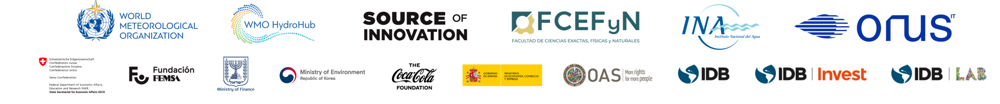

<p align="center">
  
</p> 


[](https://creativecommons.org/licenses/by-nd/4.0/)

# LSPIV User Guide

## 📌 Introduction
This repository contains the **Introductory Practical Guide to Flow Measurement Using Images**, designed to provide best practices and recommendations for new users interested in measuring surface velocity and water flow using **Large-Scale Particle Image Velocimetry (LSPIV)**.

This guide was developed as part of the project **"RIVeR-LAC: Innovation in Large-Scale Particle Image Velocimetry for Water Resource Management"**. The project was selected through the **WMO HydroHub Innovation Call for Latin America and the Caribbean**, organized by the **World Meteorological Organization (WMO)** and funded by the **Inter-American Development Bank (IDB)**.

## 🚀 Key Features

This guide is designed in **simple language**, bridging the gap between users with **little or no experience** and highly technical documentation. It is **richly illustrated with figures and diagrams**, making complex concepts easier to understand.

🔍 **A Practical Approach: From Fieldwork to Data Processing**  
- 🎥 **Fieldwork: Capturing the Flow**  
  - Guidance on selecting the **best recording method** and setting up field equipment.  
  - Key recommendations for **video acquisition** to ensure reliable results.  
  - **Field verification and quality control** to minimize errors and improve measurement accuracy.

- 🖥 **Processing Steps: From Video to Flow Data**  
  - Overview of **software options** and essential data validation steps.  
  - General workflow for **video processing, image transformation, and velocity estimation**.  
  - Methods for **flow calculation** based on LSPIV analysis.  

📚 **Want to Go Deeper?**  
- This guide includes **annexes** where advanced users can explore **technical details**.  

🌎 **Available in Multiple Languages**  

## 📖 How to Access the Guide
The **LSPIV User Guide** is available in two languages:
- **English version**: [Guidelines_EN.md](./Guidelines_EN.md)
- **Spanish version**: [Guidelines_ES.md](./Guidelines_ES.md)

To read the guide, simply open the corresponding Markdown file in any text editor or Markdown viewer.

## 👥 Authors

### **Coordinator**
- **Antoine Patalano** – ORUS and Faculty of Exact, Physical, and Natural Sciences, National University of Córdoba, Argentina.

### **Authors**
- **Leandro Massó** – ORUS and Faculty of Exact, Physical, and Natural Sciences, National University of Córdoba, Argentina.
- **Antoine Patalano** – ORUS and Faculty of Exact, Physical, and Natural Sciences, National University of Córdoba, Argentina.

### Contributors:
- **Mariano Re** - National Water Institute of Argentina.
- **Pablo García** - National Water Institute of Argentina.
- **Nicolas Ortiz** - National Water Institute of Argentina.
- **Ana Heredia Ligorria** - National Water Institute and Faculty of Exact, Physical, and Natural Sciences, National University of Córdoba, Argentina.
- **María Catalina Lago** - National Water Institute of Argentina.

### **External Reviewers**
- **Johanna Korhonen** – WMO Secretariat.
- **Cecilia Maroñas** – Inter-American Development Bank (IDB).
- **Salvador Peña** – WMO HydroHub Think Tank.
- **Cristina Wahrmann** – Costa Rican Institute of Electricity (ICE) and WMO HydroHub Think Tank.
- **Marco Serrano** – Costa Rican Institute of Electricity (ICE).
- **María José Torres** – Costa Rican Institute of Electricity (ICE).
- **Shawn Boyce** – Caribbean Institute for Meteorology and Hydrology (CIMH) and WMO HydroHub Think Tank.
- **James Bomhof** – Water Survey of Canada, Environment and Climate Change Canada (ECCC).
- **Yirgalem Gebremichael** – WMO Secretariat.

## 📜 License
This guide is licensed under the **Creative Commons BY-ND 4.0 (Attribution-NoDerivatives)** license.

- You are free to **share and distribute** this document, as long as proper credit is given to the original authors.
- **No modifications or derivative works** are allowed without explicit permission from the authors.
- All **figures, diagrams, and images** are also protected under this license.

For more details, see the [LICENSE.md](./LICENSE.md) file or visit [Creative Commons BY-ND 4.0](https://creativecommons.org/licenses/by-nd/4.0/).

## 🏗 Contributing

We welcome contributions! There are two main ways to contribute:

### 🔹 **1. Suggest Improvements via Issues** (No Git knowledge required)  
If you want to report an error, suggest a change, or propose an improvement:  
1. Open an **Issue** in this repository.  
2. Select the **Contribution Request** template and fill in the details.  
3. A reviewer will evaluate your suggestion and provide feedback.  

### 🔹 **2. Submit a Pull Request (PR)** (For users familiar with Git)  
If you prefer to contribute directly with a modification:  
1. **Fork** this repository.  
2. Create a new branch for your changes:  
   ```sh
   git checkout -b feature-new-improvement
   ```  
3. Commit your changes following the repository guidelines:  
   ```sh
   git commit -m "Improved section X with better explanation"
   ```  
4. Push your changes:  
   ```sh
   git push origin feature-new-improvement
   ```  
5. Open a **Pull Request (PR) to `main`** for review.  

### 📌 **Major Changes or New Features? Let's Discuss!**  
If your contribution involves **significant modifications or new sections**, please **open an Issue first** or contact the development team before proceeding.  


---
